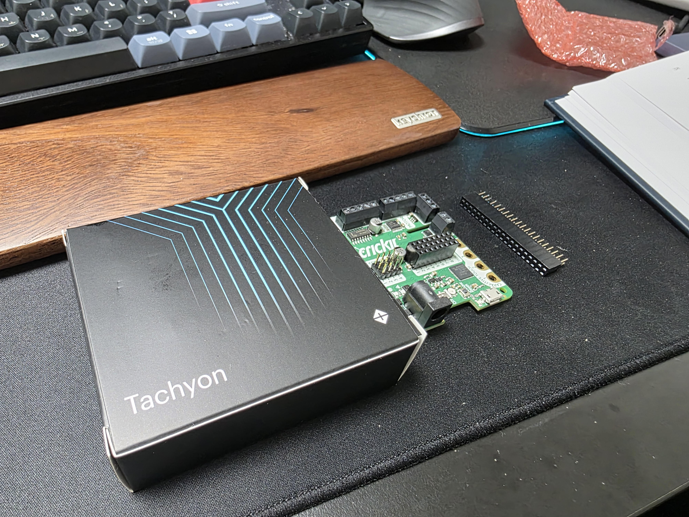
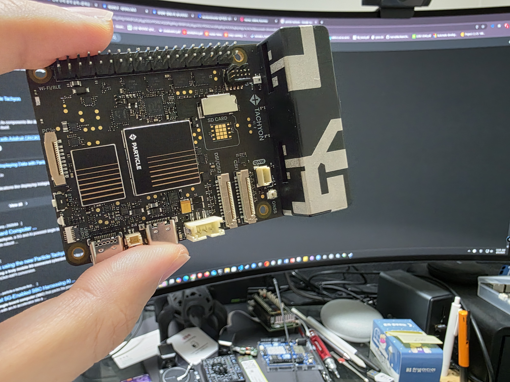
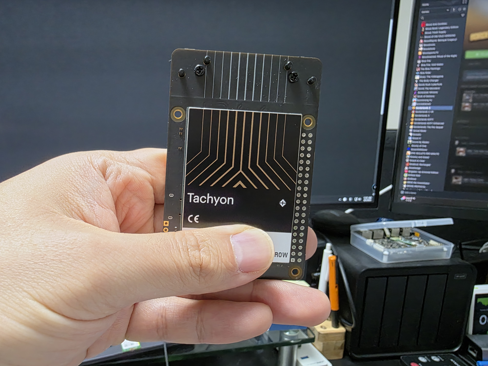
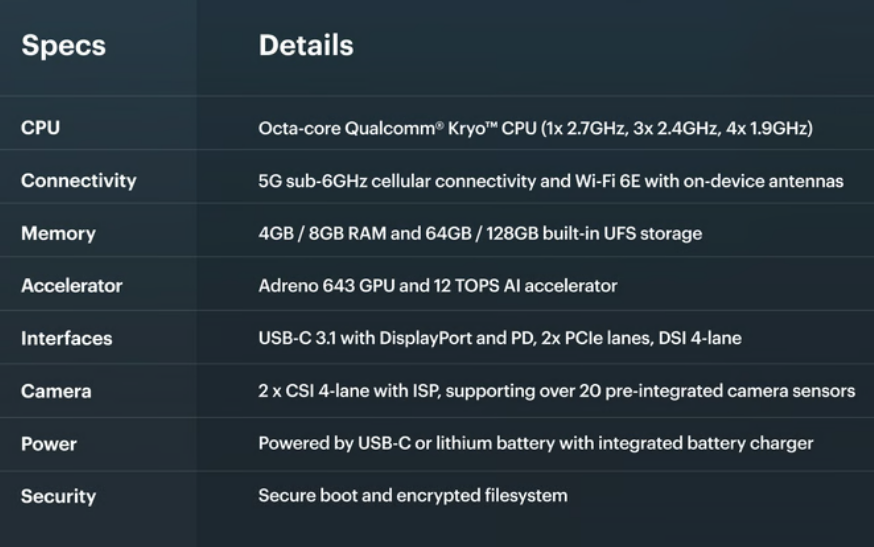
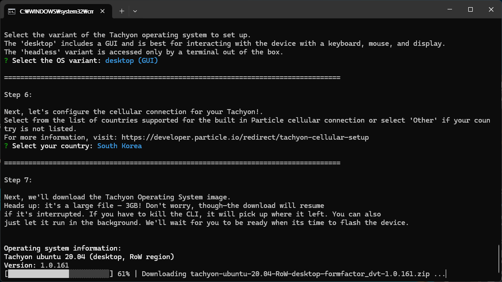
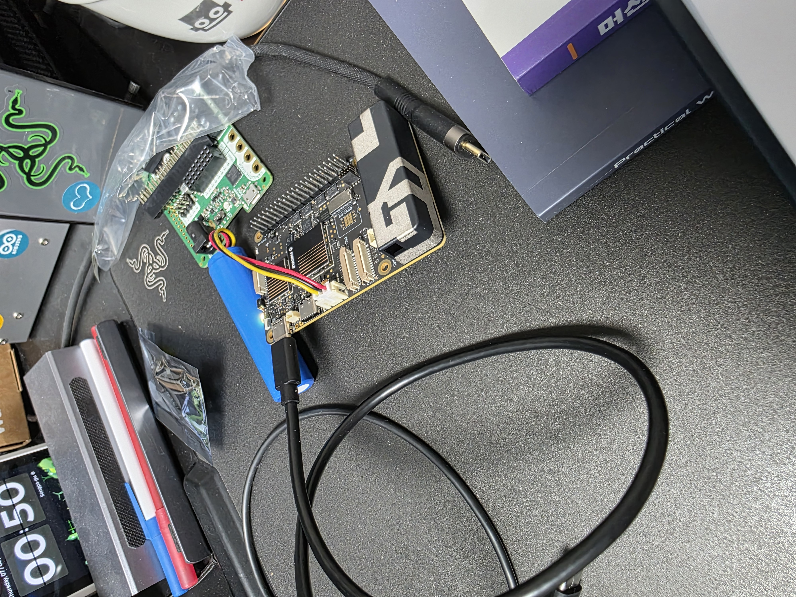
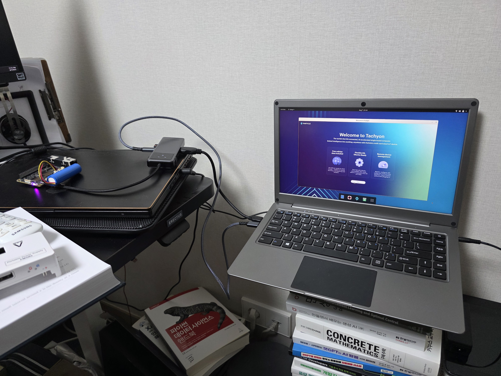

## tl;dr

Particle Tachyon은 USB alt 모드를 지원하는데, c-to-c display가 안되더라 

## 서두

이전에 언급했던 것처럼 Mini pupper 2라는 로봇개를 조립하고 있다. 그런데 제조사 사이트를 참고하면 Raspberry PI CM4가 있어야 보드에 직결해서 사용이 가능하다고 한다. 직접 물어본 바로는 일반 Raspberry PI 4로도 연결이 가능하긴 한데, 선 연결이 필요하다고 설명을 해주는데, 부연으로 7월 정도에 퀄컴칩을 쓴 좋은 모듈이 나와서 살 생각이 없냐고 물어본다. 처음에는 그걸 써야 다른 거랑 연동해서 실시간 제어가 가능하겠다 싶었는데... 생각해보니까 내가 이전에 Kickstarter를 통해서 펀딩을 해놓은 게(?) 있었다는게 떠올라서 기다리고, 얼마전에 수령했다.

## Particle Tachyon

::: {#fig-orin_case layout-ncol=3}

Particle Tachyon
:::

내가 Kickstarter를 통해서 펀딩한 제품은 [Particle](https://www.particle.io/)이란 회사에서 구입한 [Tachyon](https://www.particle.io/tachyon/)이란 Single Computer Board (SBC)이다. 사실 Raspberry PI가 이미 대중화가 되어버린 시점에서 Raspberry PI의 GPIO 핀배열과 호환되는 SBC들이 많이 출시되고 있고, 단순하게 보면 Tachyon도 그런 SBC 중 하나라고 볼수 있지만, 이 보드는 퀄컴의 dragonwing QCM6490을 달고 나온 최초의 SBC이다. 다른 SBC랑 비교한다면 퀄컴칩을 달고 있기 때문에, 칩에서 5G 및 WIFI 6E가 지원되어 다른 플랫폼보다는 Connectivity 측면에서 좋고, 자체적으로 NPU가 내장되어 있어 AI 연산시 도움을 받을 수 있다. (소개 페이지상에서는 12 TOPS 정도의 성능이 나온다고 한다.) 상세한 스펙은 아래 그림을 참고하면 좋을거 같다.

::: {.callout-note}

참고로 8년전에 공부한다고 [Dragonboard 410c](https://www.qualcomm.com/products/technology/processors/application-processors/dragonboard-410c)란 보드도 가지고 windows 10 IoT도 올리고 이것저것 해봤었는데, 어느 시점에선가 개발지원이 끊겼다.

:::

## 환경 구성

일반적으로 사용되는 SBC라면 SD카드를 통해서 OS를 설치하거나, 별도의 SSD를 설치하여 Jetson처럼 Host PC에서 보드에 OS를 직접 설치하는 방식이 있는데, Tachyon은 후자방법으로 진행하며, Particle CLI 라는 것을 통해서 Firmware 및 OS flash가 이뤄진다.

::: {#fig-orin_case layout-ncol=2}

Tachyon 설정 과정
:::

특이하게 개발문서상에서는 외장배터리를 연결한 상태에서 진행하게 되어있고, 이를 위해서 동봉된 배터리를 연결한 상태에서 Windows host PC에서 필요한 프로그램을 설치했다.

## 문제

이 보드가 앞에서 설명한 특징을 가지고 있는데, 한가지 다루는데 있어서 불편한 부분은 외부와 연결할 수 있는 I/O 인터페이스가 USB-c 2개만 나와있다는 것이다. 그래서 이 보드를 사용하기 위해서는 USB-c 허브가 필요하며, 특히 headless가 아닌 GUI를 위한 display가 필요하다면 별도의 HDMI 포트가 달린 허브를 준비해야 한다. 애초에 난 USB-c용 display가 있어서 c-to-c display가 될 줄 알고 연결했는데 출력이 나오지 않았다. 알고보니 [제조사](https://community.particle.io/t/tachyon-wont-output-video/69612/6)에서 언급하기론 usb-c가 alt mode를 지원하는데, usb c-to-c 연결을 위해서는 충분한 전원 공급(대략 5A?)가 필요하다고 한다. 덕분에 hdmi 포트가 달린 허브를 구매해서 환경 설정을 마무리했다.

## 결론 및 계획

결과적으로 이렇게 케이블을 둘러둘러 연결하면서 화면출력도 확인했고, 기타 기능 검증도 해봤다. 사실 퀄컴에서 홍보하는 것처럼 이 보드의 장점인 NPU를 활용해봐야 제대로된 사용이 될 거 같다. 다행히도 퀄컴에서도 자체 [AI hub](https://aihub.qualcomm.com/models)를 통해서 다양한 모델들을 지원하고 있는것으로 보이며, 특히 Computer vision 분야에는 6490을 위한 몇가지 모델이 올라와있다. 다만 QCM6490이 시중에 나와있는 Elite 모델에 비해 성능이 부족하기 때문에, 원래 모델이 아니라 w8a8와 같이 quantization이 적용된 모델을 돌릴 수 있는거 같다. 그래서 Quantization 관련 강의도 좀 보면서 모델도 직접 올려보고 해보고 싶다. 뭐 이게 잘되면 원래 계획했던 것처럼 Mini Pupper의 제어보드가 될지도..

