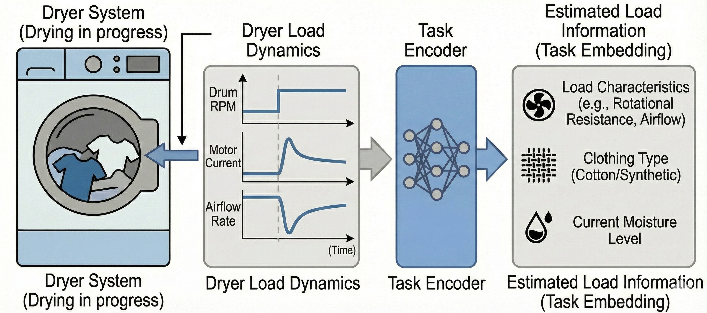
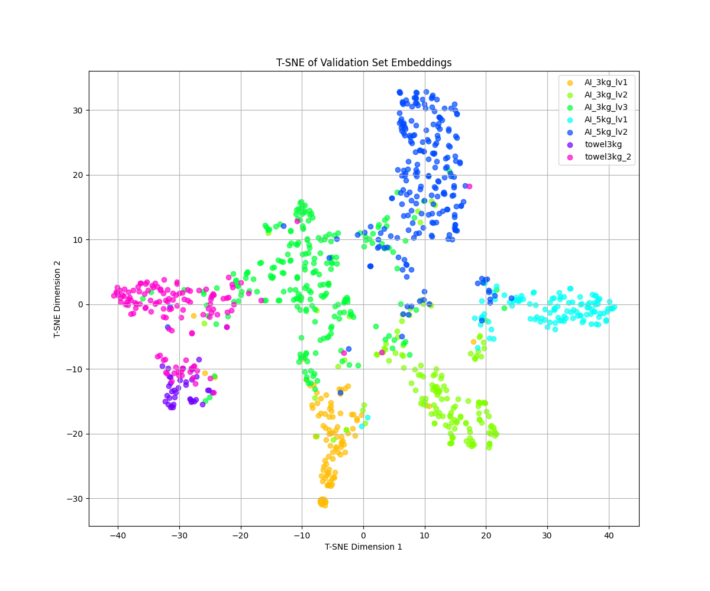
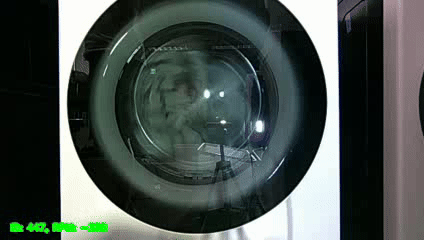
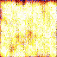
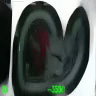

## Prologue

2025 was a truly busy year. At work, I took on the title of Project Leader for the first time and attempted to apply AI technology to home appliances. To achieve this, I collaborated with people from various fields, persuading and sometimes even engaging in disputes. Meanwhile, as generative AI began to enter the development environment in earnest, I tried to apply various approaches to see how I could incorporate the recent technological trend.

Outside of work, I also reviewed technical books for readers before publication (usually express this as 'beta-review'), striving to ensure they were more technically grounded and accessible. Personally, engaging in such activities allowed me to explore the latest technological trends early on, which was rewarding.

## Life at Work

Following last year, I continued working on applying AI technology to home appliances this year. However on this year, I also took on the role of leading the project. As a team member, its role primarily involved implementing the features and conducting experiments to achieve project goals. But, from a project management perspective, it required not only development work but also managing team schedules, understanding the underlying technologies, and ultimately persuading stakeholders based on the results achieved from lots of experiments. Still, participating in the development, organizing the results, and appealing to others about the importance of the related technology wasn't a bad experience for me. Also, thanks to the team members who complemented each other well technically, I learned a lot and had a good experience. Of course, the project deliverables weren't that satisfying...

### Meta Reinforcement Learning

As this year began, the technical keyword for the task I was assigned was **Meta Reinforcement Learning**. In fact, the keyword “meta-learning” itself has been around for quite some time, lots of paper introduced numerous methodologies aimed at achieving strong performance even on tasks not directly learned. Recently, it has become an actively researched domain, with findings suggesting that applying Meta RL techniques to train LLMs can further improve their performance. 

My initial research was driven by a fundamental question: Can Meta-Reinforcement Learning (Meta-RL) truly be effective in physical, real-world environments like home appliances? As often highlighted in the literature, the ultimate goal of Meta-RL—developing models that generalize to unseen environments—is incredibly compelling when applied to the real world. This curiosity led me to apply Meta-RL to dryer systems this year.

Similar to the challenges I encountered with washing machine RL, dryers in real-home settings face a significant hurdle: infinite variability. A model must deliver optimal performance not just for lab-tested loads, but for the diverse laundry combinations of actual users. Whether it’s a small handful of items, a heavy quilt, or a mix of fabrics ranging from synthetic activewear to dense cottons, every household has unique lifestyle patterns. My goal was to develop a universal RL model capable of autonomously adapting to these diverse 'tasks' and tailoring the drying process to each individual user.

Our primary focus was to determine whether the sensor data generated by the dryer carries enough high-fidelity information to distinguish between different types of laundry loads. If this hypothesis holds true, it means we can develop a **Task Encoder** capable of inferring the current state of the laundry directly from raw sensor inputs. By integrating the representations extracted from this encoder with Reinforcement Learning, we can successfully train the Meta-RL model mentioned earlier.

::: {#fig-dryer-dynamics layout-ncol=1}

Dryer Dynamics (by Google Gemini)
:::

To implement this, we defined what we call **'Dryer Load Dynamics'**. As is often the case with real-world Reinforcement Learning (RL) lacking a simulator, we sought to estimate the internal dynamics of moving laundry by analyzing sensor responses to specific control perturbations. This dynamic information was then integrated as a conditioning factor within the RL model's state representation.

Furthermore, since our objective was to cluster similar load types rather than achieve pinpoint classification, we moved away from standard Cross-Entropy Loss. Instead, we employed [Supervised Contrastive Loss](https://arxiv.org/abs/2004.11362) to encourage similar loads to group together, and further refined discriminative performance using [ArcFace Loss](https://arxiv.org/abs/1801.07698). As a result, the Task Encoder successfully mapped similar laundry types into tight clusters while maintaining clear separation between distinct categories.

::: {#fig-dryer-TSNE layout-ncol=1}

T-SNE visualization of various laundry types
:::

By integrating this task-specific information as auxiliary input during training, we established a Meta-RL architecture consisting of a Task Encoder and an Actor. Given that a dryer is a highly complex environment where physics, thermodynamics, and fluid dynamics are intricately intertwined, we didn't quite reach our initial drying performance targets. However, we successfully demonstrated the system's ability to generalize to unseen laundry loads—bringing us remarkably close to developing what could have been the world's first (?) Meta-RL-powered dryer.

### Drying Motion Simulator based on Diffusion Model

As the project evolved, the absence of a high-fidelity simulator—as mentioned earlier—remained our primary bottleneck. This led me to explore a new possibility: could we build a motion simulator using our existing technology? Conveniently, while evaluating the Meta-RL model, we had compiled a dataset of video footage synchronized with sensor data, capturing diverse laundry motions within the drum. This sparked an idea—leveraging this dataset to generate synthetic video corresponding to any given set of sensor readings.

Leveraging insights from the deeplearning.ai course ["How Diffusion Models Work?"](https://www.deeplearning.ai/short-courses/how-diffusion-models-work/), I confirmed the feasibility of creating a data-driven "dryer motion simulator" that generates video directly from sensor inputs.

To implement this, I developed a Video Diffusion Model utilizing a U-Net architecture and DDPM, with development assistance from Gemini Code Assist. During training, I conducted regular validation checks by inputting real sensor data to assess how closely the generated video output matched actual physical motions.

::: {#fig-ddpm layout-ncol=4}

{#fig-original}

{#fig-100epoch}

{#fig-500epoch}

{#fig-1000epoch}

Training Process of Video Diffusion Model
:::

While the model didn't capture the dryer's motion with perfect precision, it was surprisingly successful at generating the tumbling patterns of laundry—especially considering this was a toy example trained on limited computational resources (GTX 1080 Ti) with a small sample size. I still need to address inconsistencies in camera viewpoints from the training data, but I believe that with further refinement, we could eventually infer internal laundry motion without needing an actual camera installed in the dryer.

Beyond that, I aim to develop a simulator that translates abstract, continuous sensor streams—data that is otherwise difficult for humans to parse—into an intuitively understandable visual format. To push this even further, I am currently exploring physics engines like [NVIDIA Warp](https://github.com/NVIDIA/warp) to see if I can implement a more realistic and physically grounded simulation environment.

## Off-duty

While leadership responsibilities limited my time for new research this year, I remained active in the tech community by serving as a technical reviewer for various publishers. My focus was on identifying technical flaws and improving readability.

Despite occasional self-doubt about my own expertise, I dedicated myself to the task by personally verifying code examples to ensure technical accuracy. This year alone, I’ve contributed to the publication of 32 technical titles. You can check out the list of books I've reviewed at this [link](https://kcsgoodboy.github.io/ko/activities.html#section).

One of the best parts of being a technical reviewer is getting an up-close look at new technologies I haven't mastered yet. It pushes me to research things I don't know, and it's a great feeling to see my feedback help improve the final book.

I see this as a 'learning loop' where I get to experiment with the latest AI tools—like GPT, Gemini, Claude, and Cursor—and then bring those skills back to my day job. Even though books don't move quite as fast as the latest research papers, they are written for a broader audience, which means the explanations are often much clearer and easier to digest.

## Epilogue

2025 has been a long but rewarding year. I spent much of it stepping out of my comfort zone to integrate cutting-edge tech into both my professional and side projects. Things didn't always go as smoothly as planned, but I’ve realized that growth often happens in the middle of those struggles. Looking ahead to next year, I want to live even more purposefully and turn my hard work into tangible results, both in the office and in my studies. (Top of my list for next year: Publishing a paper!)