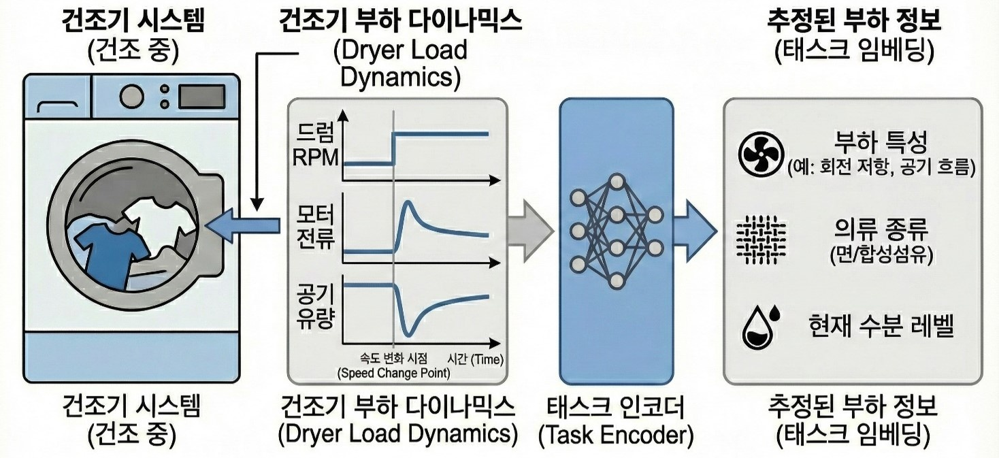

## 서두

참 바쁜 한해였다. 회사에서도 처음으로 Project Leader라는 타이틀을 달고 가전에다가 인공지능 기술을 적용하려는 시도를 해봤고, 이를 위해서 다양한 분야의 사람들과 협업을 하면서 설득도 하고 때로는 다툼이 있기도 했다. 그러면서 생성형AI가 본격적으로 개발환경에 들어오면서 그런 기술 트렌드를 어떻게 하면 접목해볼 수 있을까 하는 시도를 다양하게 해봤던 것 같다.
물론 회사 외적으로도 독자들에게 기술서적이 출간되기 이전에 미리 검토를 해보면서, 조금더 기술적으로 근거가 있고 다가가기 쉬운 책이 만들어지게끔 노력을 했다. 개인적으로도 그런 활동을 하면서 최신 기술 경향도 미리 탐색해볼 수 있어 좋았던 것 같다.

## 회사에서의 업무

작년에 이어서 올해에도 가전에 인공지능 기술을 적용하는 업무를 수행했다. 다만 올해는 해당 과제를 리딩하는 업무까지 같이 맡아서 진행하게 되었다. 사실 팀을 구성하는 팀원으로써의 역할은 단순히 프로젝트의 목표 달성을 위한 기능 구현이나 실험 업무가 주가 되겠지만, 과제를 운영하는 입장에서 보면 개발 업무와 더불어 구성원의 일정 관리, 구성 기술에 대한 이해, 더 나아가 해당 기술을 적용함으로써 얻은 결과를 토대로 사람들을 설득하는 과정까지 필요했다. 그래도 나름 개발에 참여하면서, 결과를 정리하고 관련 기술의 중요성에 대해서 사람들에게 어필하는 경험 자체는 나쁘지 않았다. 또한 구성원이 기술적으로도 잘 보완해준 덕분에, 많은 것을 배우고 좋은 경험을 했다고 생각한다. 물론 프로젝트 성과물이 그렇게 만족스럽지는 않았지만...

### 메타강화학습

올해가 시작되면서 내가 맡은 과제의 기술 키워드는 **Meta Reinforcement Learning**였었다. 사실 메타러닝이란 키워드 자체는 나온지도 한참되었고, 학계에서도 실제 학습되지 않은 Task에서도 좋은 성능을 보여주기 위한 방법론에 대해서 많이 소개되어 있다. 특히 요근래에는 LLM을 학습시키는데도 Meta RL 기법이 적용되면 성능을 더 개선시킬 수 있다는 내용들이 나오면서 활발히 연구되는 도메인이기도 하다. 

내가 처음으로 해보려고 했던 것은 과연 가전과 같은 실물 환경에서도 이런 메타강화학습 기법이 적용가능할까 하는 부분이었다. 대부분의 메타강화학습 논문의 서문에도 제시되어 있는 내용이지만, 메타강화학습이 지향하는 목표는 어떻게 보면 실물 환경에서는 진짜 매혹적이다. 아니 어떻게 하면 실제 학습하지 않은 환경에서도 잘 동작할 수 있는 모델을 만들 수 있는 것일까 하는 궁금증에서 출발하여 올해 건조기에다가 처음 적용해보고자 했다. 이전에 시도했던 세탁기 강화학습 처럼 실물 환경에 놓인 건조기도 비슷한 문제를 가지고 있다. 실제 실험실에서 학습하고 실험하는 세탁물뿐만 아니라 실제 고객들이 사용하는 세탁물에서도 최적의 건조 성능이 나와야 하는데, 문제는 다양한 고객들이 실제로 넣을 세탁물의 조합이 거의 무한대에 가깝다는 것이다. 어떤 사람은 소량의 세탁물만 넣고 건조시킬수도 있고, 어떤 사람은 이불과 같이 크고 묵직한 세탁물을 건조시키려고 할 것이다. 사람에 따라서는 운동복과 같이 잘 마르는 재질의 세탁물이 많을 수도 있고, 자녀가 많은 가정에서는 면 재질의 세탁물이 많을 것이다. 이렇게 사람의 특성과 생활 패턴에 맞게 건조시켜줄 수 있는 강화학습 모델을 만드는 것이 목적이었고, 이렇게 범용적인 세탁물 건조 (혹은 Task)에 대응할 수 있는 강화학습 모델을 만들려고 했다.

우리가 초점을 맞춘 부분은 건조기에서 나온 센서 데이터가 과연 세탁물을 구별할 수 있을만큼, 주요한 정보를 가졌냐는 것이었다. 만약 이런 가정이 맞다면 이를 통해서 주어진 센서 데이터를 통해 현재 세탁물의 상태를 추론할 수 있는 **Task Encoder**를 만들 수 있다는 것이었고, 여기에서 나온 정보를 강화학습과 연계하여 앞에서 언급한 메타강화학습 모델을 학습시킬 수 있다는 것이다. 

::: {#fig-dryer-dynamics layout-ncol=1}

건조기 다이나믹스 (by Google Gemini)
:::

이를 위해서 정의한 것이 건조기 다이나믹스라는 것이다. 모든 실물 강화학습에 적용되는 내용이겠지만, 시뮬레이터가 없는 일반적인 환경에서 어떤 유격을 가했을때 센서의 변화량이 담긴 데이터를 토대로 나름의 기구내에서 세탁물이 움직이는 것에 대한 다이나믹스를 추정하고자 했다. 이에 대한 정보를 강화학습 모델 학습시 조건부 확률의 요소 중 하나로 넣게끔 했다. 또한, 정확한 부하 예측이 아닌 유사한 부하를 뭉치게 하는 것이 목적이므로 일반적인 Cross Entropy Loss가 아닌, [Supervised Contrastive Loss](https://arxiv.org/abs/2004.11362) 같은 것도 적용해보고 조금 더 구분 성능을 개선하기 위해서 [ArcFace Loss](https://arxiv.org/abs/1801.07698)도 적용해봤다. 그랬더니 실제 Task Encoder를 통해서 나온 정보들이 비슷한 세탁물끼리는 뭉치고, 조금 차이가 나는 세탁물끼리는 구분이 되는 형태까지는 도출할 수 있었던 것 같다.

::: {#fig-dryer-TSNE layout-ncol=1}

세탁물 정보에 대한 T-SNE 시각화
:::

이 정보를 이제 모델 학습시 부가적인 정보로 넣어주면 Task Encoder + Actor 형태의 Meta RL 모델이 될 것으로 봤다. 물론 건조기라는 환경 자체가 물리와 열, 유체가 복합적으로 엮인 복잡한 환경이었기에, 우리가 정의한 목표치까지 건조 성능을 보이지는 못했지만, 적어도 학습되지 않은 건조물에서도 대응이 가능한 세계 최초의 메타강화학습 적용 건조기(?)가 나올 뻔했다.

### Diffusion Model을 활용한 건조 모션 시뮬레이터

아이디어를 펼치다보니, 앞에서 언급했던 것처럼 뭔가 건조기의 상태를 모사할 수 있는 시뮬레이터가 없다는 부분이 제일 문제라고 생각했고, 주어진 기술로 과연 건조 모션을 시뮬레이션할 수 있는 것을 만들어볼 수 있지 않을까 생각했다. 마침 메타강화학습 모델을 평가하면서 다양한 세탁물이 건조기 내에서 다양한 모션을 수행할 때에 대한 영상데이터를 센서 데이터와 함께 쌓아놓았고, 이 데이터를 활용해서 임의의 센서 데이터에 해당하는 영상을 생성해낼 수 있지 않을까 싶었다.

마침 deeplearning.ai에서 제공하는 강의중에 [How Diffusion Models Work?](https://www.deeplearning.ai/short-courses/how-diffusion-models-work/)이란 내용이 있었고, 실제 예제를 해보니까 학습만 잘 시키면 센서 데이터에 해당하는 모션 영상, 이른바 건조 모션 시뮬레이터 같은 것도 만들수 있을것 같았다. 그래서 Gemini Code Assist랑 같이 U-Net 기반의 Denoising Diffusion Probabilistic Model (DDPM)이 적용된 Video Diffusion Model을 만들었고, 실제로 학습 중간중간마다 실제 센서 데이터를 넣어서 영상이 얼마나 실제와 유사하게 나오는지를 확인하고자 했다.

::: {#fig-ddpm layout-ncol=4}

{#fig-original}

{#fig-100epoch}

{#fig-500epoch}

{#fig-1000epoch}

Video Diffusion Model 학습 과정
:::

물론 실제 건조기가 도는 모션이 명확하게 학습되지는 않았지만, 낮은 Computation Resource (1080TI)로 적은 샘플을 가지고 학습한 toy example 치고는 생각보다 건조기안에서 세탁물이 돌아가는 모션까지는 만들어진 것 같았다. 학습 영상 데이터가 수집될 당시의 camera view point가 다른 문제를 해소하기 위해서 좀 더 생각할 부분은 있지만, 조금더 발전시키면 굳이 건조기에 카메라가 부착되지 않더라도, 어떤 세탁물이 건조기 내에서 돌고 있는 영상은 대충 유추할 수 있지 않을까 생각한다. 그리고 무엇보다 센서 데이터라는 눈으로 확인하기 어려운 연속된 정보를 사람의 눈으로 판단할 수 있는 용도로 활용할 수 있는 일종의 시뮬레이터를 만들어보려고 한다. 물론 [Nvidia Warp](https://github.com/NVIDIA/warp) 같은 physics engine을 활용하면 조금 더 현실성있는 시뮬레이터도 구현가능하지 않을까 하고 좀 더 탐색중이다.

## 회사 외에서..

올해는 뭔가 프로젝트를 리딩한다는 부담감을 갖고 있어선지, 뭔가 새로운 강의나 논문에 대한 탐색을 많이 하지 못했다. 그래도 올해 다양한 출판사에서 출간되는 기술서적에 대해서 미리 검토하고, 기술적인 오류나 문맥 오류를 찾는 작업을 했다. 물론 한편으로는 내가 책에서 소개하는 기술을 제대로 이해하고, 오류를 지적하는 것일까 하는 걱정이 내심들긴 하지만, 나름 책에 소개되어 있는 예제도 직접해보면서 좋은 책이 나올 수 있게 노력했다. 그러고보니 올해까지 검토한 서적이 대략 32권 정도 되는 것 같다. 어떤 책들인지는 [링크](https://kcsgoodboy.github.io/ko/activities.html#section) 참고. 

사실 이런 베타리딩이란 과정을 거치게 되면, 개인적으로는 내가 몰랐던 새로운 기술에 대해서 조금 가까이 살펴볼 기회를 얻게 되는 부분이 좋다. 그러다가 내가 이해가 안되는 부분이 있으면 직접 찾아보기도 하면서 오류를 찾아서 알려주면 반영도 되고... 그러면서 GPT나 Gemini, Claude, Cursor 같은 도구 사용법도 직접 해보면서 얻은 지식을 현업에도 적용해보는 선순환 과정을 거친다고 생각한다. 물론 논문처럼 최신 기술을 빠르게 얻을 수 있는 것은 아니지만, 대다수의 독자들을 대상으로 한 기술 서적이기에 왠만한 책들이 설명도 잘 되어 있고, 그만큼 읽으면서도 이해하기 좋았던 것 같다.

## 회고

기나긴 2025년이 끝나간다. 그래도 올해는 현업에서나 회사 외적으로나 최신 기술을 적극적으로 도입하고, 적용해보려는 시도를 다양하게 해보았다. 물론 딱 거기에 걸맞는 성과가 나왔으면 좋았겠지만, 세상이 그렇게 쉽게만 흘러가지도 않았지만, 그래도 시도속에서도 성장할만한 부분이라던가 배울만한 부분을 많이 발견했다. 내년에는 조금더 발전적으로 살고, 그만큼 학문적으로나 현업에서도 노력한 것에 대한 결과가 도출되었으면 좋겠다. (내년엔 꼭 논문 한편~!)