### Resource

::: {layout-ncol=2}
[](https://youtu.be/vI46tzt4O7Y?si=lhD3KJkDHqIYaiyd)

[](https://cs330.stanford.edu/materials/cs330_multitask_transfer_2023.pdf)
:::

## Definition of Task

$$ 
\mathcal{T}_i \triangleq \{p_i(x), p_i(y \vert x), \mathcal{L}_i\}
$$ {#eq-task-definition}

@eq-task-definition implies that a specific task $\mathcal{T}_i$ is defined not merely as a simple chunk of data—as is common in single-task learning—but as a set of three core elements.

First, $p_i(x)$ represents the **Input Distribution**, or the form of the problem arising from the given task. Strictly speaking, while $p$ itself is the distribution of the data, here it indicates the characteristics under which the input data $x$ (such as images or text) is generated. For example, in a problem involving handwriting recognition across multiple languages, the visual appearance of images constituting English sentences differs completely from that of Korean sentences. Since the data $x$ differs, this constitutes a case where the distributions $p(x)$ are distinct.

The second element, $p_i(y \vert x)$, defines the **Label Distribution**—essentially, what the correct answer is for the given problem. As defined earlier, it represents the probability distribution of the ground truth label $y$ given the input $x$. Simply put, it serves as the "rule" for labeling the input.

The final element, $\mathcal{L}_i$, is the commonly known **Loss Function**. This defines a score indicating how well or poorly the model is performing during training. When the model generates a prediction for a given input, this function determines the model's performance based on the discrepancy between the prediction and the actual value. Naturally, the calculation method varies by task. For instance, the loss function defined for a classification task will differ from that of a regression task.

In conclusion, this equation explains that a task should be viewed as a **distribution** rather than a simple dataset. Therefore, it is crucial to evaluate whether a model can go beyond simply memorizing the dataset itself and instead learn the fundamental distribution of the task to achieve Generalization on new data.

## Single-task vs. Multi-task

::: {#fig-tasks layout-ncol=2}

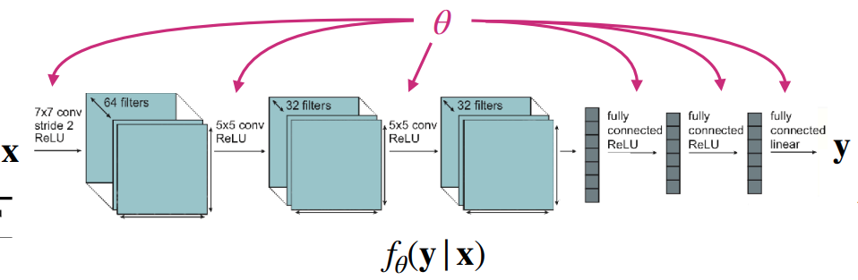{#fig-single-task}

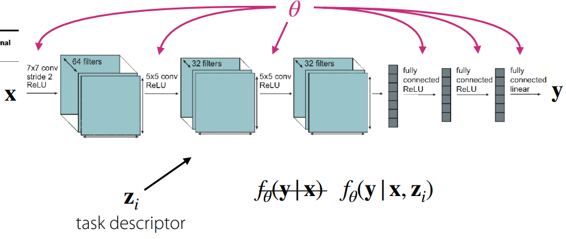{#fig-multi-task}

General architecture of task handling
:::

The fundamental difference between models dealing with single-task learning and those dealing with multi-task learning lies in how the task to be solved is defined and received as input. 

As shown in @fig-single-task, the goal of a single-task model is to find the parameter $\theta$ that minimizes the loss function for a single dataset. In this case, the model takes the form $f_{\theta}(y \vert x)$, inferring $y$ based solely on the input data $x$. Note that this implies an underlying assumption: the training and test data are drawn from the same distribution. Since no separate task information is provided, this approach is also referred to as being **task-agnostic**.

On the other hand, multi-task models learn a set of multiple tasks $\mathcal{T}_i$ simultaneously. Here, each task consists of the three elements defined earlier in @eq-task-definition. One major feature distinguishing this from single-task learning is the **task descriptor** $z_i$. Simply put, this provides additional input information about which task is currently being performed. Consequently, the model is defined as $f_{\theta}(y \vert x, z_i)$, and the goal becomes finding the parameter $\theta$ that minimizes the loss functions across multiple tasks. The lecture materials express this as follows:

$$
\min_{\theta} \sum_{i=1}^T \mathcal{L}_i (\theta, \mathcal{D}_i)
$$

The key to multi-task learning then becomes how to define the task descriptor $z_i$, which ultimately depends on the implementation. To numerically distinguish between tasks, one could use simple integers or assign them as one-hot vectors. Alternatively, tasks can be defined in natural language, as humans do, or provided as information containing specific task specifications. How this is defined is an aspect worth considering regarding the efficiency of multi-task learning.

At this point, several key components need to be defined to train a multi-task model. These can be broadly categorized into the following questions, which the lecture addresses individually:

- How should we define $z_i$ and condition the model?
- How can we define the objective function for each task?
- How do we optimize multiple objective functions?

## Conditioning on the task

First, we address how to define the task descriptor and how to train the model for individual tasks. For ease of understanding, let's assume the task descriptor is defined as a one-hot vector. From a model design perspective, the question then becomes: "How can we condition the model on the task to enable multi-task learning?"

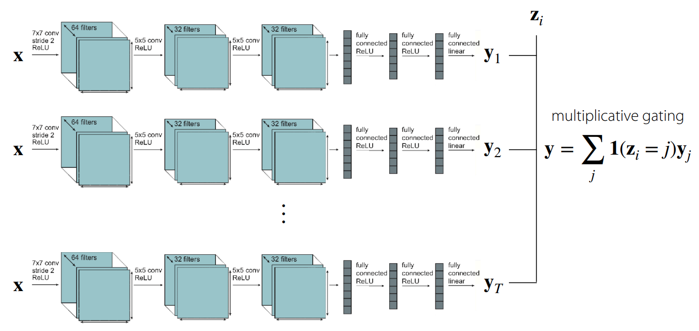{#fig-independent-training}

The simplest approach is to train separate models corresponding to each individual task and condition them at the output stage. As shown in @fig-independent-training, this essentially employs multiplicative gating—using the output of a network trained for a specific task only when the task descriptor matches that task. Of course, in this case, no parameter sharing occurs between the internal networks, though from the outside, it appears as a single large network. While this might be the most straightforward way to conceive a multi-task solution, it fails to consider computational efficiency or model size.

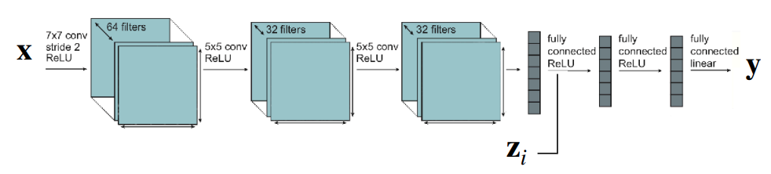{#fig-all-shared-training}

Another extreme case to consider is a structure where all parameters are shared across tasks during training. However, as illustrated in @fig-all-shared-training, while parameters are shared, the task descriptor $z_i$ would be concatenated at the FC Layer or activation stage where the output is generated. In this scenario, common elements within the tasks—or to borrow the earlier expression, the internal rules regarding the answers to multiple problems—are shared. This opens up room for better computational efficiency and size optimization.

If we adopt this parameter-sharing structure, the model parameter $\theta$ can be divided into shared parameters $\theta^{sh}$ and task-specific parameters $\theta^{i}$. Accordingly, the objective function for the model can be reformulated as follows:

$$
\min_{\theta^{sh}, \theta^1, \dots, \theta^T} \sum_{i=1}^T \mathcal{L}_i ( {\theta^{sh}, \theta^i}, \mathcal{D}_i)
$$

So far, we have explored common-sense approaches to handling multi-task scenarios without deep prior knowledge. The conclusion up to this point is that training such a model requires a task descriptor, and depending on how this information is conditioned, one must decide how and in which layers to share parameters. The following figures illustrate various model structures based on these conditioning methods.

::: {#fig-conditioning layout-nrow=2}

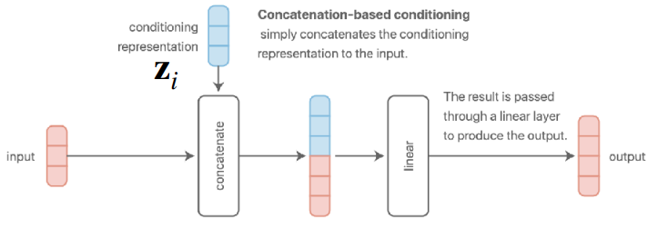{#fig-concatenation-based-conditioning}

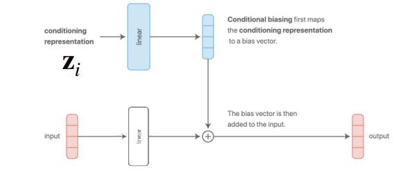{#fig-additive-conditioning}

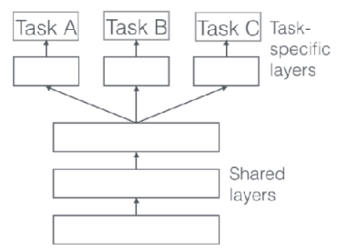{#fig-multi-head}

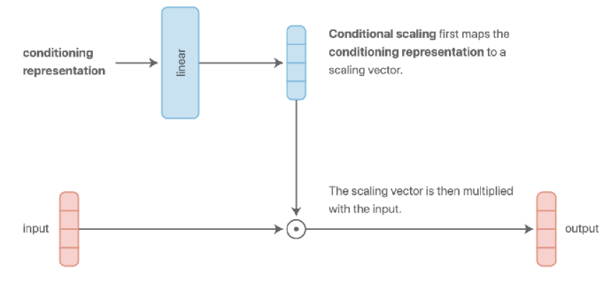{#fig-multiplicative-conditioning}

Some common choices for conditioning (Source: [feature-wise transformation](https://distill.pub/2018/feature-wise-transformations/))
:::

@fig-concatenation-based-conditioning and @fig-additive-conditioning represent the structures introduced earlier. The former concatenates the task descriptor with the input data, while the latter adds it to the result after passing through a layer.

To elaborate, the concatenation method combines information at the input stage and processes it by **sharing parameters across all subsequent layers**. However, the specific section of the input layer's weight matrix that interacts with the task descriptor $z$ effectively functions as a **task-specific bias**.

Meanwhile, the additive method adds the task descriptor directly to the bias vector output from the linear layer. This characteristic allows the model to assign distinct biases and differentiate representations for each task.

A key takeaway from the lecture is that while @fig-concatenation-based-conditioning and @fig-additive-conditioning appear different externally, they are mathematically identical. For instance, assuming a concatenated vector $[x; z]$ of input data $x$ and task descriptor $z$, multiplying this by weights $W_1, W_2$ results in $W \cdot [x; z] = W_1 x + W_2 z$, which is effectively an additive result. Although the presence of nonlinearity like ReLU in between can cause differences in expressivity, the mathematical computation remains fundamentally the same.

Additionally, as seen in @fig-multi-head, there exists a multi-head architecture (@ruder2017overview) that dedicates specific layers to tasks, acting like a switch to control the model's active regions. There is also a structure using multiplicative conditioning (@fig-multiplicative-conditioning) instead of additive, which grants more expressivity to layers per task, offering potential benefits in terms of generalization.

Research on model architectures for multi-task learning is actively ongoing, and the lecture introduces several such structures.

::: {#fig-architecture layout-nrow=2}

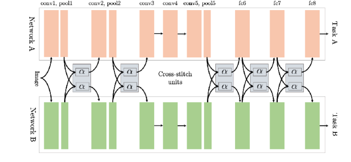{#fig-cross-switch-network}

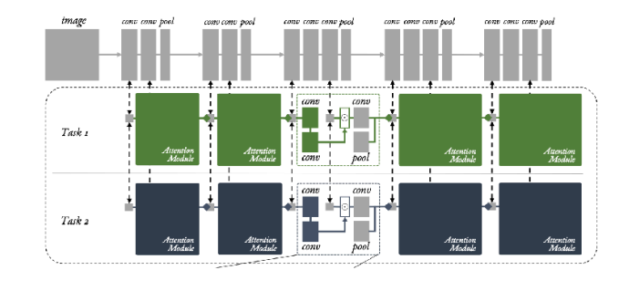{#fig-multi-task-attention-network}

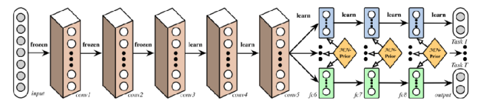{#fig-deep-relation-network}

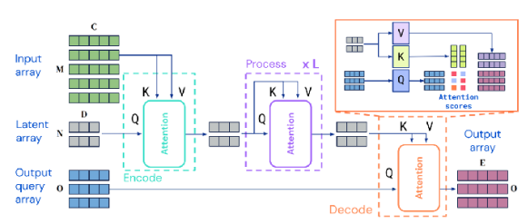{#fig-perceiver-io}

Various multi-task architectures ([a (Misra et al)](@misra2016cross), [b (Liu et al)](@liu2019end), [c (Long et al)](@long2017learning), [d (Jaegle et al)](@jaegle2021perceiver))
:::

In reality, there is no rule of thumb for model architectures in multi-task learning. Some structures work well depending on the task form, while in other cases, performance may degrade compared to single-task models. This depends on the type of problem—or task—we are trying to solve, and may require intuition or domain knowledge.

## Objective function

We previously touched upon the simplest form of the multi-task objective function in the task definition section:
$$
\min_{\theta} \sum_{i=1}^T \mathcal{L}_i ( \theta, \mathcal{D}_i)
$$

However, among the tasks we aim to solve, there may be variations in difficulty—some tasks might be significantly harder than others. To address this, we can apply weights to prioritize learning for more difficult tasks while placing less emphasis on easier ones.

$$
\min_{\theta} \sum_{i=1}^T w_i \mathcal{L}_i ( \theta, \mathcal{D}_i)
$$

How, then, should we assign the weight $w_i$ for each task? The simplest method is to assign importance or priority based on difficulty, as in the previous example. Naturally, this requires a specific criterion for calculation. Alternatively, one could consider dynamically adjusting $w_i$ based on training trends observed during the process.

The lecture introduces two main approaches regarding this topic. The first is **GradNorm**, proposed by @chen2018gradnorm. This technique balances the training process by normalizing the gradient magnitudes across tasks, ensuring that tasks with similar gradient scales guide the gradient descent.

Another approach is to frame the problem of minimizing losses across multiple tasks as a min-max optimization problem ($\min_\theta \max_i \mathcal{L}_i (\theta, \mathcal{D}_i)$). In other words, this method focuses on optimizing the loss of the worst-performing task. This concept is presented as **Distributionally Robust Optimization (DRO)** in @kuhn2025distributionally. Beyond these methods, objective functions can also be defined from the perspectives of task robustness or fairness.

## Optimizing the objective

We begin by outlining the optimization process for the basic objective function, excluding the task-specific weights discussed earlier.

```pseudocode
#| html-indent-size: "1.2em"
#| html-comment-delimiter: "//"
#| html-line-number: true
#| html-line-number-punc: ":"
#| html-no-end: false
#| pdf-placement: "htb!"
#| pdf-line-number: true

\begin{algorithm}
\caption{Basic Version}
\begin{algorithmic}
\State Sample mini-batch of tasks $\mathcal{B} \sim {\mathcal{T}_i}$
\State Sample mini-batch of datapoints for each task $\mathcal{D}_i^b \sim \mathcal{D}_i$
\State Compute loss on the mini-batch: $\hat{\mathcal{L}}(\theta, \mathcal{B}) = \sum_{\mathcal{T}_k \in \mathcal{B}} \mathcal{L}_k (\theta, \mathcal{D}_k^b)$
\State Backpropagate loss to compute gradient $\nabla_{\theta} \hat{\mathcal{L}}$
\State Apply gradient with your favorite neural net optimizer (e.g. Adam)
\end{algorithmic}
\end{algorithm}
```

Unlike standard deep learning training, where batches are sampled randomly from the entire dataset, multi-task learning typically employs a **two-stage sampling process**.
First, a mini-batch of tasks is sampled. In this step, a subset of tasks to be used for training is randomly selected from the entire set of tasks $\mathcal{T}$. If the number of tasks is small, all may be used; however, if the variety is extensive, only a subset is selected.
The next step involves sampling a mini-batch of data corresponding to each of the selected tasks.

This two-stage approach is designed to mitigate **Data Imbalance** issues. If we were to sample randomly from the aggregated dataset without distinguishing between tasks, tasks with massive amounts of data would have a significantly higher probability of being selected compared to those with smaller datasets. This can lead to bias toward dominant tasks. By sampling tasks uniformly first, we ensure that tasks with fewer data points receive equal training opportunities. Of course, if the previously mentioned weighting strategies are applied, these sampling probabilities can also be adjusted per task.

The subsequent steps of calculating loss and optimizing remain the same as in standard deep learning. However, one critical factor to consider is the **scale of the labels**.

For instance, if one task outputs values between -5 and 5 while another outputs values between -100 and 100, the task with the smaller scale might barely be learned. **Especially when dealing with regression problems or rewards in reinforcement learning**, it is crucial to apply **normalization** to the labels to ensure consistency in the loss scales across all tasks.

To summarize, the lecture presents the standard practice as follows: first sample the tasks, then sample data from those tasks, and finally perform normalization on the labels.

## Challenges

Transitioning from single-task to multi-task learning introduces a distinct set of challenges. The lecture specifically highlighted three key issues: **Negative Transfer**, **Overfitting**, and **the number of tasks**.

### Negative Trasfer & Overfitting

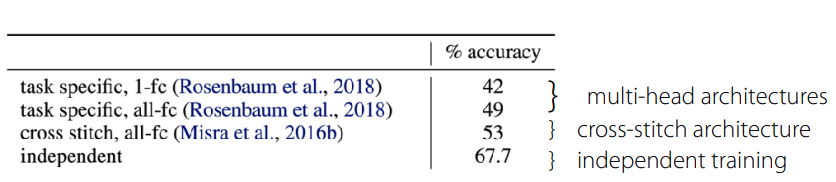{#fig-negative-transfer}

::: {.callout-note} 
Note that [Multi-task CIFAR-10/100](https://github.com/minhbtnguyen/multitask_learning_vit/blob/main/multitask-learning-cnn-cifar10.ipynb) does not refer to a separate official dataset but rather a modification of the well-known CIFAR-10/100 datasets into a multi-task format. Typically, tasks are distinguished hierarchically, where evaluation is divided into Multi-class Classification and Super-class Classification. 
:::

Although we previously discussed parameter sharing, sharing parameters for the sake of computational efficiency is not always beneficial. In fact, @yu2020gradient demonstrated in experiments using Multi-task CIFAR-100 that independent networks (single-task) actually performed best (@fig-negative-transfer). While the original intent of sharing is to discover common underlying elements of the problems, it can ironically lead to **negative transfer** due to the model's inability to distinctly characterize features between tasks. This results in optimization difficulties caused by cross-task inference or differences in learning dynamics across individual tasks. Furthermore, to effectively utilize task representations, the model size generally needs to be larger compared to single-task models.

To address this, the lecture introduces the concept of **soft parameter sharing**.

$$
\min_{\theta^{sh}, \theta^1, \dots, \theta^T} \sum_{i=1}^T \mathcal{L}_i({\theta^{sh}, \theta^i}, \mathcal{D}_i) + \lambda \sum_{i'=1}^T \Vert \theta^i - \theta^{i'} \Vert
$$

Unlike **hard parameter sharing** (such as the concatenation or multiplicative methods mentioned earlier) where parameters are fully shared, soft parameter sharing assigns separate parameters to each task. However, it adds a **regularization term** that calculates the difference (here, L2 distance) between the parameters of task $i$ and task $i'$ to ensure they do not diverge too much.

Consequently, if tasks are similar, their parameters will naturally align to minimize the loss, effectively leading to sharing. Conversely, for conflicting tasks, the model learns by balancing the task loss against the regularization penalty. This offers the advantage of fluidly adjusting parameter sharing between tasks. However, one must keep in mind the downsides: increased memory usage due to maintaining separate parameters per task and the additional burden of tuning the regularization term.

The reverse situation also holds true. If **overfitting** occurs on specific tasks rather than negative transfer, one should actively consider increasing parameter sharing.

As demonstrated, there are conflicting factors when balancing multi-task capabilities with generalization. Since there is no single optimal method or closed-form solution, the design of multi-task architectures requires significant deliberation.

### A Lot of Tasks

When dealing with multi-task learning, one often encounters scenarios involving a large number of tasks. From the perspective of training efficiency, a critical decision arises: should we train on all tasks simultaneously, or is it better to group similar tasks together?

As discussed with negative and positive transfer, there is no definitive method to determine or numerically quantify task similarity in advance. This is because task similarity depends not only on the content of the tasks themselves but also on dataset characteristics, the model architecture, the optimizer, and the current stage of training. Instead, research is currently focused on methods to **approximate** this similarity.

::: {#fig-similarity layout-ncol=2}

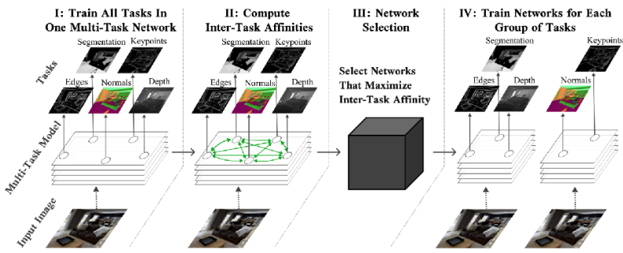{#fig-task-affinity}

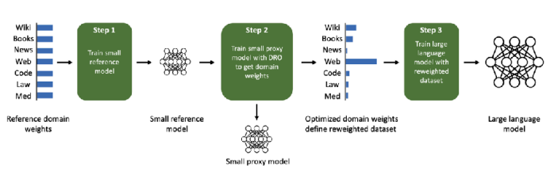{#fig-DoReMi}

Research on Task Grouping 
:::

The fundamental concept involves training a single model on all tasks and analyzing the optimization process or gradients. Specifically, it identifies which tasks exhibit gradients moving in similar directions and groups them accordingly.

The lecture introduced two papers regarding this approach. @fifty2021efficiently proposed a framework called **Task Affinity Grouping (TAG)**, which calculates **inter-task affinities** to select appropriate networks. Meanwhile, @xie2023doremi introduced a method (DoReMi) for optimizing the mixture weights of task-specific data used in pre-training Language Models.

## Summary

This lecture covered the foundational elements required to understand multi-task learning, including the definition of a task, basic model architectures capable of handling multiple tasks, objective functions, and strategies for optimization.

The core takeaway is that while multi-task learning distinguishes itself from single-task learning by utilizing a task descriptor to train the model, achieving true learning efficiency requires a careful consideration of the correlations between tasks.