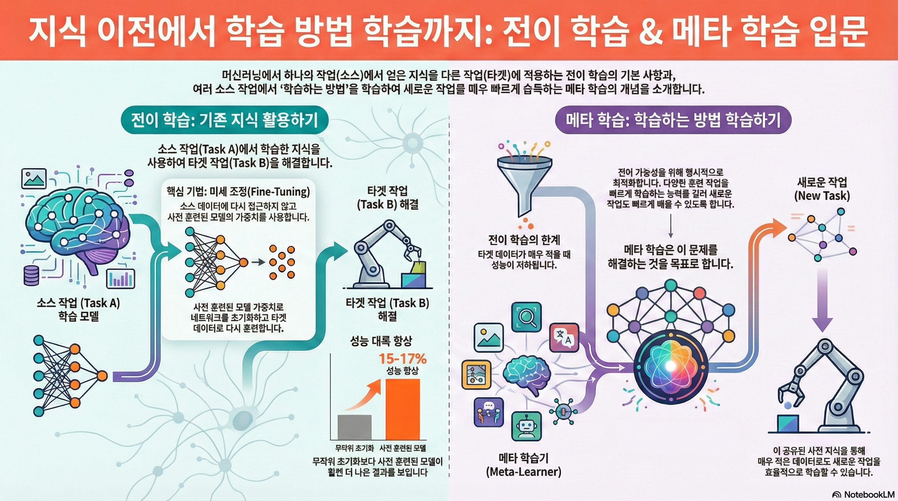

### 강의 및 자료

::: {layout-ncol=2}

:::

포스트에 소개되어 있는 자료는 강의 자료에서 따왔습니다.

## Lecture Summary with NotebookLM

## Multi-Task Learning vs. Transfer Learning

이전 강의에서 다뤘던 **Multi-Task Learning**은 여러 개의 task($\mathcal{T}_1, \mathcal{T_2}, \dots, \mathcal{T}_T$)에 대해서 **동시에** 해결하는 것이 목표이다. 즉, 하나의 모델이 주어진 모든 task에 대해서 좋은 성능을 내도록 학습하는 것이다. 이에 따라 parameter update를 위한 objective function도 다음과 같이 정의된다.

$$
\min_{\theta} \sum_{i=1}^T \mathcal{L}_i ( \theta, \mathcal{D}_i)
$$

반면, **Transfer Learning**는 어떤 Source Task $\mathcal{T}_a$ 와 Target Task $\mathcal{T}_b$ 가 있다고 가정했을 때, $\mathcal{T}_a$ 의 문제를 해결하면서 쌓은 지식을 활용하여 새로운 task $\mathcal{T}_b$ 를 해결하는 것이 목표이다. 그래서 $\mathcal{T}_a$ 에서의 성능보다는 $\mathcal{T}_b$ 에서의 성능을 높이는데 초점을 맞춘다. 이 학습의 기본적인 전제는 이렇게 지식이 활용되는 과정내에서 Source Task에서 쌓인 데이터셋 $\mathcal{D}_a$ 는 활용할 수 없다는 것이다. 즉, Source Task의 방대한 데이터를 재사용하는 것이 아니라, 그 데이터로부터 학습된 지식이 "압축된" 형태 (parameter) 만을 가져와서 활용하는 형태가 된다. 

사실 어떻게 보면 Transfer Learning이 이상적으로 학습된다면, Multi-task도 다룰 수 있는 방법론이 될텐데, 상식적으로 생각해도 $\mathcal{T}_a$ 에 대해 학습한 뒤, 해당 지식을 전이해서 $\mathcal{T}_b$ 에 적용하는 것도 결론적으로는 두가지 task $\mathcal{T}_a$ 와 $\mathcal{T}_b$ 에 대한 해결책을 갖는 것이 되기 때문이다. 하지만 기존에 학습했던 Task에 대한 데이터셋을 활용할 수 없다는 전제로 인해, Transfer Learning 문제를 Multi-task Learning으로 치환해서 풀 수 없다. 이전 강의 내용도 상기해보면, 기본 가정이 모든 task에 대한 데이터셋이 존재한 상태에서 multi-task learning이 이뤄졌다는 것을 알 수 있다.

그러면 어떤 시점에 multi-task learning대신 transfer learning을 고려하고, 어떤 문제에 적용하기 좋을까에 대한 질문을 던질 수 있는데, 강의에서는 두가지 케이스에 대해서 소개했다. 먼저, source task $\mathcal{T}_a$ 에서 쌓은 데이터인 $\mathcal{D}_a$ 의 양이 너무 클 때의 경우이다. 예를 들어서 ImageNet과 같이 source의 데이터셋이 매우 크기 때문에 특정 모델에 대해서 처음부터 재학습을 하거나 모델을 유지하는 것이 어렵기 때문에, 일반적으로는 공개되어 있는 지식이 함축된 parameter를 가져와서 활용하는 편이다. 물론 $\mathcal{D}_a$ 자체가 없는 경우도 많이 있다. 두번째의 경우는 source task $\mathcal{T}_a$ 가 아닌, target task $\mathcal{T}_b$ 의 성능을 더 고려할 때이다. 이 부분은 사실 실제 인공지능 모델이 배포되는 시점에서 생각해볼만한 부분인데, 대부분의 개발자는 자신의 학습환경보다는 실제 모델이 배포되었을 때에서의 성능이 어느정도 보장되는 것이 우선시되기 때문에 이 경우는 transfer learning을 적용해보면 좋은 예시가 될 수 있다.

## Transfer learning via fine-tuning

transfer learning 개념과 함께 다뤄지는 내용이 바로 **fine-tuning(미세 조정)**일 것이다. fine-tuning이란 source task $\mathcal{T}_a$ 에서 학습된 가중치 $\theta$ 로 신경망을 초기화한 뒤, target task $\mathcal{T}_b$ 의 데이터셋 $\mathcal{D}_b$ 를 사용해서 gradient descent를 통해 parameter $\phi$ 를 업데이트하는 방법이다. 강의에서는 추가학습을 위한 데이터셋이란 의미로 $\mathcal{D}^{tr}$ 로 표기했고, 수식으로는 다음과 같이 소개하고 있다.

$$
\phi \leftarrow \theta - \alpha \nabla_\theta \mathcal{L}(\theta, \mathcal{D}^{tr})
$$

{#fig-finetuning-result}

@fig-finetuning-result 는 @huh2016makes 에 소개된 내용인데, ImageNet과 같이 대규모 데이터셋으로 사전학습한 모델을 다른 데이터셋인 PASCAL과 SUN 데이터셋에 적용해봤을 때의 성능을 보여주고 있다.

::: {.callout-note}
[PASCAL VOC](https://docs.ultralytics.com/datasets/detect/voc/) 데이터셋은 컴퓨터 비전에서 많이 활용되는 데이터셋 중 하나로, 분류목적으로 구성된 ImageNet과 더불어, Object detection, Object segmentation, Classification에 대한 성능 검증을 할 수 있다. [SUN](https://groups.csail.mit.edu/vision/SUN/hierarchy.html) 데이터셋도 classification 뿐만 아니라 Scene Recognition과 Object Detection에 대한 성능 검증도 할 수 있는 데이터셋이다.
:::

앞에서 정의한 transfer learning의 형태를 가져오면, 해당 실험에서의 source task는 ImageNet이고, target task는 PASCAL과 SUN 데이터셋이 되겠다. 이 결과가 의미하는 것은 초기 학습시 임의로 초기화된 parameter를 사용하는 것보다 ImageNet에서 학습된 parameter를 초기값으로 사용하는 것이 훨씬 더 효과적임을 보여주고 있다. 이 밖에도 LLM이나 Foundation Model을 재학습시킬 때도 [HuggingFace](https://huggingface.co/) 같은 플랫폼으로부터 parameter를 가져와 활용하는 편이다.

그러면 fine-tuning을 하는 방법도 여러가지가 있을텐데, 강의에서 쉽게 fine-tuning을 위해서 취해볼 수 있는 방법론 몇가지를 소개했다.

- 작은 learning rate $\eta$ 로 fine-tune 시도
- 앞쪽 layer에 대해서 작은 learning rate로 fine-tune
- 초기에는 앞쪽 layer를 freeze했다가, 점점 unfreeze하는 방식으로 fine-tune
- 마지막 layer만 재초기화
- Cross Validation을 통해서 hyperparameter 재탐색
- 다른 Architecture 고려 

특히 작은 learning rate로 설정하거나, layer를 freeze해서 fine-tuning한다는 내용이 많이 나오는데, 학습 데이터셋에 비해 상대적으로 작은 데이터셋으로 인한 급격한 변화 (Feature Distortion)를 막기 위한 방법이라고 보면 좋을 것 같다.

## Breaking Common Wisdom

사실, 사전 모델 학습에 있어서 반드시 크고 방대한 데이터셋이 있어야만 이런 transfer learning이나 fine-tuning을 통한 성능 개선이 가능할 것 같지만, 이를 반증하는 내용도 제시되어 있다.

{#fig-diverse-data}

@fig-diverse-data 는 @krishna2023downstream 에 소개된 내용인데, Pre-train과 fine-tuning시 사용하는 데이터셋의 차이를 두어 어떤 모델의 성능이 가장 좋은지를 비교하는 실험을 했다. 이 중 가운데에 있는 경우는 Wikipedia와 같이 방대한 데이터로 Pre-train을 하고, 사전에 정의된 finetuning용 데이터셋으로 학습시킨 경우이고, 일반적으로는 이렇게 했을때의 결과가 가장 좋을 거라고 생각할 수 있다. 하지만 결과가 보여주는 의미는 방대한 데이터가 아니더라도 Downstream task (앞에서 소개한 target task)에 해당하는 데이터만 가지고 unsupervied pre-training 을 해도 이와 비등한 결과를 얻을 수 있다는 점이다. 이를 통해서 사전 학습 데이터가 반드시 다양할 필요는 없으며, 타겟 데이터셋만으로도 충분히 유의미한 특징을 학습할 수 있음을 시사한다. 

@lee2022surgical 논문에서도 이런 비슷한 통념을 깬 내용을 소개하고 있다.

{#fig-surgical-fine-tuning}

일반적인 transfer learning에서는 모델의 마지막 layer(head)가 가장 task에 특화된 부분이기 때문에 마지막 layer를 재학습하는 것이 효과적이라고 알려져있었지만, 저자의 아이디어는 "만약 어떤 label을 예측하는 것이 아니라, 조금 low-level에서 발생하는 pixel corruption에 대응하려면 마지막 layer가 아닌 중간이나 앞단의 layer를 수정해야 되지 않을까?" 라는 것이었다. 그래서 실제 실험도 기존의 통념으로 진행한 부분 (CelebA 데이터셋으로 학습한 Output-Level Shift)와 함께, 조금더 low-level에서 바뀌는 Feature-level shift(Entity-30 데이터셋)와 Input-level shift(CIFAR-10-Corruption) task에서의 fine-tuning 효과를 확인하고자 했다. @fig-surgical-fine-tuning 의 결과로는 꼭 마지막 layer가 아니더라도 처음 layer나 심지어는 중간 layer를 fine-tuning해도 좋은 성능이 나온다는 것을 확인할 수 있다. 

그래서 교수가 언급한 아이디어는 @kumar2022fine 에서 소개된 Linear Probing then Full Fine-tuning (LP-FT) 이란 방식이다.

{#fig-LP-FT}

기존의 Fine-tuning 방식은 단순히 Full Fine-tuning 만 하거나, 혹은 Linear Probing, 즉 앞단의 feature extractor 부분은 freeze시키고 마지막 head 부분만 재학습하는 방식이었는데, 이렇게 하면 fine-tuning distribution sample(혹은 in-distribution)에서만 잘되거나, 혹은 Out-of-Distribution sample 성능이 개선되어도 오히려 in-distribution sample에서의 성능이 열화되는 현상이 나타난다. 그래서 @kumar2022fine 에서 소개한 방법은 @fig-LP-FT 에도 나와있는 것처럼 두가지 방법을 모두 활용하여, 먼저 마지막 head만 학습시키고 난 후에, 이때의 validation loss가 어느정도 수렴하면, 그 후에 전체 네트워크를 unfreeze한 후, fine-tuning하는 방식이다. 일반적으로 transfer learning을 하게 되면 target task에 맞춰서 head를 랜덤하게 초기화하는데, 이 상태에서 전체 네트워크를 학습시키면 랜덤하게 초기화된 head에서 발생하는 이상한 gradient로 인해서 앞단에 힘들게 학습시킨 feature extractor의 parameter가 틀어지는 현상이 나타난다. 보통 이런 현상을 **Feature Distortion** 이라고 하는데, 제안한 LP-FT 방식은 fine-tuning시 발생할 수 있는 이런 Feature Distortion을 완화시켜주는 Robustness 측면에서의 이점이 있다고 볼 수 있다.

transfer learning에서의 통념 중 하나는 pre-training이 항상 유리하다는 점이다.

{#fig-ULMFiT}

@fig-ULMFiT 은 @howard2018universal 논문에 소개된 실험 결과인데, 첫번째 그래프의 결과는 학습 데이터의 양과는 상관없이, From-scratch로 학습하는 것보다는 사전 학습된 모델을 fine-tuning하는 것이 항상 validation error가 낮음을 보여주고 있다. 특히 같은 데이터양의 관점으로 봤을때도, 파란색 선으로 표현된 from-scratch 방식보다 주황색/초랙색의 fine-tuning 결과가 전반적으로 좋게 나온다. 그리고 두번째의 그래프는 첫번째 그래프의 경우와는 다르게 학습 데이터의 양을 극도로 줄인 환경에서의 성능을 비교한 것인데, 여기에서 볼 부분은 training sample의 수가 극도로 적은 (즉, fine-tuning할 데이터의 양이 작은) 100개 정도의 샘플에서의 validation error는 생각보다 그렇게 큰 개선치를 보여주지 못한다. 결과적으로 target task의 데이터셋의 양이 극도로 적은 케이스에서는 pre-training도 좋은 설루션이 되지 않는다는 것이다.

그래서 강의에서는 데이터가 너무 적은 경우에서도 모델이 빠르게 적응할 수 있도록, objective function 등으로 task 간의 전이가능성(transferability)을 명시적으로 표현할 수 있는 **meta-learning** 기법의 필요성에서 대해서 설명했다.

## From Transfer Learning to Meta-Learning

그러면 앞에서 다뤘던 Transfer Learning과 달리 Meta-Learning에서는 어떤 부분이 강조가 된 것일까? 우선 목적성은 동일하다. Transfer learning 에서도 target task에서의 성능을 개선하기 위해서 모델을 초기화하는 방법에 대해서 다루고 있었고, meta-learning도 동일한 지향점을 가지고 있는데, meta-learning에서 강조되는 목적 중 하나는 바로 앞에서 언급했던 것처럼 transferability를 어떻게 명시적으로 최적화할 수 있냐(explicitly optimize)는 것이다. 쉽게 예시로 들자면, 어떤 주어진 training task들이 주어졌을 때, 이 task들에 대해서 빠르게 학습하는 방법에 최적화할 수 있는지 여부를 확인하려고 한다. 만약 이게 가능하다면 training task가 아닌 새로운 task가 들어왔을때도 빠르게 학습할 수 있게 된다. 

그러면 학습에 대한 objective function은 learning a task ( $\mathcal{D}_i^{tr} \rightarrow \theta$ )가 될 것이고, 작은 $\mathcal{D}_i^{tr}$ 로도 objective function을 최소화시킬 수 있는 방법을 찾는 것이 meta-learning에서의 근본적인 목표이다.

사실 meta-learning 자체가 지향하는 바는 이상적이지만, 실체에 대해서 실현 가능성 여부가 궁금할 수 있는데, 강의에서는 이 부분을 두가지로 나눠서 설명하고자 했다. 우선 meta-learning에서 어떻게 데이터셋을 처리하고, 새로운 task에 대해서 어떻게 학습할 것인가 하는 동작원리(Mechanistic View)의 관점에서 살펴보고, 두번째로는 왜 meta-learning이 적은 샘플로도 task에 대해서 학습이 가능한지를 bayesian statistics를 기반으로 살펴보는 확률론적 관점(Probabilistic View)에서 meta-learning의 가능성을 살펴보았다. 

### Probabilistic View

강의의 전체적인 내용은 Mechanistic View에 초점을 맞추지만, 해당 내용을 설명하기에 앞서 확률론적 관점에서 meta-learning이 어떻게 동작하는지에 대해서 간단하게 설명했다.

{#fig-probabilistic-graphical-model}

@fig-probabilistic-graphical-model 은 **Probabilistic Graphical Model** 이란 컨셉으로 학습에 대한 과정을 일종의 확률 모델 형태로 도식화한 것이다. 여기에서 동그라미는 Random Variable이고, 각 변수간의 상관관계나 의존성은 화살표로 표기된다. 그리고 박스는 동일 구조가 반복적으로 수행되는 것을 명시한다. 먼저 박스 안쪽에 있는 내용은 전형적인 task의 학습 과정을 표현한다. 그래서 주어진 데이터 $x, y$ 를 잘 표현할 수 있는 parameter $\phi$ 찾는 과정이 된다. 여기에서 바깥쪽에 있는 $\theta$ 가 meta-learning을 위한 parameter가 되는데, 쉽게 설명하면 task간의 **공유되는 지식(shared structure)**가 된다. 그러면 meta-learning의 학습 구조는 가장 상위에 shared structure를 위한 $\theta$ 가 존재하고, 이 $\theta$ 가 각 Task별 parameter $\phi_i$ 에 영향을 미치며, 결국 이 $\phi_i$ 가 각 Task 별 데이터를 설명하는 parameter가 된다. 이렇게 되면 학습에 사용되는 모든 Task는 $\theta$ 라는 공통된 지식을 갖게 되는 것이다.

만약 $\theta$ 가 없었다면 각 task의 parameter $\phi_1, \phi_2, \dots$ 는 서로 관련이 없어보이겠지만, 이제 $\theta$ 에 대해서 알고 활용한다면 각 task의 parameter 역시 해당 정보 기반으로 구분이 더 될 것이다. ( $\phi_1 \perp \!\!\! \perp \phi_2 \perp \!\!\! \perp \dots$ ) 이로 인해서 데이터에 대한 entropy 역시 어떤 $\theta$ 라는 공통 규칙을 알게 되면 개별 Task에 대한 parameter $\phi_i$ 에 대한 entropy도 줄어들고 ( $\mathcal{H}(p(\phi_i \vert \theta)) \lt \mathcal{H}(p(\phi_i))$), 결과적으로 데이터가 많이 필요하지 않아도 정답을 찾을 수 있게 된다.

이에 대한 쉬운 이해를 위해서 강의에서는 두가지 예시 (@fig-bayesian-meta-learning) 를 설명했다. 

::: {#fig-bayesian-meta-learning layout-ncol=2}

{#fig-multi-task-sinusoid}

{#fig-multi-language-machine-translation}

:::

먼저 @fig-multi-task-sinusoid 에서는 여러 개의 sine graph를 학습하는 task에 대한 문제인데, 앞의 구조를 가져오면 $\phi_i$ 는 각 그래프별 진폭(amplitude)와 위상(phase)가 될 것이고, $\theta$ 는 각 그래프가 sine graph 모양이다 라는 사실 자체가 된다. 만약 우리가 각 그래프가 sine graph 모양이라는 사실을 모른 상태에서 점을 추정하면 수많은 데이터가 필요하지만, $\theta$ 를 알면 점 몇 개만 찍어봐도 $\phi_i$ 를 금방 추정할 수 있다. @fig-multi-language-machine-translation 에서 소개하는 또다른 예시인 다국어 번역에서도 언어에 대한 보편적인 문법 구조나 의미론적 체계가 $\theta$ 로 사전에 주어진다면, 그렇지 않은 경우보다 조금 더 효율적으로 학습시킬 수 있다.

정리하자면 bayesian 관점에서 meta-learning은 문제상에 내재되어 있는 공통적인 지식 $\theta$ 를 찾는 문제와 같다. 개별 사건 ( $\phi_i$ )들은 서로 달라 보이지만, 그 뒤에 숨어있는 공통된 원리( $\theta$ )를 파악하면, 기존에 학습되지 않은 새로운 task에 대응할 때도 적은 데이터만으로도 문제를 해결할 수 있게 된다. 이 개념이 meta-learning 에서 나오는 **Few-shot Learning**의 이론적인 근거가 되겠다.

## An Example of Meta-Learning

::: {#fig-meta-learning layout-nrow=2}

{#fig-meta-training}

{#fig-meta-testing}

:::

앞에서 언급한 바와 같이 이제 Mechanistic 관점에서의 meta learning의 동작원리를 살펴보고자 한다. @fig-meta-learning 은 흔히 meta-learning process로 소개되는 **meta training**과 **meta testing** 에 대한 예시이다. 먼저, 우리가 풀어야 할 문제가 여러 개 ( $\mathcal{T}_1, \mathcal{T}_2, \dots, \mathcal{T}_i$ ) 가 있고, 각 task마다 분류하고자 하는 것이 다르다고 가정해보자. 여기에 constraint를 걸어 학습하는 데이터의 양이 매우 적은 상황도 고려해보면, 이런 환경에서 From scratch로 학습한다면, 원하는 성능치를 얻지 못할 것이다. 이를 위해서 맨 먼저 수행하는 것이 @fig-meta-training 에서 보여주는 Meta Training 이다. 이 과정에서는 우리가 해결하고자 적은 데이터로 task를 학습하는 문제를 일종의 모의고사처럼 만들어 모델에게 연습시키는 과정이다. 이때 필요한 것은 학습시 필요한 방대한 데이터셋을 우리가 풀고자 하는 문제와 동일한 형태의 세부 가상 Task들로 나눈다. 예를 들어서 $\mathcal{T}_1$ 에서는 5장의 사진을 보고, 주어진 이미지에 대한 label을 맞추는 문제, $\mathcal{T}_2$ 에서는 또다른 5장의 사진을 보고, 새로 주어진 이미지의 label을 맞추는 문제, 이런 식으로 말이다. 이 과정을 통해서 모델은 "label" 자체를 외우는 것이 아니라, "사진 몇 장을 봤을 때, 그 특징을 빠르게 파악해서 구분하는 능력" 자체를 훈련하게 된다.

이 훈련이 끝난 후, 실제로 우리가 풀고자 했던 새로운 문제에 적용하는 meta testing 과정이 이어진다. @fig-meta-testing 에서처럼 training시에는 주어지 않았던 새로운 이미지를 class별로 1장씩 주었을 때, 과연 학습되지 않았던 label을 가진 이미지라도 모델이 훈련과정을 통해서 적은 사진만 보고 구분하는 법을 학습했기 때문에 빠르게 해당 입력도 적응하여 분류할 수 있게 된다. 
Meta Learning으로 문제를 해결하기 위해 정의되어야 할 가정이 있는데, 반드시 meta training과 meta testing시 활용되는 task는 동일한 Task 분포에서 동일하면서 독립적인 분포를 형성하며 샘플링되어야 한다는 것이다. (Independent and Indentically Distributed, i.i.d) 수식으로 표현하자면 meta-training시 주어진 Task $\mathcal{T}_1, \dots, \mathcal{T}_n$ 이 있고, meta testing시 사용할 $\mathcal{T}_{test}$ 가 있을때, 다음과 같은 성격을 띄어야 한다.

$$
\mathcal{T}_1, \dots, \mathcal{T}_n \sim p(\mathcal{T}), \mathcal{T}_{test} \sim p(\mathcal{T})
$$

그러니까 쉽게 설명하면, 뭔가 4족 보행 로봇을 보행에 대한 학습을 기반으로 2족 보행 로봇의 보행으로 전이시키는 문제는 meta learning이지만, 보행이 아닌 grasping이나 push 같은 건 또 meta learning을 통해서 해결할 수 있는 문제가 아닌 것이다. 즉 task는 앞에서도 언급한 공통적인 구조 $\theta$ 를 가져야 한다.

참고로 Meta Learning 관련 논문을 살펴보다 보면 몇가지 새로운 용어들이 나오게 되는데, 간단히 정리해보면 다음과 같다.

- **Support Set**: 각 task에서 학습용으로 주어지는 적은 양(few-shot) 데이터를 말한다. 기존의 머신러닝 개념에서는 training set 역할을 한다.
- **Query Set**: 학습한 내용을 바탕으로 맞춰야 할 "문제" 데이터를 말한다. 기존의 머신러닝 개념에서는 test set 역할을 한다.
- **N-way K-shot Learning**: Meta Learning에서의 문제 난이도를 정의하는 용어이다.
  - **N-way**: 분류해야 할 class의 갯수를 말한다
  - **K-shot**: 각 class당 주어지는 예제(support)의 갯수를 말한다.

사실 강의의 예시는 쉬운 이해를 위해서 이미지 분류를 들었지만, 회귀(Regression), 언어 생성(Language Generation), 로봇 스킬 학습(Robot Skill Learning)에서도 동일한 Meta Learing 컨셉으로 문제를 정의하고 해결할 수 있다.

## Summary

사실 강의에서는 학생들의 질문이 많아, 강의 자료에 있는 내용을 많이 skip하고 넘어간 부분이 있어서 개인적으로 강의자료를 보고 정리해보았다. 전체 내용을 요약해보자면, 이전 강의에서 다뤘던 multi-task learning과는 다르게 transfer learning에서는 source task $\mathcal{T}_a$ 에서 학습했던 지식 기반으로 target task $\mathcal{T}_b$ 를 해결하는 것이 목적이며, 일반적으로 사전에 확보된 방대한 데이터로 학습하거나, 미리 학습된 가중치를 기반으로 fine-tuning하는 방식이 수행된다. 그래서 fine-tuning하는 방법에 대해서도 소개가 되었고, meta learning에서는 결과적으로 수많은 source task에 대한 transfer learning을 수행하는 형태가 된다. 일반적으로 meta learning에서는 task간의 공통된 특성을 찾는 것이 목적이 되므로, 적은 샘플 내에서 학습한 후, 새로운 target task에서 얼마나 빠르게, 정확하게, 안정적으로 대응할 수 있는지를 찾는 과정이라고 보면 될 것 같다.

