### Resource

::: {layout-ncol=2}

:::

## Lecture Summary with NotebookLM

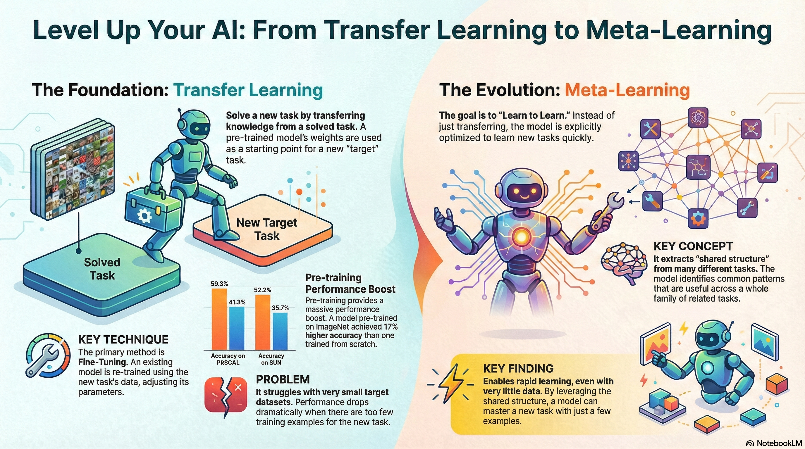

## Multi-Task Learning vs. Transfer Learning

**Multi-Task Learning**, as discussed in the previous lecture, aims to solve multiple tasks ($\mathcal{T}_1, \mathcal{T_2}, \dots, \mathcal{T}_T$) **simultaneously**. In other words, the goal is to train a single model that performs well across all given tasks. Accordingly, the objective function for parameter updates is defined as follows:

$$
\min_{\theta} \sum_{i=1}^T \mathcal{L}_i ( \theta, \mathcal{D}_i)
$$

On the other hand, **Transfer Learning** assumes the existence of a Source Task $\mathcal{T}_a$ and a Target Task $\mathcal{T}_b$. Its goal is to solve the new task $\mathcal{T}_b$ by leveraging the knowledge acquired while solving $\mathcal{T}_a$. Therefore, the focus is on maximizing performance on $\mathcal{T}_b$ rather than $\mathcal{T}_a$. A fundamental premise of this approach is that the dataset $\mathcal{D}_a$ accumulated from the Source Task is typically not available during the adaptation process. Instead of reusing the massive data from the Source Task directly, we utilize the "compressed" knowledge (parameters) learned from that data.

Ideally, if Transfer Learning is performed perfectly, it could be seen as a method capable of handling Multi-task scenarios. Intuitively, learning $\mathcal{T}_a$ and then transferring that knowledge to $\mathcal{T}_b$ ultimately results in a solution for both tasks. However, due to the constraint that we cannot access the dataset of the previously learned task, Transfer Learning cannot simply be treated as a Multi-task Learning problem. Recalling the previous lecture, Multi-task Learning assumes that datasets for all tasks are simultaneously available.

So, when should we consider Transfer Learning over Multi-task Learning? The lecture introduced two primary scenarios.

First, when the amount of data $\mathcal{D}_a$ accumulated in the source task $\mathcal{T}_a$ is too large. For example, datasets like ImageNet are so massive that retaining the data or retraining a model from scratch is computationally prohibitive. In such cases, it is common to use publicly available parameters that encapsulate the learned knowledge. Of course, there are also frequent cases where $\mathcal{D}_a$ is simply unavailable.

Second, when the performance of the **target task** $\mathcal{T}_b$ **is the priority**, rather than the source task. This is a practical consideration when deploying AI models. Since developers often prioritize performance in the deployment environment over the training environment, Transfer Learning serves as an excellent approach in this context.

## Transfer learning via fine-tuning

A concept closely related to Transfer Learning is **Fine-tuning**. Fine-tuning involves initializing a neural network with weights $\theta$ learned from a source task $\mathcal{T}_a$, and then updating the parameters $\phi$ via gradient descent using the dataset $\mathcal{D}_b$ of the target task $\mathcal{T}_b$. The lecture denotes the dataset for additional training as $\mathcal{D}^{tr}$, and the update rule is described as follows:

$$
\phi \leftarrow \theta - \alpha \nabla_\theta \mathcal{L}(\theta, \mathcal{D}^{tr})
$$

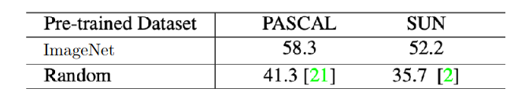{#fig-finetuning-result}

@fig-finetuning-result displays results from @huh2016makes. It compares the performance when applying a model pre-trained on a large-scale dataset like ImageNet to different datasets such as PASCAL and SUN.

::: {.callout-note} 
The [PASCAL VOC](https://docs.ultralytics.com/datasets/detect/voc/) dataset is widely used in computer vision. Alongside ImageNet, which is primarily constructed for classification, PASCAL VOC allows for performance validation in Object Detection, Object Segmentation, and Classification. The [SUN](https://groups.csail.mit.edu/vision/SUN/hierarchy.html) dataset also enables validation for Scene Recognition and Object Detection in addition to classification. 
:::

Applying the definition of transfer learning mentioned earlier, ImageNet serves as the source task in this experiment, while PASCAL and SUN represent the target tasks. These results indicate that using parameters learned from ImageNet as initialization is significantly more effective than using random initialization. This practice is also standard when retraining LLMs or Foundation Models, where parameters are often downloaded from platforms like [HuggingFace](https://huggingface.co/) for use.

There are various strategies for fine-tuning. The lecture highlighted several accessible methods:

- Fine-tune with a smaller learning rate $\eta$.
- Fine-tune earlier layers with a smaller learning rate.
- Freeze earlier layers initially, then gradually unfreeze them during fine-tuning.
- Re-initialize only the last layer.
- Search for new hyperparameters via Cross-Validation.
- Consider different architectures.

Techniques like using a small learning rate or freezing layers are frequently mentioned. These methods can be seen as strategies to prevent **Feature Distortion**—drastic changes in learned features caused by training on a relatively small dataset compared to the original training set.

## Breaking Common Wisdom

While it is often assumed that massive datasets are strictly necessary for pre-training to achieve performance gains through transfer learning or fine-tuning, evidence suggests otherwise.

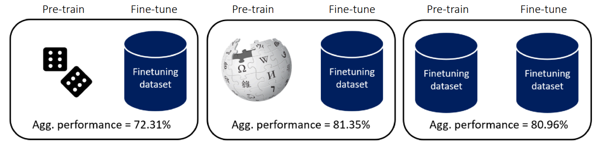{#fig-diverse-data}

@fig-diverse-data illustrates findings from @krishna2023downstream. The authors conducted experiments comparing model performance based on the difference between datasets used for pre-training and fine-tuning. The middle case represents pre-training on massive data (like Wikipedia) followed by fine-tuning on a defined dataset. While one might generally expect this to yield the best results, the findings show that unsupervised pre-training using **only** the data relevant to the Downstream task (the target task mentioned earlier) produces comparable results. This implies that pre-training data does not necessarily need to be diverse; learning meaningful features is possible using only the target dataset.

@lee2022surgical also introduces content that challenges similar conventional wisdom.

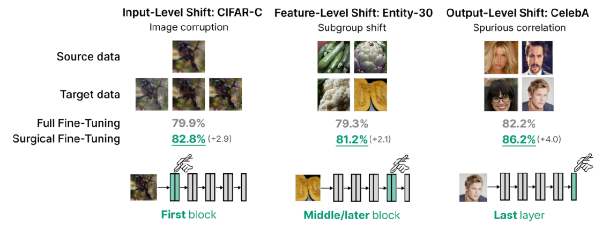{#fig-surgical-fine-tuning}

In general transfer learning, it is known that retraining the last layer (head) is effective because it is the most task-specific part. However, the author's idea was: "If the goal is not just label prediction but handling low-level pixel corruptions, shouldn't we modify the intermediate or earlier layers?" Consequently, the experiment verified fine-tuning effects not only on Output-Level Shift (CelebA dataset), which aligns with conventional wisdom, but also on Feature-level shift (Entity-30 dataset) and Input-level shift (CIFAR-10-Corruption), which involve changes at lower levels. The results in @fig-surgical-fine-tuning confirm that fine-tuning the first or even intermediate layers—rather than just the last layer—can yield excellent performance depending on the context.

Thus, the idea mentioned by the professor is the **Linear Probing then Full Fine-tuning (LP-FT)** method introduced in @kumar2022fine.

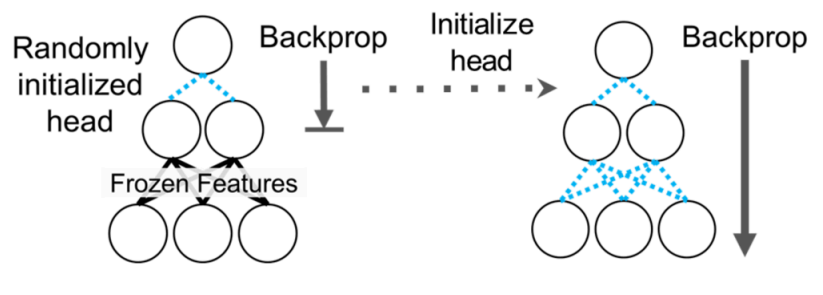{#fig-LP-FT}

Conventional fine-tuning methods typically involved either simply performing Full Fine-tuning or using Linear Probing (freezing the feature extractor and training only the head). However, these approaches often resulted in good performance only on fine-tuning distribution samples (in-distribution) or caused degradation in in-distribution performance even if Out-of-Distribution sample performance improved.

Therefore, the method introduced in @kumar2022fine, as shown in @fig-LP-FT, utilizes both approaches. First, only the head is trained (Linear Probing). Once the validation loss converges to some extent, the entire network is unfrozen and fine-tuned. Generally, in transfer learning, the head is randomly initialized to match the target task. If the entire network is trained from this state, the "weird" gradients generated from the randomly initialized head can disrupt the parameters of the feature extractor that were painstakingly learned. This phenomenon is commonly referred to as Feature Distortion. The proposed LP-FT method offers advantages in terms of robustness by mitigating this distortion that can occur during fine-tuning.

Another common belief in transfer learning is that pre-training is always advantageous.

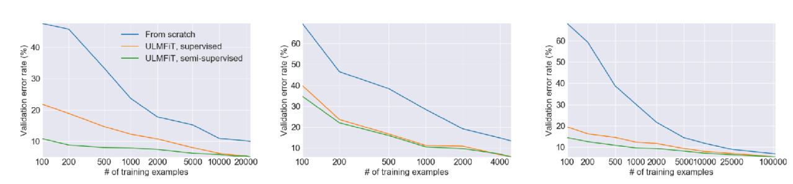{#fig-ULMFiT}

@fig-ULMFiT shows experimental results from the @howard2018universal paper. The first graph demonstrates that, regardless of the amount of training data, fine-tuning a pre-trained model consistently yields lower validation error compared to training from scratch. Even with the same amount of data, fine-tuning results (orange/green lines) are generally better than the from-scratch approach (blue line).

However, the second graph compares performance in an environment where the amount of training data is extremely reduced. The key observation here is that with an extremely small number of training samples (around 100), the validation error does not show as significant an improvement as expected. Consequently, when the target task dataset is extremely small, pre-training may not be a viable solution.

Therefore, the lecture explained the necessity of **meta-learning** techniques. These techniques can explicitly express transferability between tasks using objective functions, enabling models to adapt quickly even when data is extremely scarce.

## From Transfer Learning to Meta-Learning

So, what distinguishes Meta-Learning from the Transfer Learning discussed earlier?

First, the fundamental goal is shared. Transfer Learning addresses methods for initializing models to improve performance on a target task, and Meta-Learning shares this objective. However, a key distinction in Meta-Learning is its focus on **explicitly optimizing** for **transferability**, as previously mentioned. To put it simply, given a set of training tasks, the goal is to optimize the learning process itself to adapt quickly to these tasks. If successful, this enables rapid adaptation even when presented with a new, unseen task.

Consequently, the objective function revolves around "learning a task" ($\mathcal{D}_i^{tr} \rightarrow \theta$), and the fundamental goal of Meta-Learning is to find a way to minimize this objective function even with a small dataset $\mathcal{D}_i^{tr}$.

While the aspirations of Meta-Learning are ideal, one might question its feasibility in practice. The lecture addressed this by breaking it down into two perspectives:

1. Mechanistic View: This perspective looks at the operational principles—how datasets are processed and how learning is executed for new tasks.
2. Probabilistic View: Based on Bayesian statistics, this perspective explores why learning is possible even with few samples, examining the theoretical potential of Meta-Learning.

### Probabilistic View

While the lecture primarily focuses on the Mechanistic View, it first briefly introduced how Meta-Learning operates from a probabilistic perspective.

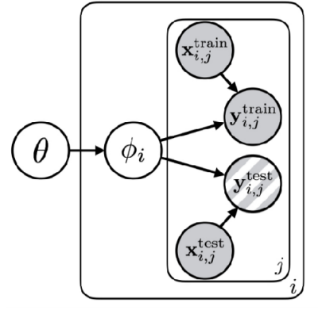{#fig-probabilistic-graphical-model}

@fig-probabilistic-graphical-model visualizes the learning process as a probabilistic model, a concept known as a **Probabilistic Graphical Model**. Here, circles represent Random Variables, and arrows indicate correlations or dependencies between them. The box (plate notation) signifies that the same structure is executed repeatedly.

First, the content inside the box represents the typical task learning process: finding the parameter $\phi$ that best explains the given data $x, y$. The external variable $\theta$ serves as the parameter for Meta-Learning; simply put, it represents the **shared structure** or knowledge across tasks. In this Meta-Learning structure, $\theta$ (the shared structure) sits at the top and influences the task-specific parameters $\phi_i$. In turn, $\phi_i$ becomes the parameter that explains the data for each specific task. Consequently, all tasks involved in the learning process share the common knowledge $\theta$.

Without $\theta$, the parameters $\phi_1, \phi_2, \dots$ for each task would appear unrelated (independent). However, by knowing and utilizing $\theta$, the parameters for each task become conditionally dependent on this shared information ($\phi_1 \perp \!\!\! \perp \phi_2 \perp \!\!\! \perp \dots$).
Knowing the common rule $\theta$ reduces the entropy of the task-specific parameters $\phi_i$ ($\mathcal{H}(p(\phi_i \vert \theta)) \lt \mathcal{H}(p(\phi_i))$). Consequently, we can find the solution without requiring a large amount of data.

To illustrate this, the lecture provided two examples (@fig-bayesian-meta-learning).

::: {#fig-bayesian-meta-learning layout-ncol=2}

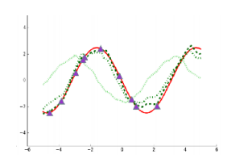{#fig-multi-task-sinusoid}

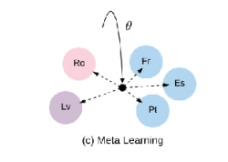{#fig-multi-language-machine-translation}

:::

First, @fig-multi-task-sinusoid represents the problem of learning multiple sine waves. Applying the structure discussed above, $\phi_i$ corresponds to the amplitude and phase of each specific wave, while $\theta$ represents the general knowledge that "these are sinusoidal functions." Without knowing that the underlying function is a sine wave, we would need significant data to estimate the curve. However, knowing $\theta$ allows us to estimate $\phi_i$ quickly with just a few data points.

Similarly, in the Multi-language Machine Translation example shown in @fig-multi-language-machine-translation, if universal grammatical structures or semantic systems are given as $\theta$ beforehand, the model can be trained much more efficiently than without them.

In summary, from a Bayesian perspective, Meta-Learning is equivalent to the problem of discovering the shared knowledge $\theta$ inherent in the tasks. Although individual events ($\phi_i$) may appear distinct, identifying the hidden common principle ($\theta$) allows us to solve problems with minimal data, even when encountering new, unseen tasks. This concept provides the theoretical foundation for **Few-shot Learning** in Meta-Learning.

## An Example of Meta-Learning

::: {#fig-meta-learning layout-nrow=2}

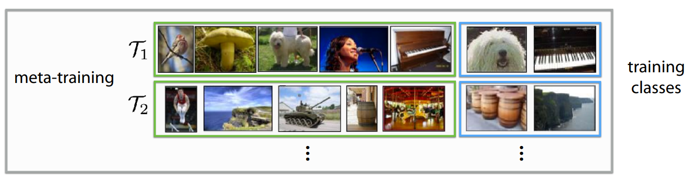{#fig-meta-training}

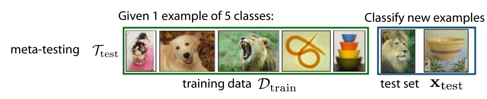{#fig-meta-testing}

:::

As mentioned earlier, we now turn to the working principles of Meta-Learning from the **Mechanistic View**. @fig-meta-learning illustrates **meta-training** and **meta-testing**, which are commonly cited as the core processes of Meta-Learning.

First, let's assume we have multiple tasks to solve ($\mathcal{T}_1, \mathcal{T}_2, \dots, \mathcal{T}_i$), where each task involves classifying different objects. If we add a constraint that the amount of training data is very small, training from scratch in this environment would fail to achieve the desired performance.

To address this, we first perform **Meta-Training**, as shown in @fig-meta-training. This process is akin to a "mock exam," where the model practices the problem of learning tasks with limited data. Here, we divide a massive dataset into detailed virtual tasks that mirror the structure of the problem we intend to solve. For instance, in $\mathcal{T}_1$, the model might be asked to predict a label after viewing 5 photos; in $\mathcal{T}_2$, it does the same with a different set of 5 photos. Through this process, the model trains not to memorize specific "labels," but rather the **ability to quickly grasp features and distinguish objects** after seeing just a few examples.

After this training, the **Meta-Testing** process follows, where we apply the model to the actual new problem we want to solve. As shown in @fig-meta-testing, even when given new images (e.g., 1 shot per class) with labels not seen during training, the model can quickly adapt and classify the inputs. This is because it has already learned the method of distinguishing objects using very few images during the training process.

A critical assumption must be defined to solve problems with Meta-Learning: the tasks used in meta-training and meta-testing must be sampled from the same task distribution and must be Independent and Identically Distributed (i.i.d.).Mathematically, if we have tasks $\mathcal{T}_1, \dots, \mathcal{T}_n$ given during meta-training and $\mathcal{T}_{test}$ to be used during meta-testing, they must satisfy the following property:

$$
\mathcal{T}_1, \dots, \mathcal{T}_n \sim p(\mathcal{T}), \mathcal{T}_{test} \sim p(\mathcal{T})
$$

To put it simply, transferring knowledge from quadruped robot walking to bipedal robot walking qualifies as a Meta-Learning problem. However, transferring walking skills to tasks like grasping or pushing does not, as they do not share the underlying task structure. In other words, the tasks must share the **common structure** $\theta$ mentioned earlier.

For reference, when reading Meta-Learning papers, you will encounter several specific terms. Here is a brief summary:

- **Support Set**: The small amount of data (few-shot) provided for learning in each task. It serves the role of the training set in traditional machine learning.
- **Query Set**: The "problem" data to be predicted based on what was learned. It serves the role of the test set in traditional machine learning.
- **N-way K-shot Learning**: Terms defining the problem difficulty in Meta-Learning.
  - **N-way**: The number of classes to classify.
  - **K-shot**: The number of examples (support) provided per class.

While the lecture used image classification as an example for clarity, the same Meta-Learning concepts can be defined and applied to **Regression, Language Generation**, and **Robot Skill Learning**.

## Summary

Due to the high volume of student questions during the lecture, several sections of the slide deck were skipped. I have personally organized and summarized the material based on the lecture slides to fill in these gaps.

To summarize the overall content: unlike Multi-Task Learning, which was covered in previous sessions, **Transfer Learning** aims to solve a target task $\mathcal{T}_b$ based on knowledge acquired from a source task $\mathcal{T}_a$. This is typically achieved by training on massive, pre-acquired datasets or by **fine-tuning** based on pre-trained weights. We also explored various methodologies for effective fine-tuning.

**Meta-Learning**, effectively, can be viewed as performing transfer learning across numerous source tasks. Since the primary goal of Meta-Learning is to identify common characteristics shared among tasks, it can be understood as a process of determining how **quickly, accurately, and stably** a model can adapt to a new target task after learning from just a few samples.