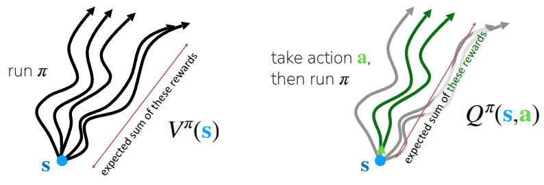
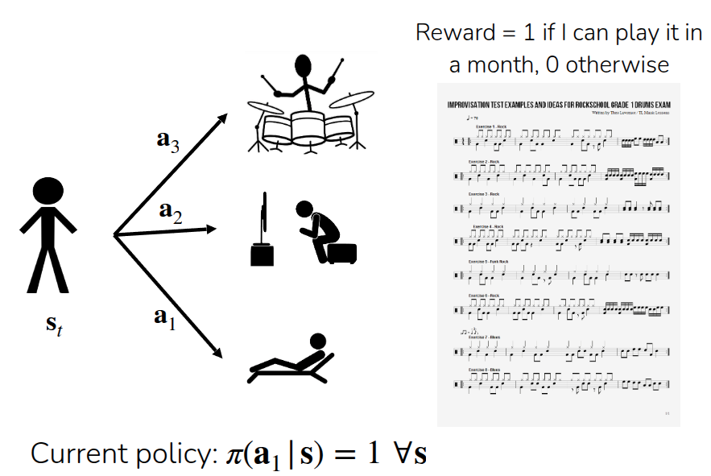

### 강의 및 자료

::: {layout-ncol=2}

:::

포스트에 소개되어 있는 자료는 강의 자료에서 따왔습니다.

## Lecture Summary with NotebookLM

## Value function & Q function

Actor-Critic Methods를 다루기에 앞서서 가장 먼저 정의되어야 할 개념은 과연 우리한테 주어져 있는 환경상에서의 가치(Value)를 어떻게 정의하고 측정할 수 있느냐 하는 점이다. 그래서 강화학습에서 다뤄지는 세가지 핵심 개념인 **Value function** $V$ 과 **Q-function** $Q$, 그리고 **Advantage function** $A$ 에 대해서 먼저 설명해보고자 한다.

{#fig-VQ}

먼저 **value function** $V^{\pi}(s)$ 는 현재의 정책 $\pi$ 를 수행할 때, 주어진 상태 $s$ 에서 앞으로 얼마나 reward를 받을 수 있는지를 나타내는 함수이다. 강화학습의 특성상 미래에 얻을 수 있는 가치를 최대화할 수 있는 방향으로 행동을 취하기 때문에, 이렇게 $V^{\pi}(s)$ 를 통해서 현재 상태에서의 평균적인 미래 가치를 계산하고 학습에 활용한다. 인자가 $s$ 만 들어가기 때문에, 이 함수를 통해서는 특정 행동을 딱 정해서 취하지 않고, 평소의 $\pi$ 에 따라서 행동할 경우 미래에 얻을 수 있는 기대(expected) 점수라고 생각하면 이해가 쉬울 것 같다. @fig-VQ 의 첫번째 그림에서도 나타나듯이, 특정 state $s$ 에서 $\pi$ 에 따라 여러번 특정 시점까지의 action을 취하다보면, 그 시점까지의 과정, 일종의 경로(trajectory)가 생성될 것이다. 결과적으로 이 trajectory 들 간에 얻었던 총 reward의 기대값이 $V^{\pi}(s)$ 가 된다.

$$
V^{\pi}(s_t) = \mathbb{E}_{\pi} \Big[ \sum_{t'=t}^T r(s_{t'}, a_{t'}) \vert s_t \Big]
$$

**Q-function** $Q^{\pi}(s, a)$ 에서는 Value function에 부가적인 정보를 추가한 형태로, 주어진 상태 $s$ 에서 특정 행동 $a$ 를 취했을 경우 미래에 얻을 수 있는 가치를 나타낸 함수이다. 그래서 @fig-VQ 의 두번째 그림을 보면 앞에서 설명한 것처럼 여러 trajectory들이 있겠지만, 이 중에서도 특정 state $s$ 에서 특정 action $a$ 를 취했던 경우가 있을 것이다. 이 trajectory(그림에서의 초록색 선들)에 한정해서 이때 얻을 수 있는 총 reward의 기대값이 $Q^{\pi}(s, a)$ 일 것이다. 

$$
Q^{\pi}(s_t, a_t) = \mathbb{E}_{\pi} \Big[ \sum_{t'=t}^T r(s_{t'}, a_{t'}) \vert s_t, a_t \Big]
$$

그래서 사실 Q-function은 value function 계산시 활용되는 일부의 action $a$ 에 한정해서 계산한 값이 되기 때문에 다음과 같은 관계가 성립한다.

$$
V^{\pi}(s) = \mathbb{E}_{a \sim \pi(\cdot \vert s)} [Q^{\pi}(s, a)]
$$

그러다보니 value function과 Q-function을 조합하면, 현재 수행하는 정책 $\pi$ 에 따라, 특정 state $s$ 에서 $a$ 를 취했을 때, 일반적인 value function보다 얼마나 잘했는지 여부를 알 수 있을 것이다. 이런 개념으로 등장한 내용이 **advantage function** $A^{\pi}(s, a)$ 이다. 아무래도 value function에는 $a$ 가 아닌, 다른 행동을 취했을 때의 기대 보상값이 모두 포함되어 있으므로, 행동에 대한 이점(advantage)도 이렇게 계산할 수 있다.

$$
A^{\pi}(s, a) = Q^{\pi}(s, a) - V^{\pi}(s)
$$

이해를 쉽게 하기 위해서 악기를 연주하는 방법을 학습하는 과정에 대해서 앞의 notation을 예시로 제공했다.

{#fig-example}

