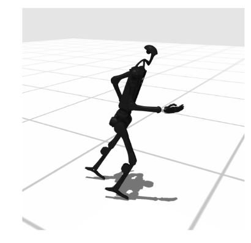
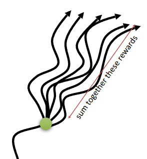
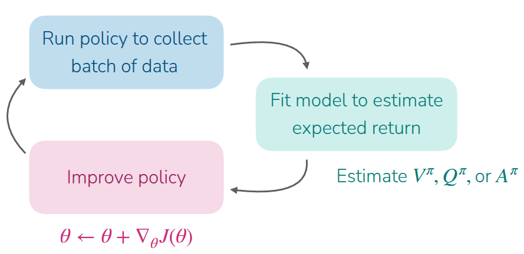

### 강의 및 자료

::: {layout-ncol=2}

:::

포스트에 소개되어 있는 자료는 강의 자료에서 따왔습니다.

## Lecture Summary with NotebookLM

## Value function & Q function

Actor-Critic Methods를 다루기에 앞서서 가장 먼저 정의되어야 할 개념은 과연 우리한테 주어져 있는 환경상에서의 가치(Value)를 어떻게 정의하고 측정할 수 있느냐 하는 점이다. 그래서 강화학습에서 다뤄지는 세가지 핵심 개념인 **Value function** $V$ 과 **Q-function** $Q$, 그리고 **Advantage function** $A$ 에 대해서 먼저 설명해보고자 한다.

{#fig-VQ}

먼저 **value function** $V^{\pi}(s)$ 는 현재의 정책 $\pi$ 를 수행할 때, 주어진 상태 $s$ 에서 앞으로 얼마나 reward를 받을 수 있는지를 나타내는 함수이다. 강화학습의 특성상 미래에 얻을 수 있는 가치를 최대화할 수 있는 방향으로 행동을 취하기 때문에, 이렇게 $V^{\pi}(s)$ 를 통해서 현재 상태에서의 평균적인 미래 가치를 계산하고 학습에 활용한다. 인자가 $s$ 만 들어가기 때문에, 이 함수를 통해서는 특정 행동을 딱 정해서 취하지 않고, 평소의 $\pi$ 에 따라서 행동할 경우 미래에 얻을 수 있는 기대(expected) 점수라고 생각하면 이해가 쉬울 것 같다. @fig-VQ 의 첫번째 그림에서도 나타나듯이, 특정 state $s$ 에서 $\pi$ 에 따라 여러번 특정 시점까지의 action을 취하다보면, 그 시점까지의 과정, 일종의 경로(trajectory)가 생성될 것이다. 결과적으로 이 trajectory 들 간에 얻었던 총 reward의 기대값이 $V^{\pi}(s)$ 가 된다.

$$
V^{\pi}(s_t) = \mathbb{E}_{\pi} \Big[ \sum_{t'=t}^T r(s_{t'}, a_{t'}) \vert s_t \Big]
$$

**Q-function** $Q^{\pi}(s, a)$ 에서는 Value function에 부가적인 정보를 추가한 형태로, 주어진 상태 $s$ 에서 특정 행동 $a$ 를 취했을 경우 미래에 얻을 수 있는 가치를 나타낸 함수이다. 그래서 @fig-VQ 의 두번째 그림을 보면 앞에서 설명한 것처럼 여러 trajectory들이 있겠지만, 이 중에서도 특정 state $s$ 에서 특정 action $a$ 를 취했던 경우가 있을 것이다. 이 trajectory(그림에서의 초록색 선들)에 한정해서 이때 얻을 수 있는 총 reward의 기대값이 $Q^{\pi}(s, a)$ 일 것이다. 

$$
Q^{\pi}(s_t, a_t) = \mathbb{E}_{\pi} \Big[ \sum_{t'=t}^T r(s_{t'}, a_{t'}) \vert s_t, a_t \Big]
$$

그래서 사실 Q-function은 value function 계산시 활용되는 일부의 action $a$ 에 한정해서 계산한 값이 되기 때문에 다음과 같은 관계가 성립한다.

$$
V^{\pi}(s) = \mathbb{E}_{a \sim \pi(\cdot \vert s)} [Q^{\pi}(s, a)]
$$

그러다보니 value function과 Q-function을 조합하면, 현재 수행하는 정책 $\pi$ 에 따라, 특정 state $s$ 에서 $a$ 를 취했을 때, 일반적인 value function보다 얼마나 잘했는지 여부를 알 수 있을 것이다. 이런 개념으로 등장한 내용이 **advantage function** $A^{\pi}(s, a)$ 이다. 아무래도 value function에는 $a$ 가 아닌, 다른 행동을 취했을 때의 기대 보상값이 모두 포함되어 있으므로, 행동에 대한 이점(advantage)도 이렇게 계산할 수 있다.

$$
A^{\pi}(s, a) = Q^{\pi}(s, a) - V^{\pi}(s)
$$

이해를 쉽게 하기 위해서 악기를 연주하는 방법을 학습하는 과정에 대해서 앞의 notation을 적용하는 것을 예시로 제공했다.

{#fig-example}

먼저 환경에 대해서 정의를 하자면, 한달안에 악보를 보고 음악을 연주할 수 있으면 reward를 1, 그렇지 않으면 0을 받는 sparse reward의 형태로 되어 있고, 학습자가 현재 취하고 있는 policy는 항상 action이 $a_1$, 즉 해변에 누워있는 행동으로 고정되어 있는 deterministic policy ( $\pi(a_1 \vert s) = 1$ ) 을 따른다. 그러면 이때의 value function $V^{\pi}(s_t)$ 는 지금과 같이 해변에 누워있는 행동만 계속하게 되면 한달뒤에 악기를 연주할 수 없으므로 0이 된다. 

Q-function으로 살펴보면 이제 취할 수 있는 행동을 나눠서 볼 수 있는데, 우선 TV를 보는 $a_2$ 를 취했을 경우(참고로 TV에서 연주 관련 영상을 시청하는 것은 아니다.)와, 진짜 악기를 연주하는 $a_3$ 를 취했을 경우로 나누어 볼 수 있는데, 유의해야 할 부분은 $s_t$ 상태에서만 $a_t$ 를 취한 것이지, 이로 인해 상태 전이가 발생한 시점에는 기존의 policy대로 $a_1$ 를 취한다는 점이다. 쉽게 설명하면 $Q^{\pi}(a_2 \vert s_t)$ 는 $s_t$ 에서는 TV를 보고, 이후에는 해변에서 휴식을 취하는 행동을 했을 때 한달 뒤에 악기를 연주할 수 있는지 여부를 나타낸 함수가 된다. 이렇게 하면 값은 당연히 0이 될 것이다. 반면 $Q^{\pi}(a_3 \vert s_t)$ 는 드럼 연습을 한번 해보고 난 후, 한달 뒤에 연주할 수 있는 것을 나타낸 것이기 때문에 다른 action에 대한 Q-function인 $Q^{\pi}(a_1 \vert s_t)$ 나 $Q^{\pi}(a_2 \vert s_t)$ 와는 다른 값이 나올 것이다.

이제 advantage function 도 구해보면, 이 역시 $s_t$ 상태에서의 취한 $a_t$ 에 나눠서 살펴볼 수 있다. 그러면 기존 action인 $a_1$ 에 대비해서 $a_2$ 가 가지는 advantage는 $Q^{\pi}(a_2 \vert s_t) - V^{\pi}(s_t)$ 가 되고, 이 값은 0이 될 것이다. 또다른 action인 $a_3$ 의 advantage도 동일하게 $Q^{\pi}(a_3 \vert s_t) - V^{\pi}(s_t)$ 로 구할 수 있을 텐데, 그러면 결과는 0이 아닌 값이 나오게 된다.

해당 예제를 통해서 설명하고자 한 내용은 사실 현재 상태에 대한 가치를 매길 때, 뭔가 행동에 대한 상대적인 의미(여기에서는 advantage)를 부여하면, 잘한 행동에 대한 가치를 조금 더 유의미하게 평가할 수 있다는 것을 설명하고자 함이었다. 이전 강의에서 다뤘던 (vanila) Policy Gradient에서는 기본적으로 샘플링된 trajectory를 기반으로 학습이 이뤄지기 때문에, trajectory 내에서 아무리 좋은 action을 취했을지라도 결과가 안 좋게 나오면 해당 action에 대해서 가치를 부여할 수 없다. 하지만 advantage 라는 개념을 가져오면 **평균적인 내 수준** ($V$) 보다 더 나은 결과를 만든 행동 ($Q$) 에 대해서 따로 가치를 부여할 수 있기 때문에, 이를 통해서 학습의 variance를 줄이고 조금더 효율적으로 policy를 학습할 수 있게 도와준다.

## What is dissatisfying about policy gradients?

이전 강의에서 다뤘던 내용인 policy gradient에서는 기본적인 형태인 Monte Carlo 방식을 통해서 샘플링된 trajectory를 policy를 학습시키는 **REINFORCE** (@williams1992reinforce) 라는 알고리즘을 다뤘다. 이 알고리즘을 따르게 되면 우선 현재의 policy를 통해서 일정양의 trajectory를 먼저 수집하고, 수집된 trajectory를 활용해서 policy를 개선시키는 일종의 policy iteration을 반복하게 된다. (물론 REINFORCE가 policy evaluation과 improvement를 반복하는 명확한 policy iteration의 형태는 아니지만, 샘플링을 통한 과정도 일종의 현재 policy의 상태를 추정하는 과정이라고 생각해서 iteration이라고 표현했다) 그리고 나서 부가적으로  학습시 발생하는 variance를 줄이기 위해 reward-to-go나 baseline을 적용한 형태의 식을 소개했다.

$$
\nabla_{\theta}J(\theta) \approx \frac{1}{N} {\color{blue} \sum_{i=1}^N} \sum_{t=1}^T \nabla_{\theta} {\color{red} \log \pi_{\theta}(a_{i, t} \vert s_{i, t})}  \Big((\sum_{t'=t}^T r(s_{i, t'}, a_{i, t'})) - b\Big)
$$

위 수식에서 ${\color{blue} \sum_{i=1}^N}$ 부분이 현재의 policy에서 trajectory를 sampling 하는 부분이고, ${\color{red} \log \pi_{\theta}(a_{i, t} \vert s_{i, t})}$ 는 현재 학습중인 policy $\pi_{\theta}$ 의 likelihood를 나타낸 것이다. 여기서 likelihood를 통해서 현재 취한 행동 $a_{i, t}$ 를 미래에 더 자주하게 할지, 아니면 덜 하게 만들지를 결정할 수 있다. 이에 대한 gradient를 계산함으로써, 해당 행동을 할 확률을 높이는 방향으로 학습이 이뤄지게 된다. 

그런데 문제는 앞에서 언급한 것처럼, trajectory 단위로 수행되다보니 중간에 나온 action에 대해서는 전체적인 학습에 영향을 미치지 못하고 뭍히는 현상이 나온다는 것이다.

::: {#fig-robot-trajectory layout-ncol=2}

{#fig-robot-walking}

{#fig-robot-folding}

:::

강의에서는 @fig-robot-trajectory 를 통해서 두가지 예시를 소개했다. @fig-robot-walking 에 나오는 예시는 시뮬레이터상에서 robot으로 하여금 앞으로 걷는 모션을 학습하게 하는 예시이고, @fig-robot-folding 은 실제 공개된 [Figure.AI](https://www.figure.ai/)사의 Helix의 세탁물을 개는 것에 대한 예시 내용이다. 참고로 영상은 다음과 같다.



@fig-robot-walking 의 예시처럼 humanoid 로봇을 걷게 하는 것 자체는 학습이 어렵다. 이 때문에 초기 학습시에는 거의 걷지 못하고, 넘어지는 결과만 나올 것이다. 그러다 간혹 한 걸음 정도는 앞으로 갔다가 넘어지는 trajectory도 나오게 된다. 상식적으로 생각해보면 이렇게 한 걸음 나아가는 것이 반복적으로 학습되었을때 궁극적으로는 걷게하는 형태가 될텐데, 문제는 수집된 trajectory가 다 로봇이 넘어져서 reward를 못받는 경우라면, 이에 대한 최종 보상(return)은 매우 낮거나 음수가 될 것이다. 이 때, 앞에서 소개한 Policy Gradient의 경우라면 이 trajectory에 포함된 모든 action에 대한 확률을 낮추려고 할 것이다. 즉, 한 걸음 앞으로 나아간 좋은 action조차도, 전체 나쁜 결과로 인해서 likelihood가 낮아지는 결과가 나오는 것이다.

@fig-robot-folding 도 마찬가지이다. 만약 로봇이 세탁물을 개는 동작을 할 때도 처음부터 세탁물을 바로 개는 동작보다는 세탁물을 바르게 펴고 정렬하는 일련의 과정이 필요할 것이다. 이로 인해서 뭔가 progress가 발생한 action (예를 들어서 세탁물을 편다던가, 아니면 소매만 접는다던가 하는...)에 대해서도 학습에 기여할 수 있는 부분이 있으면 좋을텐데, 만약 환경 자체가 세탁물이 정상적으로 개어진 것이 대해서만 평가하는 sparse형태라면 progress가 발생한 action도 역시 활용할 수 없다.

즉, 이 예시를 통해서 설명하고자 하는 바는 결과적으로 Policy Gradient를 적용하면 어떻게든 학습이 이뤄지긴 하겠지만, 이를 위해서 필요한 데이터의 양이 어마어마하기 때문에 Sample inefficiency 문제가 발생하게 된다. 또한 단일 trajectory에서 나온 return이 우연적인 요소(stochasticity)에 의해서 크게 달라질 수도 있기 때문에, 해당 값이 들쭉날쭉하게 나옴으로 인한 high variance 문제도 갖고 있다. 그래서 강의에서도 이런 policy gradient 방법이 시뮬레이터가 존재하는 환경에서는 잘 동작하지만, 시뮬레이터가 없고, 실제 환경에 적응시켜야 할 문제에서는 적합하지 않다는 것을 언급하고 있다. **그러면 어떻게 특정 action에 대한 좋고 나쁜 정도를 학습할 수 있을까?**

## Improving Policy Gradient

{#fig-monte-carlo-return}

이전에 소개했던 policy gradient의 수식을 보면, sampling된 trajectory에서의 reward의 총합을 계산하는 term이 있다. ($\sum_{t'=t}^T(s_{i, t'}, a_{i, t'})$) 그런데 Monte Carlo sampling의 특성상 @fig-monte-carlo-return 에서 보여지는 것처럼 실제 얻은 보상의 총합(Monte Carlo Return)을 사용했기 때문에 high variance의 문제가 발생했다. 이를 해소하기 위해 기대 보상값인 Q-function을 사용하면 이 variance 문제를 어느 정도 완화시킬 수 있다. 

사실 뒷부분의 reward의 총합을 계산하는 것의 의미는 과연 현재 state $s_{i, t}$ 에서 action $a_{i, t}$ 를 취했을 때 내가 얼마나 reward를 얻을 수 있느냐 인 것이고, Monte Carlo 방식을 하면 이 값을 실제 값으로 쓰겠다는 것이었다. 하지만 사실 계산시, 활용되는 값 자체가 정확하냐 부정확하냐 보다는 이 값이 추정하는 통계치, 즉 평균값을 활용하면 앞에서 언급한 stochasticity의 영향을 줄일 수 있을 것이다. 식으로 표현하면 다음과 같다.

$$
\sum_{t'=t}^T E_{\pi_{\theta}}[r(s_{t'}, a_{t'}) \vert s_t, a_t] = Q(s_t, a_t)
$$

이에 따라서 기존의 policy gradient도 r에 대한 식이 아닌 Q function에 대한 식으로 근사할 수 있게 된다.

$$
\nabla_{\theta}J(\theta) \approx \frac{1}{N} \sum_{i=1}^N \sum_{t=1}^T \nabla_{\theta} \log_{\pi_{\theta}} (a_{i, t} \vert s_{i, t}) Q(S_{i, t}, a_{i, t})
$$

또한 baseline을 계산할때도 개선점을 찾을 수 있다. 기존의 value function 만으로 policy gradient를 할 경우 value의 scale에 대한 문제가 발생할 수 있기 때문에, 약간 목적을 **평균 가치**보다 얼마나 좋나를 가지고 gradient 변화의 크기를 계산하면 scale의 문제를 해소할 수 있다. 이를 위한 요소로 $b$ 를 계산하고 이를 빼주었는데, 이는 $\frac{1}{N} \sum_{i} Q(s_{i, t}, a_{i, t})$ 이다. 그런데 앞에서 배웠던 value function $V(s_t)$ 도 사실 Q-function에서 특정 state $s_t$ 에서 취할 수 있는 모든 action에 대한 평균치 ( $V(s_t) = E_{a_t \sim \pi_{\theta}(\cdot \vert s_t)}[Q(s_t, a_t)]$ ) 이기 때문에 $b$ 도 $V(s_t)$ 로 대체할 수 있음을 알 수 있다. 그런데 가만히 생각해보면 $Q(s_{i, t}, a_{i, t}) - V(s_t) $ 의 형태가 앞에서 언급했던 advantage function임을 확인할 수 있고, 이 말은 해당 부분을 advantage function으로 대체할 수 있게 된다.

$$
\nabla_{\theta}J(\theta) \approx \frac{1}{N} \sum_{i=1}^N \sum_{t=1}^T \nabla_{\theta} \log_{\pi_{\theta}} (a_{i, t} \vert s_{i, t}) A^{\pi}(s_{i, t}, a_{i, t})
$$

결과적으로 advantage function $A^{\pi}$ 를 잘 추정하면 policy gradient시 필요한 gradient의 variance를 줄일 수 있다는 결론이 난다.

## How to estimate the value of a policy

지금까지의 결론은 policy gradient를 위해서는 value function ($V^{\pi}, Q^{\pi}$)과 advantage function $A^{\pi}$ 를 잘 추정하고, 이때 계산한 값을 기반으로 policy를 improve시켜야 한다는 것이었다. 사실 advantage function을 계산하기 위해서는 $V^{\pi}$ 와 $Q^{\pi}$ 를 알아야 한다. 그리고 더 고민해보면 Q-function도 value function으로 표현할 수 있다는 것을 확인할 수 있다.

$$
\begin{aligned}
Q^{\pi}(s_t, a_t) &= \sum_{t'=t}^T E_{\pi_{\theta}}[r(s_{t'}, a_{t'}) \vert s_t, a_t] \\
&= r(s_t, a_t) + \sum_{t'=t+1}^T E_{\pi_{\theta}}[r(s_{t'}, a_{t'}) \vert s_t, a_t] \\
&= r(s_t, a_t) + E_{s_{t+1} \sim p(\cdot \vert s_t, a_t)} [V^{\pi}(s_{t+1})] \\
&\approx r(s_t, a_t) + V^{\pi}(s_{t+1})
\end{aligned}
$$

이렇게까지 바꿔보면 advantage function은 현재 state $s_t$에서 특정 action $a_t$ 를 취했을 때의 reward와 value function만 알고 있으면 계산할 수 있다.

$$
A^{\pi}(s_t, a_t) \approx r(s_t, a_t) + V^{\pi}(s_{t+1}) - V^{\pi}(s_t)
$$

그러면 value function을 어떻게 잘 추정할 수 있을까? 기존의 방식은 trajectory를 샘플링해서 이때의 reward 총합을 계산하고, 이를 value function으로 추정했다. 이런 방식을 Monte Carlo Estimation이라고 표현하는데, 원래 어떤 값을 추정할때도 여러개를 샘플링해서 이에 대한 평균을 내듯이 value function에 대한 추정치도 trajectory를 여러개 샘플링해서 동일 상태 $s_t$ 에서 여러번 반복한 결과를 가지고 계산해야 한다.(@fig-monte-carlo-return) 그런데 현실적으로는 정확하게 동일한 상태 $s_t$ 로 되돌려놓고 다시 실행시키는, 일종의 reset을 취하기가 어렵다. 그렇기 때문에 single trajectory를 가지고 value estimation이 이뤄지는데, 그래도 이 문제를 어느 정도 완화시키기 위해서 신경망을 사용하게 된다. 강의에서는 두가지 과정으로 나눠서 value function estimation을 수행하는 절차를 보여줬다.

1. single sample estimate에 대한 데이터를 쭉 모으고, 이를 데이터셋으로 만든다. 이때 입력을 $s_{i, t}$, label을 $\sum_{t'=t}^T r(s_{i, t'}, a_{i, t'})$ 으로 하는 데이터셋이 된다. (Aggregate dataset) $\rightarrow \{(s_{i, t}, \sum_{t'=t}^T r(s_{i, t'}, a_{i, t'})\}$
2. 만든 데이터셋으로 value function을 추정할 수 있도록 신경망을 학습시킨다. (Supervised Learning) $\mathcal{L}(\phi) = \frac{1}{2} \sum_i \Vert \hat{V}_{\phi}^{\pi}(s_i) - y_i \Vert^2$

이렇게 하면 결좌적으로 신경망은 비슷한 state에서 나온 여러 결과들을 종합하여 평균을 내는 효과를 갖게 되고, 이를 통해서 물리적으로는 불가능한 "Multi-Sample Averaging"을 수학적으로 근사하게 된다.
