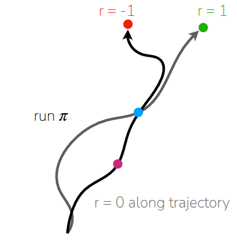
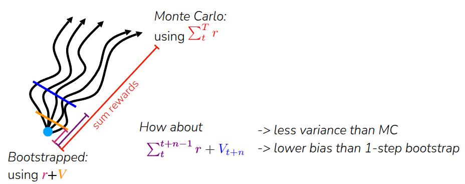
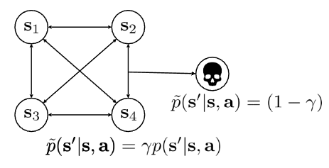

### Resource

::: {layout-ncol=2}

:::

## Lecture Summary with NotebookLM

## Value function & Q function

Before diving into Actor-Critic Methods, the first concept that must be established is how to define and measure "Value" within a given environment. Therefore, I would like to start by explaining three core concepts in Reinforcement Learning: the **Value function** ($V$), the **Q-function** ($Q$), and the **Advantage function** ($A$).

{#fig-VQ}

First, the **value function** $V^{\pi}(s)$ represents how much reward can be expected in the future given a state $s$ while following the current policy $\pi$. Since the goal of Reinforcement Learning is to take actions that maximize future value, $V^{\pi}(s)$ is used to calculate the average future value at the current state and utilize it for learning. Because it takes only $s$ as an argument, you can think of it as the expected score you would get by following your usual policy $\pi$, without choosing a specific action to start with. As shown in the first part of @fig-VQ, if you take actions according to $\pi$ from a specific state $s$ multiple times, a process—or a **trajectory**—is generated up to a certain point. Consequently, the expected value of the total rewards obtained across these trajectories becomes $V^{\pi}(s)$.

$$
V^{\pi}(s_t) = \mathbb{E}_{\pi} \Big[ \sum_{t'=t}^T r(s_{t'}, a_{t'}) \vert s_t \Big]
$$

The **Q-function** $Q^{\pi}(s, a)$ adds additional information to the Value function. It represents the future value obtainable when a specific action $a$ is taken in a given state $s$. Looking at the second part of @fig-VQ, there are multiple trajectories as explained before, but we focus on the cases where a specific action $a$ was taken at state $s$. The expected value of the total rewards, strictly limited to these specific trajectories (the green lines in the figure), corresponds to $Q^{\pi}(s, a)$.

$$
Q^{\pi}(s_t, a_t) = \mathbb{E}_{\pi} \Big[ \sum_{t'=t}^T r(s_{t'}, a_{t'}) \vert s_t, a_t \Big]
$$

Since the Q-function is essentially a calculation limited to a specific subset of actions $a$ used in the value function calculation, the following relationship holds:

$$
V^{\pi}(s) = \mathbb{E}_{a \sim \pi(\cdot \vert s)} [Q^{\pi}(s, a)]
$$

By combining the value function and the Q-function, we can determine how much **"better"** taking a specific action $a$ in state $s$ is compared to the general value function under the current policy $\pi$. This concept leads to the **Advantage function** $A^{\pi}(s, a)$. Since the value function includes the expected rewards of taking other actions (not just $a$), we can calculate the relative advantage of a specific action as follows:

$$
A^{\pi}(s, a) = Q^{\pi}(s, a) - V^{\pi}(s)
$$

To make this easier to understand, let's apply the above notation to an example of learning to play an instrument.

{#fig-example}

First, let's define the environment: it has a **sparse reward** structure where you get a reward of 1 if you can read sheet music and play music within a month, and 0 otherwise. The learner's current policy follows a deterministic policy ($\pi(a_1 \vert s) = 1$) where the action is always fixed to $a_1$ (lying on the beach). In this case, the value function $V^{\pi}(s_t)$ is 0 because if you only continue to lie on the beach, you won't be able to play the instrument a month later.

Now, let's look at the available actions using the Q-function. We can consider case $a_2$ (watching TV—note that this is not watching music tutorials) and case $a_3$ (actually practicing the instrument). A crucial point to note is that the specific action $a_t$ is taken only at state $s_t$. After the state transition occurs, the agent follows the original policy (taking $a_1$). Simply put, $Q^{\pi}(a_2 \vert s_t)$ represents the scenario where you watch TV at $s_t$, but then go back to relaxing on the beach afterwards. Naturally, this value will be 0. On the other hand, $Q^{\pi}(a_3 \vert s_t)$ represents practicing the drums once, which implies a potential change in outcome a month later, resulting in a value different from $Q^{\pi}(a_1 \vert s_t)$ or $Q^{\pi}(a_2 \vert s_t)$.

If we calculate the advantage function, we can again analyze it by the action taken at $s_t$. The advantage of $a_2$ compared to the existing action $a_1$ is $Q^{\pi}(a_2 \vert s_t) - V^{\pi}(s_t)$, which results in 0. However, the advantage of the other action $a_3$ can be calculated as $Q^{\pi}(a_3 \vert s_t) - V^{\pi}(s_t)$, which will result in a non-zero value.

The point of this example was to demonstrate that when assessing the value of a current state, assigning a relative meaning to an action (in this case, advantage) allows for a more meaningful evaluation of "good" actions. In the (vanilla) Policy Gradient covered in previous lectures, learning is based on sampled trajectories. Therefore, even if a good action was taken within a trajectory, if the final result is poor, value cannot be assigned to that specific action. However, by introducing the concept of **Advantage**, we can explicitly assign value to an action ($Q$) that produced a better result than the **average performance level** ($V$). This helps reduce the variance of learning and assists in learning the policy more efficiently.

## What is dissatisfying about policy gradients?

In the previous lecture on Policy Gradients, we covered the **REINFORCE** (@williams1992reinforce) algorithm, which trains a policy using trajectories sampled via a basic Monte Carlo method. Following this algorithm involves first collecting a certain amount of trajectories using the current policy, and then utilizing these collected trajectories to improve the policy—a process akin to repeating policy iteration. (Although REINFORCE does not follow the strict form of policy iteration that alternates between clear policy evaluation and improvement steps, I used the term "iteration" here because the sampling process can be viewed as a way of estimating the current state of the policy.) We also introduced equations that apply "reward-to-go" or a "baseline" to reduce the variance that occurs during training.

$$
\nabla_{\theta}J(\theta) \approx \frac{1}{N} {\color{blue} \sum_{i=1}^N} \sum_{t=1}^T \nabla_{\theta} {\color{red} \log \pi_{\theta}(a_{i, t} \vert s_{i, t})}  \Big((\sum_{t'=t}^T r(s_{i, t'}, a_{i, t'})) - b\Big)
$$

In the equation above, the ${\color{blue} \sum_{i=1}^N}$ term corresponds to sampling trajectories from the current policy, while ${\color{red} \log \pi_{\theta}(a_{i, t} \vert s_{i, t})}$ represents the likelihood of the policy $\pi_{\theta}$ currently being trained. Through this likelihood, the algorithm determines whether to increase or decrease the frequency of the taken action $a_{i, t}$ in the future. By calculating the gradient with respect to this, learning proceeds in a direction that increases the probability of taking that action.However, the issue, as mentioned earlier, is that because this process operates on a **trajectory basis**, specific actions taken in the middle may fail to significantly influence the overall learning and end up getting **buried** (or overshadowed) by the outcome of the entire trajectory.

::: {#fig-robot-trajectory layout-ncol=2}

{#fig-robot-walking}

{#fig-robot-folding}

:::

The lecture introduced two examples shown in @fig-robot-trajectory. The example in @fig-robot-walking demonstrates training a robot to walk forward in a simulator, while @fig-robot-folding illustrates a real-world example of [Figure.AI](https://www.figure.ai/)'s Helix robot folding laundry. For reference, the video is shown below:



As seen in the example of @fig-robot-walking, teaching a humanoid robot to walk is inherently difficult. Because of this, in the early stages of training, the robot will likely fail to walk and mostly just fall over. However, occasionally, a trajectory might emerge where the robot manages to take a single step forward before falling. Intuitively, if taking that single step is learned repeatedly, it should ultimately lead to walking. The problem is, if the collected trajectory results in a fall and fails to receive a reward, the final return for that trajectory will be very low or negative. In this case, the Policy Gradient method introduced earlier would try to lower the probability of all actions included in this trajectory. In other words, even the "good" action of taking a step forward ends up having its likelihood reduced due to the overall negative outcome.

The same applies to @fig-robot-folding. When a robot folds laundry, it doesn't just fold it immediately; it requires a sequence of processes, such as flattening and aligning the laundry first. It would be beneficial if actions that result in some progress (e.g., flattening the cloth or folding just a sleeve) could contribute to learning. However, if the environment has a **sparse reward** structure that only evaluates whether the laundry is fully folded, these progress-making actions cannot be utilized effectively.

In short, the point of these examples is that while Policy Gradient will eventually work, it suffers from **sample inefficiency** because it requires a massive amount of data to achieve convergence. Furthermore, since the return from a single trajectory can vary significantly due to stochastic factors, it also suffers from **high variance** as the values fluctuate wildly. Therefore, the lecture mentions that while standard policy gradient methods work well in environments with simulators, they are not suitable for problems that need to be adapted to the real world without a simulator. Then, **how can we learn the quality (good or bad) of a specific action?**

## Improving Policy Gradient

{#fig-monte-carlo-return}

If we look back at the Policy Gradient formula introduced earlier, there is a term that calculates the sum of rewards from a sampled trajectory ($\sum_{t'=t}^T(s_{i, t'}, a_{i, t'})$). However, due to the nature of Monte Carlo sampling, as shown in @fig-monte-carlo-return, using the actual sum of obtained rewards (Monte Carlo Return) resulted in a **high variance** problem. To address this, we can mitigate the variance issue to some extent by using the **Q-function**, which represents the expected reward.

Fundamentally, the purpose of calculating the sum of rewards is to answer the question: "How much reward can I obtain by taking action $a_{i, t}$ at the current state $s_{i, t}$?" The Monte Carlo approach opted to answer this by using the actual, observed value from a single run. However, rather than relying on the exactness of a single realization, utilizing the statistical estimate—specifically the **mean value** (expectation)—can significantly reduce the impact of the stochasticity mentioned earlier. This can be expressed in the formula as follows:

$$
\sum_{t'=t}^T E_{\pi_{\theta}}[r(s_{t'}, a_{t'}) \vert s_t, a_t] = Q(s_t, a_t)
$$

Consequently, the standard policy gradient can be approximated using a formulation based on the **Q-function**, rather than the original expression based on rewards ($r$).

$$
\nabla_{\theta}J(\theta) \approx \frac{1}{N} \sum_{i=1}^N \sum_{t=1}^T \nabla_{\theta} \log_{\pi_{\theta}} (a_{i, t} \vert s_{i, t}) Q(S_{i, t}, a_{i, t})
$$

Furthermore, we can find room for improvement in how we calculate the baseline. If we perform Policy Gradient using only the raw value function (or Q-function), issues related to the scale of the values may arise. To address this, we can resolve the scaling issue by shifting our objective to measure "how much better an action is compared to the **average value**" when calculating the magnitude of the gradient update.

Previously, we calculated and subtracted a baseline $b$, which corresponds to the average of Q-values: $\frac{1}{N} \sum_{i} Q(s_{i, t}, a_{i, t})$. However, recall that the value function $V(s_t)$ is essentially the expected value (average) of the Q-function over all possible actions at a specific state $s_t$ ($V(s_t) = \mathbb{E}_{a_t \sim \pi_{\theta}(\cdot \vert s_t)}[Q(s_t, a_t)]$). This implies that the baseline $b$ can be effectively replaced by $V(s_t)$.

Upon closer inspection, we can see that the resulting term $Q(s_{i, t}, a_{i, t}) - V(s_t)$ matches the definition of the **Advantage function** mentioned earlier. This means we can substitute this term directly with the Advantage function.

$$
\nabla_{\theta}J(\theta) \approx \frac{1}{N} \sum_{i=1}^N \sum_{t=1}^T \nabla_{\theta} \log_{\pi_{\theta}} (a_{i, t} \vert s_{i, t}) A^{\pi}(s_{i, t}, a_{i, t})
$$

Consequently, we arrive at the conclusion that if we can estimate the Advantage function $A^{\pi}$ accurately, we can significantly reduce the variance of the gradients in Policy Gradient methods.

## How to estimate the value of a policy

The conclusion drawn so far is that to perform Policy Gradient effectively, we need to accurately estimate the value functions ($V^{\pi}, Q^{\pi}$) and the advantage function $A^{\pi}$, and then use these calculated values to improve the policy. Strictly speaking, calculating the advantage function requires knowing both $V^{\pi}$ and $Q^{\pi}$. However, upon further reflection, we can see that the Q-function can actually be expressed in terms of the value function.

$$
\begin{aligned}
Q^{\pi}(s_t, a_t) &= \sum_{t'=t}^T E_{\pi_{\theta}}[r(s_{t'}, a_{t'}) \vert s_t, a_t] \\
&= r(s_t, a_t) + \sum_{t'=t+1}^T E_{\pi_{\theta}}[r(s_{t'}, a_{t'}) \vert s_t, a_t] \\
&= r(s_t, a_t) + E_{s_{t+1} \sim p(\cdot \vert s_t, a_t)} [V^{\pi}(s_{t+1})] \\
&\approx r(s_t, a_t) + V^{\pi}(s_{t+1})
\end{aligned}
$$

By rewriting it in this form, it becomes evident that the advantage function can be calculated knowing only the immediate reward obtained by taking a specific action $a_t$ at the current state $s_t$, and the **value function** (of the next state).

$$
A^{\pi}(s_t, a_t) \approx r(s_t, a_t) + V^{\pi}(s_{t+1}) - V^{\pi}(s_t)
$$

### Monte Carlo Estimation {#sec-monte-carlo-estimation}

So, how can we accurately estimate the value function? The conventional method involved sampling a trajectory, calculating the sum of rewards obtained, and using this sum as an estimate for the value function. This approach is known as **Monte Carlo Estimation**. Just as we typically estimate a value by taking the average of multiple samples, estimating the value function ideally requires sampling multiple trajectories starting from the same state $s_t$ and averaging the results (see @fig-monte-carlo-return).

However, in reality, it is difficult to perfectly **reset** the environment to the exact same state $s_t$ and run the simulation again. Therefore, value estimation is often performed using a **single trajectory**. To mitigate the limitations of this approach, we utilize neural networks. The lecture outlined a two-step process for performing value function estimation:

1. **Aggregate Dataset**: Collect data from single sample estimates to create a dataset. Here, the input is $s_{i, t}$ and the label is the sum of rewards $\sum_{t'=t}^T r(s_{i, t'}, a_{i, t'})$.$\rightarrow \{(s_{i, t}, \sum_{t'=t}^T r(s_{i, t'}, a_{i, t'})\}$
2. **Supervised Learning**: Train a neural network to estimate the value function using the created dataset.$\mathcal{L}(\phi) = \frac{1}{2} \sum_i \Vert \hat{V}_{\phi}^{\pi}(s_i) - y_i \Vert^2$

By doing so, the neural network effectively aggregates various outcomes from similar states and averages them. This allows us to mathematically approximate **"Multi-Sample Averaging"**, which would otherwise be physically impossible (or impractical) to perform directly.

### Bootstrapping

While @sec-monte-carlo-estimation discussed performing value function estimation using actual rewards via neural networks, this section focuses on reducing the high variance that can occur during training by relying on estimated values rather than raw empirical returns.

As a reminder, when aggregating the dataset in the previous method, we defined the training label as follows:

$$
\text{Monte Carlo target: }  y_{i, t} = \sum_{t'=t}^T r(s_{i, t'}, a_{i, t'})
$$

Strictly speaking, however, the ideal target for training should be the **expected reward sum** starting from the current state $s_{i, t}$. In fact, this value can be decomposed into the **actual reward** received immediately and the **expected reward sum** from the next state $s_{i, t+1}$ after the transition occurs. Going a step further, this expected future reward sum can be substituted with the **Value Function** of the next state, $V^{\pi}(s_{i, t+1})$, which represents that average value.

$$
\begin{aligned}
\text{ideal target: } y_{i, t} &= \sum_{t'=t}^T E_{\pi_{\theta}} [r(s_{i, t'}, a_{i, t'}) \vert s_{i, t}] \\
&\approx r(s_{i, t}, a_{i, t}) + \sum_{t'=t+1}^T E_{\pi_{\theta}} [r(s_{i, t'}, a_{i, t'}) \vert s_{i, t + 1}] \\
&= r(s_{i, t}, a_{i, t}) + V^{\pi}(s_{i, t+1})
\end{aligned}
$$

Ideally, to accurately estimate the value function, we should use the calculated rewards averaged over multiple trajectories. However, in practice, we estimate the mean using only a **single trajectory**, making the final formula a **single-sample approximation** of the expected reward sum.

Furthermore, the value function $V^{\pi} (s_{i, t+1})$ referenced in our equation is not the exact value derived from multiple trajectories. Instead, as introduced earlier, we use the value $\hat{V}_{\phi}^{\pi}(s_{i, t+1})$ estimated by a neural network. Consequently, the process involves retraining based on these inferred values. The lecture referred to this concept as **Bootstrapping**.

Therefore, the process, which now applies bootstrapping to the data aggregation method introduced earlier, can be defined in two steps:

1. **Bootstrapped Dataset**: Collect data based on single sample estimates and construct a dataset to derive "bootstrapped" estimates. Here, the label changes from the previously defined $\sum_{t'=t}^T r(s_{i, t'}, a_{i, t'})$ to: $y_{i, t} = r(s_{i, t}, a_{i, t}) + \hat{V}_\phi^{\pi}(s_{i, t+1})$
2. **Supervised Learning**: Train the neural network to estimate the value function using the dataset formed in this manner. $\mathcal{L}(\phi) = \frac{1}{2} \sum_i \Vert \hat{V}_{\phi}^{\pi}(s_i) - y_i \Vert^2$

::: {.callout-note}
In fact, the form above is closely related to **Temporal Difference (TD) Learning** in Reinforcement Learning theory. In TD Learning, calculating the TD error involves obtaining the estimated value function for the next state and comparing it with the estimated value function for the current state.

$$
\text{TD error: } \delta_t = r(s_{i, t}, a_{i, t}) + V^{\pi}(s_{i, t+1}) - V^{\pi}(s_{i, t})
$$

The methodology of learning using a bootstrapped target essentially constitutes TD Learning.
:::

### Monte Carlo Estimation vs. Bootstrapping

In the previous two sections, we introduced two methods for defining labels when creating a dataset to estimate the value function using neural networks:

$$
\begin{aligned}
\text{Monte Carlo: } & y_{i, t} = \sum_{t'=t}^T r(s_{i, t'}, a_{i, t'}) \\
\text{Bootstrapping: } & y_{i, t} = r(s_{i, t}, a_{i, t}) + V^{\pi}(s_{i, t+1})
\end{aligned}
$$

The key difference between the two methods lies in whether we use the accumulated rewards obtained from an actual trajectory or utilize the **value function**, which represents an average value. The lecture illustrated this distinction using the example shown in @fig-value-function-estimation.

{#fig-value-function-estimation}

First, let's assume we have two trajectories that share a common intermediate point, represented by the **blue** state.
- Trajectory 1 ($\tau_1$): Starts at the **pink** state, passes through the **blue** state, and ends with a reward of -1.
- Trajectory 2 ($\tau_2$): (Starting state unknown), passes through the **blue** state, and ends with a reward of 1.
  
Assuming both trajectories were executed under the same policy $\pi$, how should we estimate the value function for the blue state, $\hat{V}^{\pi}({\color{blue} s})$, and the pink state, $\hat{V}^{\pi}({\color{pink} s})$?

If we first attempt to estimate the value function using the **Monte Carlo** method, we wait until the trajectory is completed and define the value of that state as the total reward actually received. In this case, $\hat{V}^{\pi}({\color{blue} s})$ becomes 0 because it averages the case where the reward is -1 and the case where it is 1. However, for $\hat{V}^{\pi}({\color{pink} s})$, since only $\tau_1$ experienced this state within the observed trajectories, it simply follows the reward of that trajectory, which is -1. This leads to a problem where the value function is defined without reflecting the reward of $\tau_2$ (which effectively passed through the blue state), leaving us unaware of whether the pink state was inherently bad or if the negative outcome was just bad luck.

On the other hand, if we attempt to estimate using the **Bootstrapping** method, we fundamentally utilize the value function of the next state. Here, $\hat{V}^{\pi}({\color{blue} s})$ is defined as 0, just like in the Monte Carlo method, but a difference arises when calculating the value for the pink state. In Bootstrapping, we use the value function of the subsequent state—the blue state, $\hat{V}^{\pi}({\color{blue} s})$—rather than the final trajectory result. Therefore, the value becomes 0. Consequently, even though the pink state belongs to $\tau_1$ which received a reward of -1, it indirectly "shares" the positive outcome of $\tau_2$ via bootstrapping, allowing for a more reasonable estimate.

The point of this example was to highlight that comparing Monte Carlo Estimation and Bootstrapping leads us to the **Bias-Variance Tradeoff**, a fundamental concept in Machine Learning.

- **Monte Carlo Estimation**: Since it calculates values based on actually obtained rewards, the estimates are **unbiased**. However, because they rely on the inherent **stochasticity** of the sampled trajectories, they suffer from **high variance**. As mentioned earlier, this variance problem is exacerbated when estimating from a **single sample**.
- **Bootstrapping Estimation**: Since it calculates based on previously estimated values, the variance is significantly lower compared to the MC method. However, if the value function is approximated by a neural network, the initial (untrained) $V_{\phi}$ is inaccurate. Because the model continues to learn based on these potentially inaccurate targets, **bias** is introduced.

The lecture suggests that because bootstrapping dramatically reduces variance, it allows for much more stable learning than the MC method, provided that there are methods to control the bias.

### N-step Returns

Consequently, the lecture introduced **N-step returns** as a method to estimate the value function by combining the unbiased nature of Monte Carlo with the low variance characteristic of Bootstrapping.

{#fig-n-step-returns}

N-step returns work by **interpolating** between these two approaches. To put it simply, waiting until the very end of the episode (like MC) is too unstable (high variance), while estimating based immediately on the next state's value (like standard bootstrapping) introduces too much bias. Therefore, the strategy is to proceed for a few more steps ($N$ steps) to accumulate actual rewards, and then estimate the remaining value.

Comparing this mathematically with the estimation methods discussed earlier:

$$
\begin{aligned}
\text{Monte Carlo: } & y_{i, t} = \sum_{t'=t}^T r(s_{i, t'}, a_{i, t'}) \\
\text{Bootstrapping: } & y_{i, t} = r(s_{i, t}, a_{i, t}) + \hat{V}_{\phi}^{\pi}(s_{i, t+1}) \\
\text{N-step returns: } & y_{i, t} = \sum_{t'=t}^{t+n-1} r(s_{i, t'}, a_{i, t'}) + \hat{V}_{\phi}^{\pi}(s_{i, t+n})
\end{aligned}
$$

It is helpful to focus on the purple line in @fig-n-step-returns. The core idea is to perform Monte Carlo Estimation using the actual rewards obtained for $N$ steps within the trajectory, and then utilize the estimated value function for the remainder starting at $t+N$. This approach offers the dual advantage of reducing variance compared to pure MC methods, while also mitigating the inaccuracy caused by bias found in pure Bootstrapping.

Defining the value of $N$ is crucial here. If $N=1$, the formula becomes identical to the Bootstrapping method mentioned earlier. If $N=\infty$, it reverts to the standard Monte Carlo formula. The lecture explains that tuning $N$ appropriately is particularly beneficial in environments with very short interaction cycles; by reflecting the actual rewards received over $N$ steps, we can define the current value function more accurately, thereby aiding the learning process.

### Relation with discount factors

The lecture also highlighted an interesting perspective on the discount factor in the context of N-step returns. The discount factor, typically denoted as $\gamma$, is generally understood as a mathematical tool used to reduce the weight of future values. If an episode has an infinite or extremely long horizon, simply summing up all future values can cause the estimate to diverge to infinity. Therefore, we introduce this factor to assign higher weights to near-future rewards and lower weights to distant future rewards ($r_t + \gamma r_{t+1} + \gamma^2 r_{t+2} \dots$), ensuring that the total sum converges.

{#fig-probability-of-death}

However, the professor offered a different interpretation using the "Probability of Death" example shown in @fig-probability-of-death. He explained the discount factor as the probability of the agent "surviving" at each step.

For instance, if $\gamma$ is 0.99, the game continues with a 99% probability. Conversely, the agent faces a 1% probability ($1 - \gamma$) of "dying." Upon death, the agent reaches a "death state" where no further rewards can be obtained. The key insight here is that changing $\gamma$ alters the probability of the agent's death. Since the transition dynamics (specifically, the transition to the death state) depend on $\gamma$, changing the discount factor effectively results in **changing the MDP itself**.

## Summary

This lecture focused primarily on the foundational concepts required to understand the algorithm, rather than just the **Actor-Critic Method** itself as suggested by the title. Building upon the Policy Gradient methods covered in the previous lecture, it explained the concepts of various value functions and advantage functions, ultimately defining the algorithm as follows:

1. Sample a batch of data $\{ (s_{1, i}, a_{1, i}, r_{1, i}, \dots, s_{T, i}, a_{T, i}, r_{T, i}) \}$ from the current policy $\pi_{\theta}$.
2. Train a model to estimate the value function $\hat{V}_{\phi}^{\pi}$ using the rewards from the sampled data.
3. Calculate the Advantage function using the estimated value function. ($\hat{A}^{\pi_{\theta}}(s_t, a_t) = r(s_{t, i}, a_{t, i}) + \gamma \hat{V}_{\phi}^{\pi_{\theta}}(s_{t+1, i}) - \hat{V}_{\phi}^{\pi_{\theta}}(s_{t, i})$)
4. Calculate the gradient of the objective function using the Advantage function. ($\nabla_{\theta}J(\theta) \approx \sum_{t, i} \nabla_{\theta} \log_{\pi_{\theta}} (a_{t, i} \vert s_{t, i}) \hat{A}^{\pi_{\theta}}(s_{t, i}, a_{t, i})$)
5. Update $\theta$ in the direction of the ascending gradient. ($\theta \leftarrow \theta + \alpha \nabla_{\theta}J(\theta)$)

Looking at the big picture, we can see that the process is effectively divided into two parts: estimating (or evaluating) the value of the current state, and then using that evaluation to update the model and sample new data using the updated policy. This structure, where the process is split into a **Critic** that estimates the current state's value and an **Actor** that performs actions and updates the policy, is referred to as the **Actor-Critic Method**.

Simply put, the Actor-Critic method estimates what is good or bad to guide the agent toward better actions—essentially enabling the policy gradient to move in a more optimal direction. In Deep RL, the required value function is estimated using neural networks. The lecture categorized the methods for estimating the value function into three main approaches: **Monte Carlo estimation**, which utilizes all rewards in a trajectory; **Bootstrapping estimation**, which uses the current reward and the value function of the next state; and **N-step Returns**, a hybrid method used to address the **Bias-Variance tradeoff** inherent in the first two approaches.
