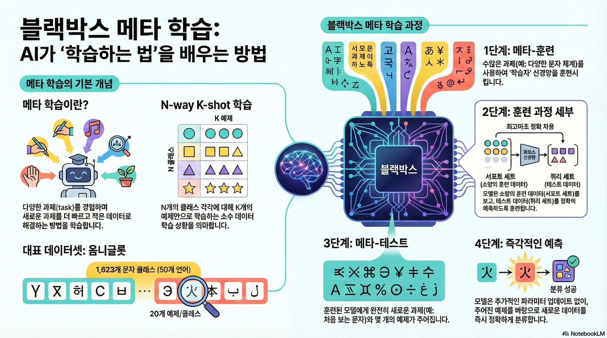
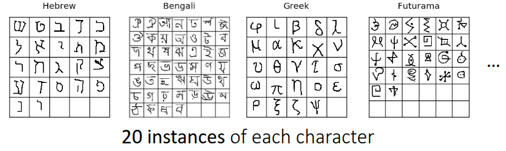
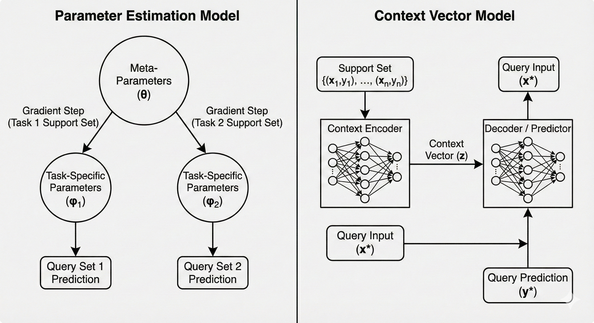
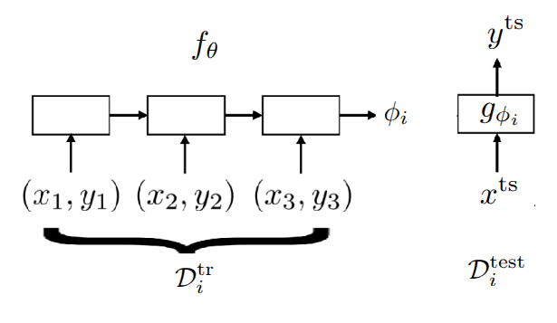
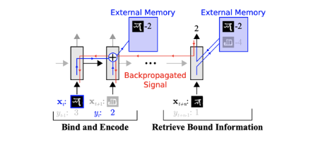
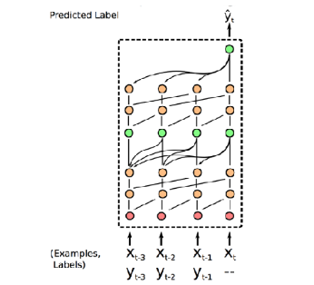
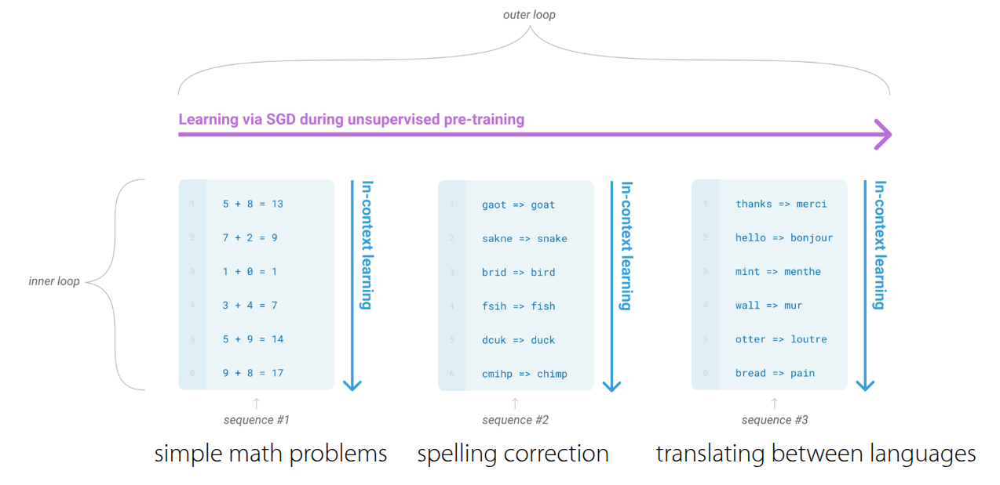
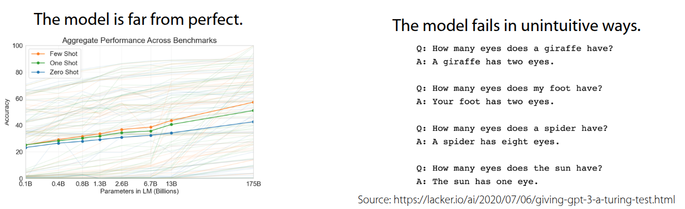
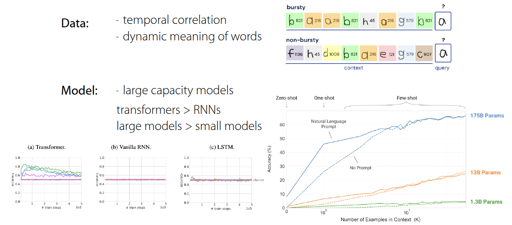

### 강의 및 자료

::: {layout-ncol=2}
[](https://www.youtube.com/watch?v=cjTs7lH5eUs&list=PLoROMvodv4rNjRoawgt72BBNwL2V7doGI&index=4)

[](https://cs330.stanford.edu/materials/cs330_metalearning_bbox_2023.pdf)
:::

포스트에 소개되어 있는 자료는 강의 자료에서 따왔습니다.

## Lecture Summary with NotebookLM



## One View on the Meta-Learning Problem

우선 해당 강의에서 다루는 주요 주제인 Black-Box Meta Learning 을 다루기에 앞서서, 교수는 본인의 박사 학위논문 (@Finn:EECS-2018-105) 에 정의한 내용을 통해 메타러닝이 일종의 지도 학습을 확장한 형태라는 것에 대해서 설명했다.

::: {#tbl-panel layout-ncol=2}
|      | Supervised Learning | Meta Supervised Learning |
|------|------|------|
|           | $y=g_{\phi}(x)$   | $y^{ts} = f_{\theta}(\mathcal{D}^{tr}, x^{ts})$ |
| Inputs    | $x$    | $\mathcal{D}^{tr} (= \{(x, y)_{1:K}\}), x^{ts}$    |
| Outputs    | $y$    | $y^{ts}$    |
| Data    | $\{(x, y)_i\}$    | $\{\mathcal{D}_i\}$    |

Comparison of Supervised Learning & Meta-Supervised Learning
:::

@tbl-panel 에도 보여지다시피 **Supervised Learning**과 **Meta Supervised Learning** 과의 차이는 입력과 출력의 정의에서 차이가 있다. 일반 supervised learning 에서는 입력인 데이터 포인트 $x$ 이고, 출력이 label $y$ 이고, 이때의 objective $y=g_{\phi}(x)$ 인 함수 $g$ 를 학습하는 것이다. 반면, meta supervised learning 에서는 입력이 **학습데이터셋** ($\mathcal{D}^{tr}$) 과 새로운 테스트 데이터 입력 $x^{ts}$ 의 조합이다. 이에 대한 출력은 테스트 입력에 대한 label $y^{ts}$ 이다. Objective function은 데이터셋 전체 ($\mathcal{D}^{tr}$) 을 입력으로 받아, 새로운 데이터 ($x^{ts}$)에 대한 예측을 내놓는 함수 $f$ 를 학습하는 것이 된다. 여기에서 $\mathcal{D}^{tr}$ 을 **support set**이라고 하며, 일반적으로는 $K$ 개의 class에 대해서 분류하는 문제로 정의된다.

그래서 강의에서는 **Dataset of Datasets** 라는 표현을 사용했는데, 함수를 학습시키기 위해서 필요한 데이터가 일반적인 입력-출력의 쌍 ($(x, y)$) 이 아닌, 특정 task에 해당하는 데이터셋의 집합이 필요하다는 부분을 언급했다. 그래서 보통 Meta Learning이 진행되는 과정중에 초기의 task의 정보를 얻는 meta training과정이 있는데, 이때 task를 샘플링해서 학습이 이뤄진다.

강의의 서두에서 이를 설명한 이유는 Meta Learning에 대한 방법론 자체가 어떤 고도화된 알고리즘을 살펴보기에 앞서, 먼저 처리되는 데이터셋을 처리할 수 있는 신경망 구조에 대해서 살펴봄으로써, 주어진 함수 $f$의 설계와 최적화 문제로 단순화시킨다는 것이다. 그래서 위와 같이 task와 데이터의 조합으로 이뤄진 입력을 순차적으로 처리할 수 있는 RNN계열이나 Transformer 등의 구조를 먼저 설계하고 이를 최적화하면 문제를 해결할 수 있다는 가정을 전제로 두게 되는데, 이 내용이 해당 강의에서 다룰 Black-box 접근법의 이론적인 토대가 된다.

이와 같이 Black-box 접근법을 통해 일반적으로 설계할 수 있는 방법론은 다음과 같이 요약할 수 있다.

1. 먼저 meta-training시 사용할 $\mathcal{D}^{tr}$ 과 test시 사용할 샘플 $x^{ts}$ 를 입력으로 받는 함수 $f_{\theta}(\mathcal{D^{tr}, x^{ts}})$ 를 찾는다
2. 주어진 meta-training 데이터를 활용하여, Maximum Likelihood Estimation을 통한 $\theta$ 를 최적화할 수 있는 방법을 찾는다. (참고로 $\theta$는 **meta-parameter**라고 표현하는 것 같다.)

결과적으로 Meta Learning도 일반적인 Supervised Learning과 동일하게 **데이터셋을 입력으로 받아 예측을 출력하는 함수 $f$ 를 어떻게 설계하고 학습시킬 것인가?** 로 정리할 수 있다.

## Benchmarks for Meta Learning & Meta-training

{#fig-omniglot}

Meta Learning의 학습 과정을 설명하기에 앞서서 Meta Learning에서 주로 활용되는 Benchmark에 대한 소개를 간단히 했다. @fig-omniglot 은 @lake2015omniglot 에서 소개된 Omniglot이란 데이터셋으로, 문자를 인식하는 관점에서는 많이 알려져있는 benchmark인 MNIST 데이터셋과 유사하나, (0~9)사이의 적은 수의 클래스에 대해 많은 데이터를 가진 MNIST와 다르게 Omniglot 데이터셋은 50개의 알파벳에 대해서 1623개의 문자를 가지고 있고, 각 클래스당 20개의 매우 적은 샘플을 가지는 데이터셋이다. 그래서 **많은 클래스와 적은 샘플** 을 가지는 특성을 활용하여 Meta Learning 문제를 정의하는데 많이 사용되며, MNIST와 유사한 인식 문제 특성으로 인해서 MNIST의 "transpose"라고 표현하기도 한다. 이 밖에도 few-shot sample을 가지고 이미지 인식을 하는 데이터셋으로는 @ren2018meta 에서 소개된 tieredImageNet 이나, Fewshot-CIFAR100 (or CIFAR-FS), CelebA, ORBIT, CUB 등의 다양한 Meta Learning용 benchmark들이 존재한다. 물론 인식 뿐만 아니라 다른 benchmark도 존재한다. @nguyen2020meta 에서는 Graph Neural Network 구조를 활용하여 분자 물성 예측 (Molecular Property Prediction) 문제를 Meta Learning 형태로 만들어 해결했는데, 해당 논문에서 활용된 데이터셋을 benchmark 형태로 공개하였다. 또한 @yin2019meta 와 @li2021channel 에서도 각각 object의 pose estimation과 통신시 활용되는 channel coding에서 meta learning을 적용한 사례와 관련 benchmark를 공유했다.

강의에서는 위의 benchmark 중 Omniglot 데이터셋을 활용하여, 3-way 1-shot classification 문제(3개의 클래스를 구분하고, 학습시 클래스당 1개의 이미지만 주어지는 상황)시 meta-training이 이뤄지는 과정을 설명하고 했다.

- **Task Sampling**: 우선 첫번째 과정에서는 Omniglot 데이터셋 중에서 하나의 Task, 즉 알파벳을 고르고, 그 중 **3개의 문자**를 무작위로 뽑았다. 예시에서는 영어 알파벳의 A, B, C를 뽑았다고 가정했다. 그러면 이 3개의 문자가 현재의 episode에서 풀어야 할 하나의 Task $\mathcal{T}_i$ 가 된다.
- **Dataset Split**: 주어진 각 문자에서 2장의 이미지를 샘플링하고, 하나를 **Training Set (Support Set)**, 다른 하나를 **Test Set(Query Set)**으로 사용한다. 앞에서 정의한 것처럼 Supervised Learning와 같은 방식으로 해결하기 위한 label도 지정해줘야 하는데, 이 때 label은 임의로 0, 1, 2, 즉 A에 해당하는 이미지는 0, B에 해당하는 이미지는 1, C에 해당하는 이미지는 2로 지정해주는 것이다. 그러면 Test set으로 들어오는 이미지에 대해서 label을 맞추게 하는 것이 목표가 된다. 그래서 만약 다른 알파벳의 A에 해당하는 이미지가 들어올 경우는 0을 맞추게 하는 문제로 정의될 것이다.  여기서 중요한 부분은 샘플이 적은 특성상 label 자체를 외울 가능성을 배제하기 위해서 label을 task마다 무작위로 섞어줘야 한다는 점이다.
- **Black-box Adaptation**: 교수는 앞 과정을 통해서 생성된 dataset을 넣어줄 black-box model을 두가지 큰 형태로 나눠서 설명했다.
  - **(Version 1) Generating Parameter Method**: 이때는 Classifier 자체와 Classifier를 제어하는 Parameter $\phi$ 를 출력하는 신경망 두가지 형태로 구성한다. 그래서 RNN과 같은 신경망이 $\mathcal{D}^{tr}$ 을 입력으로 받으면, 다른 신경망에 해당하는 parameter $\phi$ 를 출력하게 되고, 이어서 $x^{ts}$ 를 해당 신경망에 넣어서 최종적인 예측값 $\hat{y}$ 를 출력하게 된다. 가장 naive한 방식지만, 매번 $\mathcal{D}^{tr}$ 을 넣어줄 때마다, 수백만개의 parameter를 출력하는 과정 자체가 매우 비효율적이고, 확장성도 떨어진다.
  - **(Version 2) Learning to Learn with Activation**: 이 방식이 교수가 최종적으로 제안한 방식으로, 전체 parameter를 출력하는 대신 RNN이나 Transformer의 내재된 hidden state나 embedding vector를 **Context**로 활용하는 방법이다. 이렇게 되면 최종적인 label은 주어진 context vector와 $x^{ts}$ 를 함께 신경망에 넣어 예측하는 방식으로 구성된다. 이 경우 Parameter를 생성하는 방식보다 훨씬 효율적이며 실무에서도 주로 사용되는 방식이다.  
- **Optimization**: 마지막으로 생성된 label과 실제 정답을 비교해서 loss를 계산하고, loss를 통해서 meta-parameter $\theta$ 를 업데이트한다. 이때 RNN의 activation을 거치고 난 hidden state를 update하는 것이 아니라, hidden state를 생성하는 신경망의 가중치를 업데이트하는 것이 핵심이다.

강의에서 필기된 Black-box adaption내 두가지 구조에 대한 내용은 Gemini로 재구성해보았다. @fig-black-box-adaptation 에서도 앞에서 설명한 내용이 표현되어 있다.

{#fig-black-box-adaptation}

## Black-Box Adaptation

교수는 Black-Box 구조를 통해서 신경망이 학습 절차(Learning Procedure) 자체를 모방하도록 학습시키는 내용에 대해서 조금 더 부연 설명을 했다.



일반적인 학습이 데이터($x$)를 받아서 label $y$ 를 내보낸다면, **Black-Box Meta Learning**은 학습 데이터셋 ($\mathcal{D}^{tr}$) 과 테스트 입력($x^{ts}$)을 통째로 입력을 받아 label을 예측하는 형태로 되어 있다. 쉽게 설명하자면 모델 내부에서 데이터셋을 처리하고 정보를 추출하는 과정이 일종의 "블랙박스"안에서 일어나는 학습과정과 같다는 의미가 되겠다.

교수는 **"learner"** 라는 개념으로 표현했는데, Black-Box Adaptation의 과정은 첫번째로 주어진 task의 데이터셋을 표현할 수 있는 "learner" 신경망을 학습하고 ($\phi_i =f_{\theta}(\mathcal{D}^{tr})$), "learner"의 output을 활용하여 주어진 테스트 샘플의 label을 예측하는 과정으로 이뤄져 있다. 사실 보면 알겠지만, 하나하나가 앞에서 소개한 supervised learning이고, objective function도 supervised learning이 조합된 형태이다.

$$
\min_{\theta} \sum_{\mathcal{T}_i} {\color{red} \sum_{(x, y) \sim \mathcal{D}_i^{ts}} -\log g_{\phi_i}(y \vert x)}
$$

로 되어 있는데, 위에서 소개한 learner의 식을 가져와 보면,

$$
\min_{\theta} \sum_{\mathcal{T}_i} \mathcal{L}(f_{\theta}(\mathcal{D}_i^{tr}), \mathcal{D}_i^{ts})
$$

로 정리할 수 있다. 알고리즘 형태로 표현하면 다음과 같다.

```pseudocode
#| html-indent-size: "1.2em"
#| html-comment-delimiter: "//"
#| html-line-number: true
#| html-line-number-punc: ":"
#| html-no-end: false
#| pdf-placement: "htb!"
#| pdf-line-number: true

\begin{algorithm}
\caption{Black Box Meta Learning}
\begin{algorithmic}
\State Sample task $\mathcal{T}_i$ (or mini-batch of tasks)
\State Sample disjoint datasets $\mathcal{D}_i^{tr}, \mathcal{D}_i^{ts}$ from $\mathcal{D}_i$
\State Compute $h_i (\approx \phi_i) \leftarrow f_{\theta}(\mathcal{D}_i^{tr})$
\State Update $\theta$ using $\nabla_{\theta}\mathcal{L}(\phi_i, \mathcal{D}_i^{ts})$
\State Iterate 1~4
\end{algorithmic}
\end{algorithm}
```

## Challenges

강의에서는 앞에서 언급된 omniglot 데이터셋 (@lake2015omniglot) 이 등장할 시점에 인공지능 분야와 인지과학 분야 사이의 논쟁에 대해서도 소개했다. 그 당시 인지과학 분야에서는 딥러닝 방식은 방대한 데이터가 있어야만 학습할 수 있으므로, **one-shot learning**과 같이 매우 적은 샘플에서 학습하는 방식은 불가능할 것이라고 주장했다. 하지만 @santoro2016meta 논문에서 제안한 **Memory-Augmented Neural Network (MANN)** 구조는 LSTM이나 Neural Turing Machine과 같은 구조의 신경망을 통해서 Few-shot Learning을 잘 할 수 있음으로 보여주었고, 해당 연구가 Black-Box Meta-Learning의 시초가 되었다. 먼저, 모델이 학습데이터(Support Set)을 순차적으로 읽으면서 중요한 정보를 외부 메모리나 LSTM의 Cell State에 저장하고, 새로운 데이터(Query Set)가 들어오면 저장된 메모리에서 관련된 정보를 탐색(Retrieve)하며 라벨을 예측하는 형태로 되어 있다. 즉, 데이터를 메모리에 binding하고, 추후에 이를 꺼내 쓰는 과정을 통해 parameter update 없이도 학습이 일어나는 것처럼 보이게 만든 것이라고 보면 좋을 거 같다.



여기에서 이전에 다뤘던 주제였던 Multi-task Learning의 내용을 다시 언급했다. 기존의 Multi-task Learning에서는 모델에게 Task Descriptor $z_i$ 를 명시적으로 제공했다. 하지만 지금까지 계속 다루는 meta learning 케이스에서는 새로운 Task가 계속 들어오기 때문에 multi-task 방식처럼 task 정보에 대한 메타데이터를 정의해서 넣어줄 수 없다. 바로 이 부분을 해소하기 위한 방법으로 RNN이나 특정 Encoder가 학습 데이터셋($\mathcal{D}^{tr}$)을 일고 생성한 hidden state, 혹은 context vector $h_i$ 가 등장하게 된다. 이 정보가 multi-task learning에서의 task descriptor 역할을 대신하게 되는 것이다. 즉, 모델에게 직접적으로 task에 대한 메타데이터를 주지 않아도, 신경망이 support set을 읽고, "아 이 데이터를 보니 현재의 task는 이런 특징을 가진 classification이구나"라고 스스로 task 정보를 요약해내는 셈이다. 

그래서 강의에서는 이 부분을 **충분 통계량(Sufficient statistics)**라고 표현했다. 뭔가 task에 대한 전체 정보를 추정할 수 있는 정보 전체를 업데이트하거나 예측하지 않더라도, context vector 같은 low-dimensional vector $h_i$ 만으로 task를 수행하기 충분한 문맥 정보가 담겨있다는 뜻이다.

이 밖에도 이런 Context Vector $h_i$ 를 조금더 효과적으로 추출하기 위한 여러가지 연구에 대해서도 소개했다. 강의 중간에 이런 task가 여러 개인 상황으로 인한 catastropic forgetting에 대한 질문도 나오긴 했는데, 본연적으로 RNN/LSTM같은 구조는 데이터를 순차적으로 처리하기 때문에 입력 시퀀스가 길어지면, 앞단의 일부 정보를 잊어버리는 Long-term dependency 문제가 발생한다. 



@mishra2017simple 논문에서 소개된 **Simple Neural AttentIve Meta-Learner (SNAIL)** 구조는 Convolution 연산과 Attention 연산을 조합해서 task에 대한 정보를 효율적으로 생성할 수 있도록 했다. 먼저 Convolution 연산을 통해서는 데이터 내에서의 local information을 뽑고, attention 에서는 전체 시퀀스 내에서 특정 정보를 직접 접근할 수 있도록 해, 모델이 긴 시퀀스 내에서 특정 데이터 포인트 (예를 들어 support set의 데이터)를 잊지 않고, 즉시 참고를 할 수 있도록 해주는 구조로 되어 있다. 이 구조를 통해서 앞에서 소개했던 MANN 구조보다 Omniglot 데이터셋에서 높은 정확도 개선을 보여주었다. 특히 논문에서는 Image Classification 뿐만 아니라 RL 문제에서도 적용해서도 당시 제안되었던 MAML (@finn2017model) 이나 ${RL}^2$ (@duan2016rl) 보다도 더 좋은 성능을 보였다.

## Summary

결론적으로 Meta Learning 문제를 푸는데 있어, 이렇게 Black-Box 형태로 adaptation하는 구조는 신경망의 크기가 데이터의 정보를 학습할만큼 충분하다면 어떤 학습알고리즘이든 근사할 수 있을만큼 표현력이 크며, 단순히 Supervised Learning에 한정된 사례뿐만 아니라 앞의 예시처럼 Reinforcement Learning에서도 쉽게 결합할 수 있다는 장점을 가진다. 다만 아무래도 모델의 parameter를 또다른 신경망으로 제어하는 형태가 되면서 모델 구조가 복잡하고 거대해지며, objective function에도 나온 것처럼 loss function이 중첩되면서 optimiztion 관점에서도 문제가 발생할 수 있다. 그리고 학습하는 방법 자체를 처음부터 학습해야 하므로 데이터 효율성이 떨어진다는 부분은 meta learning 분야에서 많이 제기되는 단점 중 하나이다.

## Case Study - GPT-3 for Black-Box Meta Learning

강의 말미에는 거대한 Black-Box Meta Learning 모델로서의 GPT-3 사례에 대해서 소개했다. 2020년 5월에 OpenAI에서 **Language Models are Few-Shot Learners** (@brown2020language) 라는 논문을 통해서 GPT-3를 소개했고, 당시에는 175Bn 라는 parameter를 가진 transformer 구조로 되어 있었다. 강의에서 다룬 meta learning 관점으로 보자면 모델에게 입력되는 **Prompt(Context)**는 학습 데이터셋($\mathcal{D}^{tr}$)역할을 하고, 모델이 이어서 생성해야 할 텍스트가 테스트 데이터 ($\mathcal{D}^{ts}$) 역할을 한다. 강의 자료를 보면 "**Emergent** Few-shot Learning"이란 표현을 썼는데, 앞에서 본 Omniglot 예제처럼 의도적으로 few-shot learning을 위해서 훈련된 것이 아니라, 방대한 텍스트 데이터를 통해 다음 단어를 예측하는 **언어 모델링(Language Modeling)**을 학습하는 과정에서 Few-shot learning 능력이 자연스럽게 발현(Emergent)된 것이 특징이다. 

GPT-3가 할 수 있는 Task는 번역, 교정, 산술문제 해결 등 다양한데, 이렇게 다양한 task를 하나의 모델로 수행할 있는 이유는 모든 문제를 text 형태로 변환해서 처리했기 때문이다.

{#fig-learning-loop}

@fig-learning-loop 은 GPT-3 내부에서 이뤄지는 학습 과정인데, 크게 inner loop와 outer loop로 나눠서 진행된다. 사전에 인터넷에서 크롤링된 데이터나 위키피디아, 책의 내용을 활용하여 방대한 데이터셋이 확보되어 있다고 가정했을 때, outer loop에서는 이 데이터를 활용하여 내부 transformer의 parameter를 업데이트한다. 그리고 이렇게 학습된 모델은 프롬프트 내의 context를 읽고, 즉석에서 패턴을 파악하여 추론하는 in-context learning 과정이 수행된다. 이때 parameter update는 일어나지 않고, 모델의 forward pass만으로 학습이 이뤄진다. 어떻게 이런게 가능하지 싶을 수도 있지만, 앞에서 전제로 둔 것처럼 방대한 데이터와 task의 특성을 학습할만큼 충분한 모델 구조를 가지면 가능하다. 이와 별개로 GPT-3의 One-shot Learning이나 Few-shot Learning에 대한 예시도 소개했다.

{#fig-limitation}

한편으로는 한계에 대해서도 언급했다. 방대한 데이터를 바탕으로 학습했음에도, 학습한 양과 대비해 Few-shot/One-shot/Zero-shot Learning에 대한 accuracy가 높지 않다는 것이다. 실제로 GPT-3도 175Bn의 parameter를 가지고 다양한 benchmark에 성능을 뽑아도 accuracy가 50% 에 도달하는 수준에 머물렀다. 또한 Prompt의 순서에 따라서 출력이 이상하게 나오는 경우도 존재한다. @fig-limitation 에도 나오는 것처럼 prompt의 순서에 따라서 최종적인 결과가 "Your foot has two eyes." 나 "The sun has one eye." 같은 이상한 결과가 나오는 경우도 발생한다. 결과적으로 $\mathcal{D}^{tr}$ 에 해당하는 Prompt를 어떻게 구성하느냐에 따라 성능 차이가 발생한다는 것을 알 수 있다.

그러면 어떤 요소가 few-shot learning 능력이 발현시킬 수 있는지에 대한 연구 내용도 공유되었다. 



@chan2022data 에서 언급한 내용은 단순히 데이터셋을 많이 학습하는 것이 아닌, 특정 데이터 조건과 모델 구조가 갖춰졌을 때, Few-shot learning 능력이 emergent함을 보여준 것이다. 핵심적인 내용은 Temporal Correlation과 Dynamic Meaning 이란 부분인데, 먼저 데이터 내에서 시간적으로 서로 연관되어 나타나는 성질이 중요하다는 것이다. 예를 들어서 $\mathcal{D}^{tr}$ 과 $\mathcal{D}^{ts}$ 간에 서로 관련이 있어야 모델이 context 자체를 활용하는 법을 배우게 된다는 것을 설명하고 있다. 또한, 단어의 의미가 하나로 고정되어 있는 것이 아니라 문맥에 따라서 변화하는 특성이 데이터내에 반영되어 있어야 context에 대해서 모델이 학습할 수 있는 능력을 길러주게 된다. 그 외적으로 모델의 크기나 구조 자체도 emergent 능력에 영향을 준다는 결과도 논문을 통해서 소개하고 있다.

해당 장을 통해서 GPT-3가 Black-Box Meta Learning 관점으로 바라봤을때 살펴볼만한 내용을 다뤘다. 물론 Language Modeling을 목적으로 학습되는 GPT-3와 task를 샘플링하고, 데이터셋을 맞추는 Meta Learning의 학습 목표나 Task에 대응하는 근본적인 기원은 차이가 있으나, 방대한 데이터셋을 읽고 결과를 예측한다는 점에서 동일하게 바라볼 수 있는 부분이 있다는 점을 강의에서 설명했다.

