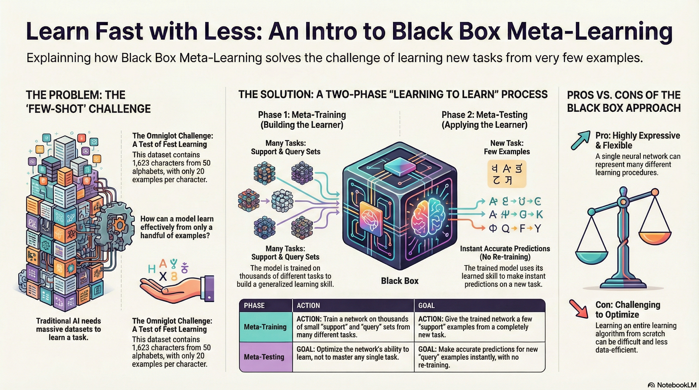

### Resource

::: {layout-ncol=2}
[](https://www.youtube.com/watch?v=cjTs7lH5eUs&list=PLoROMvodv4rNjRoawgt72BBNwL2V7doGI&index=4)

[](https://cs330.stanford.edu/materials/cs330_metalearning_bbox_2023.pdf)
:::

## Lecture Summary with NotebookLM



## One View on the Meta-Learning Problem

Before diving into the main topic of this lecture, **Black-Box Meta-Learning**, the professor explained that meta-learning can be viewed as an extension of supervised learning, referencing definitions from her Ph.D. thesis (@Finn:EECS-2018-105).

$$ 
\begin{aligned}
y &= g_{\phi}(x) \\
\text{Input: } & x \\
\text{Output: } & y \\
\text{Data: } & \{(x, y)_i\} \\
\end{aligned}
$$ {#eq-supervised-learining}

::: {#tbl-panel layout-ncol=2}
|      | Supervised Learning | Meta Supervised Learning |
|------|------|------|
|           | $y=g_{\phi}(x)$   | $y^{ts} = f_{\theta}(\mathcal{D}^{tr}, x^{ts})$ |
| Inputs    | $x$    | $\mathcal{D}^{tr} (= \{(x, y)_{1:K}\}), x^{ts}$    |
| Outputs    | $y$    | $y^{ts}$    |
| Data    | $\{(x, y)_i\}$    | $\{\mathcal{D}_i\}$    |

Comparison of Supervised Learning & Meta-Supervised Learning
:::

$$\begin{aligned}
y &= g_{\phi}(x) \\
\text{Input: } & x \\
\text{Output: } & y \\
\text{Data: } & \{(x, y)_i\} \\
\end{aligned}
$$ {#eq-supervised-learning}

::: {#tbl-panel layout-ncol=2}
|      | Supervised Learning | Meta-Supervised Learning |
|------|------|------|
|           | $y=g_{\phi}(x)$   | $y^{ts} = f_{\theta}(\mathcal{D}^{tr}, x^{ts})$ |
| Inputs    | $x$    | $\mathcal{D}^{tr} (= \{(x, y)_{1:K}\}), x^{ts}$    |
| Outputs    | $y$    | $y^{ts}$    |
| Data    | $\{(x, y)_i\}$    | $\{\mathcal{D}_i\}$    |

Comparison of Supervised Learning & Meta-Supervised Learning
:::

As shown in @tbl-panel, the distinction between **Supervised Learning** and **Meta-Supervised Learning** lies in the definition of inputs and outputs. In standard supervised learning, the input is a data point $x$, the output is a label $y$, and the objective is to learn a function $g$ such that $y=g_{\phi}(x)$.

In contrast, in meta-supervised learning, the input is a combination of a **training dataset** ($\mathcal{D}^{tr}$) and a new test input $x^{ts}$. The corresponding output is the label $y^{ts}$ for the test input. The objective function becomes learning a function $f$ that takes the entire dataset ($\mathcal{D}^{tr}$) as input and produces a prediction for the new data ($x^{ts}$). Here, $\mathcal{D}^{tr}$ is referred to as the **support set**, and the problem is typically defined as a classification task over $K$ classes.

The lecture used the term **"Dataset of Datasets."** This highlights that the data required to train the function is not merely input-output pairs ($(x, y)$), but rather a collection of datasets, where each dataset corresponds to a specific task. Consequently, during the meta-training phase—where information from initial tasks is acquired—learning proceeds by sampling these tasks.

The rationale for explaining this concept at the beginning of the lecture is to simplify the problem into the design and optimization of a given function $f$, before examining highly complex algorithms. By viewing the problem through this lens, we can focus on examining neural network architectures capable of processing datasets (datasets combined with tasks). This premise suggests that we can solve the problem by designing and optimizing architectures such as RNNs or Transformers that can process inputs sequentially. This concept serves as the theoretical foundation for the Black-Box approach covered in this lecture.

The methodology for designing a general Black-Box approach can be summarized as follows:

1.  First, identify a function $f_{\theta}(\mathcal{D^{tr}, x^{ts}})$ that takes the training set $\mathcal{D}^{tr}$ (used during meta-training) and a test sample $x^{ts}$ as inputs.
2.  Second, find a method to optimize $\theta$ using Maximum Likelihood Estimation given the meta-training data. (Note that $\theta$ represents the **meta-parameters**).

In conclusion, Meta-Learning, like standard Supervised Learning, can be boiled down to a single question: **How do we design and train a function $f$ that takes a dataset as input and outputs a prediction?**

## Benchmarks for Meta Learning & Meta-training

{#fig-omniglot}

Before explaining the training process of Meta-Learning, the lecture briefly introduced commonly used benchmarks in the field. @fig-omniglot shows the **Omniglot** dataset introduced by @lake2015omniglot. While similar to the well-known MNIST benchmark in terms of character recognition, there is a key difference: while MNIST consists of a small number of classes (0-9) with a large amount of data per class, Omniglot contains 1,623 characters from 50 different alphabets, with only 20 samples per class. Due to this characteristic of having **"many classes with few samples"**, it is widely used to define Meta-Learning problems and is often referred to as the "transpose of MNIST."

Beyond Omniglot, there are various other benchmarks for few-shot image recognition, such as **tieredImageNet** introduced by @ren2018meta, **Fewshot-CIFAR100 (CIFAR-FS)**, **CelebA**, **ORBIT**, and **CUB**. Of course, benchmarks exist beyond computer vision as well. @nguyen2020meta solved the Molecular Property Prediction problem using Graph Neural Networks in a meta-learning framework and released the dataset as a benchmark. Additionally, @yin2019meta and @li2021channel shared cases and benchmarks applying meta-learning to object pose estimation and channel coding in communications domain, respectively.

The lecture explained the meta-training process using the Omniglot dataset as an example, specifically focusing on a **3-way 1-shot classification** problem (distinguishing between 3 classes, given only 1 image per class during adaptation).

- **Task Sampling**: The first step involves selecting a single Task—specifically, choosing an alphabet from the Omniglot dataset and randomly selecting **3 characters** from it. For example, let's assume we selected A, B, and C from the English alphabet. These three characters constitute a single Task $\mathcal{T}_i$ to be solved in the current episode.
- **Dataset Split**: From each selected character, we sample 2 images. One is used for the **Training Set (Support Set)**, and the other for the **Test Set (Query Set)**. As defined previously, we need to assign labels to solve this in a Supervised Learning manner. Here, we assign arbitrary labels 0, 1, and 2 (e.g., A=0, B=1, C=2). The goal is to correctly predict the labels for images in the Test set. If an image of 'A' from a different alphabet (or style) appears, the model should predict 0. A crucial detail here is that labels must be **randomly shuffled** for each task to prevent the model from memorizing the specific class-to-label mapping (e.g., preventing it from learning that "A is always 0").
- **Black-box Adaptation**: The professor described two major approaches for the black-box model that processes the dataset generated in the previous steps.
  - **(Version 1) Generating Parameter Method**: This approach consists of two neural networks: the classifier itself and a network that outputs the parameters $\phi$ to control that classifier. When a network like an RNN receives $\mathcal{D}^{tr}$ as input, it outputs the parameters $\phi$ for the second network. Then, $x^{ts}$ is fed into the second network (parametrized by $\phi$) to output the final prediction $\hat{y}$. While this is the most naive approach, generating millions of parameters every time $\mathcal{D}^{tr}$ is input is highly inefficient and suffers from poor scalability.
  - **(Version 2) Learning to Learn with Activation**: This is the method ultimately proposed by the professor. Instead of outputting the entire set of parameters, it utilizes the internal hidden state or embedding vector of an RNN or Transformer as a Context. In this setup, the final label is predicted by feeding both the given context vector and $x^{ts}$ into the neural network. This method is far more efficient than generating parameters and is the standard approach used in practice.
- **Optimization**: Finally, the loss is calculated by comparing the generated label with the ground truth. This loss is then used to update the meta-parameters $\theta$. It is important to note that we update the weights of the neural network that generates the hidden state, not the hidden state (activation) itself.

I have reconstructed the content regarding the two structures of Black-box adaptation mentioned in the lecture notes using Gemini. @fig-black-box-adaptation illustrates the concepts described above.

{#fig-black-box-adaptation}

## Black-Box Adaptation

The professor provided further explanation on how the Black-Box structure allows the neural network to learn to mimic the **learning procedure** itself.

Unlike standard learning, which receives data ($x$) and outputs a label $y$, **Black-Box Meta-Learning** takes the entire training dataset ($\mathcal{D}^{tr}$) and a test input ($x^{ts}$) as combined inputs to predict the label. Simply put, the model's internal processing—handling the dataset and extracting information—is analogous to a learning process occurring inside a "black box".

The professor referred to this concept as a **"learner"**. The Black-Box Adaptation process consists of two steps: first, training a "learner" neural network capable of representing the dataset of a given task ($\phi_i =f_{\theta}(\mathcal{D}^{tr})$), and second, predicting the label of a given test sample using the output of this "learner." As you can see, each component corresponds to the supervised learning paradigm introduced earlier, and the objective function is essentially a combination of these supervised learning objectives.

$$
\min_{\theta} \sum_{\mathcal{T}_i} {\color{red} \sum_{(x, y) \sim \mathcal{D}_i^{ts}} -\log g_{\phi_i}(y \vert x)}
$$

If we substitute the "learner" equation introduced above into this, the objective function can be summarized as:

$$
\min_{\theta} \sum_{\mathcal{T}_i} \mathcal{L}(f_{\theta}(\mathcal{D}_i^{tr}), \mathcal{D}_i^{ts})
$$

Expressed in the form of an algorithm, it is as follows:

```pseudocode
#| html-indent-size: "1.2em"
#| html-comment-delimiter: "//"
#| html-line-number: true
#| html-line-number-punc: ":"
#| html-no-end: false
#| pdf-placement: "htb!"
#| pdf-line-number: true

\begin{algorithm}
\caption{Black Box Meta Learning}
\begin{algorithmic}
\State Sample task $\mathcal{T}_i$ (or mini-batch of tasks)
\State Sample disjoint datasets $\mathcal{D}_i^{tr}, \mathcal{D}_i^{ts}$ from $\mathcal{D}_i$
\State Compute $h_i (\approx \phi_i) \leftarrow f_{\theta}(\mathcal{D}_i^{tr})$
\State Update $\theta$ using $\nabla_{\theta}\mathcal{L}(\phi_i, \mathcal{D}_i^{ts})$
\State Iterate 1~4
\end{algorithmic}
\end{algorithm}
```

## Challenges

The lecture also introduced a debate between the AI and Cognitive Science communities that arose around the time the Omniglot dataset (@lake2015omniglot) was released. At that time, cognitive scientists argued that deep learning methods, which require vast amounts of data, would be incapable of **one-shot learning** (learning from very few samples).

However, the **Memory-Augmented Neural Network (MANN)** architecture proposed by @santoro2016meta demonstrated that few-shot learning is indeed possible using neural networks with structures like LSTMs or Neural Turing Machines. This research effectively became the origin of Black-Box Meta-Learning.

In MANN, the model sequentially reads the training data (Support Set) and stores important information in external memory or the LSTM's cell state. When new data (Query Set) arrives, it retrieves relevant information from the stored memory to predict labels. In essence, by binding data to memory and retrieving it later, the model creates the appearance of learning without explicit parameter updates.


At this point, the lecture revisited the topic of Multi-task Learning covered previously. In traditional Multi-task Learning, a Task Descriptor $z_i$ was explicitly provided to the model. However, in the meta-learning scenarios we are discussing, new tasks are constantly introduced, making it impossible to define and provide metadata for task information as done in multi-task approaches.

To resolve this, the concept of a hidden state or context vector $h_i$ emerged—generated by an RNN or a specific Encoder reading the training dataset ($\mathcal{D}^{tr}$). This information essentially replaces the role of the task descriptor in multi-task learning. Instead of being explicitly given metadata about the task, the neural network reads the support set and self-summarizes the task information, effectively inferring, "Ah, looking at this data, the current task is a classification problem with these characteristics".

The lecture referred to this as **Sufficient Statistics**. This implies that even without updating or predicting the entire information required to estimate the task, a low-dimensional vector $h_i$, such as a context vector, contains sufficient contextual information to perform the task.

Additionally, the lecture introduced various studies aimed at extracting this Context Vector $h_i$ more effectively. During the lecture, a question was raised regarding **catastrophic forgetting** due to the multi-task nature of the problem. Inherently, architectures like RNNs/LSTMs process data sequentially, leading to the **Long-term dependency** problem where information from the beginning of the sequence is lost as the sequence grows longer.


The **Simple Neural AttentIve Meta-Learner (SNAIL)** architecture, introduced in @mishra2017simple, combines Convolution and Attention operations to efficiently generate task information. The Convolution operations extract local information within the data, while the Attention mechanism allows direct access to specific information within the entire sequence. This structure enables the model to instantly reference specific data points (e.g., data from the support set) within a long sequence without forgetting them.

Through this architecture, SNAIL demonstrated significant accuracy improvements over the previously introduced MANN on the Omniglot dataset. Notably, the paper showed that SNAIL achieved better performance than contemporary methods like MAML (@finn2017model) and ${RL}^2$ (@duan2016rl), not only in Image Classification but also when applied to Reinforcement Learning problems.

## Summary

In conclusion, when approaching Meta-Learning problems, the **Black-Box adaptation** structure possesses high expressive power; provided the neural network has sufficient capacity to capture the information within the data, it can approximate virtually any learning algorithm. Furthermore, it offers the distinct advantage of being versatile—it is not limited to Supervised Learning but can also be seamlessly integrated with Reinforcement Learning, as demonstrated in the previous examples.

However, there are significant challenges. Since the architecture often involves controlling model parameters via another neural network (or complex context processing), the model structure tends to become massive and intricate. Additionally, as seen in the objective function, the loss landscape can become complex due to nested functions, potentially leading to issues from an **optimization** perspective. Finally, a frequently raised criticism in the field of meta-learning is **sample inefficiency**; because the model must learn the "learning procedure" itself from scratch, it often requires a substantial amount of data to achieve generalization.

## Case Study - GPT-3 for Black-Box Meta Learning

The lecture concluded with a case study of **GPT-3** as a massive Black-Box Meta-Learning model. In May 2020, OpenAI introduced GPT-3 via the paper **Language Models are Few-Shot Learners** (@brown2020language). At the time, it utilized a Transformer architecture with a staggering **175 billion parameters**.

From the perspective of meta-learning discussed in this lecture, the **Prompt (Context)** provided to the model acts as the training dataset ($\mathcal{D}^{tr}$), while the subsequent text the model is required to generate serves as the test data ($\mathcal{D}^{ts}$).

The lecture slides notably used the term **"Emergent Few-shot Learning"**. Unlike the Omniglot example seen earlier, where the model was explicitly trained for few-shot tasks, GPT-3's few-shot capabilities were not an explicit training objective. Instead, this ability naturally **emerged** as a byproduct of training for **Language Modeling** (predicting the next word) over a massive corpus of text data.

GPT-3 can perform a wide variety of tasks, including translation, grammar correction, and arithmetic. The reason a single model can handle such diverse tasks is that it unifies all problems by converting them into a **text-to-text** format.

{#fig-learning-loop}

@fig-learning-loop illustrates the learning process within GPT-3, which can be broadly divided into an **inner loop** and an **outer loop**.

- **Outer Loop**: Assuming a massive dataset secured from web crawls, Wikipedia, and books, the outer loop is responsible for updating the internal Transformer parameters using this data (Standard Pre-training).
- **Inner Loop**: Once trained, the model undergoes the **In-Context Learning** process. Here, the model reads the context within the prompt and instantly identifies patterns to perform inference. Crucially, **no parameter updates occur** during this stage; "learning" happens solely through the model's **forward pass**.

You might wonder how this is feasible. However, as established in the premise of Black-Box Meta-Learning, it becomes possible if the model architecture possesses sufficient capacity (expressivity) to capture the characteristics of such vast data and tasks. Apart from the mechanism, the lecture also presented specific examples demonstrating GPT-3's One-shot and Few-shot learning capabilities.

{#fig-limitation}

On the other hand, the lecture also addressed the limitations. Despite being trained on massive amounts of data, the accuracy for Few-shot/One-shot/Zero-shot Learning remains relatively modest compared to the volume of training data. In fact, even with 175 billion parameters, GPT-3's performance across various benchmarks hovered around the 50% accuracy mark.

Furthermore, there are cases where the output becomes erratic depending on the order of the Prompt. As shown in @fig-limitation, simply changing the order of examples in the prompt can lead to nonsensical results like "Your foot has two eyes" or "The sun has one eye." Consequently, this highlights that performance varies significantly depending on how the Prompt (corresponding to $\mathcal{D}^{tr}$) is constructed.

The lecture then shared research findings on what specific factors enable the emergence of few-shot learning capabilities.

The findings discussed in @chan2022data demonstrate that emergent Few-shot learning is not solely a result of training on large datasets, but rather manifests when specific data conditions and model architectures are met. The key concepts are **Temporal Correlation** and **Dynamic Meaning**.

- **Temporal Correlation**: It emphasizes the importance of temporal associations within the data. For instance, there must be a relation between $\mathcal{D}^{tr}$ and $\mathcal{D}^{ts}$ for the model to learn how to utilize the context itself.
- **Dynamic Meaning**: The data must reflect the characteristic that word meanings are not fixed but change depending on the context (e.g., burstiness or re-occurrence of terms). This forces the model to develop the ability to infer meaning from the immediate context.

Additionally, the paper presents results showing that the model's scale and architecture itself influence these emergent abilities.

In this section, we explored GPT-3 through the lens of Black-Box Meta-Learning. Of course, there are fundamental differences between GPT-3 (trained for Language Modeling) and standard Meta-Learning (which samples tasks and aligns datasets) in terms of training objectives and task origins. However, the lecture explained that they can be viewed in parallel, as both involve the mechanism of reading massive datasets (contexts) to predict outcomes.