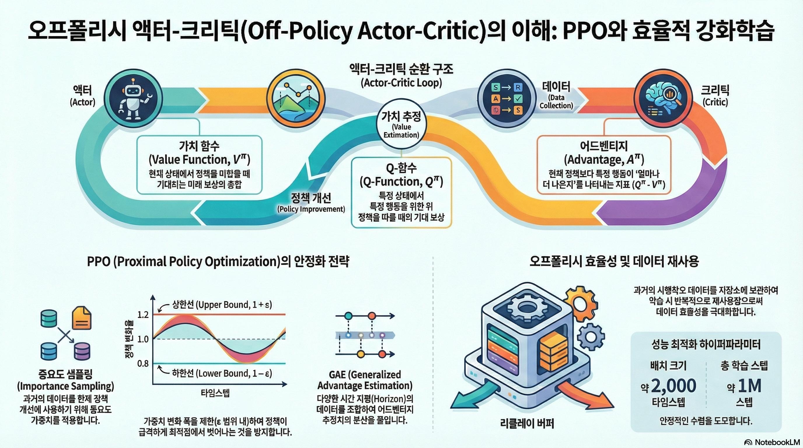
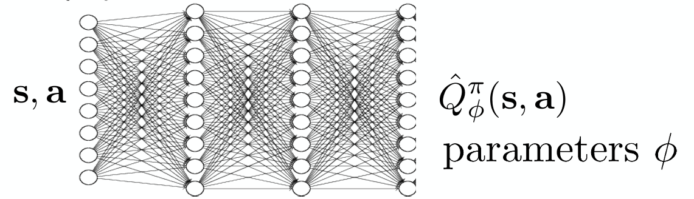

### 강의 및 자료

::: {layout-ncol=2}
[](https://youtu.be/cRGKc-nAWho?si=udpcpFHWkk9JXe-B)

[](https://cs224r.stanford.edu/slides/05_cs224r_offpolicy_actor_critic_2025.pdf)
:::

포스트에 소개되어 있는 자료는 강의 자료에서 따왔습니다.

## Lecture Summary with NotebookLM



## Recap for (On-Policy) Actor Critic Methods

이전 내용에서는 Policy Gradient의 내용과 Value function을 추정하는 모델을 만들어서 이를 통해 policy를 학습시키는 Actor-Critic Methods에 대해서 소개했다. 먼저 Policy Gradient에 대한 내용을 다시 다뤄보자면,

$$
\nabla_{\theta}J(\theta) \approx \frac{1}{N} {\color{blue} \sum_{i=1}^N} \sum_{t=1}^T \nabla_{\theta} {\color{red} \log \pi_{\theta}(a_{o, t} \vert s_{i, t})} \Big( {\color{green} \Big( \sum_{t'=t}^T r(s_{i, t'}, a_{i, t'})\Big)} {\color{cyan} - b}\Big)
$$ {#eq-policy-gradient}

으로 표현되었고, @eq-policy-gradient 에서 ${\color{blue} \sum_{i=1}^N}$ 부분을 통해서 policy로부터 sample을 취하고, ${\color{red} \log \pi_{\theta}(a_{o, t} \vert s_{i, t})}$ 를 통해서 policy가 좋은 trajectory에 대한 것을 따라가고, 안좋은 방향으로는 멀어지게 하는 policy likelihood를 따라갔다. 또한 미래시점의 reward sum만을 고려하기 위해서 ${\color{green} \Big( \sum_{t'=t}^T r(s_{i, t'}, a_{i, t'})\Big)}$ 를 활용하여 reward-to-go 란 개념을 사용했고, 단순히 좋고 나쁘다는 것보다는 좋고 나쁜것에 대한 기준을 정의하기 위해서 ${\color{cyan} b}$ 라는 baseline 개념을 적용했다. 이를 통해서 최종적으로 기준보다 좋은 trajectory의 내용을 더 많이 취하고, 기준보다 나쁜 trajectory의 내요은 덜 하게 하는 policy gradient 알고리즘이 정의되었다. 또한 sample efficiency 관점에서도 개선시키기 위해서 다른 policy에서 수집된 데이터를 활용하는 **Off-policy** 방식의 Policy Gradient에 대해서도 소개했다. 대신 현재의 수행 policy ($\pi_{\theta}$)와 다른 policy ($\pi_{\theta'}$)에서 sampling 해온 만큼, 해당 비율만큼 반영하는 비율을 추가로 적용하는 게 필요했는데, 이를 위해서 **Importance Weight** 라는 개념을 사용했다. Importance weight 까지 적용된 Off-policy Policy Gradient의 최종 식은 다음과 같다.

$$
\nabla_{\theta}J(\theta) \approx \frac{1}{N} \sum_{i=1}^N \sum_{t=1}^T {\color{yellow} \frac{\pi_{\theta'}(a_{i, t} \vert s_{i, t})}{\pi_{\theta}(a_{i, t} \vert s_{i, t})}} \nabla_{\theta} \log \pi_{\theta'}(a_{i, t} \vert s_{i, t}) \Big( \Big( \sum_{t'=t}^T r(s_{i, t'}, a_{i, t'})\Big) - b \Big)
$$

이렇게 trajectory 단위로 policy 학습하는 것에서 발전해서 실제로 미래에 받을 수 있는 expected return을 추정할 수 있는 Value function과 부가적인 Advantage function에 대해서 소개했고, 신경망 기반의 value function을 추정하는 모델까지 학습시켜서 policy 학습에 활용하는 Actor-Critic Method에 대해서 지난번에 다뤘다. 역시 이에 대한 식도 

$$
\nabla_{\theta}J(\theta) \approx \frac{1}{N} {\color{blue} \sum_{i=1}^N} \sum_{t=1}^T \nabla_{\theta} \log_{\pi_{\theta}} (a_{i, t} \vert s_{i, t}) {\color{cyan} A^{\pi}(s_{i, t}, a_{i, t})} 
$$ {#eq-actor-critic}

@eq-actor-critic 과 같이 정의되었다. 마찬가지로 실제로 policy를 수행하면 데이터를 수집하는 부분(${\color{blue} \sum_{i=1}^N}$)과 현재 취한 action에 대한 가치가 평균적인 가치보다 얼마나 더 좋은지를 판단하는 Advantage function(${\color{cyan} A^{\pi}(s_{i, t}, a_{i, t})}$)을 통해서 어떤게 좋고 나쁜지 판단하고(Critic), 더 좋은 것을 행하는(Actor) 형태의 구조로 되어 있었다. 이때 value function을 추정하는 방법에 있어, 실제 reward를 활용하는 Monte Carlo Estimation과 현재의 reward와 다음 State의 value function을 통해 추정하는 Bootstrapping Estimation, 또 이 두 방법에서 발생하는 Bias-Variance Tradeoff 현상을 완화시키기 위해 N-step Retrun같은 방법도 존재한다고 소개했고, 이를 통해서 마지막 Advantage function도 Value function으로 바꿔서 볼 수 있다고 언급했다.

$$
A^{\pi}(s_t, a_t) \approx r(s_t, a_t) + V^{\pi}(s_{t+1}) - V^{\pi}(s_t)
$$

그런데 위에서 설명한 Actor-Critic Method내의 첨자를 살펴보면 다 동일한 policy($\pi_{\theta}$)를 사용했다. 그럼 과연 Off-policy Policy Gradient처럼 다른 policy $\pi_{\theta'}$ 에서 수집된 데이터를 활용한 Off-Policy 형태의 Actor-Critic, **Off-Policy Actor-Critic Methods**에 대한 내용이 이번 포스트에서 다룰 내용이다.

## Off-Policy Actor-Critic Methods

먼저 기본적인 Off-Policy의 전제는 동일하다. 우선 현재의 policy에서 데이터를 sampling 하고, 수집된 데이터 내에서 value function model을 학습시키고, 추후에 gradient를 취할때 Importance Weight를 적용하면 되지 않을까? 

::: {.callout-note title="Importance Weight"}
기존의 Policy Gradient는 데이터를 수집하고, 딱 한번 업데이트하면 기존 데이터는 버려야 했다. 왜냐하면, 학습을 통해서 policy $\pi$ 가 업데이트되는 순간, 기존 데이터는 data distribution이 바뀌면서 더 이상 $\pi$ 가 만든 데이터가 아니게 되기 때문이다. Sample Inefficiency가 큰 단점으로 작용하는 강화학습에서는 이를 극복하기 위해서 Importance Weight라는 개념이 나온다. 아이디어는 간단한데, 과거 정책($\pi_{old}$)과 현재 정책($\pi$)의 확률 비율을 계산해서 보정해주는 것이다. 식으로 표현하면 다음과 같다.

$$
r_t(\theta) = \frac{\pi_{\theta}(a_t \vert s_t)}{\pi_{\theta_{old}}(a_t \vert s_t)}
$$

이렇게 되면 해당값은 일종의 가중치처럼 작용할 수 있는데, 만약 해당값이 1보다 크게 되면, 현재 정책이 과거 정책보다 해당 행동을 더 선호하게 되는 경우이므로, 가중치를 높여서 더 학습에 활용하는 형태가 될 것이고, 1보다 작으면 반대로 덜 선호하는 경우이므로 가중치를 낮춰 조금만 반영하게 된다. 이처럼 **확률 비율**을 곱해주면, 이론적으로는 과거 데이터를 버리지 않고, 여러 번 재사용하여 학습 효율을 높일 수 있게 된다.
:::

### Multiple Gradient Step

강의에서 소개한 첫번째 버전인 Multiple Gradient Step 부분은 바로 Gradient를 구해서 parameter를 update하는 과정을 반복해보자는 것이다.


```pseudocode
#| html-indent-size: "1.2em"
#| html-comment-delimiter: "//"
#| html-line-number: true
#| html-line-number-punc: ":"
#| html-no-end: false
#| pdf-placement: "htb!"
#| pdf-line-number: true
#| label: algo-Multiple-Gradient-Step

\begin{algorithm}
\caption{Version 1. Multiple Gradient Step}
\begin{algorithmic}
\State Sample batch of data $\{(s_{1, i}, a_{1, i}, \dots s_{T,i}, a_{T, i})\}$ from $\pi_{\theta}$
\State Fit $\hat{V}_{\phi}^{\pi_{\theta}}$ to summed rewards in data
\State Evaluate $\hat{A}^{\pi_{\theta}}(s_{t, i}, a_{t, i}) = r(s_{t, i}, a_{t, i}) + \gamma \hat{V}_{\phi}^{\pi_{\theta}}(s_{t+1, i}) - \hat{V}_{\phi}^{\pi_{\theta}}(s_{t, i})$, $\forall t, i$
\State Evaluate $\nabla_{\theta'} J(\theta') = \sum_{t, i} \frac{\pi_{\theta'} (a_{t, i} \vert s_{t, i})}{\pi_{\theta} (a_{t, i} \vert s_{t, i})} \nabla_{\theta'} \log \pi_{\theta'} (a_{t, i} \vert s_{t, i}) \hat{A}^{\pi_{\theta}}(s_{t, i}, a_{t, i})$
\State Update $\theta \leftarrow \theta + \alpha \nabla_{\theta} J(\theta)$
\State Take Multiple Step in 4, 5
\end{algorithmic}
\end{algorithm}
```

실제로 구현시 PyTorch나 Tensorflow, JAX같이 자동 미분(Auto-Differentiation)이 지원되는 프레임워크에서는 미분할 대상이 되는 Objective function이 필요하다. 그런데 현재의 미분했을때 위와 같은 Importance Weight가 반영된 수식을 얻기 위해서는 역으로 이를 위한 수식을 정의해줘야 한다. 이렇게 원래의 objective function을 구하기 위해 새로 정의할 함수를 강의에서는 **대리함수(Surrogate Objective function)**이라고 설명하는데, 먼저 이해를 위해서는 많이 알려져있는 trick 중 하나인 **Log-Derivative trick**이란 것을 알아야 한다.

::: {.callout-tip title="Log-Derivative Trick"}

$$
p_{\theta}(\tau) \nabla_{\theta} \log p_{\theta}(\tau) = \nabla_{\theta} p_{\theta}(\tau)
$$

:::

우리가 최종적으로 미분해서 얻고 싶은 함수는 $\frac{\pi_{\theta'}}{\pi_{\theta_{old}}} \nabla \log \pi_{\theta'} A$ 인데, 여기에서 업데이트하려는 $\theta'$ 와 상관없는 변수를 제외하고는, $\pi_{\theta'} \nabla \log \pi_{\theta'}$ 만 남게 된다. 이 부분이 사실 Log-Derivative trick에서 정의한 내용을 활용하면 그냥 $\pi_{\theta'} \nabla \pi_{\theta'}$ 가 된다. 그래서 이제 앞에서 언급한 바와 같이 surrogate objective을 정의하면 다음과 같이 된다.

$$
\tilde{J}(\theta') \approx \sum_{t, i} \frac{\pi_{\theta'}(a_{t, i} \vert s_{t, i})}{\pi_{\theta} (a_{t, i} \vert s_{t, i})} \hat{A}^{\pi_{\theta}}(s_{t, i}, a_{t, i})
$$ {#eq-surrogate-objective-function}

이게 진짜 objective function은 아니지만, 이를 PyTorch나 JAX같이 auto-differentiation을 사용하면 원하는 방향으로 parameter를 업데이트할 수 있기 때문에, surrogate라는 내용이 적용된 것이다.

@eq-surrogate-objective-function 을 살펴보면 importance weight가 반영되어 있는데, 앞의 @algo-Multiple-Gradient-Step 을 보면, @eq-surrogate-objective-function 에서 gradient를 계산하고, parameter를 update하는게 여러번 반복적으로 수행되기 때문에 결과적으로는 policy를 좋은 방향으로 개선시키기보다는 단순히 이전 policy에 비해서 차이가 확연하게 나타나는 policy가 학습되게끔 가산점(incentivized)을 주게 되고, 결과적으로 학습이 불안정해지거나 policy collapse같은 현상이 나타난다.

그래서 강의에서 이를 해소하기 위한 아이디어를 두가지 제시했는데, 첫번째는 **Kullback-Leibler(KL) Divergence**라는 통계 지표를 일종의 constraint로 생각해 policy 학습시 활용하자는 것이고, 두번째는 반복적인 update시 문제가 발생하는 importance weight 부분에 대해서 일종의 boundary를 걸자는 것이다. 두 방법 모두 학습하는 policy가 기존 policy에 비해서 너무 급격하게 변화하는 것을 막는 일종의 안정장치를 걸었다고 보면 좋을것 같다.

첫번째 방법에 대해서 부연 설명을 하자면, KL Divergence는 인자로 들어가는 두개의 확률분포가 서로 얼마나 다른지를 측정하는 통계지표이다. 강화학습의 맥락에서 살펴보면 과거의 policy $\pi_{old}$ 와 현재 학습중인 policy $\pi_{\theta}$ 의 행동 패턴이 얼마나 달라졌는지를 수치로 나타낸 것이다. 실제 @eq-surrogate-objective-function 에서 사용하는 advantage function $\hat{A}$ 는 과거 policy $\pi_{old}$ 를 기준으로 계산되었기 때문에 만약 현재 policy가 과거와 너무 달라진다면, advantage function도 의미를 잃게 된다. 그래서 학습을 하되, 과거 policy의 distribution에서 너무 떨어지지 않게 하는 제약(constraint)으로 사용하는 게 첫번째 방식이고, @schulman2015trust 에서 처음 이런 개념을 제시했다. 강의에서는 이를 구현하는 방법으로 이전에 소개한 surrogate objective에 penalty term으로 추가하는 방식을 설명했다.

$$
\tilde{J}_{Con} \approx \tilde{J}^{surr}(\theta') - \beta \cdot KL(\pi_{\theta_{old}}(\cdot \vert s) \Vert \pi_{\theta}(\cdot \vert s))
$$

이렇게 정의하면 multiple gradient step을 통해서 policy 가 너무 많이 변화하여, 결과적으로 $KL$ 값이 커치면, 전체 Objective function 값은 작아진다. 그러면 Gradient Ascent과정에서 보상을 높이되, KL Divergence가 낮은 지점을 찾는 방향으로 최적화가 이뤄지게 된다. 여기서 $\beta$ 는 hyperparameter로 penalty의 강도를 조절하게 되는데, 사실 $\beta$ 의 이상적인 값을 찾는 것이 어렵기 때문에, @schulman2017proximal 논문에서는 뒤에서 소개할 **Clipped Surrogate function**외에 **Adaptive KL Penalty** 라는 개념도 제시했다. 간단하게만 설명하면 미리 KL Penalty의 임계값을 지정해주고, 특정 조건에 해당될때의 $\beta$ 값을 조절하게 하는 것이다.
최근 이렇게 KL Contraint를 학습에 활용하는 방안은 RLHF 같은 LLM의 Preference를 최적화하는 문제에서도 많이 적용하는 편이다.

두번째 아이디어는 앞에서 언급한 것처럼 Importance Weight에 Boundary를 정하는 방법인데, 이 아이디어가 @schulman2017proximal 에서 소개되는 **Proximal Policy Optimization(PPO)** 의 핵심 내용 중 하나이다.

### Proximal Policy Optimization (PPO)

강의에서는 @schulman2017proximal 논문에서 @eq-surrogate-objective-function 으로 정의했던 surrogate objective에서 적용한 3가지 trick(혹은 안전장치)이 언급했다. 먼저 적용된 trick은 앞에서 잠깐 언급한 것처럼 importance weight에 boundary를 걸어주는 것이다. 

$$
\tilde{J}(\theta') \approx \sum_{t, i} \text{clip} \big( \frac{\pi_{\theta'}(a_{t, i} \vert s_{t, i})}{\pi_{\theta} (a_{t, i} \vert s_{t, i})}, 1 - \epsilon, 1 + \epsilon \big) \hat{A}^{\pi_{\theta}}(s_{t, i}, a_{t, i})
$$

그래서 boundary가 특정 범위를 넘어서면 제한값으로 강제로 **자르는(Clipping)** 방식을 취했다. 그래서 반복적인 update를 통해서 importance weight로 인한 policy가 급격하게 변할 요인을 제거한 것이다. (이 정의로 인해서 Clipped surrogate objective가 적용된 PPO는 **PPO-clip** 라고 부르고, 앞에서 설명된 adaptive KL Penalty가 적용된 PPO는 **PPO-KL** 이라고 부른다.)

두번째 trick은 이렇게 clipped된 surrogate objective와 원래의 objective function을 비교해서 두 값 중 낮은 값을 선택하는 것이다.

$$
\tilde{J}(\theta') \approx \sum_{t, i} \min \Big( \frac{\pi_{\theta'}(a_{t, i} \vert s_{t, i})}{\pi_{\theta} (a_{t, i} \vert s_{t, i})}\hat{A}^{\pi_{\theta}}(s_{t, i}, a_{t, i}),   \text{clip} \big( \frac{\pi_{\theta'}(a_{t, i} \vert s_{t, i})}{\pi_{\theta} (a_{t, i} \vert s_{t, i})}, 1 - \epsilon, 1 + \epsilon \big) \hat{A}^{\pi_{\theta}}(s_{t, i}, a_{t, i})\Big)
$$

이른바 **비관적 추정(Pessimistic Estimation)**이라고 표현하기도 하는데, clipping을 통해서도 보상이 과대평가되는 현상을 방지하는 안전장치 역할을 한다. 사실 이 부분은 교수도 실제로는 잘 나타나지 않는 rare event라고 표현하기도 했다.

마지막으로는 Advantage function에서도 안정적인 값을 계산하기 위한 trick으로 **Generalized Advantage Estimation(GAE)**을 논문에서 제안했다. 기존의 내용대로라면 Actor-Critic 방식에서는 Value function을 추정하기 위해서 별도의 model $\hat{V}^{\pi}$ 을 학습시켰고, 이때 추정에 활용하는 방법으로 Monte Carlo Estimation이나 Bootstrapping 방식에 대해서 언급했었다. 그리고 이 두 방법을 사용했을 때 발생하는 Bias-Variance Tradeoff에 대한 내용도 다뤘다. @schulman2017proximal 에서 언급한 GAE에서는 Advantage에 대한 추정값을 길이(horizon)을 다르게 하면서 구하고, 구한값에 대해서 **가중 평균(weighted average)**를 함으로써 bias와 variance간의 균형을 조절하는 역할을 수행한다. 

먼저, discount factor $\gamma$ 가 적용된 상태에서의 1-step의 TD-error는 다음과 같이 정의된다.

$$
\delta_t = r_t + \gamma \hat{V}_{\phi}^{\pi}(s_{t+1}) - \hat{V}_{\phi}^{\pi}(s_t)
$$

이를 $\lambda$ 라는 hyperparameter를 사용해서, 미래로 갈수록 감쇠시키는 방향으로 advantage function을 추정하면 다음과 같은 식이 된다.

$$
\hat{A}_{GAE}^{\pi} = \sum_{n=1}^{\infty} (\gamma \lambda)^{n-1} \delta_t
$$

역시 $\lambda$ 를 설정하는 문제가 남아있긴 하지만, GAE를 통해서 가까운 미래의 정보는 많이 반영하고, 너무 먼 미래의 정보는 적게 반영하여 적절한 bias와 variance 간의 균형을 유지할 수 있게 해준다.

이를 통해서 최종적으로 Clipped Surrogate objective와 Generalized Advantage Estimation이 적용된 PPO-clip의 최종 알고리즘은 아래와 같다.

```pseudocode
#| html-indent-size: "1.2em"
#| html-comment-delimiter: "//"
#| html-line-number: true
#| html-line-number-punc: ":"
#| html-no-end: false
#| pdf-placement: "htb!"
#| pdf-line-number: true
#| label: algo-PPO

\begin{algorithm}
\caption{Proximal Policy Optimization (PPO)}
\begin{algorithmic}
\State Sample batch of data $\{(s_{1, i}, a_{1, i}, \dots s_{T,i}, a_{T, i})\}$ from $\pi_{\theta}$
\State Fit $\hat{V}_{\phi}^{\pi_{\theta}}$ to summed rewards in data
\State Evaluate $\hat{A}_{GAE}^{\pi}(s_t, a_t) = \sum_{n=1}^{\infty} w_n ( \sum_{t'=t}^{t+n} \gamma^{t'-t} r(s_{t'}, a_{t'}) - \hat{V}_{\phi}^{\pi}(s_t) + \gamma^n \hat{V}_{\phi}^{\pi}(s_{t+n}))$
\State Update policy with $M$ gradient steps on surrogate objective: $\tilde(J)(\theta') \approx \sum_{t, i} \min \Big( \frac{\pi_{\theta'}(a_{t, i} \vert s_{t, i})}{\pi_{\theta} (a_{t, i} \vert s_{t, i})}\hat{A}_{GAE}^{\pi}(s_{t, i}, a_{t,i}),   \text{clip} \big( \frac{\pi_{\theta'}(a_{t, i} \vert s_{t, i})}{\pi_{\theta} (a_{t, i} \vert s_{t, i})}, 1 - \epsilon, 1 + \epsilon \big) \hat{A}_{GAE}^{\pi}(s_{t, i}, a_{t,i})\Big)$
\end{algorithmic}
\end{algorithm}
```

식이 복잡하긴 하지만, @schulman2015trust 에서 소개된 TRPO에 비하면 쉽게 구현할 수 있으며, 실제로도 적은 iteration을 통해서도 PPO가 REINFORCE나 TRPO보다 좋은 성능을 보여주었다.

### Using Replay Buffer

지금까지 살펴본 Actor-Critic Methods를 정리하자면, policy로부터 data를 샘플링해와서 한번만 gradient update를 취하는, 즉 현재 policy $\pi_{\theta}$ 에 대해서만 처리하는 On-Policy Actor-Critic 방식을 먼저 살펴보았고, 학습 효율성 측면에서 여러번 gradient update를 취하는 Off-Policy Actor-Critic 내용을 다뤘다. 사실 엄밀히 말하면, update를 시작하기 전 시점이나 Multiple Gradient step을 통해서 update되는 도중의 policy가 차이가 있을 뿐이지 완전한(fully) Off-Policy Actor-Critic이라고 말하기는 어려웠다. Importance Sampling 기법을 적용해서 데이터를 효율적으로 사용하긴 했어도, 조금 더 효율성을 확장시키기 위해서는 현재의 policy뿐만 아니라 다른 policy들이 exploration하면서 겪은 데이터를 활용하면 좋지 않을까? 강의에서는 이를 위해 강화학습 이론에서 나오는 **"replay buffer"**라는 것을 Actor-Critic Method에 적용해보는 아이디어와 On-Policy내에서 정의했던 가정을 Off-Policy 형태로 변환하기 위해서 제거하는 아이디어를 제시했다.

Replay Buffer라는 것은 @lin1992self 에서 소개된 내용으로 "experience replay"라고도 소개된다. 이름에도 들어있다시피 다른 policy가 exploration을 하면서 경험한 trajectory들을 일종의 영역에 저장한 것을 말하는데, Off-Policy Actor-Critic 에서는 이 replay buffer로부터 뽑은 샘플로 value function을 학습하고, advantage function을 evaluate하는 것이 주된 내용이다.

{#fig-replay-buffer}

@fig-replay-buffer 는 실질적으로 replay buffer와 연계되서 parameter를 update하는 과정이 도식화된 것인데, replay buffer에 넣을때는 현재 State $s$, 현재 취한 행동 $a$, 이때 받은 reward $r$, 그리고 전이된 다음 state $s'$ 형태로 넣고, 데이터를 샘플링할 때도 $(s, a, r, s')$ 형태로 뽑아서 $\theta$ 를 학습하는 형태로 진행된다. 이를 통해서 알고리즘도 다음과 같이 replay buffer가 적용된 형태로 써볼 수 있다.

```pseudocode
#| html-indent-size: "1.2em"
#| html-comment-delimiter: "//"
#| html-line-number: true
#| html-line-number-punc: ":"
#| html-no-end: false
#| pdf-placement: "htb!"
#| pdf-line-number: true
#| label: algo-Replay-Buffer

\begin{algorithm}
\caption{Actor-Critic Methods with Replay Buffer}
\begin{algorithmic}
\State Collect experience $\{(s_i, a_i)\}$ from $\pi_{\theta}$ (& add to replay buffer)
\State Sample a batch $\{s_i, a_i, r_i, s_i'\}$ from replay buffer $\mathcal{R}$
\State Update $\hat{V}_{\phi}^{\pi}$ using targets ${\color{red} y_i = r_i + \gamma \hat{V}_{\phi}^{\pi}(s_i')}$ for each $s_i$
\State Evaluate $\hat{A}^{\pi}(s_i, a_i) = r(s_i, a_i) + \gamma \hat{V}_{\phi}^{\pi}(s_i') - \hat{V}_{\phi}^{\pi}(s_i)$
\State $\nabla_{\theta} J(\theta) \approx \frac{1}{N} \sum_i {\color{blue} \nabla_{\theta} \log \pi_{\theta}(a_i \vert s_i) \hat{A}^{\pi}(s_i, a_i)}$
\State $\theta \leftarrow \theta + \alpha \nabla_{\theta} J(\theta)$
\end{algorithmic}
\end{algorithm}
```

그런데 강의에서는 @algo-Replay-Buffer 에서 단순하게 과거 데이터를 buffer에 넣고 학습시키면 왜 실패하는지에 대해서 두가지 측면에서 살펴보았다. 첫번째로는 빨간색으로 표기된 ${\color{red} y_i = r_i + \gamma \hat{V}_{\phi}^{\pi}(s_i')}$ 인데, 본래의 value function의 정의를 따르자면 **현재 policy $\pi_{\theta}$ 를 따를 때 기대되는 미래 보상의 합** 이다. 하지만 replay buffer에서 뽑은 데이터, 특히 target으로 활용되는 $r$ 과 $s'$ 는 현재 policy가 아니라 과거의 policy가 수행하면서 누적된 데이터이기에 value function이 제대로 학습되지 않는다. 강의에서는 **Mixture of past policies** 라는 표현으로 Value Function Mismatch가 발생하고 있음을 지적했다.

또다른 문제는 파란색으로 표기된 ${\color{blue} \nabla_{\theta} \log \pi_{\theta}(a_i \vert s_i) \hat{A}^{\pi}(s_i, a_i)}$ 에서 발생한다. Actor-Critic Method의 특성상 gradient update를 위해서는 현재 policy에서의 advantage function을 계산하거나 주어진 상황에서 action을 취할 확률 ($\pi_{\theta}(a_i \vert s_i)$)을 계산해야 되는데, 이 때 사용되는 action도 역시 과거의 policy가 수행한 action $a$ 이다. 만약 현재의 policy가 주어진 상태 $s$ 에 있다면 다른 action을 취할지도 모르는 일이다. 여기에서 Action Mismatch가 발생한다.

결과적으로 주어진 state에 대한 value function $V(s)$ 만으로는 replay buffer에서 뽑은 데이터를 활용하여 학습할 수 없게 된다. 이때문에 제안된 아이디어는 $V(s)$ 대신 state action value function인 $Q(s, a)$ 를 활용하는 것이다. 어차피 replay buffer에는 $(s, a, r, s')$ 의 형태로 있기 때문에 action $a$ 를 따로 입력으로 활용하는 $Q(s, a)$ 를 사용하면, 과거에 했던 action $a$ 와 현재 취하고자 하는 action $a'$ 를 분리해서 평가할 수 있게 해준다. 그러면 현재 policy에 대한 Q-function도 다음과 같이 정의된다. 그리고 이 아이디어가 뒤에서 소개할 **Soft Actor-Critic(SAC)** 알고리즘의 시작점이다.

$$
Q^{\pi_{\theta}}(s, a) = r(s, a) + \gamma \mathbb{E}_{s' \sim p(\cdot \vert s, a), \bar{a'} \sim \pi_{\theta}(\cdot \vert s')} [Q^{\pi_{\theta}}(s', \bar{a'})]
$$ {#eq-q-function-for-replay-buffer}

엄밀하게 말하면, @eq-q-function-for-replay-buffer 에서 활용되는 다음 state에서 취할 다음 action ($a'$)도 현재의 policy $\pi_{\theta}$ 에서 얻는 것이 정확한 Q-function을 계산하는 것이겠지만, replay buffer에서 뽑는 action은 옛날 policy에서 뽑은 값이기 때문에, 이걸 활용해서 Q function을 구할 수 없다. 그렇기 때문에 현재의 policy $\pi_{\theta}$ 에 다음 state $s'$ 를 넣고 sampling한 $a'$ 를 사용해서 $Q^{\pi}(s, a)$ 를 근사하는 형태를 가진다. 그러면 전체적인 과정은

1. replay buffer로부터 $(s_i, a_i, s_i')$ 을 sampling한다.
2. 현재 policy $\pi_{\theta}$ 로부터 $\hat{a}_i' \sim \pi_{\theta}(\cdot, s_i')$ 을 sampling한다.

을 거치면 아래와 같은 Q function을 구할 수 있게 된다.
$$
Q^{\pi_{\theta}}(s_i, a_i) \approx r(s_i, a_i) + \gamma Q^{\pi_{\theta}}(s_i', a_i')
$$

물론 초기의 신경망으로 Value function을 학습시키는 Deep RL에서 Q function을 추정하기 위해서 위의 식을 target으로 하는 신경망을 별도로 학습하는 과정이 필요하다. 그리고 이때 replay buffer에는 최대한 다양하고 풍부한 state, action trajectory가 있어야 정확한 모델을 학습시킬 수 있을 것이다.



$$
\mathcal{L}(\phi) = \frac{1}{N} \sum_i \Vert \hat{Q}_{\phi}^{\pi}(s_i, a_i) - y_i \Vert^2
$$

첫번째 잘못된 부분을 보완할 수 있게 수정된 알고리즘은 다음과 같다.

```pseudocode
#| html-indent-size: "1.2em"
#| html-comment-delimiter: "//"
#| html-line-number: true
#| html-line-number-punc: ":"
#| html-no-end: false
#| pdf-placement: "htb!"
#| pdf-line-number: true
#| label: algo-Replay-Buffer

\begin{algorithm}
\caption{Version 2: Fixing the value function mismatch}
\begin{algorithmic}
\State Collect experience $\{(s_i, a_i)\}$ from $\pi_{\theta}$ (& add to replay buffer)
\State Sample a batch $\{s_i, a_i, r_i, s_i'\}$ from replay buffer $\mathcal{R}$
\State Update $\hat{Q}_{\phi}^{\pi}$ using targets ${\color{red} y_i = r_i + \gamma \hat{Q}_{\phi}^{\pi}(s_i', a_i')}$ 
\State Evaluate $\hat{A}^{\pi}(s_i, a_i) = r(s_i, a_i) + \gamma \hat{V}_{\phi}^{\pi}(s_i') - \hat{V}_{\phi}^{\pi}(s_i)$
\State $\nabla_{\theta} J(\theta) \approx \frac{1}{N} \sum_i {\color{blue} \nabla_{\theta} \log \pi_{\theta}(a_i \vert s_i) \hat{A}^{\pi}(s_i, a_i)}$
\State $\theta \leftarrow \theta + \alpha \nabla_{\theta} J(\theta)$
\end{algorithmic}
\end{algorithm}
```

유의할 부분은 $a_i'$ 은 replay buffer $\mathcal{R}$ 에서 뽑은 것이 아니라 현재 policy $\pi_{\theta}$에서 sampling한 값이다.

두번째 잘못된 부분이었던 ${\color{blue} \nabla_{\theta} \log \pi_{\theta}(a_i \vert s_i) \hat{A}^{\pi}(s_i, a_i)}$ 에서도 수정할 수 있는 포인트가 존재한다. 우선 기존에 활용했던 advantage function $\hat{A}^{\pi}$ 를 구하기 위해서는 이전 정의처럼 Value function과 Q-function이 있어야 하는데, 앞에서 Value function을 Q-function으로 바꾼 이상, 해당 부분도 $\hat{Q}^{\pi}$ 으로 대체하는 것이 편하게 된다. 물론 이전에 advantage function을 사용했던 이유가 baseline을 적용해서 variance를 줄이려고 했던 것이기 때문에, Q-function을 쓰게 된다면 variance가 커지게 되겠지만, 이제 replay buffer에 있는 과거의 policy가 쌓은 방대한 데이터를 활용할 수 있기 때문에 조금 더 정확한 Q-function을 학습할 수 있게 된다.

또다른 수정 포인트는 앞의 value function mismatch에서도 야기된 것처럼 replay buffer에서 sampling한 action을 사용하는 부분인데, 이 역시 replay buffer가 아닌 현재 policy에서 sampling한 action을 사용하면 해결된다. 이 부분까지 수정한 알고리즘은 @algo-action-mismatch 로 표현할 수 있다.

```pseudocode
#| html-indent-size: "1.2em"
#| html-comment-delimiter: "//"
#| html-line-number: true
#| html-line-number-punc: ":"
#| html-no-end: false
#| pdf-placement: "htb!"
#| pdf-line-number: true
#| label: algo-action-mismatch

\begin{algorithm}
\caption{Version 2: Fixing the action mismatch}
\begin{algorithmic}
\State Collect experience $\{(s_i, a_i)\}$ from $\pi_{\theta}$ (& add to replay buffer)
\State Sample a batch $\{s_i, a_i, r_i, s_i'\}$ from replay buffer $\mathcal{R}$
\State Update $\hat{Q}_{\phi}^{\pi}$ using targets ${\color{red} y_i = r_i + \gamma \hat{Q}_{\phi}^{\pi}(s_i', a_i')}$ 
\State Evaluate $\hat{A}^{\pi}(s_i, a_i) = r(s_i, a_i) + \gamma \hat{V}_{\phi}^{\pi}(s_i') - \hat{V}_{\phi}^{\pi}(s_i)$
\State $\nabla_{\theta} J(\theta) \approx \frac{1}{N} \sum_i {\color{blue} \nabla_{\theta} \log \pi_{\theta}(a_i^{\pi} \vert s_i) \hat{Q}^{\pi}(s_i, a_i^{\pi})}$ where $a_i^{\pi} \sim \pi_\theta (a \vert s_i)$
\State $\theta \leftarrow \theta + \alpha \nabla_{\theta} J(\theta)$
\end{algorithmic}
\end{algorithm}
```

사실 내부에 사용되는 $s_i$ 역시 현재 policy가 경험하지 않은 state 일수도 있기 때문에 문제가 생길수도 있지만, 실제 해보지 않은 state에서 취할 수 있는 방법은 없고, 강의에서도 그냥 받아들여야 한다고 설명했다. 

여기까지가 replay buffer에서 추출한 데이터를 기반으로 Q-function 모델을 학습하고, 이를 통해서 policy까지 update하는 (Fully) Off-Policy Actor-Critic Method 알고리즘이다. 여기에서 몇가지 구현상 세부적인 사항들이 반영되어 **Soft Actor-Critic (SAC)** 이란 알고리즘으로 소개되었다. (@haarnoja2018soft) 논문에서 소개된 세부적인 반영사항에 대해서 간단히 소개해보고자 한다.

##  Soft Actor-Critic (SAC)

```pseudocode
#| html-indent-size: "1.2em"
#| html-comment-delimiter: "//"
#| html-line-number: true
#| html-line-number-punc: ":"
#| html-no-end: false
#| pdf-placement: "htb!"
#| pdf-line-number: true
#| label: algo-soft-actor-critic

\begin{algorithm}
\caption{Soft Actor-Critic}
\begin{algorithmic}
\State Collect experience $\{(s_i, a_i)\}$ from $\pi_{\theta}$ (& add to replay buffer)
\State Sample a batch $\{s_i, a_i, r_i, s_i'\}$ from replay buffer $\mathcal{R}$
\State Update $\hat{Q}_{\phi}^{\pi}$ using targets $y_i = r_i + \gamma \hat{Q}_{\phi}^{\pi}(s_i', a_i')$ for each $s_i, a_i$
\State Evaluate $\hat{A}^{\pi}(s_i, a_i) = r(s_i, a_i) + \gamma \hat{V}_{\phi}^{\pi}(s_i') - \hat{V}_{\phi}^{\pi}(s_i)$
\State $\nabla_{\theta} J(\theta) \approx \frac{1}{N} \sum_i \nabla_{\theta} \log \pi_{\theta}(a_i^{\pi} \vert s_i) \hat{Q}^{\pi}(s_i, a_i^{\pi})$ where $a_i^{\pi} \sim \pi_\theta (a \vert s_i)$
\State $\theta \leftarrow \theta + \alpha \nabla_{\theta} J(\theta)$
\end{algorithmic}
\end{algorithm}
```

먼저 @algo-action-mismatch 와 비교해보면 3번째 항에서 $for each s_i, a_i$ 란 항이 추가되었는데, 사실 Q-function이 주어진 state $s$ 와 action $a$ 를 입력으로 받아 value를 출력하는 신경망이다. 물론 신경망이기 때문에 target $y_i$ 를 정확하게 예측할 수 있도록, sampling된 batch내의 $s_i$ 와 $a_i$ 를 사용해서 학습시켜야 한다. 그래서 해당 표현을 통해서 **buffer에서 sampling한 batch의 모든 sample에 대해서, 과거의 state($s_i$)와 action($a_i$)을 입력으로 넣어 Q값을 예측하고, 이를 target과 비교해서 $\phi$ 를 업데이트하라**는 의미를 부여하게 되는 것이다.

또한 논문에서 소개한 기법 중 하나는 **Reparameterization Trick** 이라는 것이다. 원래 $\pi_{\theta}$ 에서 출력으로 나오는 정보는 일종의 통계 정보이다. 만약 gaussian policy라고 가정하면 평균이 $\mu$ 이고, 분산이 $\sigma^2$ 인 gaussian policy에서 action $a$를 sampling하게 된다. 문제는 이렇게 sampling되는 과정이 위의 수식에 들어가게 되면 gradient 계산시 필요한 미분과정을 수행할 수 없다. Reparameterization Trick이라 함은 이렇게 통계 정보를 추출하는 과정과 sampling하는 과정을 분리해서 sampling 자체를 네트워크가 아닌 외부에서 처리하게끔 해주는 것이다. 쉽게 말해,

$$
a = \mu_{\theta}(s) + \sigma_{\theta}(s) \cdot \epsilon
$$

의 식처럼 $\mu_\theta$ 와 $\sigma_{\theta}$ 부분만 모델이 다루고, sampling에 적용되는 randomness인 $\epsilon$ 은 별도의 입력으로 부여하게 된다. 그러면 $\theta$ 가 바뀌었을 때의 $a$ 의 변화를 확인할 수 있으므로, 이를 통한 미분도 가능하게 해주는 것이다. 

물론 SAC에서는 위의 기법 외에 exploration을 가미하기 위한 entropy term을 추가하는 등의 별도 contribution이 존재하지만, 강의에서는 딱 Off-policy Actor-Critic에 맞는 내용에 한정해서 설명이 이뤄졌다. 아무튼 이를 통해서 SAC는 replay buffer에 쌓인 과거 policy의 trajectory를 활용할 수 있기 때문에 이전에 소개했던 PPO보다 sample efficiency가 향상된 측면이 있었고, 실제로도 로봇이 처음부터 학습을 시작해서 2시간만에 걷게 하는 예시도 소개했다. (@haarnoja2018soft2) 이렇게 Fully Off-Policy 형태로 학습하게 되면 Real World와 같이 sample efficiency가 중요한 환경에서 적용해볼 수 있는 중요 요소가 된다고 언급했다.



이 밖에도 @luo2025precise 에서도 SAC를 사용했을 때, 적은 학습시간을 통해서도 Behavior Cloning보다 더 빠르고 정확하게 복잡한 task를 수행한 결과에 대해서도 소개했다.



**Sim-to-Real**이란 용어를 통해, 시뮬레이터 환경에서 학습된 모델을 실제 환경으로 전이시키는 연구를 소개했던 @tan2018sim 에서는 조금더 효율성이 떨어지더라도 transfer시 안정성 측면을 고려해서 PPO를 사용했고, 역시 유의미한 결과가 도출되었다.



그리고 많이 알려져있는 예제 중에 OpenAI에서 만든 "Solving rubik's cube with a robot hand" 에서도 PPO를 사용해서 시뮬레이터에서 학습시킨 로봇손을 실제 손으로 transfer한 결과도 있다. (@akkaya2019solving)

