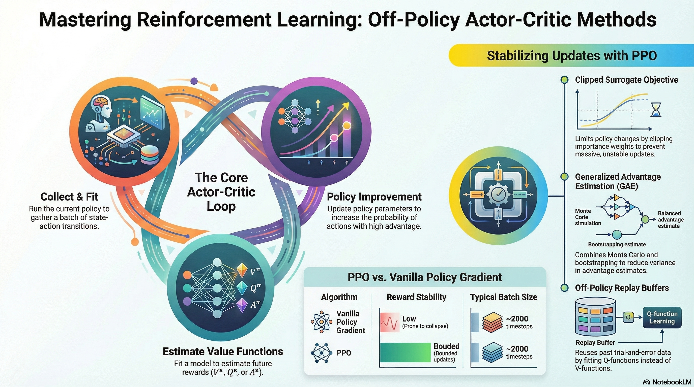
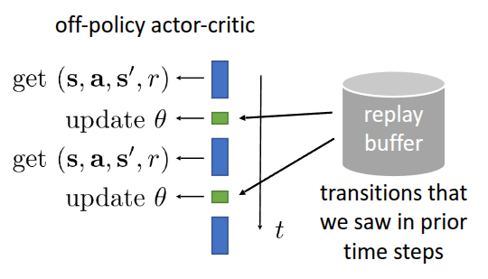

### Resource

::: {layout-ncol=2}
[](https://youtu.be/cRGKc-nAWho?si=udpcpFHWkk9JXe-B)

[](https://cs224r.stanford.edu/spring_2025/slides/05_cs224r_offpolicy_actor_critic_2025.pdf)
:::

## Lecture Summary with NotebookLM



## Recap for (On-Policy) Actor Critic Methods

In our previous discussion, we covered the fundamentals of Policy Gradient and introduced Actor-Critic methods, which involve training a policy by leveraging a model that estimates the value function. To recap the Policy Gradient formulation:

$$\nabla_{\theta}J(\theta) \approx \frac{1}{N} {\color{blue} \sum_{i=1}^N} \sum_{t=1}^T \nabla_{\theta} {\color{red} \log \pi_{\theta}(a_{i, t} \vert s_{i, t})} \Big( {\color{green} \Big( \sum_{t'=t}^T r(s_{i, t'}, a_{i, t'})\Big)} {\color{cyan} - b}\Big)
$$ {#eq-policy-gradient}

In @eq-policy-gradient, the ${\color{blue} \sum_{i=1}^N}$ term represents sampling from the policy. The ${\color{red} \log \pi_{\theta}(a_{i, t} \vert s_{i, t})}$ term follows the **policy likelihood**, increasing the probability of actions that lead to good trajectories while decreasing it for poor ones. To focus on future rewards, we used the concept of **reward-to-go** denoted by ${\color{green} \Big( \sum_{t'=t}^T r(s_{i, t'}, a_{i, t'})\Big)}$. Furthermore, we applied a **baseline** ${\color{cyan} b}$ to establish a criterion for "good" or "bad" outcomes. This defined a policy gradient algorithm that reinforces trajectories performing better than the baseline and suppresses those that perform worse.

To improve **sample efficiency**, we also explored **Off-policy** Policy Gradient, which utilizes data collected from a different policy. Since the data is sampled from a behavioral policy ($\pi_{\theta}$) different from the target policy ($\pi_{\theta'}$), we introduced **Importance Weighting** to account for the distribution mismatch. The final expression for Off-policy Policy Gradient is as follows:

$$
\nabla_{\theta}J(\theta) \approx \frac{1}{N} \sum_{i=1}^N \sum_{t=1}^T {\color{yellow} \frac{\pi_{\theta'}(a_{i, t} \vert s_{i, t})}{\pi_{\theta}(a_{i, t} \vert s_{i, t})}} \nabla_{\theta} \log \pi_{\theta'}(a_{i, t} \vert s_{i, t}) \Big( \Big( \sum_{t'=t}^T r(s_{i, t'}, a_{i, t'})\Big) - b \Big)
$$

Advancing from trajectory-level learning, we previously discussed **Actor-Critic methods**, where a neural network-based value function model estimates the expected return to assist in policy learning. The gradient for this method is defined as:

$$
\nabla_{\theta}J(\theta) \approx \frac{1}{N} {\color{blue} \sum_{i=1}^N} \sum_{t=1}^T \nabla_{\theta} \log_{\pi_{\theta}} (a_{i, t} \vert s_{i, t}) {\color{cyan} A^{\pi}(s_{i, t}, a_{i, t})}
$$ {#eq-actor-critic}

As shown in @eq-actor-critic, the structure involves collecting data (${\color{blue} \sum_{i=1}^N}$) and using an **Advantage function** (${\color{cyan} A^{\pi}(s_{i, t}, a_{i, t})}$) to determine how much better an action is compared to the average value. This setup functions as a **Critic** (evaluating actions) and an **Actor** (improving the policy). Regarding value function estimation, we touched upon **Monte Carlo Estimation**, which uses actual rewards, and **Bootstrapping Estimation**, which uses the current reward and the estimated value of the next state. We also noted that methods like **N-step Return** exist to mitigate the **Bias-Variance Tradeoff** inherent in these two approaches. Ultimately, the Advantage function can be expressed in terms of the Value function:

$$
A^{\pi}(s_t, a_t) \approx r(s_t, a_t) + V^{\pi}(s_{t+1}) - V^{\pi}(s_t)
$$

However, in the Actor-Critic methods described above, all terms refer to the same policy ($\pi_{\theta}$). This post will dive into **Off-Policy Actor-Critic Methods**, which, similar to **Off-policy Policy Gradient**, utilize data collected from a different policy $\pi_{\theta'}$.

## Off-Policy Actor-Critic Methods

The fundamental premise of off-policy learning remains the same: we sample data using the current policy, train the value function model on that data, and then apply **Importance Weights** when computing the gradients.

::: {.callout-note title="Importance Weight"}
In traditional Policy Gradient methods, data had to be discarded after a single update. This is because as soon as the policy $\pi$ is updated, the data distribution changes, and the existing data no longer represents the behavior of the new policy.

To overcome **sample inefficiency**—a significant challenge in reinforcement learning—we introduce the concept of Importance Weights. The idea is straightforward: we compensate for the distribution mismatch by calculating the **probability ratio** between the current policy ($\pi$) and the old policy ($\pi_{old}$) that originally collected the data.

$$
r_t(\theta) = \frac{\pi_{\theta}(a_t \vert s_t)}{\pi_{\theta_{old}}(a_t \vert s_t)}
$$

This ratio acts as a weight for each sample. If the value is greater than 1, it means the current policy prefers that specific action more than the old policy did, so we amplify its influence on the learning process. Conversely, if the value is less than 1, it indicates the current policy is less likely to take that action, so we reduce its weight. By multiplying by this probability ratio, we can theoretically reuse past data multiple times instead of discarding it, thereby significantly increasing learning efficiency. 

:::

### Multiple Gradient Step

The first approach introduced in the lecture, **Multiple Gradient Step**, focuses on repeating the process of computing gradients and updating parameters multiple times on the same batch of data.

```pseudocode
#| html-indent-size: "1.2em"
#| html-comment-delimiter: "//"
#| html-line-number: true
#| html-line-number-punc: ":"
#| html-no-end: false
#| pdf-placement: "htb!"
#| pdf-line-number: true
#| label: algo-Multiple-Gradient-Step

\begin{algorithm}
\caption{Version 1. Multiple Gradient Step}
\begin{algorithmic}
\State Sample batch of data $\{(s_{1, i}, a_{1, i}, \dots s_{T,i}, a_{T, i})\}$ from $\pi_{\theta}$
\State Fit $\hat{V}_{\phi}^{\pi_{\theta}}$ to summed rewards in data
\State Evaluate $\hat{A}^{\pi_{\theta}}(s_{t, i}, a_{t, i}) = r(s_{t, i}, a_{t, i}) + \gamma \hat{V}_{\phi}^{\pi_{\theta}}(s_{t+1, i}) - \hat{V}_{\phi}^{\pi_{\theta}}(s_{t, i})$, $\forall t, i$
\State Evaluate $\nabla_{\theta'} J(\theta') = \sum_{t, i} \frac{\pi_{\theta'} (a_{t, i} \vert s_{t, i})}{\pi_{\theta} (a_{t, i} \vert s_{t, i})} \nabla_{\theta'} \log \pi_{\theta'} (a_{t, i} \vert s_{t, i}) \hat{A}^{\pi_{\theta}}(s_{t, i}, a_{t, i})$
\State Update $\theta \leftarrow \theta + \alpha \nabla_{\theta} J(\theta)$
\State Repeat steps 4 and 5 for multiple iterations
\end{algorithmic}
\end{algorithm}
```

In practice, implementation using auto-differentiation frameworks like **PyTorch, TensorFlow**, or **JAX** requires a scalar objective function to differentiate. To derive the importance-weighted gradient shown in the algorithm, we define a **Surrogate Objective Function**. To understand how this works, we must first look at a common mathematical tool known as the **Log-Derivative Trick**.

::: {.callout-tip title="Log-Derivative Trick"}

$$
p_{\theta}(\tau) \nabla_{\theta} \log p_{\theta}(\tau) = \nabla_{\theta} p_{\theta}(\tau)
$$

:::

The function we ultimately want to obtain through differentiation is $\frac{\pi_{\theta'}}{\pi_{\theta_{old}}} \nabla \log \pi_{\theta'} A$. By setting aside variables unrelated to the update target $\theta'$, we are left with the core term $\pi_{\theta'} \nabla \log \pi_{\theta'}$. Applying the **Log-Derivative trick**, this part simplifies to $\nabla \pi_{\theta'}$. Consequently, we can define the surrogate objective function as follows:

$$\tilde{J}(\theta') \approx \sum_{t, i} \frac{\pi_{\theta'}(a_{t, i} \vert s_{i, t})}{\pi_{\theta} (a_{t, i} \vert s_{i, t})} \hat{A}^{\pi_{\theta}}(s_{i, t}, a_{i, t})
$$ {#eq-surrogate-objective-function}

While this is not the "true" objective function, it is termed a "surrogate" because using auto-differentiation frameworks like **PyTorch** or **JAX** on this function allows us to update the parameters in the desired direction.

However, a closer look at @eq-surrogate-objective-function reveals a potential issue. As seen in @algo-Multiple-Gradient-Step, repeatedly calculating the gradient and updating parameters using the importance weight can lead to a problematic incentive. Instead of steadily improving the policy, the optimization might simply maximize the difference between the new and old policies. This often results in training instability or the phenomenon known as **policy collapse**.

To address this, two primary ideas were presented in the lecture. The first is to use **Kullback-Leibler (KL) Divergence** as a constraint during policy training. The second is to impose a boundary on the importance weights. Both methods act as "safety rails" to prevent the policy from changing too drastically during iterative updates.

### KL Divergence as a Constraint

KL Divergence is a statistical measure of how much two probability distributions differ. In the context of reinforcement learning, it quantifies the change in behavior between the old policy ($\pi_{old}$) and the current policy being trained ($\pi_{\theta}$). 

Since the advantage function $\hat{A}$ in @eq-surrogate-objective-function was calculated based on the old policy $\pi_{old}$, it loses its validity if the current policy diverges too much from the old one. To prevent this, @schulman2015trust proposed keeping the update within a specific "trust region" by adding a penalty term to the surrogate objective:

$$
\tilde{J}_{Con} \approx \tilde{J}^{surr}(\theta') - \beta \cdot KL(\pi{\theta_{old}}(\cdot \vert s) \Vert \pi_{\theta}(\cdot \vert s))
$$

With this definition, if the policy changes too much across multiple gradient steps—causing the $KL$ value to rise—the overall objective value decreases. During **Gradient Ascent**, the optimizer will naturally seek a point that maximizes rewards while keeping the KL Divergence low. 

While $\beta$ is a hyperparameter that controls the strength of this penalty, finding an ideal fixed value can be difficult. Consequently, @schulman2017proximal introduced the concept of an **Adaptive KL Penalty**, which dynamically adjusts $\beta$ based on a target KL threshold. Interestingly, this approach of using KL constraints is currently a standard practice in **RLHF (Reinforcement Learning from Human Feedback)** to optimize LLM preferences.

The second idea is to set a boundary directly on the Importance Weight itself. This concept is a cornerstone of **Proximal Policy Optimization (PPO)**, as introduced in @schulman2017proximal.

### Proximal Policy Optimization (PPO)

The lecture highlights three specific "tricks" (or safeguards) introduced in @schulman2017proximal to refine the surrogate objective defined in @eq-surrogate-objective-function.

The first trick, as briefly mentioned earlier, is to impose a boundary on the importance weight:

$$
\tilde{J}(\theta') \approx \sum_{t, i} \text{clip} \big( \frac{\pi_{\theta'}(a_{t, i} \vert s_{t, i})}{\pi_{\theta} (a_{t, i} \vert s_{t, i})}, 1 - \epsilon, 1 + \epsilon \big) \hat{A}^{\pi_{\theta}}(s_{t, i}, a_{t, i})
$$

By **clipping** the ratio when it moves outside a specific range (typically $[1-\epsilon, 1+\epsilon]$), the algorithm removes the incentive for the policy to change drastically due to extreme importance weights during iterative updates. PPO using this clipped surrogate objective is formally known as **PPO-clip**, while the version using the adaptive KL penalty is called **PPO-KL**.

The second trick involves taking the minimum of the clipped objective and the unclipped objective:

$$
\tilde{J}(\theta') \approx \sum_{t, i} \min \Big( \frac{\pi_{\theta'}(a_{t, i} \vert s_{t, i})}{\pi_{\theta} (a_{t, i} \vert s_{t, i})}\hat{A}^{\pi_{\theta}}(s_{t, i}, a_{t, i}), \text{clip} \big( \frac{\pi_{\theta'}(a_{t, i} \vert s_{t, i})}{\pi_{\theta} (a_{t, i} \vert s_{t, i})}, 1 - \epsilon, 1 + \epsilon \big) \hat{A}^{\pi_{\theta}}(s_{t, i}, a_{t, i})\Big)
$$

This is often referred to as **Pessimistic Estimation**. It serves as an additional safety rail to prevent the overestimation of rewards, even with clipping in place. The professor noted that while this is a critical theoretical safeguard, the specific conditions it addresses are often "rare events" in actual practice.

Finally, the paper proposes **Generalized Advantage Estimation (GAE)** as a method to compute more stable advantage values.

In standard Actor-Critic setups, we train a separate model $\hat{V}^{\pi}$ to estimate the value function, typically using either Monte Carlo Estimation or Bootstrapping. We previously discussed the **Bias-Variance Tradeoff** that arises between these two approaches. GAE, as described in @schulman2017proximal, calculates advantage estimates across various horizons and takes a **weighted average** of these values to find the optimal balance between bias and variance.

First, the **1-step TD-error** with the discount factor $\gamma$ is defined as follows:

$$
\delta_t = r_t + \gamma \hat{V}_{\phi}^{\pi}(s_{t+1}) - \hat{V}_{\phi}^{\pi}(s_t)
$$

By introducing a hyperparameter $\lambda$, we estimate the advantage function by exponentially decaying the error terms as we look further into the future. This results in the following formulation:

$$
\hat{A}_{GAE}^{\pi} = \sum_{n=1}^{\infty} (\gamma \lambda)^{n-1} \delta_{t+n-1}
$$

While tuning $\lambda$ remains a challenge, GAE allows us to place more weight on information from the immediate future and less on the distant future. This effectively maintains a proper balance between bias and variance.

By combining the **Clipped Surrogate Objective** and **Generalized Advantage Estimation**, the final **PPO-clip** algorithm is summarized below:

```pseudocode
#| html-indent-size: "1.2em"
#| html-comment-delimiter: "//"
#| html-line-number: true
#| html-line-number-punc: ":"
#| html-no-end: false
#| pdf-placement: "htb!"
#| pdf-line-number: true
#| label: algo-PPO

\begin{algorithm}
\caption{Proximal Policy Optimization (PPO)}
\begin{algorithmic}
\State Sample batch of data $\{(s_{1, i}, a_{1, i}, \dots s_{T,i}, a_{T, i})\}$ from $\pi_{\theta}$
\State Fit $\hat{V}_{\phi}^{\pi_{\theta}}$ to summed rewards in data
\State Evaluate $\hat{A}_{GAE}^{\pi}(s_t, a_t) = \sum_{n=1}^{\infty} w_n ( \sum_{t'=t}^{t+n} \gamma^{t'-t} r(s_{t'}, a_{t'}) - \hat{V}_{\phi}^{\pi}(s_t) + \gamma^n \hat{V}_{\phi}^{\pi}(s_{t+n}))$
\State Update policy with $M$ gradient steps on surrogate objective: $\tilde(J)(\theta') \approx \sum_{t, i} \min \Big( \frac{\pi_{\theta'}(a_{t, i} \vert s_{t, i})}{\pi_{\theta} (a_{t, i} \vert s_{t, i})}\hat{A}_{GAE}^{\pi}(s_{t, i}, a_{t,i}),   \text{clip} \big( \frac{\pi_{\theta'}(a_{t, i} \vert s_{t, i})}{\pi_{\theta} (a_{t, i} \vert s_{t, i})}, 1 - \epsilon, 1 + \epsilon \big) \hat{A}_{GAE}^{\pi}(s_{t, i}, a_{t,i})\Big)$
\end{algorithmic}
\end{algorithm}
```

Although the formulation is somewhat complex, PPO is much simpler to implement than TRPO (@schulman2015trust). In practice, PPO has consistently demonstrated superior performance over both REINFORCE and TRPO, often achieving better results with significantly fewer iterations.

### Using Replay Buffer

To summarize the Actor-Critic methods we have explored so far, we first looked at **On-Policy Actor-Critic**, where data is sampled from the current policy and used for a single gradient update. We then moved on to **Off-Policy Actor-Critic**, which improves sample efficiency by performing multiple gradient updates on the same data.

Strictly speaking, however, the "Multiple Gradient Step" approach is only "partially" off-policy, as the distribution mismatch only occurs between the policy at the start of the update and the evolving policy during the steps. While **Importance Sampling** allows for more efficient data usage, we can further extend this efficiency by leveraging data collected not just by the current policy, but by various previous policies during their exploration. To achieve this, the lecture introduced the idea of integrating a **"replay buffer"** (a concept from reinforcement learning theory) into Actor-Critic methods and removing the on-policy assumptions to enable a fully off-policy formulation.

The Replay Buffer, also known as **"experience replay"** as introduced in @lin1992self, is a storage space for trajectories experienced by different policies during exploration. In an Off-Policy Actor-Critic framework, the core process involves training the value function and evaluating the advantage function using samples drawn from this buffer.

{#fig-replay-buffer}

@fig-replay-buffer illustrates the parameter update process in conjunction with a replay buffer. When storing experience, we save it in the form of a tuple containing the current state $s$, the action taken $a$, the received reward $r$, and the transitioned next state $s'$. During training, we sample these $(s, a, r, s')$ tuples to update $\theta$. This allows us to formulate the algorithm with an integrated replay buffer as follows:

```pseudocode
#| html-indent-size: "1.2em"
#| html-comment-delimiter: "//"
#| html-line-number: true
#| html-line-number-punc: ":"
#| html-no-end: false
#| pdf-placement: "htb!"
#| pdf-line-number: true
#| label: algo-Replay-Buffer

\begin{algorithm}
\caption{Actor-Critic Methods with Replay Buffer}
\begin{algorithmic}
\State Collect experience $\{(s_i, a_i)\}$ from $\pi_{\theta}$ (\& add to replay buffer)
\State Sample a batch $\{s_i, a_i, r_i, s_i'\}$ from replay buffer $\mathcal{R}$
\State Update $\hat{V}_{\phi}^{\pi}$ using targets ${\color{red} y_i = r_i + \gamma \hat{V}_{\phi}^{\pi}(s_i')}$ for each $s_i$
\State Evaluate $\hat{A}^{\pi}(s_i, a_i) = r(s_i, a_i) + \gamma \hat{V}_{\phi}^{\pi}(s_i') - \hat{V}_{\phi}^{\pi}(s_i)$
\State $\nabla_{\theta} J(\theta) \approx \frac{1}{N} \sum_i \frac{\pi_{\theta'} (a_{t, i} \vert s_{t, i})}{\pi_{\theta} (a_{t, i} \vert s_{t, i})} {\color{blue} \nabla_{\theta} \log \pi_{\theta}(a_i \vert s_i) \hat{A}^{\pi}(s_i, a_i)}$
\State $\theta \leftarrow \theta + \alpha \nabla_{\theta} J(\theta)$
\end{algorithmic}
\end{algorithm}
```

::: {.callout-warning title="Adding Importance Weights"} 
As you may notice in the original lecture slides, the importance weight—which accounts for the probability ratio between policies—is omitted from the algorithm when using data sampled from the replay buffer. One might assume this can be resolved simply by applying importance weighting as we did in Off-Policy Policy Gradient. It is likely that the lecture omitted this detail to focus on the conceptual pitfalls of naive implementation. However, to ensure technical accuracy and clarity within the context of this post, I have included the importance weights in the formulation below, departing slightly from the original lecture slides. 
:::

However, the lecture explores why simply storing past data in a buffer and training with it—as shown in Algorithm 3—leads to failure. This failure is examined from two critical perspectives.

The first issue lies in the target term highlighted in red: ${\color{red} y_i = r_i + \gamma \hat{V}_{\phi}^{\pi}(s_i')}$. By definition, the value function represents the **expected sum of future rewards when following the current policy** $\pi_{\theta}$.

However, the data drawn from the replay buffer—specifically the rewards $r$ and next states $s'$—were accumulated by past policies, not the current one. As a result, the value function fails to train correctly. The lecture identifies this as a **Value Function Mismatch**, describing the buffer data as a **"mixture of past policies"**.

The second problem occurs in the gradient update term highlighted in blue: ${\color{blue} \nabla_{\theta} \log \pi_{\theta}(a_i \vert s_i) \hat{A}^{\pi}(s_i, a_i)}$. Due to the nature of Actor-Critic methods, calculating the gradient requires either the advantage function for the current policy or the probability of taking a specific action ($\pi_{\theta}(a_i \vert s_i)$) under the current parameters.

The action $a$ used in this calculation is one that was performed by a past policy. If the current policy were in state $s$, it might choose an entirely different action. This discrepancy is known as an **Action Mismatch**.

Consequently, the state value function $V(s)$ alone is insufficient for learning from replay buffer data. To address this, the proposed solution is to utilize the **state-action value function** $Q(s, a)$ instead of $V(s)$.

Since the replay buffer stores data as $(s, a, r, s')$ tuples, $Q(s, a)$—which takes the action $a$ as an explicit input—allows the model to evaluate the past action $a$ independently of the current policy's preferences. This leads to the definition of the Q-function for the current policy, which serves as the foundation for the **Soft Actor-Critic (SAC)** algorithm.

$$
Q^{\pi_{\theta}}(s, a) = r(s, a) + \gamma \mathbb{E}_{s' \sim p(\cdot \vert s, a), \bar{a'} \sim \pi_{\theta}(\cdot \vert s')} [Q^{\pi_{\theta}}(s', \bar{a'})]
$$ {#eq-q-function-for-replay-buffer}

To calculate the exact Q-function in @eq-q-function-for-replay-buffer, the next action ($a'$) in the next state must also be derived from the current policy $\pi_{\theta}$. Because the actions already present in the replay buffer come from old policies, we cannot use them to compute the current $Q^{\pi}$. Instead, we approximate $Q^{\pi}(s, a)$ by inputting the next state $s'$ into the current policy $\pi_{\theta}$ to sample a new action $a'$. 

The overall process is as follows:

1.  **Sample** $(s_i, a_i, s_i')$ from the replay buffer.
2.  **Sample** a new action $\hat{a}_i' \sim \pi_{\theta}(\cdot, s_i')$ using the current policy $\pi_{\theta}$.

By following these steps, we can compute the Q-function effectively using off-policy data.

$$
Q^{\pi_{\theta}}(s_i, a_i) \approx r(s_i, a_i) + \gamma Q^{\pi_{\theta}}(s_i', a_i')
$$

Naturally, in Deep Reinforcement Learning (Deep RL)—where neural networks are used to approximate value functions—a separate training process is required to estimate the Q-function, using the equation mentioned above as the target. To train an accurate model, it is crucial that the replay buffer contains a diverse and rich set of state and action trajectories.

$$
\mathcal{L}(\phi) = \frac{1}{N} \sum_i \Vert \hat{Q}_{\phi}^{\pi}(s_i, a_i) - y_i \Vert^2
$$

The following is the revised algorithm designed to address the value function mismatch discussed earlier:

```pseudocode
#| html-indent-size: "1.2em"
#| html-comment-delimiter: "//"
#| html-line-number: true
#| html-line-number-punc: ":"
#| html-no-end: false
#| pdf-placement: "htb!"
#| pdf-line-number: true
#| label: algo-Replay-Buffer

\begin{algorithm}
\caption{Version 2: Fixing the value function mismatch}
\begin{algorithmic}
\State Collect experience $\{(s_i, a_i)\}$ from $\pi_{\theta}$ (\& add to replay buffer)
\State Sample a batch $\{s_i, a_i, r_i, s_i'\}$ from replay buffer $\mathcal{R}$
\State Update $\hat{Q}_{\phi}^{\pi}$ using targets ${\color{red} y_i = r_i + \gamma \hat{Q}_{\phi}^{\pi}(s_i', a_i')}$ 
\State Evaluate $\hat{A}^{\pi}(s_i, a_i) = r(s_i, a_i) + \gamma \hat{V}_{\phi}^{\pi}(s_i') - \hat{V}_{\phi}^{\pi}(s_i)$
\State $\nabla_{\theta} J(\theta) \approx \frac{1}{N} \sum_i {\color{blue} \nabla_{\theta} \log \pi_{\theta}(a_i \vert s_i) \hat{A}^{\pi}(s_i, a_i)}$
\State $\theta \leftarrow \theta + \alpha \nabla_{\theta} J(\theta)$
\end{algorithmic}
\end{algorithm}
```

It is crucial to note that $a_i'$ is sampled from the current policy $\pi_{\theta}$, not drawn from the replay buffer $\mathcal{R}$.

Regarding the second issue found in the term ${\color{blue} \nabla_{\theta} \log \pi_{\theta}(a_i \vert s_i) \hat{A}^{\pi}(s_i, a_i)}$, there are specific points of refinement to consider. Traditionally, calculating the advantage function $\hat{A}^{\pi}$ requires both the value function and the Q-function. However, since we have already transitioned from $V(s)$ to $Q(s, a)$ to fix the value mismatch, it is much more practical to replace the advantage term directly with $\hat{Q}^{\pi}$.

While using the Q-function directly may increase variance—as we are essentially removing the baseline—the ability to leverage the vast, diverse data collected by past policies in the replay buffer allows us to train a significantly more accurate Q-function.

Another key modification addresses the **Action Mismatch** caused by using actions sampled directly from the replay buffer for the policy update. This is resolved by instead using actions sampled from the current policy. The final refined algorithm incorporating these changes is represented in @algo-action-mismatch.

```pseudocode
#| html-indent-size: "1.2em"
#| html-comment-delimiter: "//"
#| html-line-number: true
#| html-line-number-punc: ":"
#| html-no-end: false
#| pdf-placement: "htb!"
#| pdf-line-number: true
#| label: algo-action-mismatch

\begin{algorithm}
\caption{Version 2: Fixing the action mismatch}
\begin{algorithmic}
\State Collect experience $\{(s_i, a_i)\}$ from $\pi_{\theta}$ (\& add to replay buffer)
\State Sample a batch $\{s_i, a_i, r_i, s_i'\}$ from replay buffer $\mathcal{R}$
\State Update $\hat{Q}_{\phi}^{\pi}$ using targets ${\color{red} y_i = r_i + \gamma \hat{Q}_{\phi}^{\pi}(s_i', a_i')}$ 
\State Evaluate $\hat{A}^{\pi}(s_i, a_i) = r(s_i, a_i) + \gamma \hat{V}_{\phi}^{\pi}(s_i') - \hat{V}_{\phi}^{\pi}(s_i)$
\State $\nabla_{\theta} J(\theta) \approx \frac{1}{N} \sum_i {\color{blue} \nabla_{\theta} \log \pi_{\theta}(a_i^{\pi} \vert s_i) \hat{Q}^{\pi}(s_i, a_i^{\pi})}$ where $a_i^{\pi} \sim \pi_\theta (a \vert s_i)$
\State $\theta \leftarrow \theta + \alpha \nabla_{\theta} J(\theta)$
\end{algorithmic}
\end{algorithm}
```

It is true that $s_i$ itself might be a state that the current policy has never experienced, which can still lead to potential issues. However, there is no practical way to handle states that haven't been visited yet, and the lecture explained that we simply have to accept this as an inherent part of the method.

This concludes the **(Fully) Off-Policy Actor-Critic Method**, an algorithm that trains a Q-function model based on data extracted from a replay buffer and uses it to update the policy. By incorporating several additional implementation details, this approach was formally introduced as the **Soft Actor-Critic (SAC)** algorithm (@haarnoja2018soft). The following section will briefly touch upon the specific implementation details introduced in that paper.

##  Soft Actor-Critic (SAC)

```pseudocode
#| html-indent-size: "1.2em"
#| html-comment-delimiter: "//"
#| html-line-number: true
#| html-line-number-punc: ":"
#| html-no-end: false
#| pdf-placement: "htb!"
#| pdf-line-number: true
#| label: algo-soft-actor-critic

\begin{algorithm}
\caption{Soft Actor-Critic}
\begin{algorithmic}
\State Collect experience $\{(s_i, a_i)\}$ from $\pi_{\theta}$ (\& add to replay buffer)
\State Sample a batch $\{s_i, a_i, r_i, s_i'\}$ from replay buffer $\mathcal{R}$
\State Update $\hat{Q}_{\phi}^{\pi}$ using targets $y_i = r_i + \gamma \hat{Q}_{\phi}^{\pi}(s_i', a_i')$ for each $s_i, a_i$
\State Evaluate $\hat{A}^{\pi}(s_i, a_i) = r(s_i, a_i) + \gamma \hat{V}_{\phi}^{\pi}(s_i') - \hat{V}_{\phi}^{\pi}(s_i)$
\State $\nabla_{\theta} J(\theta) \approx \frac{1}{N} \sum_i \nabla_{\theta} \log \pi_{\theta}(a_i^{\pi} \vert s_i) \hat{Q}^{\pi}(s_i, a_i^{\pi})$ where $a_i^{\pi} \sim \pi_\theta (a \vert s_i)$
\State $\theta \leftarrow \theta + \alpha \nabla_{\theta} J(\theta)$
\end{algorithmic}
\end{algorithm}
```

First, comparing this to @algo-action-mismatch, a term such as "for each $s_i, a_i$" is emphasized. Since the Q-function is a neural network that takes a state $s$ and an action $a$ as inputs to output a value, we must train it using the $s_i$ and $a_i$ from the sampled batch to ensure it accurately predicts the target $y_i$. This phrasing underscores the requirement to **use every sample in the batch from the buffer—using the past state ($s_i$) and action ($a_i$) as inputs—to predict the Q-value and update $\phi$ by comparing it with the target**.

Another critical technique introduced in the paper is the **Reparameterization Trick**. Normally, the output of a policy $\pi_{\theta}$ consists of statistical parameters. For instance, if we assume a Gaussian policy, we sample an action $a$ from a distribution with mean $\mu$ and variance $\sigma^2$. The problem is that this stochastic sampling process is non-differentiable, making it impossible to compute the gradients needed for backpropagation.

The Reparameterization Trick solves this by decoupling the deterministic parameters from the stochastic sampling process, effectively moving the randomness outside of the network. In simple terms:

$$
a = \mu_{\theta}(s) + \sigma_{\theta}(s) \cdot \epsilon
$$

As shown in the equation, the model only handles the $\mu_\theta$ and $\sigma_{\theta}$ components, while the randomness $\epsilon$ is provided as a separate input. This allows us to observe how $a$ changes as $\theta$ changes, thereby making the entire process differentiable.

While SAC includes additional contributions, such as an entropy term to encourage exploration, the lecture focused specifically on the elements relevant to Off-policy Actor-Critic methods. Because SAC can leverage the vast trajectories accumulated by past policies in a replay buffer, it offers significantly better sample efficiency than PPO. A striking example mentioned in the lecture demonstrated a robot learning to walk from scratch in just two hours (@haarnoja2018soft2). As noted, this **Fully Off-Policy** approach is a vital factor when applying reinforcement learning to real-world environments where sample efficiency is paramount.



Additionally, @luo2025precise demonstrated that using SAC achieved complex tasks faster and more accurately than Behavior Cloning (BC), even with limited training time.



In the study @tan2018sim, which introduced the concept of **Sim-to-Real**—transferring models trained in simulation to physical environments—PPO was utilized for its stability during the transfer process, despite being slightly less efficient, and it yielded significant results.



Furthermore, a well-known example is OpenAI's "Solving Rubik's Cube with a robot hand," which also used PPO to successfully transfer a robot hand trained in simulation to a real physical environment (@akkaya2019solving).



## Summary

In this post, we explored the process of modifying the Actor-Critic Method into an off-policy framework to improve sample efficiency, focusing on the resulting algorithms: **Proximal Policy Optimization (PPO)** and **Soft Actor-Critic (SAC)**. Due to the nature of off-policy learning, we initially attempted to apply the same Importance Weights used in Off-Policy Policy Gradient to leverage trajectories from past policies. However, we observed that repeated gradient steps could lead to unintended learning behaviors. To address this, we discussed KL constraints and clipping methods that guide the policy toward the goal without deviating too far from the previous policy—the fundamental principles of PPO.

Separately, we examined how the techniques introduced in @haarnoja2018soft can resolve the value function and action mismatches that occur when using data sampled from a replay buffer. This led to the derivation of SAC, a fully off-policy Actor-Critic algorithm using a replay buffer. Real-world examples demonstrated that SAC performs exceptionally well in environments where data efficiency is critical, while PPO remains a robust choice for scenarios requiring stable policy learning, such as Sim-to-Real transfer.