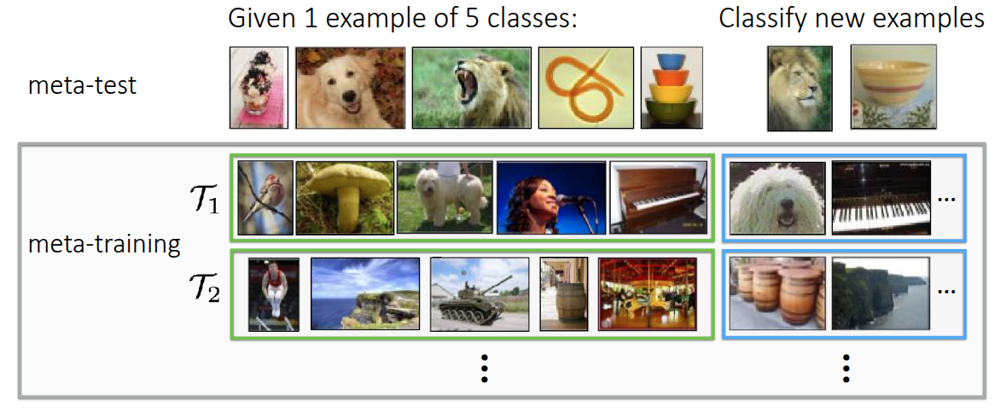
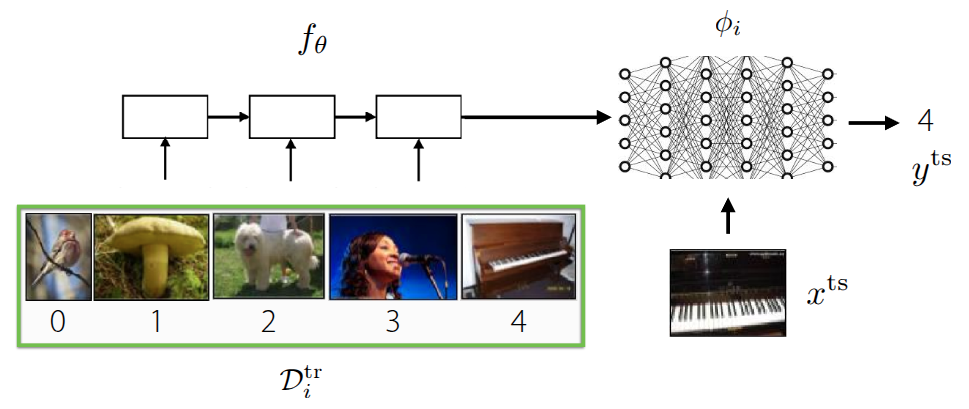
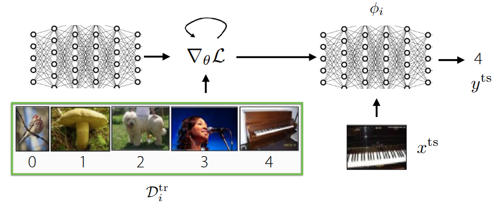
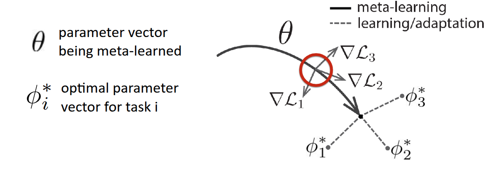
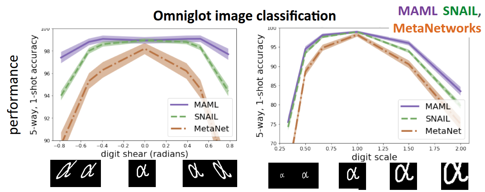

### 강의 및 자료

::: {layout-ncol=2}
[](https://www.youtube.com/watch?v=Gj5SEpFIv8I&list=PLoROMvodv4rNjRoawgt72BBNwL2V7doGI&index=5)

[](https://cs330.stanford.edu/materials/cs330_optbased_metalearning_2023.pdf)
:::

포스트에 소개되어 있는 자료는 강의 자료에서 따왔습니다.

## Lecture Summary with NotebookLM


## Problem Settings Recap

이전 강의부터 쭉 다루고 있는 내용은 여러 개의 task $\mathcal{T}_1, \dots, \mathcal{T}_T$ 에 대해서 한번에 푸는 **Multi-task Learning** 부터 시작해서, 어떤 source task $\mathcal{T}_a$ 에서 학습한 지식을 전이하는 방식으로 target task $\mathcal{T}_b$ 를 해결하는 **Transfer Learning**, 결과적으로 Transfer Learning의 source task를 여러개로 확장시켜, 새로운 task $\mathcal{T}_test$ 를 조금 더 빠르고, 정확하고, 안정적으로 해결하는 **Meta Learning** 방법론에 대해서 다뤘다.

{#fig-example-meta-learning}

Meta Learning에서 가장 흔하게 다루는 예시 중 하나인 이미지 분류 문제 (@fig-example-meta-learning) 도 소개했다. 해당 예시에서는 MiniImageNet이란 데이터셋에서 클래스당 1개의 이미지만 가지고 5개의 클래스를 분류하는 5-way, 1-shot image classification 문제를 해결하는 것이었고, 이를 해결하기 위한 내부 process로 **meta-training**과 **meta-test** 라는 과정을 소개했다. meta-test 단계에서 새로운 task로 주어질 이미지를 분류하기 위해서, meta-training 단계에서 주어진 동일한 문제 형태(5-way, 1-shot) 형태로 모델에게 학습시켜 모델이 이미지 자체에 대한 학습이 아닌, 이미지를 분류하는 방법 자체를 빠르게 학습시키는 것이 목적이 되겠다.



그래서 지난 강의에서 다룬 내용은 Meta Learning 기법 중 하나인 **Black-box Adaptation**, 즉 이렇게 Task를 학습하는 것 자체를 black-box 형태의 신경망 ($\phi_i$) 에게 주입해서 학습시키는 방식이었다. 그래서 meta-training시 사용되는 데이터셋 $\mathcal{D}_i^{tr}$ 에서 유의미한 context를 뽑던, 데이터셋 자체를 바로 넣어서 모델을 학습시키고 난 후, 실제로 새로운 이미지 ($x^{ts}$)가 주어졌을때, 이에 해당하는 label을 추론하는 방식으로 된다. 일반적인 문제 형태는 다음과 같이 정의된다.

$$
y^{ts} = f_{\text{black-box}}(\mathcal{D}^{tr}_i, x^{ts})
$$

이렇게 하면 별도의 장치없이 데이터셋의 정보만으로 어떤 Task인지 추론하고, 이에 대한 판단을 black-box 신경망이 하게 되므로 데이터셋의 형태에 따라 조금 더 표현적으로 대응할 수 있다. 하지만 기존에 학습되지 않은 새로운 유형(Out-of-Distribution)의 task가 나오면 데이터에 의존하는 특성상 성능이 급격히 떨어질 수 있고, 문제에 따라서 적용할 수 있는 최적화 기법의 종류나 hyperparameter 같은 최적화 문제가 남아있기는 하다. 그러면 여기서 던질 수 있는 질문은, **"최적화 문제도 Meta-learning안에 직접 포함시킬 수 있지 않을까?"** 이 내용이 이번 포스트에서 다룰 **Optimization-based Meta Learning** 의 핵심적인 내용이다. 



기존에 소개했던 black-box 방식과의 큰 차이라면, 이제는 meta-training 단계에서 주어진 데이터셋 $\mathcal{D}^{tr}$ 으로 학습하되, 이때 gradient update를 반복적으로 수행하면서, 학습에 이상적인 초기 meta parameter $\theta$ 를 찾는 것이 목표가 된다. 그러면 초기 meta parameter가 정해졌을 때, 주어진 새로운 데이터 $x^{ts}$ 를 활용하여 모델을 수정해주면 이상적인 모델을 만들 수 있을 것이다. 이전에도 이와 관련된 내용으로 **fine-tuning** 이란 개념을 다뤘었다.

## Fine-tuning

$$
\phi \leftarrow \theta - \alpha \nabla_{\theta} \mathcal{L}(\theta, \mathcal{D}^tr)
$$ {#eq-fine-tuning-meta-training}

**fine-tuning** 은 앞에서 다뤘던 것처럼 기존에 학습했던 모델의 parameter $\theta$ 가 주어진 상태에서 새로운 데이터가 주어졌을 때, 주어진 데이터셋에서의 반복적인 gradient update를 통해서 parameter $\phi$ 를 다시 찾는 과정이다. Meta Learning에서는 @eq-fine-tuning-meta-training 식처럼 학습 데이터셋 (Support Set)에 있는 구체적인 예시들을 보면서, 해당 task에 맞는 parameter $\phi$로 adaptation하는 과정을 수행하게 된다.

{#fig-ULMFit}

@fig-ULMFit 은 이전 Transfer Learning 강의에도 소개한 것처럼 @howard2018universal 에서 제안된 실험이었는데, 처음부터 학습하는 방식(파란색)에 비해서 상대적으로 주어진 데이터셋으로 fine-tuning 한 결과(초록색, 주황색)의 error rate가 확연히 낮게 나온다. Universal Language Model에서도 대량의 데이터셋을 활용하여 Pre-training을 수행한 후, 특정 task의 데이터의 데이터로 fine-tuning을 수행하면 성능을 개선할 수 있다는 부분이었는데, 교수는 이 부분에서 데이터양에 의한 한계도 같이 소개했다. 그래프에도 x축의 앞쪽, 즉 데이터의 양이 매우 적은 구간에서는 처음부터 학습하는 방식이나, fine-tuning하는 방식 모두 error rate가 높게 나온다. 이를 통해 단순히 사전학습된 parameter를 가져와서 재학습하는 것만으로는 데이터가 극도로 적은(Few-shot) 상황에서 최적의 성능을 내기 어렵다는 것을 설명했다. 궁극적으로 Meta Learning에서 목표로 하는 Few-shot 환경에서는 여전히 한계가 존재한다는 것이다.

## Optimization-Based Adaptation

그래서 교수는 본인의 논문 @finn2017model 을 통해서 fine-tuning을 Meta Learning에서 활용할 수 있는 방법에 대해서 소개했다. 크게 fine-tuning하는 inner-loop와 Meta Learning을 수행하는 outer loop 두 단계로 나눠서 진행이 된다. 먼저 주어진 초기 parameter $\theta$ 가 있다고 했을때, 특정 Task $\mathcal{T}_i$ 를 학습하면 $\theta$ 가 어떻게 변하는지를 시뮬레이션 단계가 inner-loop에서 수행된다.

$$
\phi_i \leftarrow \theta - \alpha \nabla_{\theta} \mathcal{L}(\theta, \mathcal{D}^{tr}_i)
$$

여기에서 구한 결과값인 $\phi_t$ 는 최종적인 모델의 parameter가 아니라, **만약 여기에서 학습하면 parameter가 이렇게 변할 것이다** 라는 임시 parameter이다. 실제로 이 값을 활용하여 최종 parameter를 update 하는 단계는 다음 단계인 outer-loop에서 수행된다.

$$
\min_{\theta} \sum_{\text{task } i} \mathcal{L}(\phi_i, \mathcal{D}^{ts}_i)
$$

outer-loop에서는 실질적으로 앞에서 도출한 parameter와 주어진 test 데이터셋 (query set)이 있을 때, 이에 대한 loss가 최소화되는 $\theta$ 를 찾는 objective function을 가지게 될 것이며, 역시 이 값을 찾기 위한 gradient descent를 수행하게 될 것이다.

$$
\theta \leftarrow \theta - \beta \sum_{\text{task } i} \mathcal{L}(\phi_i, \mathcal{D}^{ts}_i)
$$ {#eq-outer-loop-meta-learning}

이제 @eq-outer-loop-meta-learning 의 의미는 앞에서 구한 $\phi_i$ 를 바탕으로, 학습되지 않은 데이터 $\mathcal{D}^{ts}_i$ 를 맞춰봤을 때의 loss를 활용하여 궁극적인 모델 parameter를 업데이트하게 된다. 핵심 아이디어는 주어진 여러 개의 task에 대해서 fine-tuning을 통해서 transfer했을 때, 성능이 좋은 meta parameter $\theta$ 를 찾는 것이다. 교수는 이런 아이디어를 **Model-Agnostic Meta-Learning(MAML)** 이란 알고리즘으로 소개했다.

{#fig-MAML}

논문에도 소개되어 있는 @fig-MAML 그림을 보면 조금더 이해가 될텐데, 우선 $\theta$ 는 모델의 초기 parameter이고, 굵은 실선을 통해서 Meta Learning 이 이뤄지는 과정을 표현한 것이다. 만약 주어진 task가 3개가 있고, 각각의 loss function ($\mathcal{L}_1, \mathcal{L}_2, \mathcal{L}_3$) 가 있다고 가정했을 때, 각 loss 에 대한 gradient ($\nabla \mathcal{L}_1, \nabla \mathcal{L}_2, \nabla \mathcal{L}_3$)도 표현되어 있는 것처럼 다르게 나타날 것이다. MAML이 궁극적으로 추구하는 것은 3개의 task를 잘하는 각각의 optimal parameter $\phi_1*, \phi_2*, \phi_3*$ 를 찾는 것이 아니라, 몇번의 최적화 step으로도 각각의 optimal parameter에 빠르게 도달할 수 있는 $\theta*$ 를 찾는 것이다. 말 그대로 **fast-adaptation** 할 수 있는 지점을 찾는 과정이 표현된 것이다. 교수는 부가적으로 그림의 정의에 대해서 다시 설명했는데, $\theta*$ 를 찾는 과정 자체가 어떤 task에 대한 단일 optimal point를 찾는 것이 아니라, 다양한 task 에서 빠르게 대응할 수 있는 parameter space 를 찾는 것이라고 설명했다. 또한 그림 자체가 Task의 평균 gradient로 update되는 것처럼 보이지만, 실제로는 다양한 전략 등을 통해서 parameter가 update된다는 점도 부연적으로 언급했다.

이 알고리즘의 이름에 대해서 설명했는데, **Model-Agnostic** 이란 현재의 강의에서 다뤄지는 부분 중에서 RNN이나 Transformer같이 모델의 구조에 대해서 설명한 부분없이, 온전히 모델의 gradient를 통해서 update를 진행하고 있다는 점에서 나온 것이다. 즉, 모델의 구조와는 상관없이 해당 강의에서 설명하는 opimization 과정에만 초점이 맞춰져 있는 것이다.

부연적으로 MAML에 최적화된 모델 구조를 탐색하는 과정에 대한 논문 (@kim2018auto) 도 소개했는데, 해당 논문에서는 fast adaptation할 수 있는 초기 parameter를 찾는 MAML에 최적화된 구조를 찾을 수 있도록 Neural Architecture Search(NAS)이라는 AutoML 기반의 방식을 적용한 결과를 공유했다. MiniImageNet을 대상으로 기본적인 모델 구조에서의 MAML의 결과와 대비하여 NAS를 적용하여 찾은 최적화된 모델에서의 MAML을 수행하면 정확도가 대략 11%정도 상승하였는데, 흥미로운 부분은 일반적으로 딥러닝이 잘된다고 알려져있는 모델의 폭이 넓은 구조가 아니라, NAS를 통해서 찾은 모델은 폭이 좁고 깊은 (deep & narrow) 모델이 Meta Learning에 최적화된 모델이라는 것이다. 다시 말하면, 기존의 통념과는 다르지만, 강의에서 다루는 Meta Learning task에서는 상식과는 다른 구조가 오히려 adaptation에 유리하다는 점을 시사한 것이다.

지금까지 다룬 Optimization-Based Adaptation을 알고리즘으로 풀어쓰면 다음과 같다.

```pseudocode
#| html-indent-size: "1.2em"
#| html-comment-delimiter: "//"
#| html-line-number: true
#| html-line-number-punc: ":"
#| html-no-end: false
#| pdf-placement: "htb!"
#| pdf-line-number: true
#| label: algo-Optimization-Based-Adaptation

\begin{algorithm}
\caption{Optimization-Based Adaptation}
\begin{algorithmic}
\State Sample task $\mathcal{T}_i$ (or mini batch of tasks)
\State Sample disjoint datasets $\mathcal{D}^{tr}_i, \mathcal{D}^{ts}_i$ from $\mathcal{D}_i$
\State Optimize $\phi_i \leftarrow \theta - \alpha \nabla_{\theta} \mathcal{L}(\theta, \mathcal{D}^{tr}_i)$
\State Update $\theta$ using $\nabla_{\theta} \mathcal{L}(\phi_i, \mathcal{D}^{ts}_i)$ \end{algorithmic}
\end{algorithm}
```

### Using Hessian Matrix (or Approximation)

@algo-Optimization-Based-Adaptation 을 보면 알겠지만, 3번에서 $\theta$ 에 대한 gradient를 계산한 후, 4번에서 update를 위해서 gradient를 한번 더 수행하는 과정이 나온다. 즉, Optimization-Base Adaptation을 위해서는 $\theta$ 대한 2차 미분계수가 필요하다는 것이다. 만약 행렬 형태의 parameter의 2차 미분계수를 구하기 위해서는 결국 **Hessian Matrix** $H$ 를 구해야 된다. 사실 Hessian Matrix를 구하는데 있어서 complexity는 높은 편이지만, 흔히 사용되는 PyTorch나 JAX같은 딥러닝 프레임워크에서는 `torch.autograd.functional.hessian` 이나 `jax.hessian` 같은 함수를 통해서 효율적인 hessian matrix 계산이 가능하다.

우선 단순히 모든 Parameter에 대한 hessian matrix를 구하는 것도 있지만, 강의에서는 조금 더 효율적인 연산을 하기 위해서 **Hessian-Vector Product(HVP)** 라는 계산과정에 대해서 설명했다. 앞에서 설명한 것처럼 inner-loop에서 계산한 $\phi_i$ 를 outer-loop에서 gradient를 계산하면 2차 미분계수를 구해야 하고, 결과적으로 Hessian Matrix를 구해야 하지만, 궁극적으로 알고리즘에서 필요한 값은 전체 parameter에 대한 2차 미분계수가 아닌, Hessian $H$ 과 특정 벡터 $v$ 간의 곱인 $Hv$ 만 알면 된다고 설명했다. 이때 굳이 2차 미분계수를 구하지 않고, taylor expansion 같은 finite difference approximation을 활용하면 정확하진 않더라도 대략적인 $Hv$ 값을 구할 수 있다고 설명했다.

:::{.callout-note}
강의에서는 바로 taylor expansion을 통한 근사로 도출했지만, 왜 $Hv$ 만 계산하면 되는지에 대해서는 간단히 설명해서 해당 부분에 대한 수식을 조금 정리해본다. 우선 우리가 구하고자 하는 meta-gradient는 

$$
\nabla_{\theta} J(\theta) = \nabla_{\theta}\mathcal{L}(\phi_i, \mathcal{D}^{ts}_i)
$$

인데, $\phi_i$ 는 $\theta$ 에 종속된 변수이므로, 해당 값에 대한 미분값을 구하기 위해서는 chain rule을 사용해야 한다.

$$
\frac{d \mathcal{L}(\phi_i, \mathcal{D}^{ts}_i)}{d \theta} = \underbrace{\nabla_{\phi_i} \mathcal{L}(\phi_i, \mathcal{D}^{ts}_i)}_\textrm{(A) Outer Gradient} \times \underbrace{\frac{d \phi_i}{d \theta}}_\textrm{(B) Jacobian}
$$

그런데 사전의 $\mathcal{D}^{tr}_i$ 를 활용한 학습에서 구한 $\phi_i = \theta - \alpha \nabla_{\theta} \mathcal{L}(\theta, \mathcal{D}^{tr}_i)$ 였으므로, 이를 위 식에 대입해보면,

$$
\frac{d \phi_i}{d \theta} = I - \alpha \nabla^2_{\theta} \mathcal{L}(\theta, \mathcal{D}^{tr}_i)
$$

가 된다. 최종적으로 맨 앞의 수식에 위의 식을 대입하면 이렇게 된다.

$$
\nabla_{\theta} J(\theta) = \underbrace{\nabla_{\phi_i} \mathcal{L}(\phi_i, \mathcal{D}^{ts}_i)}_\textrm{test set gradient} \times \underbrace{I - \alpha \nabla^2_{\theta} \mathcal{L}(\theta, \mathcal{D}^{tr}_i)}_\textrm{with Hessian Matrix}
$$

이때 앞의 test set gradient는 row vector $v$ 로 나오기 때문에 결과적으로 $Hv$ 라는 형태로 나오게 된 것이다.

:::

우선 어떤 gradient function $g$ 가 있을 때, $x$ 에서 아주 작은 값 $\Delta x$ 만큼 $v$ 방향으로 이동한 지점의 값은 결과적으로 magnitude $r$ 과 방향 vector $v$ 의 곱으로 표현할 수 있으니까,

$$
\begin{aligned}
g(x + \Delta x) &\approxeq g(x) + H(x) \Delta x \\
g(x + rv) &\approxeq g(x) + r H(x) v \\
\end{aligned}
$$

이고, 우리가 구할 $Hv$ 는

$$
Hv \approx \frac{g(x + rv) - g(x)}{r}
$$

가 된다. 결과적으로 2차 미분계수를 굳이 구하지 않더라도, Gradient function만 구할 수 있다면 두번만 연산해서 $Hv$ 를 근사할 수 있게 된다. 교수는 경험적으로 봤을때 Few-shot Learning시 gradient step이 많이 필요하지 않았고, 조금더 Advanced한 meta learning 알고리즘에서 수백 step gradient step을 활용하긴 하지만, inner-loop상에서 gradient step을 많이 수행하는건 그렇게 좋지 못했다고 언급했다. 앞에서 소개한 PyTorch나 Tensorflow에선 이런 근사방법이 아닌 정확한(Exact) HVP를 구할 수 있기 때문에, 근사방법에 대해서는 원리를 이해하는 정도로만 알아두면 된다고 언급했다. 

:::{.callout-note}

이렇게 Hessian Matrix 계산을 생략하고 1차 미분계수(Gradient)만 활용하는 방식을 **First-Order MAML (FOMAML)**이라고 하며, 이는 교수의 MAML 논문(@finn2017model) 에서 제안되었다. 이후 @nichol2018first 은 이와 유사한 개념을 바탕으로, 내부 루프(Inner loop)를 수행한 후 그 방향으로 초기 파라미터를 조금씩 이동시키는 **Reptile**이라는 더 단순화된 알고리즘을 소개했다.

:::

## Optimization vs. Black-Box Adaptation

이전 강의에서 설명한 Black-Box Adaptation과 Optimization-Based Adaptation은 입력과 출력의 형태는 동일하지만, **학습데이터를 처리하는 내부 메커니즘** 에서 차이가 있다. 

- Black-Box Adaptation ($y^{ts} = f_{black-box}(\mathcal{D}^{tr}_i, x^{ts})$) : 학습 데이터 $\mathcal{D}^{tr}$ 과 테스트 입력 $x^{ts}$ 을 RNN이나 Transformer같은 거대한 신경망에 통째로 집어넣는다. 그래서 black-box 신경망 내부의 연산을 통해서 $\mathcal{D}^{tr}$ 의 패턴을 파악하고 결과를 출력하는 형태로 이뤄진다.
- Optimization-Based Adaptation - MAML ($y^{ts} = f_{MAML}(\mathcal{D}^{tr}_i, x^{ts}) = f_{\phi_i}(x^{ts})$) : 학습 데이터 $\mathcal{D}^{tr}$ 를 사용해 parameter를 fine-tuning한 후, 그 업데이트된 parameter로 결과를 출력한다. 강의에서 소개한 MAML에서는 computation graph 내부에서 gradient를 계산하는 연산자가 명시적으로 표현되어 있다.

사실 명시적으로 두 형태를 구분했지만, computation graph 관점에서 바라보면 각각의 특징을 살리는(Mix & Match) 새로운 알고리즘도 생각해볼 수 있었던 부분도 강의에서 소개했다. 예를 들어서 단순히 Gradient Descent를 사용하지 않고, parameter를 어떻게 업데이트할지 결정하는 신경망을 넣어서, update 규칙 자체를 학습하게 하는 방식 ($\phi_i = \theta - \alpha f(\theta, \mathcal{D}^{tr}_i, \nabla_{\theta}\mathcal{L})$) 도 MAML의 후속 논문으로 나왔다. (@ravi2017optimization) 이 computation graph로 바라보는 관점은 후의 강의에서 자세하게 다루는 것으로 정리했다.

{#fig-omniglot}

@fig-omniglot 은 @Finn:EECS-2018-105 에서 진행한 실험으로, 이전에 소개했던 Omniglot Dataset에 대한 Classfication 문제를 MAML과 Black-Box Method인 SNAIL(@mishra2017simple), MetaNetworks(@pmlr-v70-munkhdalai17a) 로 풀었을 때 성능을 비교한 것이다. 기본적인 모델 학습 과정은 동일하게 주어진 데이터셋으로 Meta-training을 수행하되, Meta-test에서는 변형(Warping)을 가한 test image을 입력으로 넣고, 모델이 얼마나 잘 적응하는지에 대해서 평가했다. 그래프의 x축은 주어진 test image에 대한 찌그러진 정도를 나타낸 것으로, 가운데 있을수록 원본의 이미지처럼 되는 것이고, 가장자리에 갈수록 옆으로 많이 찌그러진(Sheering) 형태로 데이터가 주어진다. 그래서 주어진 Task는 Sheering 정도에 따른 image classification의 정확도, 또다른 Task는 image의 scale에 따른 정확도를 구분하는 문제로 분류했다.

먼저 중심부에 분포한 데이터, 즉 변형되지 않은 이미지에 대해서는 MAML이나 기타 Black-Box Method 모두 정확도가 높게 나왔지만, 가장자리에 있는 변형을 가한 이미지, 다시 말해 학습되지 않은 분포에서는 Black-box Adaptation에 비해서 MAML 방식이 조금더 robust한 성능을 보여주는 것을 확인할 수 있었다. 이런 경향은 Scale 차이를 둔 두번째 task에서도 비슷한 현상이 나타났다. 강의에서는 이런 결과를 바탕으로 Extrapolation 성능에 있어서 두 접근 방법의 차이가 있음을 설명했다.

먼저 Black-Box Adaptation의 경우는 모델 자체가 black-box 신경망을 통해서 데이터를 처리하는 규칙 자체를 학습한 것은 맞지만, 학습 데이터의 분포에 의존적이며, 만약 기존에 보지 못한 데이터(Out-of-Distribution) 가 들어오면 extrapolation 을 제대로 수행하지 못한다. 하지만 MAML의 경우는 test 시점에서도 gradient descent를 통한 fine-tuning을 수행하기 때문에 데이터가 변형이 가해져있다 하더라도, Support Set을 보고 계산한 Gradient에 따라 parameter를 수정하게 된다. 이로 인해서 MAML이 Distribution Shift이 발생하는 상황에서도 훨씬 더 robust하게 동작하는 것을 보여줬다. (물론 교수는 Black-box Method들도 MAML처럼 성능을 더 개선할 수 있는 여지가 있음을 언급했다.)

비교에 대한 마지막 주제로 구조에 따른 장단점에 대해서 소개했다. 여기에서 말하는 **구조**란 Meta Learning의 대상 모델이 최적화 과정을 내부에 포함되어 있는지 여부에 따른 것을 말한다. Black-Box Adaptation에서 사용되는 모델은 앞에서도 RNN이나 Transformer를 들기도 했지만, 내부 구조에 최적화 과정이 포함되어 있지 않기 때문에 어떤 형태의 학습 알고리즘이나 모델을 쓰던간에 높은 표현력을 가진다. 반면 MAML 구조의 경우는 기본식에도 전제가 깔려있는 것처럼 gradient descent가 반드시 필요하다는 제약(Inductive Bias)이 있다. 이로 인해서 Gradient Descent를 사용하지 않는 알고리즘의 사용이라던가 데이터 자체가 가지는 표현력을 다 표현하지 못하는지에 따른 의문을 가질 수 있다.

교수가 저자로 참여했던 @finn2017meta 에서 관련 의문에 대해서 탐구했는데, 해당 논문에 따르면 몇가지 조건(meta learning rate $\alpha$ 를 0이 아닌 값을 가진다던가, loss fuction에 대한 Gradient를 구하는 과정에서 label에 대한 정보를 잃지 않고, 학습 데이터셋 $\mathcal{D}^{tr}_i$ 에서의 각 datapoint가 unique하다는 조건)을 만족한다면 어떠한 형태의 $\mathcal{D}^{tr}_i, x^{ts}$ 를 근사할 수 있다는 내용을 다뤘다. 이를 통해서 제약처럼 느껴질 수 있는 부분에 있어서도 일반화 측면에서 강조을 가진다는 점을 부각했다.

## Challenges

여타 접근 방법들도 그러하듯이 Optimization-Based Adaptation에도 적용시 겪게될 도전과제와 이를 극복하기 위한 설루션이 많이 연구되고 있다. 크게 두가지로 구분했는데, 첫번째 과제는 **최적화 과정을 두번 수행하면서(Bi-level optimization)** 겪게되는 학습의 불안정성 측면이고, 또다른 측면은 앞에서 언급한 것처럼 여러번의 gradient step을 밟으면서 발생하는 연산비용과 관련된 문제이다.

### Instability

많이 나왔던 내용이지만, 최적화 과정 내에 또 다른 최적화 과정이 포함된 Bi-level optimization형태로 되어 있어서 학습시 불안정성을 야기할 수 있다. 이를 극복하기 위해 공유되었던 연구 내용에는 @li2017meta 에서 소개한 **Meta-SGD** 나 @behl2019alpha 에서 소개한 **AlphaMAML** 에서처럼 innerloop에서 사용하는 (meta) learning rate $\alpha$ 자체를 Meta Learning으로 학습한다는 개념이다. 그래서 여러개의 parameter를 두고 각각 다른 $\alpha$ 로 학습시키게 되면 실제로 outer-loop 수행시 optimization이 안정적으로 수행된다는 내용을 다룬 것이다.

@zhou2018deep 와 @zintgraf2019fast 에서는 실제 meta learning에서 다루게되는 parameter 중에서 어떠한 조건에 해당되는 parameter만 학습시키는 형태를 취했다. 이를 통해서 optimization에 대한 난이도를 낮추는 내용을 언급했다. 여기에서 조건이라는 건 일반적인 transfer learning처럼 마지막 layer의 parameter만 뽑는다던지, 특정 부분집합의 parameter만 선별해서 학습시키는 방법을 뜻한다.

**MAML++** 라는 이름으로 소개된 방법 (@antoniou2018train) 은 기존 MAML에서 inner-loop가 수행되는 동안 내부에서 진행된 Batch Normalization에 대한 평균이나 분산같은 통계치를 처리하기가 어려운 부분을 해소하기 위해서 inner-loop의 각 step마다 별도의 batch normalization statistics를 사용할 수 있도록 분리(decouple)하는 방법을 적용했다. 이를 통해서 step간의 통계치가 섞여서 발생하는 불안정성을 완화시키려 노력했다. 또한 고정된 learning rate 대신 layer별로 별도의 learning rate를 사용하거나, parameter별로 다른 learning rate를 가질 수 있도록 meta learning을 적용해, 학습단계에 따라 세밀한 적용이 가능하도록 했다.

마지막에 소개된 방법은 별도의 Context Variable을 입력으로 받도록 하여 표현력을 개선하는 측면에서 진행된 연구였다. 이전에 소개했던 Multi-task Learning에서 소개된 Task Descriptor $z_i$ 개념이 적용된 아이디어인데, MAML도 학습되지 않은 새로운 Task가 주어졌을때, 주어진 parameter를 모두 update 하면서 발생하는 불안정성 문제를 해결하기 위해서 기존의 parameter $\theta$ 외에 task의 정보를 담을 수 있는 추가적인 context vector를 추가한 것이다. 그래서 내부 inner-loop에서 이 변수를 update하도록 하여, 모델이 task에 맞게 bias를 조정할 수 있도록 도와주는 역할을 한다. 조금전에 소개한 CAVIA ( @zintgraf2019fast) 란 방법에서도 비슷하게 context variable을 활용한 케이스인데, 잠깐 언급했던 특정 조건에 해당하는 부분이 바로 이 context parameter 라는 것이었다. 그래서 inner-loop수행시 전체 모델의 parameter가 아닌, context parameter만 따로 떼서 학습시키는 방식이 되겠다. 이렇게 하면 inner-loop에서 학습시킬 parameter 의 수는 확 줄어들면서, 전체 모델을 업데이트하지 않기 때문에 조금더 안정적으로 학습을 수행할 수 있다.

결과적으로 앞에서 소개한 방법들 모두 Optimization을 여러번 하는데 있어서 발생할 수 있는 불안정성을 몇가지 trick을 통해서 해소하는게 핵심적인 요소라고 할 수 있겠다.

### Computation & Memory-intesive cost

MAML에서는 inner-loop의 최적화 경로에 따라 backpropagation을 수행하기 때문에, step이 많아질수록 memory 사용량이나 computation cost가 급증한다. 이를 해소하기 위한 방법에 대한 논문도 소개했다.

첫번째 아이디어는 앞에서 소개한 Hessian Matrix를 구하는 단계를 근사화하는 것이다. 사실 이부분에 대해서 교수의 일화에 대해서도 공유를 해줬는데, 그당시 교수가 MAML 구조를 구현할 때 사용했던 tensorflow에서 bug가 존재하여, 원래 계산되어야 했던 $\frac{d \phi_i}{d \theta}$ 가 identity matrix $I$ 로 근사화가 되는 현상이 있었다. 

:::{.callout-note}

[코드](https://github.com/cbfinn/maml/blob/a7f45f1bcd7457fe97b227a21e89b8a82cc5fa49/special_grads.py#L6) 를 보면, tensorflow에서 구현되어 있지 않은 hessian matrix 를 구하기 위해, 별도의 ops를 정의한 것으로 보인다.

:::

놀랍게도 앞에서 구한 것과 같이 1차 미분계수로 근사화한 hessian matrix를 사용해도 간단한 simple few-shot learning 문제에서 잘 동작한다는 것을 확인했고, 이를 앞에서 소개한 것처럼 @finn2017model 에서 First-order MAML 이란 내용으로 언급했다. 물론 복잡한 task에서는 잘 동작하지 않았지만, 관련 내용으로 이러진 Reptile (@nichol2018first) 에서는 inner-loop를 여러번 수행한 후의 시작점 $\theta$ 와 도착점 $\phi$ 의 벡터 차이의 방향으로 초기 parameter를 이동시키는 알고리즘으로 발전시켜 일반화 성능을 보여주었다.

학습의 불안정성을 해소하는 방법으로 소개되었던 마지막 layer (Head)의 parameter만 최적화하는 부분도 관점에 따라서는 연산량 절감에서도 확인할 수 있다. @bertinetto2018meta 에서 소개된 **R2-D2** 란 방법에서는 feature를 추출하는 방법은 outer-loop를 통해서 미리 학습하고, 새로운 Task가 오면 Feature를 활용하여 빠르게 적용하는 방식을 사용했다. 이 논문에서 독창적인 부분은 기존의 최적화과정에서 반복적인 gradient descent를 통해 최적값을 찾는 과정을 Ridge Regression과 같은 closed-form solution 을 구하는 방법으로 대체한 것이앋. 이를 통해서 반복문을 통해서 여러 step을 밟을 필요없이, 행렬연산 한번으로 task에 적절한 parameter $\phi_i*$ 를 계산할 수 있다.

**MetaOptNet** 이란 방법이 소개된 @lee2019meta 논문에서도 비슷하게 마지막 layer에 대해서 parameter를 update하는 것인데, 이 논문에서는 최적값을 찾는 방법으로 **Support Vector Machine (SVM)**을 사용했다. SVM도 기본 전제는 Convex Optimization을 통해서 Global Optimum을 찾는 알고리즘으로써, 다른 최적화 알고리즘 (QP Solver) 같은 것을 활용하면 Ridge Regression처럼 closed-form solution 형태로 값을 찾을 수 있다. **R2-D2**와 **MetaOptNet** 모두 딥러닝의 표현력과 전통적인 머신러닝의 효율성을 결합한 하이브리드 접근 방식으로 보면 좋을것 같다. 

마지막으로 소개된 **Implicit MAML(iMAML)** 이란 방법(@rajeswaran2019meta) 도 computation cost를 줄이기 위해서 [**Implicit Function Theorem**](https://en.wikipedia.org/wiki/Implicit_function_theorem)이란 수학적 정리를 활용하여 수학적으로 초기 parameter에 대한 meta gradient를 정확하게 계산하는 방식을 택했다. 이를 통해서 inner-loop 수행시 급격하게 발생하는 memory 사용량을 일정하게 유지하고, 이를 통해서 gradient step을 수백 step까지 확장해서 계산할 수 있게 했다. 


## Case Study - Meta-Learning for Few-Shot Land Cover Classification

TBD

## Summary

TBD