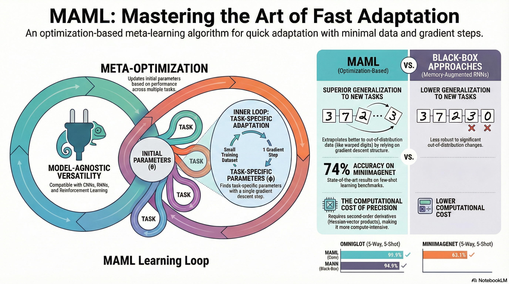
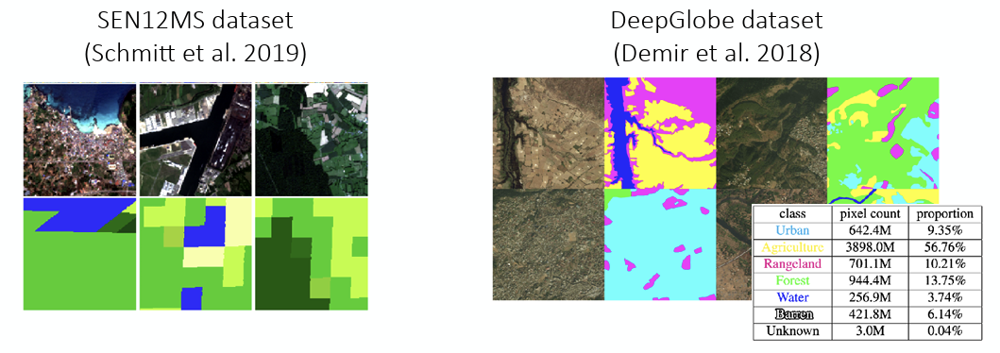
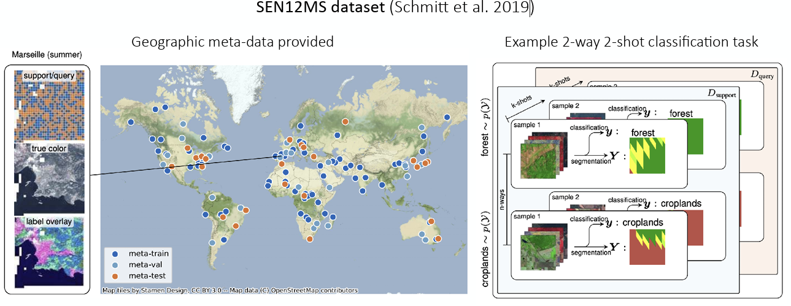
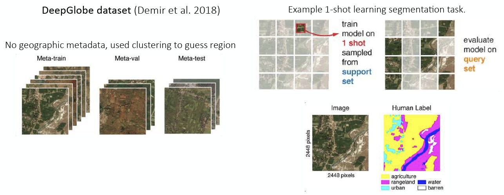
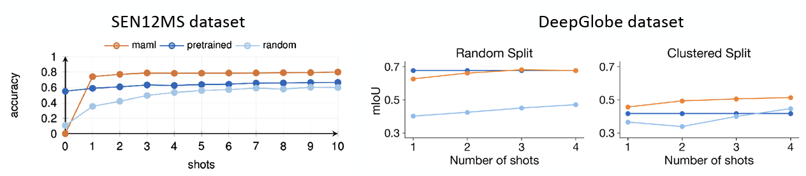

### Resource

::: {layout-ncol=2}
[](https://www.youtube.com/watch?v=Gj5SEpFIv8I&list=PLoROMvodv4rNjRoawgt72BBNwL2V7doGI&index=5)

[](https://cs330.stanford.edu/materials/cs330_optbased_metalearning_2023.pdf)
:::

## Lecture Summary with NotebookLM



## Problem Settings Recap

In previous lectures, we have covered a progression of methodologies: starting with **Multi-task Learning**, which solves multiple tasks $\mathcal{T}_1, \dots, \mathcal{T}_T$ simultaneously; moving to **Transfer Learning**, where knowledge learned from a source task $\mathcal{T}_a$ is transferred to solve a target task $\mathcal{T}_b$; and finally arriving at **Meta Learning**, which extends the source tasks to multiple instances to solve a new task $\mathcal{T}_{test}$ more quickly, accurately, and stably.

{#fig-example-meta-learning}

We also introduced a classic example in Meta Learning: the image classification problem (@fig-example-meta-learning). This example involved solving a 5-way, 1-shot image classification problem using the MiniImageNet dataset, where we classify 5 classes using only 1 image per class. To address this, we introduced the internal processes of **meta-training** and **meta-test**. The goal is to train the model during the meta-training phase using the same problem format (5-way, 1-shot) that it will encounter in the meta-test phase. This ensures the model learns how to classify images quickly, rather than just learning the specific images themselves.

In the previous lecture, we discussed **Black-box Adaptation**, a Meta Learning technique where the process of learning a task is embedded into a black-box neural network ($\phi_i$). This approach involves either extracting meaningful context from the meta-training dataset $\mathcal{D}_i^{tr}$ or feeding the dataset directly into the model. Once processed, the model infers the label for a new query image ($x^{ts}$). The general problem formulation is defined as follows:

$$
y^{ts} = f_{\text{black-box}}(\mathcal{D}^{tr}_i, x^{ts})
$$

This allows the black-box neural network to infer the task identity and make decisions solely based on the dataset information without requiring separate mechanisms, enabling a more expressive response tailored to the structure of the dataset. However, performance can degrade significantly when encountering Out-of-Distribution (OOD) tasks due to the heavy reliance on data. Additionally, challenges remain regarding optimization, such as selecting appropriate optimization techniques or hyperparameters depending on the specific problem. This leads us to the question: **"Can we explicitly incorporate the optimization process into Meta-learning?"** This is the core concept of **Optimization-based Meta Learning**, which we will cover in this post.


The major difference from the previously introduced black-box approach is that while we still learn from the dataset $\mathcal{D}^{tr}$ during meta-training, the goal is now to find an ideal set of initial meta-parameters $\theta$ by performing iterative gradient updates. Once these initial meta-parameters are established, we can fine-tune the model using new data $x^{ts}$ to achieve an optimal model. We have previously discussed the related concept of **fine-tuning**.

## Fine-tuning

$$
\phi \leftarrow \theta - \alpha \nabla_{\theta} \mathcal{L}(\theta, \mathcal{D}^{tr})
$$ {#eq-fine-tuning-meta-training}

**Fine-tuning** is a process we have previously discussed, where we find a new parameter $\phi$ through repeated gradient updates on a given dataset, starting from a pre-trained model parameter $\theta$. In Meta Learning, this process involves adapting to the specific task using the parameter $\phi$, as shown in @eq-fine-tuning-meta-training, by learning from the examples in the training dataset (Support Set).

{#fig-ULMFit}

@fig-ULMFit, introduced in the previous Transfer Learning lecture, shows an experiment proposed by @howard2018universal. It demonstrates that the error rate for fine-tuning with a given dataset (green, orange) is significantly lower compared to training from scratch (blue). The Universal Language Model also showed that pre-training on a large dataset and then fine-tuning on a specific task's data can improve performance. However, the professor also highlighted the limitations related to the amount of data. As seen in the graph, both training from scratch and fine-tuning exhibit high error rates in the region with very little data (towards the left of the x-axis). This illustrates that simply retraining from pre-trained parameters is not sufficient to achieve optimal performance in extremely data-scarce (Few-shot) scenarios. Ultimately, this suggests that limitations still exist in the Few-shot environments targeted by Meta Learning.

## Optimization-Based Adaptation

Consequently, the professor introduced a method to utilize fine-tuning within Meta Learning frameworks through her paper, @finn2017model. The process is broadly divided into two stages: an **inner-loop** that performs fine-tuning, and an outer-loop that executes Meta Learning. First, given an initial parameter $\theta$, the inner-loop acts as a simulation step to determine how $\theta$ changes when trained on a specific Task $\mathcal{T}_i$.

$$
\phi_i \leftarrow \theta - \alpha \nabla_{\theta} \mathcal{L}(\theta, \mathcal{D}^{tr}_i)
$$

The resulting value $\phi_i$ obtained here is not the final model parameter, but rather a temporary parameter representing **"how the parameter would change if trained on this task"**. The actual step of updating the final parameter using this value takes place in the subsequent stage, the **outer-loop**.

$$
\min_{\theta} \sum_{\text{task } i} \mathcal{L}(\phi_i, \mathcal{D}^{ts}_i)
$$

In the outer-loop, the objective function aims to find $\theta$ that minimizes the loss given the previously derived parameters and the test dataset (query set). Consequently, gradient descent is performed to find this optimal value.

$$
\theta \leftarrow \theta - \beta \nabla_{\theta} \sum_{\text{task } i} \mathcal{L}(\phi_i, \mathcal{D}^{ts}_i)
$$ {#eq-outer-loop-meta-learning}

The implication of @eq-outer-loop-meta-learning is that the ultimate model parameters are updated using the loss calculated from the unseen data $\mathcal{D}^{ts}_i$, based on the $\phi_i$ derived earlier. The core idea is to find a meta-parameter $\theta$ that yields high performance when transferred via fine-tuning across multiple given tasks. The professor introduced this concept as the **Model-Agnostic Meta-Learning (MAML)** algorithm. 

{#fig-MAML}

Referring to @fig-MAML, which is also presented in the paper, helps clarify the concept. Here, $\theta$ represents the model's initial parameters, and the thick solid line illustrates the Meta Learning process. Assuming there are three tasks, each with its own loss function ($\mathcal{L}_1, \mathcal{L}_2, \mathcal{L}_3$), the gradients for these losses ($\nabla \mathcal{L}_1, \nabla \mathcal{L}_2, \nabla \mathcal{L}_3$) will differ, as depicted. The ultimate goal of MAML is not to find the individual optimal parameters $\phi_1^*, \phi_2^*, \phi_3^*$ for each of the three tasks, but rather to find a $\theta^*$ that can rapidly reach each of these optimal parameters within a few optimization steps. In essence, it illustrates the process of finding a starting point that enables **fast-adaptation**. The professor further clarified the diagram's definition, explaining that finding $\theta^*$ is not about locating a single optimal point for a specific task, but rather identifying a parameter space capable of rapid adaptation across diverse tasks. She also noted that while the diagram might suggest updates based on the average gradient of tasks, in reality, parameters are updated using various strategies.

Regarding the algorithm's name, **Model-Agnostic** stems from the fact that the update process relies entirely on the model's gradients, without being tied to specific model architectures like RNNs or Transformers, which were not the focus of this lecture section. In other words, the focus is placed solely on the optimization process described in the lecture, independent of the model architecture.

Additionally, she introduced a paper (@kim2018auto) that explores searching for model architectures optimized for MAML. This research shared results from applying Neural Architecture Search (NAS), an AutoML-based method, to find structures optimized for MAML that facilitate fast adaptation. When comparing MAML results on MiniImageNet using basic model structures versus those optimized via NAS, accuracy improved by approximately 11%. An interesting finding was that, contrary to the general belief in deep learning that wide model structures perform better, the models identified by NAS as optimized for Meta Learning were **deep & narrow**. In other words, this suggests that for the Meta Learning tasks discussed in the lecture, structures that differ from conventional wisdom may actually be more advantageous for adaptation.

The Optimization-Based Adaptation discussed so far can be formalized as an algorithm as follows.

```pseudocode
#| html-indent-size: "1.2em"
#| html-comment-delimiter: "//"
#| html-line-number: true
#| html-line-number-punc: ":"
#| html-no-end: false
#| pdf-placement: "htb!"
#| pdf-line-number: true
#| label: algo-Optimization-Based-Adaptation

\begin{algorithm}
\caption{Optimization-Based Adaptation}
\begin{algorithmic}
\State Sample task $\mathcal{T}_i$ (or mini batch of tasks)
\State Sample disjoint datasets $\mathcal{D}^{tr}_i, \mathcal{D}^{ts}_i$ from $\mathcal{D}_i$
\State Optimize $\phi_i \leftarrow \theta - \alpha \nabla_{\theta} \mathcal{L}(\theta, \mathcal{D}^{tr}_i)$
\State Update $\theta$ using $\nabla_{\theta} \mathcal{L}(\phi_i, \mathcal{D}^{ts}_i)$ \end{algorithmic}
\end{algorithm}
```

### Using Hessian Matrix (or Approximation)

As shown in @algo-Optimization-Based-Adaptation, step 3 calculates the gradient with respect to $\theta$, and step 4 performs another gradient operation for the update. This implies that Optimization-Based Adaptation requires the **second-order derivative** with respect to $\theta$. To obtain the second-order derivative for matrix-form parameters, we essentially need to compute the **Hessian Matrix** $H$. Although computing the Hessian Matrix has high complexity, popular deep learning frameworks like PyTorch and JAX allow for efficient calculation via functions such as `torch.autograd.functional.hessian` or `jax.hessian`.

While one could simply compute the Hessian matrix for all parameters, the lecture introduced a more efficient calculation method called **Hessian-Vector Product (HVP)**. As mentioned earlier, calculating the gradient in the outer-loop based on $\phi_i$ (computed in the inner-loop) requires second-order derivatives, leading to the Hessian Matrix. However, the algorithm ultimately only requires the product of the Hessian $H$ and a specific vector $v$, denoted as $Hv$, rather than the full second-order derivatives for all parameters. It was explained that by using finite difference approximation, such as Taylor expansion, we can obtain an approximate $Hv$ value without explicitly computing the full second-order derivative.

:::{.callout-note}

While the lecture immediately derived this using Taylor expansion for approximation, I will briefly explain why computing only $Hv$ is sufficient and summarize the relevant equations. First, the meta-gradient we aim to compute is:

$$
\nabla_{\theta} J(\theta) = \nabla_{\theta}\mathcal{L}(\phi_i, \mathcal{D}^{ts}_i)
$$

Since $\phi_i$ is a variable dependent on $\theta$, we must apply the chain rule to obtain its derivative:

$$
\frac{d \mathcal{L}(\phi_i, \mathcal{D}^{ts}_i)}{d \theta} = \underbrace{\nabla_{\phi_i} \mathcal{L}(\phi_i, \mathcal{D}^{ts}_i)}_\textrm{(A) Outer Gradient} \times \underbrace{\frac{d \phi_i}{d \theta}}_\textrm{(B) Jacobian}
$$

However, recall that $\phi_i = \theta - \alpha \nabla_{\theta} \mathcal{L}(\theta, \mathcal{D}^{tr}_i)$ was obtained from training with the support set $\mathcal{D}^{tr}_i$. Substituting this into the equation above gives:

$$
\frac{d \phi_i}{d \theta} = I - \alpha \nabla^2_{\theta} \mathcal{L}(\theta, \mathcal{D}^{tr}_i)
$$

Finally, substituting this back into the initial equation yields:

$$
\nabla_{\theta} J(\theta) = \underbrace{\nabla_{\phi_i} \mathcal{L}(\phi_i, \mathcal{D}^{ts}_i)}_\textrm{test set gradient} \times \underbrace{I - \alpha \nabla^2_{\theta} \mathcal{L}(\theta, \mathcal{D}^{tr}_i)}_\textrm{with Hessian Matrix}
$$

Since the Hessian matrix $H$ is symmetric and $v$ acts as a row vector here, the term formally appears as $vH$. However, treating the vector as a column vector allows us to express it as $Hv$. Consequently, this reduces to a **Hessian-Vector Product (HVP)**, which is simply a multiplication operation involving the gradient $v$.

:::

First, given a gradient function $g$, the value at a point displaced by a very small amount $\Delta x$ from $x$ in the direction of $v$ can be expressed as the product of a magnitude $r$ and the direction vector $v$. Therefore:

$$
\begin{aligned}
g(x + \Delta x) &\approxeq g(x) + H(x) \Delta x \\
g(x + rv) &\approxeq g(x) + r H(x) v \\
\end{aligned}
$$

And the term $Hv$ we want to compute becomes:

$$
Hv \approx \frac{g(x + rv) - g(x)}{r}
$$

As a result, even without explicitly calculating the second-order derivatives, we can approximate $Hv$ using just two evaluations of the gradient function. The professor noted that empirically, few-shot learning does not require many gradient steps. While some more advanced meta-learning algorithms utilize hundreds of gradient steps, performing too many gradient steps in the inner-loop was generally found to be detrimental. Since modern frameworks like PyTorch and TensorFlow allow for the calculation of exact HVP rather than approximations, she mentioned that understanding the principles behind this approximation method is sufficient.

:::{.callout-note}

This approach of omitting the Hessian Matrix calculation and utilizing only the first-order derivatives (gradients) is called **First-Order MAML (FOMAML)**, which was proposed in the professor's MAML paper (@finn2017model). Later, @nichol2018first introduced **Reptile**, a simplified algorithm based on a similar concept, which moves the initial parameters slightly in the direction obtained after performing the inner loop.

:::

## Optimization vs. Black-Box Adaptation

While both Black-Box Adaptation and Optimization-Based Adaptation, as explained in the previous lecture, share the same input and output formats, they differ in their **internal mechanisms for processing training data**.

- **Black-Box Adaptation** ($y^{ts} = f_{black-box}(\mathcal{D}^{tr}_i, x^{ts})$): The training data $\mathcal{D}^{tr}$ and the test input $x^{ts}$ are fed entirely into a large neural network, such as an RNN or Transformer. The process involves identifying patterns in $\mathcal{D}^{tr}$ through internal operations within the black-box neural network and outputting the result.
- **Optimization-Based Adaptation - MAML** ($y^{ts} = f_{MAML}(\mathcal{D}^{tr}_i, x^{ts}) = f_{\phi_i}(x^{ts})$): The parameters are fine-tuned using the training data $\mathcal{D}^{tr}$, and the result is output using these updated parameters. In MAML, as introduced in the lecture, the operator for calculating gradients is explicitly represented within the computation graph.

In fact, while we explicitly distinguished between the two forms, the lecture also introduced the possibility of conceiving new algorithms that leverage the characteristics of both (Mix & Match) when viewed from the perspective of a computation graph. For instance, instead of simply using Gradient Descent, a method involves inserting a neural network that decides how to update parameters, thereby learning the update rule itself ($\phi_i = \theta - \alpha f(\theta, \mathcal{D}^{tr}_i, \nabla_{\theta}\mathcal{L})$), which appeared in a follow-up paper to MAML (@ravi2017optimization). It was noted that this perspective of viewing through a computation graph would be covered in detail in future lectures.

{#fig-omniglot}

@fig-omniglot shows an experiment conducted in @Finn:EECS-2018-105, comparing the performance when solving the classification problem on the previously introduced Omniglot Dataset using MAML and Black-Box methods such as **SNAIL** (@mishra2017simple) and **MetaNetworks** (@pmlr-v70-munkhdalai17a). The basic model training process involved performing Meta-training with the given dataset as usual, but during Meta-test, warped test images were used as input to evaluate how well the model adapts. The x-axis of the graph represents the degree of distortion applied to the test image; the center corresponds to the original image, while the edges represent data that is significantly sheared sideways. Therefore, the tasks were categorized into measuring image classification accuracy based on the degree of shearing, and another task measuring accuracy based on image scale.

First, for data distributed in the center (i.e., non-transformed images), both MAML and other Black-Box methods showed high accuracy. However, for transformed images at the edges—in other words, distributions not seen during training—it was observed that MAML demonstrated slightly more robust performance compared to Black-Box Adaptation. This trend was similarly observed in the second task involving scale differences. Based on these results, the lecture explained that there is a difference between the two approaches in terms of **Extrapolation** performance.

In the case of **Black-Box Adaptation**, while the model learns the rules for processing data through the black-box neural network, it is dependent on the distribution of the training data. If it encounters unseen data (Out-of-Distribution), it fails to perform extrapolation properly. However, since **MAML** performs fine-tuning via gradient descent even at test time, it adjusts parameters according to the gradient calculated from the Support Set, even if the data is distorted. This demonstrates that MAML operates much more robustly in situations where Distribution Shift occurs. (Of course, the professor mentioned that there is room for Black-box methods to improve performance similar to MAML.)

As the final topic of comparison, the pros and cons based on structure were introduced. Here, **structure** refers to whether the target model for Meta Learning includes an optimization process internally. Models used in Black-Box Adaptation, such as the previously mentioned RNNs or Transformers, do not include an optimization process within their internal structure, so they possess high expressivity regardless of the learning algorithm or model type used. On the other hand, the MAML structure has a constraint (Inductive Bias) that gradient descent is absolutely necessary, as implied by its fundamental equation. This may raise questions regarding the inability to use non-gradient descent algorithms or whether it fails to fully capture the expressivity inherent in the data itself.

The professor explored these questions in @finn2017meta, which she co-authored. The paper discusses that under certain conditions (such as having a non-zero meta learning rate $\alpha$, not losing label information during gradient calculation for the loss function, and each datapoint in the training dataset $\mathcal{D}^{tr}_i$ being unique), it can approximate any function of $\mathcal{D}^{tr}_i$ and $x^{ts}$. This highlighted that even aspects appearing as constraints hold strength in terms of generalization.

## Challenges

As with other approaches, Optimization-Based Adaptation faces challenges during application, and many solutions are being researched to overcome them. These challenges are broadly categorized into two types: the first is the **instability** of learning encountered while **performing the optimization process twice (Bi-level optimization)**, and the second, as mentioned earlier, relates to the computational costs incurred by taking multiple gradient steps.

### Instability

It is a frequently discussed topic, but the bi-level optimization structure, where one optimization process is nested within another, can cause instability during training. To overcome this, research such as **Meta-SGD** introduced in @li2017meta and **AlphaMAML** introduced in @behl2019alpha proposed the concept of learning the (meta) learning rate $\alpha$ itself, which is used in the inner loop, via Meta Learning. The idea is that by having multiple parameters and training them with different $\alpha$ values, the optimization during the outer loop can be performed more stably.

In @zhou2018deep and @zintgraf2019fast, the approach taken was to train only the parameters that meet certain conditions among the parameters handled in actual meta-learning. This was mentioned as a way to lower the difficulty of optimization. Here, the "conditions" refer to methods such as selecting only the parameters of the last layer, similar to general transfer learning, or selecting only a specific subset of parameters for training.

A method introduced as **MAML++** (@antoniou2018train) applied a decoupling method to allow separate batch normalization statistics for each step of the inner loop, addressing the difficulty of handling statistics like mean and variance for Batch Normalization performed internally during the inner loop in the original MAML. This effort aimed to mitigate the instability caused by mixing statistics between steps. Additionally, instead of a fixed learning rate, it applied meta-learning to allow separate learning rates per layer or different learning rates per parameter, enabling detailed application according to the learning stage.

The last method introduced was research conducted to improve expressivity by receiving a separate **Context Variable** as input. This idea applies the concept of the Task Descriptor $z_i$ introduced in previous Multi-task Learning discussions. To solve the instability problem that arises when updating all given parameters given a new, untrained task in MAML, an additional context vector capable of containing task information was added besides the existing parameter $\theta$. Thus, by updating this variable in the internal inner loop, it helps the model adjust the bias according to the task. The method called **CAVIA** (@zintgraf2019fast), introduced just a moment ago, is also a case of utilizing context variables similarly; the "specific condition" mentioned briefly referred to these context parameters. Therefore, the method involves separating and training only the context parameters, not the entire model's parameters, during the inner loop execution. This significantly reduces the number of parameters to be trained in the inner loop and allows for more stable learning because the entire model is not updated.

Consequently, the core element of all the methods introduced above can be seen as resolving the instability that can occur when performing optimization multiple times through several tricks.

### Computation & Memory-intensive cost

In MAML, since backpropagation is performed along the optimization path of the inner-loop, memory usage and computational cost increase dramatically as the number of steps increases. Several papers introducing methods to alleviate this issue were also discussed.

The first idea involves approximating the Hessian Matrix calculation step mentioned earlier. The professor actually shared an anecdote regarding this: at the time she was implementing the MAML architecture, a bug in TensorFlow caused the term $\frac{d \phi_i}{d \theta}$, which should have been explicitly calculated, to be approximated as the identity matrix $I$.

:::{.callout-note}

Looking at the [code](https://github.com/cbfinn/maml/blob/a7f45f1bcd7457fe97b227a21e89b8a82cc5fa49/special_grads.py#L6), it appears that separate ops were defined to calculate the Hessian matrix, which was not implemented in TensorFlow at the time.

:::

Surprisingly, it was confirmed that using the Hessian matrix approximated by first-order derivatives works well for simple few-shot learning problems. As mentioned earlier, this was referred to as **First-Order MAML** in @finn2017model. While it did not perform well on complex tasks, this concept evolved into **Reptile** (@nichol2018first). This algorithm moves the initial parameters in the direction of the vector difference between the starting point $\theta$ and the endpoint $\phi$ obtained after performing the inner-loop multiple times, demonstrating generalization performance.

The approach of optimizing only the parameters of the last layer (Head), previously introduced as a method to resolve training instability, can also be viewed from the perspective of reducing computational cost. In the method called **R2-D2**, introduced in @bertinetto2018meta, the feature extraction mechanism is pre-learned via the outer-loop. When a new task arrives, these features are utilized for rapid adaptation. The unique aspect of this paper is that it replaces the process of finding optimal values via iterative gradient descent with a method that obtains a **closed-form solution**, such as Ridge Regression. This allows for the calculation of task-appropriate parameters $\phi_i^*$ via a single matrix operation, eliminating the need for multiple steps through iterative loops.

Similarly, the **MetaOptNet** method introduced in @lee2019meta also updates parameters only for the last layer. However, this paper utilized **Support Vector Machine (SVM)** as the method for finding optimal values. Since SVM is fundamentally an algorithm that finds a Global Optimum through Convex Optimization, utilizing optimization algorithms (like a QP Solver) allows for finding values in a form similar to a closed-form solution, much like Ridge Regression. Both **R2-D2** and **MetaOptNet** can be viewed as hybrid approaches that combine the expressiveness of deep learning with the efficiency of traditional machine learning.

Finally, the introduced **Implicit MAML (iMAML)** method (@rajeswaran2019meta) adopted a mathematically precise approach to calculating the meta-gradient for initial parameters by utilizing the mathematical theorem known as the [**Implicit Function Theorem**](https://en.wikipedia.org/wiki/Implicit_function_theorem) to reduce computational costs. This allows memory usage, which typically spikes during the inner-loop, to be kept constant, thereby enabling the extension of calculations to hundreds of gradient steps.

## Case Study - Meta-Learning for Few-Shot Land Cover Classification

In the final section on Case Studies, the lecture introduced an application of Meta Learning for Few-shot Land Cover Classification, presented at the [EarthVision Workshop](https://www.grss-ieee.org/wp-content/uploads/earthvision2020/) during CVPR 2020 (@Russwurm_2020_CVPR_Workshops).



The problem addressed in this paper was to classify satellite imagery into categories such as Urban or Agriculture using public datasets like SEN12MS (@schmitt2019sen12ms) and DeepGlobe (@demir2018deepglobe). However, utilizing these datasets in practice presents realistic challenges. Since satellite images are used directly, the process of labeling each pixel to indicate land type is both costly and time-consuming. Furthermore, the appearance of land varies across different regions of the world, leading to statistical **Distribution Shift**.

To address this, the authors proposed redefining the problem as a Few-shot Learning problem and solving it using meta-learning. Here, the task is to classify images taken from various regions. The goal was to train a model capable of quick adaptation, allowing it to classify new regional data according to local characteristics by observing only a few examples (Few-shot) from that new region, leveraging diverse regional data and images during training.

::: {#fig-datasets layout-ncol=2}

{#fig-SEN12MS}

{#fig-DeepGlobe}

:::

As shown in @fig-SEN12MS, the SEN12MS dataset contains metadata with geographical information, allowing for clear distinction between regions. This enabled the formulation of a 2-way 2-shot classification task—classifying two classes based on just two images—as an example. On the other hand, the DeepGlobe dataset shown in @fig-DeepGlobe lacks metadata. Therefore, clustering was used to arbitrarily distinguish regions to verify how well segmentation on given images could be performed.

Consequently, the Meta Learning framework was constructed as follows, and performance was evaluated against other baselines.

$$
\begin{aligned}
\text{Meta-training data: } & \{\mathcal{D}_1, \dots, \mathcal{D}_T \} \\
\text{Meta-test time: } & \mathcal{D}^{tr}_j \text{(small amount of data from new region)} \\
& \text{(meta-test training set / meta-test support set)}
\end{aligned}
$$

The baselines for comparison were set as follows:

- **Random Initialization** - Training from scratch using the new region data $\mathcal{D}^{tr}_j$ without any pre-training.
- **Pre-train** - Pre-training on $\mathcal{D}_1 \cup \dots \cup \mathcal{D}_T$, followed by fine-tuning with $\mathcal{D}^{tr}_j$.
- **MAML** - Performing meta-training on $\{\mathcal{D}_1, \dots, \mathcal{D}_T \}$ using MAML, followed by adaptation with $\mathcal{D}^{tr}_j$.

The results are shown in @fig-results.

{#fig-results}

For SEN12MS, where geographical information is explicitly provided in the dataset, MAML clearly demonstrated superior performance compared to other methods, confirming that it is optimized to adapt quickly to new environments. Of course, in the zero-shot scenario—where unseen data is introduced without any gradient updates—the Pre-train model outperformed MAML. This is because the Pre-train model learned the average features of the regions. However, starting from the 1-shot case where a small amount of data becomes available, MAML's accuracy increased rapidly. Regarding this, it was noted that since MAML provides an initialization optimized for adaptation, its performance might be lower than that of a standard pre-trained model in the absence of additional training (adaptation).

Similarly, for the DeepGlobe dataset used to evaluate segmentation accuracy, it was confirmed that MAML outperformed other methodologies even when arbitrary information was assigned via clustering.

## Summary

In this post, we covered the lecture focusing on the major topic of **Optimization-based Meta Learning**. While **Black-Box Adaptation**, discussed in the previous chapter, involves a Black-Box neural network learning an algorithm directly from training data, **Optimization-based Adaptation** is structured as a type of **Bi-level optimization**. It seeks initial parameters capable of fast adaptation to various tasks through inner and outer loops. Notably, the term **Model-Agnostic** is used because optimization is performed via gradient descent regardless of the model's architecture. The former approach has high expressivity but suffers from a sharp decline in performance in Out-of-Distribution (OOD) cases where the test data distribution differs from the training data. In contrast, the latter is characterized by its ability to perform well in extrapolation through its internal fine-tuning process, even when OOD data is introduced.

We introduced **Model-Agnostic Meta-Learning (MAML)**, a representative algorithm for Optimization-Based Meta Learning. Due to nested gradient descent steps, it requires the computationally intensive calculation of the Hessian Matrix. To address this efficiently, we demonstrated the derivation of the **Hessian-Vector Product (HVP)** calculation method.

While MAML demonstrates good performance in problems like Few-shot Learning, it has inherent limitations regarding training instability and high computational costs. Therefore, the lecture also introduced various research efforts attempting to overcome these issues, such as **AutoMeta**, **Reptile**, and **R2-D2**.

Finally, through a case study applying MAML to Few-shot image classification, we confirmed that Meta Learning demonstrates strong generalization capabilities, enabling fast adaptation even in realistic, real-world problems.