### 강의 및 자료

::: {layout-ncol=2}
[](https://www.youtube.com/watch?v=-7kv6jf0isQ&list=PLoROMvodv4rPwxE0ONYRa_itZFdaKCylL&index=6)

[](https://cs224r.stanford.edu/slides/06_cs224r_qlearning_2025.pdf)
:::

포스트에 소개되어 있는 자료는 강의 자료에서 따왔습니다.

## Lecture Summary with NotebookLM

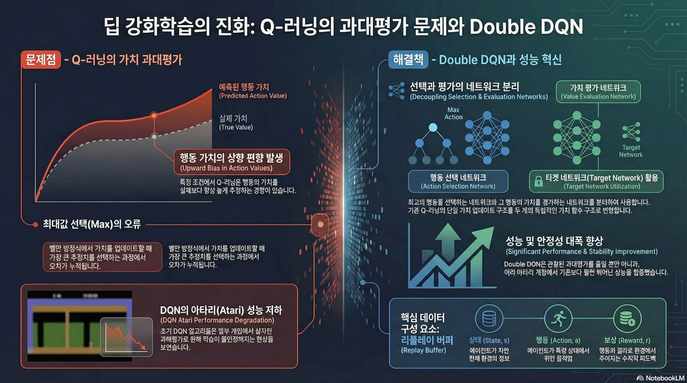

## Recap

이번 포스트에서 다룰 내용에 대한 이해를 위해서 지난 강의까지 다뤘던 내용에 대해서 다시 살펴본다.

::: {#fig-value-function layout-ncol=2}

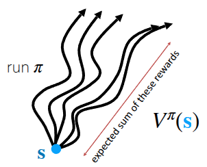{#fig-v-function}

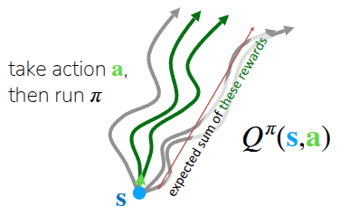{#fig-q-function}

:::

먼저 의사결정에 필요한 정보로써 강화학습에서는 주어진 상태에서 목표지점에 도달했을때 얻을수 있는 미래의 기대보상이라는 개념을 정의했다. 그래서 현재 상태 $s$ 에서 policy $\pi$ 를 따라 행동했을 때 받을 수 있는 미래의 기대 보상치를 **(State) Value Function** $V$ (@fig-v-function) 라고 표현하고, 수식으로는 다음과 같이 표현한다.

$$
V^{\pi}(s_t) = \sum_{t'=t}^T \mathbb{E}_{\pi_{\theta}}[r(s_{t'}, a_{t'}) \vert s_t]
$$

한편으로는 현재 상태에서 어떤 행동 $a$ 를 취했을 때에 대한 미래의 기대보상값도 **Q-Function** $Q$ (혹은 State-Action Value Function) (@fig-q-function) 라는 것을 사용하기도 한다.

$$
Q^{\pi}(s_t, a_t) = \sum_{t'=t}^T \mathbb{E}_{\pi_{\theta}}[r(s_{t'}, a_{t'}) \vert s_t, a_t]
$$ {#eq-q-function}

이런 정보를 활용하여 이전 강의에서 다뤘던 (Online) RL 알고리즘으로 **Policy Gradient**와 **Actor-Critic**, 그리고 다른 정책이 쌓은 경험으로 학습시키는 **Off-Policy Actor-Critic**에 대해서 다뤘다.

$$
\nabla_{\theta}J(\theta) \approx \frac{1}{N} \sum_{i=1}^N \sum_{t=1}^T \nabla_{\theta} \log \pi_{\theta} (a_{i, t} \vert s_{i, t}) \Big( \Big(\sum_{t'=t}^T r(s_{i, t'}, a_{i, t'}) \Big) - b \Big)
$$ {#eq-policy-gradient}

먼저 다뤘던 Policy Gradient는 위의 @eq-policy-gradient 에는 여러가지 trick이 반영되어 있지만, 전체 식의 의미는 기준점보다 좋은 trajectory에 대해서는 더 많이 수행하고, 기준점보다 나쁜 trajectory에선 덜 수행하는 방향으로 objective function의 gradient를 취하라는 의미였다. 여기에서 한단계 더 나아가 앞에서 언급한 value function들을 활용하여, 현재 상태 $s$ 에서 어떤 행동 $a$ 을 취했을때 얼마나 더 좋고 나쁜지를 계산하고, 이를 기반으로 policy를 학습하게 한 Actor-Critic 방식도 있었다.

$$
\nabla_{\theta} J(\theta) \approx \frac{1}{N} \sum_{i=1}^N \sum_{t=1}^T \nabla_{\theta} \log \pi_{\theta} (a_{i, t} \vert s_{i, t}) A^{\pi}(s_{i, t}, a_{i, t})
$$

사실 앞에서 소개한 Policy Gradient와 Actor-Critic 방식은 학습하는 policy와 실제로 action을 policy가 동일한 On-Policy 형태였고, 이 경우 현재 policy가 쌓은 데이터가 아니면 학습할때 버려야하는 sample inefficiency 문제가 대두되었기 때문에 이를 보완하기 위해 Replay Buffer를 사용한 Off-Policy Actor-Critic 에 대해서도 소개했다. 핵심은 replay buffer에서 샘플링한 이전의 경험 ($(s_i, a_i, s_i')$) 과 현재의 policy로부터 뽑은 다음 상태에서의 action ($\bar{a}'_i \sim \pi_{\theta}(\cdot \vert s_i')$) 을 활용하여 Q를 추정한다는 것이다. 

$$
Q^{\pi_{\theta}}(s_i, a_i) \approx r(s_i, a_i) + \gamma Q^{\pi_{\theta}}(s_i', \bar{a}_i')
$$

결과적으로 Actor-Critic 방식은 현재 상태에 대한 가치를 평가하는 Critic 과 Critic에서 추정한 Value function으로 실제로 수행하는 Actor로 이뤄져 있고, 이 두개를 모두 학습했다. 그런데 상식적으로 Critic에서 추정된 Value function를 활용하는 방법도 있겠지만, 단순히 Q-function만 가지고도 주어진 상태에서의 최적의 행동을 뽑을 수 있지 않을까 하는 막연한 의문을 가질 수 있다. 바로 이 질문에서 Q-Learning에 대한 내용이 진행된다.

## Value-based RL methods

앞서 제한 의문처럼, 만약 어떤 policy $\pi$ 에 대한 정확한 $Q^{\pi}(s, a)$ 를 알고 있다면, 굳이 별도의 Actor를 학습할 필요가 없을 것이다. 단순히 현재 상태에서 가장 높은 Q value를 가진 action을 취하는 것만으로도, 기존의 policy보다 더 낫거나 최소한 같은 성능을 내는 새로운 policy를 정의할 수 있기 때문이다. 앞의 @eq-q-function 에서 언급했던 Q function의 정의를 그대로 가져오면 현재의 policy $\pi$ 를 따르는 상황에서 주어진 State $s$ 에서 action $a$ 를 취할 때 얻을 수 있는 미래의 기대보상값이므로, 위의 설명 그대로 다음과 같은 policy를 정의할 수 있을 것이다.

$$
\pi_{\text{new}}(a_t \vert s_t) = 
\begin{cases}
 1  & \text{if } a_t = \arg \max_{a} Q_{\phi}(s_t, a) \\
 0  & \text{otherwise}
\end{cases}
$$ {#eq-greedy-policy}

강의에서는 이에 대한 쉬운 이해를 위해서 강화학습에서 많이 활용되는 2D GridWorld 상에서 목적지를 찾는 과정에 대한 예시 (@fig-grid-world) 를 공유했다. 이 환경은 sparse reward로 되어 있어서, goal에 도달했을때만 reward를 1로 받고 나머지 케이스에 대해서는 reward를 받지 못하게끔 되어 있다. 참고로 쉬운 이해를 위해 일반적으로 표기되는 discount factor $\gamma$ 는 1로 설정해, 미래에 받는 보상도 동일하게 취급하도록 했다.

::: {#fig-grid-world layout-ncol=2}

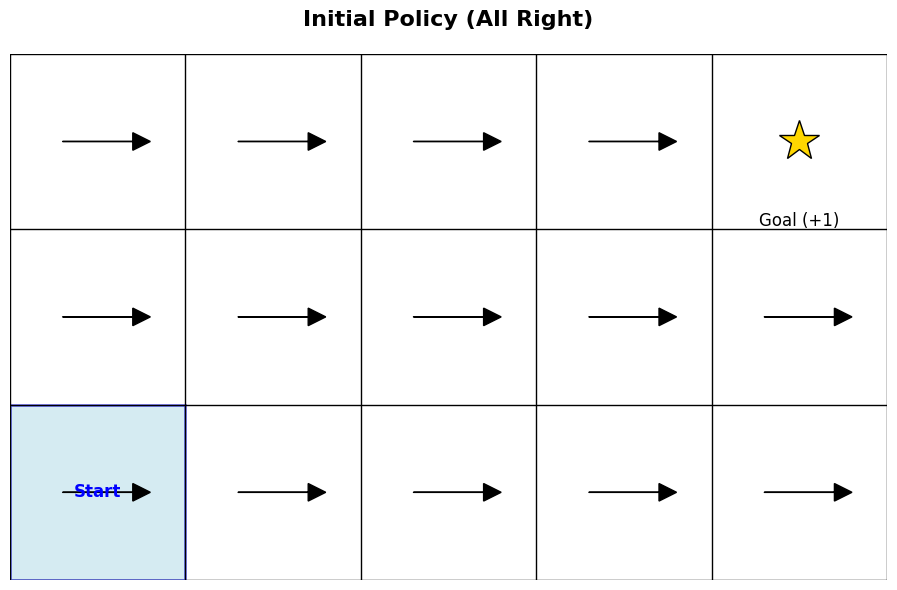{#fig-grid-init}

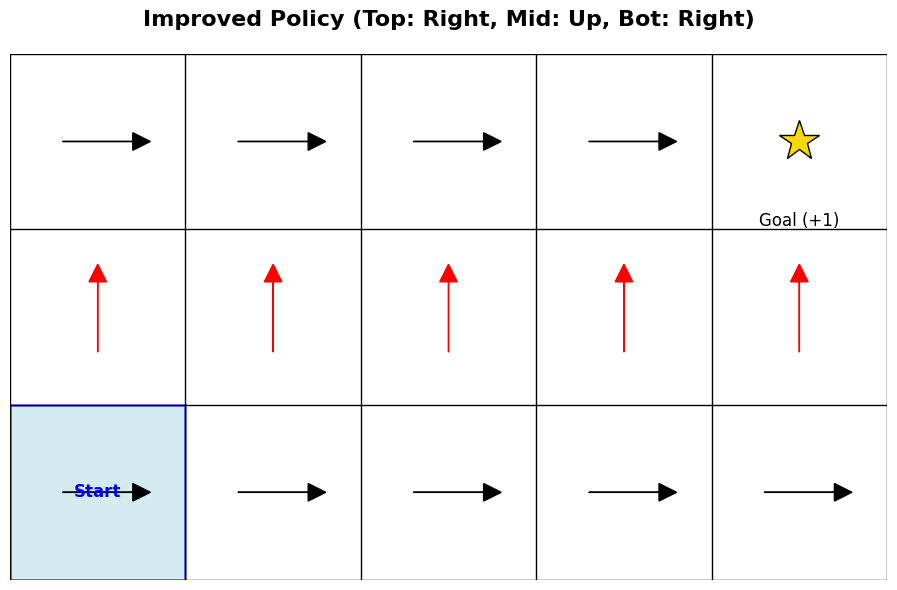{#fig-grid-1st}

:::

우선 @fig-grid-init 은 학습이 되지 않은 상태에서의 현재 policy $\pi$ 가 목적지까지 찾는 과정이다. 앞에서 정의한 @eq-greedy-policy 대로 action을 취한다고 했을때, 현재의 Q-function은 update가 되지 않은 상태이므로, $Q$ 를 최대화할 수 있는 action도 정의되지 않는다. 그렇기 때문에 임의로 오른쪽으로 가는 action만 취했다고 치자. (물론 시작점에서 목적지까지 도달하기 위해서는 오른쪽만 가는 action뿐만 아니라 위로 가는 action도 필요하다. 이때문에 강의에서 탐색(exploration)이 필요하다는 내용을 뒤에서 설명한다.) 이렇게 random하게 action을 취하다 보면 언젠가는 goal에 도달할 것이고, 그걸로 인해 우선 Q-function을 update할 수 있는 trajectory가 생성된다. 

@fig-grid-1st 는 이제 이전의 trajectory를 기반으로 $Q$ 를 update하고 난 후, 각 State에서 취할 수 있는 action을 화살표로 표기한 것이다. 우선 맨 아래 줄은 Q값을 최대화할 수 있는 action이 오른쪽 ($\rightarrow$) 으로 가는 action만 정의되어 있는데, 이 action을 따라가는 경우에는 결국 goal에 도달하지 못한다. 그래서 맨 아래줄은 어떤 칸에서든 Q value가 0이다. 대신 두번째 줄부터는 $Q$ 를 최대화할 수 있는 Action이 윗방향 ($\uparrow$) 로 정의되었고, 가장 윗줄에 도달하면 Q value를 최대화할 수 있는 action이 오른쪽 ($\rightarrow$) 으로 형성되므로, 앞에서 정의한 policy대로 따라가면 결국 goal에 도착하면서 reward를 받게 되는 것이다.

:::{.callout-note title="Policy Iteration"}

강의중 나온 질문 중에, 결과적으로 goal까지 도달할 수 있는 value function을 다시 계산하고, 해당 value를 기반으로 policy를 업데이트해야 이상적인 경로를 찾을 수 있지 않냐는 내용이 있었다. 사실 위의 예시에서도 알 수 있다시피, 이런 2D GridWorld같은 문제에서 이상적인 경로를 찾기 위한 policy를 정의하는 단계로 크게 두가지로 나눠서 볼 수 있다.

- **Policy Evaluation**: 현재 policy $\pi$ 로 데이터를 수집하고, 이를 이용해 $Q^{\pi}(s, a)$ 를 학습한다.
- **Policy Improvement**: 학습된 Q-fuction을 활용해 다음 state에서 가장 높은 Q를 얻을 수 있는 action을 선택할 수 있도록 policy를 update한다. ($\pi \leftarrow \arg \max_a Q(s, a)$)

이렇게 Polciy Evaluation과 Policy Improvement가 반복적으로 수행되는 과정 자체를 **Policy Iteration** 이라고 표현을 한다. 교수는 해당 과정에 대해서 잠깐 설명하긴 했지만, 뒤에서 소개할 Q-Learning의 알고리즘을 보면, 이런 Policy Iteration 과정이 내부에 녹아져있다.

:::

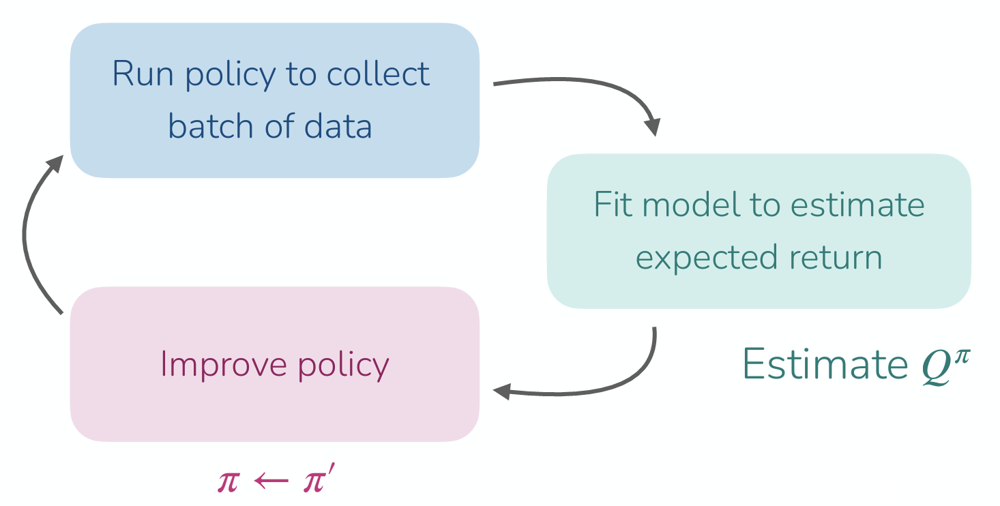

이렇게 update된 Value function을 활용하여 미래의 기대보상값을 추정하고, 이를 기반으로 policy를 update하는 일련의 과정은 앞의 과정에서 소개했던 Policy Gradient나 Actor-Critic Methods의 과정과 유사하다. 차이점이라면 action을 결정할 policy라는 게 이전에는 별도의 Actor (혹은 policy network) 이라는 객체로 정의되었다면, 앞에서 소개한 @eq-greedy-policy 는 그런 것과 상관없이 현재 상태 $s$ 에서 가장 높은 Q value를 뽑을 수 있는 action ($\arg \max_a Q(s, a)$) 만 찾으면 이 역시 주어진 환경에서 최적화된 policy를 찾게 될 것이다. 

## From Actor-Critic to Critic only

앞에서 말한 내용을 다시 정의해보면, 현재 state $s$ 에서 어떤 action $a$ 를 취했을 때의 value function $Q(s, a)$ 만 정확하게 추정할 수 있으면 이상적인 policy를 찾을 수 있고, 이렇게 Q function 기반으로 policy를 학습하는 방식을 **Q-Learning** 이라고 설명하고 있다. (@algo-Q-Learning)

```pseudocode
#| html-indent-size: "1.2em"
#| html-comment-delimiter: "//"
#| html-line-number: true
#| html-line-number-punc: ":"
#| html-no-end: false
#| pdf-placement: "htb!"
#| pdf-line-number: true
#| label: algo-Q-Learning

\begin{algorithm}
\caption{Q-Learning with Replay Buffer}
\begin{algorithmic}
\State take action $a \sim \pi(a \vert s)$, get $(s, a, s', r)$, store in $\mathcal{R}$
\State sample a batch $\{s_i, a_i, r_i, s_i'\}$ from buffer $\mathcal{R}$
\State $\hat{Q}_{\phi}^{\pi}$ using targets $y_i = r_i + \gamma \hat{Q}_{\phi}^{\pi}(s_i', a_i')$ from $a_i' \sim \pi(\cdot \vert s_i')$
\State define new policy $\pi(a_t \vert s_t) = \begin{cases} 1  & \text{if } a_t = \arg \max_{a} \hat{Q}_{\phi}(s_t, a) \\
 0  & \text{otherwise} \end{cases}$
\State Iterate from step 1 to 4 until finding optimal policy
\end{algorithmic}
\end{algorithm}
```

@algo-Q-Learning 에서도 앞에서 소개한 것처럼 현재의 value function을 계산하는 **Policy Evaluation**과 계산된 Value function을 활용해서 policy를 update하는 **Policy Improvement**가 반복적으로 수행되는 **Policy Iteration**이 들어있다. 이 과정을 무한히 반복하면, 이론적으로 optimal policy를 찾게 되지만, 사실 강의의 topic이기도 한 Deep RL에서는 이렇게 매번 policy evaluation과 improvement를 반복적으로 수행하는 것이 비효율적인 측면이 있다. 이때문에 Q function을 update하는 과정에서도 개선할 부분을 생각해볼 수 있다.

먼저 개선부분에 대한 이해를 위해서는 강화학습 이론에서 설명되는 **Bellman Equation** 에 대한 설명이 전제되어야 한다.

$$
Q^{\pi}(s, a) = r(s, a) + \gamma \mathbb{E}_{s' \sim p(\cdot \vert s, a), a' \sim \pi(\cdot \vert s')} [Q^{\pi}(s', a')] \quad \text{for all} (s, a)
$$ 

Actor-Critic에서는 현재 policy Q value를 추정하기 위해서 next state의 기대 보상값을 활용했는데, 이를 Bellman Equation이라고 한다. 그런데 Q-Learning의 목표는 현재의 policy가 아니라 optimal policy $\pi^*$ 에서의 Q value 인 $Q^*(s, a)$ 를 직접 학습하는 것이다. 그런데 앞에서 설명한 바와 같이 $\pi^{*}$ 는 항상 Q value가 최대가 되는 Action을 선택하는 특징을 가지고 있으므로, 위에서도 기대값 ($\mathbb{E}$) 이 아닌, 최대값 ($\max$) 로 대체할 수 있다. 

$$
Q^{\pi^*} = r(s, a) + \gamma \mathbb{E}_{s' \sim p(\cdot \vert s, a)} [\max_{a'}Q^{\pi^*}(s', a')] \quad \text{for all} (s, a)
$${#eq-bellman-optimality}

결과적으로 우리가 Q function이 주어진 next state $s'$ 에서 취할 수 있는 next action $a'$ 은 Q를 최대화시킬 수 있는 action이므로 이를 함수를 통해서 직접 구하는 형태로 변경된 것이다. 이렇게 optimal한 policy임을 가정하고 다시 정의한 bellman equation을 **Bellman Optimality Equation** 라고 한다. 이 모든 내용이 Q function을 활용해서 의사 결정을 할 수 있기 때문에 설명되는 것이다.

해당 내용을 바탕으로 앞에서 정의한 Q-Learning을 개선하면 다음과 같다.

```pseudocode
#| html-indent-size: "1.2em"
#| html-comment-delimiter: "//"
#| html-line-number: true
#| html-line-number-punc: ":"
#| html-no-end: false
#| pdf-placement: "htb!"
#| pdf-line-number: true
#| label: algo-improved-Q-Learning

\begin{algorithm}
\caption{Imrpoved Q-Learning with Replay Buffer}
\begin{algorithmic}
\State take action $a \sim \pi(a \vert s)$, get $(s, a, s', r)$, store in $\mathcal{R}$
\State sample a batch $\{s_i, a_i, r_i, s_i'\}$ from buffer $\mathcal{R}$
\State $\hat{Q}_{\phi}$ using targets ${\color{red} y_i = r_i + \gamma \max_{a'} \hat{Q}_{\phi}(s_i', a')}$ 
\State define new policy $\pi(a_t \vert s_t) = \begin{cases} 1  & \text{if } a_t = \arg \max_{a} \hat{Q}_{\phi}(s_t, a) \\
 0  & \text{otherwise} \end{cases}$
\State Iterate from step 1 to 4 until finding optimal policy
\end{algorithmic}
\end{algorithm}
```

이렇게 구한 $Q^{\pi^*}$ 와 이를 기반으로 도출한 policy $\pi^*$ 가 과연 optimal한가에 대해서도 강의에서 설명했는데, 위에서 제시한 2D GridWorld와 같이 모든 State와 Action에 대한 value 가 table 형태로 저장할 수 있는(tabular) 간단한 환경이라면 @algo-improved-Q-Learning 에서 정의한 방식대로 $\pi^*$ 를 찾을 수 있다. 또한 State와 Action의 형태가 Discrete하고, 충분한 탐색(Exploration)과정이 동반되었을 때도 Optimal $Q$ 를 찾을 수 있다고 설명하고 있다. 하지만 강의에서 다루는 Deep RL에서는 기본적으로 신경망을 통한 Value Function Approximation이 동반되는데, 이 경우는 항상 수렴을 보장하지 않는다고 부연으로 설명했다. 대신 @mnih2013playing 에서처럼 학습을 안정화시켜 게임이나 로봇 제어 등에서 인간을 뛰어넘는 성능을 내기도 한다.

::: {.callout-note title="About Lecture"}

강화학습의 Bible이라고 할 수 있는 @Sutton1998 에서는 지금 설명하고 있는 **Q-Learning** 에 대한 설명을 먼저 한 후, 책의 뒷절에서 **Approximate Solution Methods**이란 절에서 Policy Gradient와 Actor-Critic Methods 를 설명하고 있고, 이는 현재의 강의의 진행방향과 조금 다르다. 아마 개인적인 생각이지만, Value function에서의 policy를 정의하는 방법을 설명한 후, 그럼 value function을 어떻게 추정하는지에 대해서 설명하고자 했던게 @Sutton1998 에서 설명하려고 했던 내용이고, 강의의 의도는 신경망으로 value function을 추정하는 중요성을 부각시키기 위해서 첫 강의에서 소개한 Imitation Learning에서 이렇
게 Q-Learning까지 설명한 것 같다.

:::

::: {.callout-note title="Why Q, not V?"}

강의에 나온 질문중에 "왜 Value function ($V$) 가 아닌 Q-function ($Q$) 를 사용했는가?"에 대한 내용이 나오고 교수도 이에 대한 설명을 했다. 사실 $V$ function이나 $Q$ function 모두 미래의 기대 보상을 나타낸다는 점에서는 비슷하지만, **"함수로부터 action을 결정하는 과정"**에서 차이가 있다고 언급하고 있다.

만약 현재 State와 action에 대한 value function을 알 수 있다면, 앞에서 소개한 @eq-greedy-policy 를 통해서, 별도의 복잡한 계산없이 최적의 action을 찾을 수 있다. 즉 $Q$ Function을 통해서 어떤 action이 좋은지에 대한 정보를 이미 갖고 있는 셈이다. 이렇게 action을 결정하는 모델없이 value function을 통해서 action을 결정하는 방식을 **model-free**라고 표현한다.

반면, $V(s)$ 를 사용하게 된다면 어떻게 될까? $V(s)$ 에서는 주어진 State에 대한 가치만 알려줄 뿐, 그 State에서 어떤 행동을 해야 더 높은 가치를 가진 next state로 전이될지를 알려주지 않는다. 만약 우리가 보통 Oracle라고 표현하는 전지자가 되어서 환경의 변화에 대해서 완벽하게 예측하고, 미래의 state에 대한 value function을 정의할 수 있다면 좋겠지만, 이렇게 강화학습으로 적용하는 대부분의 문제들이 그런 Oracle이 되게끔 하는 환경의 물리법칙이나 변화 규칙(Dynamics)를 가지고 있지 않다. 이때문에 $V$ 가 아닌, $Q$ function을 사용해서 Q-Learning이라는 것을 하게 되는 것이다.

:::

## What kind of data should we collect?

Q-Learning의 장점이라고 할 수 있는 부분은 **Off-Policy** 라는 것이다. 앞의 Off-Policy Actor-Critic 부분에서 Soft Actor-Critic (SAC) 를 다룰때도 설명했던 내용이지만, 이 말은 현재의 policy가 쌓은 경험 ($(s, a, r, s')$) 뿐만 아니라, 과거의 모든 경험을 저장해 둔 Replay Buffer에서 무작위로 데이터를 샘플링하여 value function을 update하고 이에 기반한 $\pi^*$ 를 찾을 수 있다는 것이다. 이를 통해서 데이터 효율성을 극대화할 뿐만 아니라, 샘플간의 상관관계를 끊어주어 학습을 안정화하는데도 기여한다. 물론 이 때 과거의 경험을 수집한 다른 policy는 보편적으로 학습된 policy가 아니라, 뭔가 다양한 state와 action에 대한 value를 표현할 수 있는, 쉽게 말해 이를 근사할 신경망에게 넣을 다양한 학습 데이터를 만들 exploration policy가 필요할 것이다. 가장 쉽게 생각해볼 수 있는 아이디어는 일정한 확률 ($\epsilon$) 로 임의의 action을 취하게 하는 것을 적용해볼 수 있는데, 이를 **Epsilon-Greedy Exploration**이라고 표현한다.

$$
\pi(a_t \vert s_t) = 
\begin{cases}
 1 - \epsilon  & \text{if } a_t = \arg \max_{a} Q_{\phi}(s_t, a) \\
 \frac{\epsilon}{(\vert \mathcal{A} \vert - 1)}  & \text{otherwise}
\end{cases}
$$

그래서 처음에는 높은 $\epsilon$ 으로 정의해서 탐색을 하다가, 학습이 진행되는 시점에서는 Q function 에 따라 action을 취하게끔 $\epsilon$ 을 감가시키는 방법으로 많이 사용된다. 

다음으로 많이 활용되는 탐색 아이디어에는 Softmax Eploration이라고 표현하는 **Boltzmann Explortion** 이란 전략이 있다. 앞에서 소개한 Epsilon Greedy 방식은 탐색을 수행할 때, 모든 비-최적(Non-greedy) 행동을 동등하게 취하는 경향이 있다. 즉, "좋고 나쁜 정도"를 구분하지 않고 똑같이 취급한다는 단점이 있는데, Boltzmann 방식은 아래의 수식 @eq-bolzmann-exploration 에 따라 action을 결정한다.

$$
\pi(a \vert s) \approx \frac{\text{exp}(Q(s, a))}{\sum_{a'} \text{exp}(Q(s, a'))}
$${#eq-bolzmann-exploration}

그런데 어디에서 많이 본 수식처럼 보이겠지만, 사실 현재 Q function에 대한 Softmax function이다. 이렇게 일종의 정규화 과정을 거치게 되면 현재 주어진 Q value 중 어떤 값이 크고 낮은지를 확률값으로 표현할 수 있게 된다. 결과적으로 Q-function을 확률분포로 만든 후, 이에 따라 action을 선택하기 때문에, Epsilon Greedy처럼 완전히 무작위로 action을 취하는게 아니라 "가망이 있어 보이는" action 위주로 탐색을 수행하기 때문에 조금 더 효율적으로 학습을 수행할 수 있다. 대신 한가지 구현상의 어려운 부분도 있는데, softmax function을 확률 분포로 표현하기 위해서는 각각의 값들이 명확히 정의되어야 하고, 그 말은 즉 discrete하게 action이 정의되어 있는 환경에서는 구현하기가 쉽겠지만, continuous action space를 가지는 환경에서는 위와 같은 확률 계산, 특히 모든 행동에 대한 분모를 계산하기가 어렵다. 이 경우 보통 gaussian noise를 action에 대해주는 방식을 사용하거나, 별도의 샘플링 기반 최적화기법을 사용하기도 한다.

지금까지 언급한 내용을 모두 반영하여 Replay Buffer에서 샘플링한 trajectory를 기반으로 학습하는 최종적인 Q-Learning은 다음과 같이 정의된다.

```pseudocode
#| html-indent-size: "1.2em"
#| html-comment-delimiter: "//"
#| html-line-number: true
#| html-line-number-punc: ":"
#| html-no-end: false
#| pdf-placement: "htb!"
#| pdf-line-number: true
#| label: algo-full-Q-Learning

\begin{algorithm}
\caption{Full Q-Learning with Replay Buffer}
\begin{algorithmic}
\State collect data $\{(s_i, a_i, r_i, s_i')\}$ using some policy, add it to $\mathcal{R}$
\Forall{K}
  \State sample a batch $(s_i, a_i, r_i, s_i')$ from $\mathcal{R}$
  \State $\phi \leftarrow - \alpha \sum_i \frac{d Q_{\phi}}{d \phi} (s_i, a_i) (Q_{\phi}(s_i, a_i) - [r(s_i, a_i) + \gamma \max_{a'}Q_{\phi}(s_i', a_i')])$
\EndFor
\end{algorithmic}
\end{algorithm}
```

위의 @algo-full-Q-Learning 을 요약하자면, 먼저 replay buffer $\mathcal{R}$ 에서 데이터 배치를 무작위로 샘플링한 후, 샘플링한 데이터를 기반으로 정답지 역할을 할 target value $y_i$ 를 계산한다. 이때 앞에서 설명한 Bellman Optimality Equation에 정의한대로, next state $s'$ 에서 가장 높은 Q ($\max$) 를 얻을 수 있는 action을 선택하면서, 미래의 기대보상값을 추정하게 된다. 그리고 value function을 추정하는 신경망의 parameter를 gradient descent를 통해서 update하는 과정을 $K$ 번 수행하는 형태로 되어 있다. 일반적으로는 $K=1$ 로 사용하지만 데이터의 효율성을 높이기 위해서 gradient Step를 여러 번 수행하는 것도 생각해볼 수 있다. 이렇게 하면 최종적으로 잘 학습된 Q function $Q_{\phi}$ 가 나오게 되고, 이후에는 앞에서 정의한 @eq-greedy-policy 에 따라 제일 높은 Q 를 얻을 수 있는  action을 취하는 policy를 따라가면 된다.

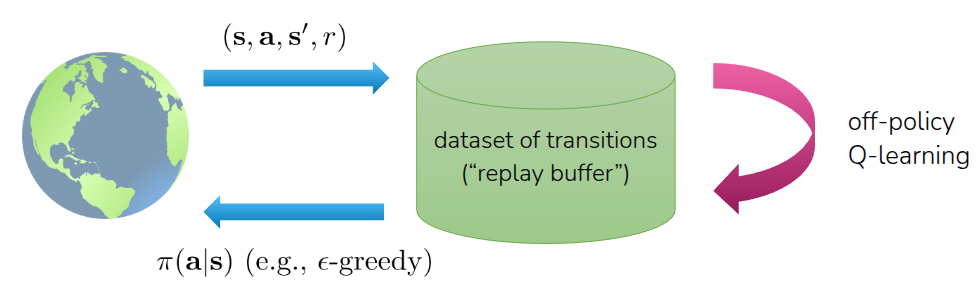{#fig-q-learning}

물론 현재 환경에 대한 Q function이 update되어야 하므로, 앞에서 설명한 Exploration이 동반된 Policy Iteration이 수행되어야 이상적인 Q-Learning 기반의 모델을 학습시킬 수 있다. 이전 강의에서 설명한 Actor-Critic과의 차이라면 Actor-Critic방식에서는 다음 state $s'$ 에서 취할 action $a'$ 을 별도의 actor(policy network)에서 취했지만, Q-Learning에서는 actor없이 $Q$ 값이 가장 높은 action을 바로 선택해서 target value를 계산한다는 점이 다르다.

## How to make Q-Learning stable?

@algo-full-Q-Learning 까지가 Q function을 신경망으로 대체한 Deep RL의 기본 아이디어였고, 실제로 이를 다양한 환경에서 실험해서 좋은 성능을 보여준 @mnih2013playing 에서는 기본 아이디어에서 학습의 안정성측면에서 몇가지 trick을 반영하여 **Deep Q-Network(DQN)** 이라고 소개했다. 

### Target Network

사실 @algo-full-Q-Learning 의 2번(replay buffer에서 데이터를 샘플링하는 과정)과 3번(target value를 계산해 parameter를 업데이트하는 과정)이 반복적으로 수행되는데, 문제는 3번에서 높은 Q를 얻을 수 있는 다음 action $a'$ 를 구할 때, 구하는 기준 Q function이 현재 학습중인 신경망에서 계산하게 된다는 점이다. 물론 Q function이 안정적으로 수렴하고, 상태에 따라서 별 변화가 없다면 괜찮겠지만, 신경망의 parameter의 초기값 등의 영향을 크게 받게 되고 결과적으로 target 값이 이에 따라 움직이는 **Moving target** 현상이 발생한다. 쉽게 말해서 정답지가 학습이 진행되는 도중에 계속 바뀌게 되는 것이다. 이에 해결하기 위해서 생각한 아이디어가 이렇게 target value를 계산할때는 고정시켜놓고, 학습이 이뤄지고 난후에 주기적으로 신경망을 update하는 것이었다. 이를 통해 target Q value가 천천히 바뀌면서 학습도 조금 더 안정적으로 수행된다. 이를 위해서 현재 학습하는 신경망과 구조적으로 동일한 신경망, 논문의 표현대로 가져오자면 target value를 계산하기 위한 **target network**를 별도로 두고, 이를 gradient update가 끝나기 전까지는 frozen 상태로 유지했다가, 주기적으로 copy해는 기법을 취했다. 

```pseudocode
#| html-indent-size: "1.2em"
#| html-comment-delimiter: "//"
#| html-line-number: true
#| html-line-number-punc: ":"
#| html-no-end: false
#| pdf-placement: "htb!"
#| pdf-line-number: true
#| label: algo-full-Q-Learning-target-network

\begin{algorithm}
\caption{Q-Learning with Replay Buffer and target network}
\begin{algorithmic}
\State save target network parameters: ${\color{red}\phi'} \leftarrow \phi$
\Forall{N}
\State collect data $\{(s_i, a_i, r_i, s_i')\}$ using some policy, add it to $\mathcal{R}$
  \Forall{K}
    \State sample a batch $(s_i, a_i, r_i, s_i')$ from $\mathcal{R}$
    \State $\phi \leftarrow \phi - \alpha \sum_i \nabla_{\phi} Q_{\phi}(s_i, a_i) \left( Q_{\phi}(s_i, a_i) - [r(s_i, a_i) + \gamma \max_{a'} {\color{red}Q_{\phi'}(s_i', a_i')}] \right)$
  \EndFor
\EndFor
\end{algorithmic}
\end{algorithm}
```

@algo-full-Q-Learning 와 대비해서 @algo-full-Q-Learning-target-network 의 차이라면 별도의 target network $\phi'$ 을 두어, 실제 network update 전까지는 frozen한 상태로 둔다는 점이다. 

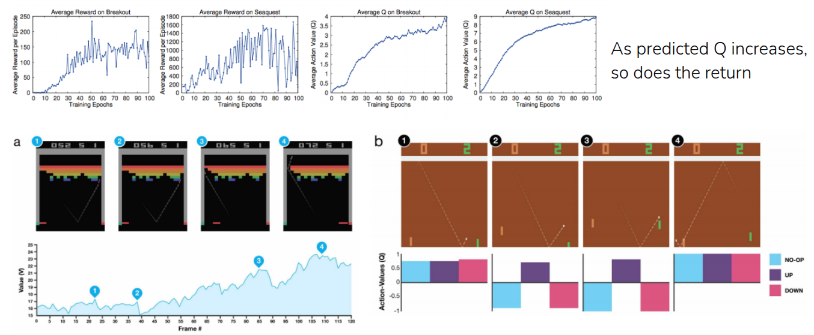{#fig-dqn-result}

@fig-dqn-result 는 @mnih2013playing 에서 앞에서 언급한 target network을 포함한 여러가지 trick 반영되어 학습된 모델의 성능지표이며, 위의 그래프를 통해서 atari 벤치마크에 포함되어 있는 Breakout과 Seaquest 게임에서의 Average Reward와 Average Q-value를 비교하고 있다. 이 두 지표가 함께 상승하는 형태로 되어 있다. Average Reward도 모델이 실제로 게임을 하면서 얻는 점수가 학습이 진행됨에 따라서 높아지고 있고, Average Q, 즉 모델이 앞으로 받을 점수라고 예측한 값도 학습이 진행됨에 따라서 같이 올라가고 있다. 결국 이 결과를 통해서 모델이 단순히 우연하게 점수를 높이게 action을 취한 것이 아니라, 현재의 자신의 상태가 좋아지고 있음을 Q value가 올라가는 것을 통해 확인할 수 있는 것이다.

### Are the Q-values (really) accurate?

그러면 Q value가 높다는게 실제 성능도 좋다는 것을 의미하는 것일까? 강의에서는 후속 논문의 결과를 통해서 반증을 제시했다.

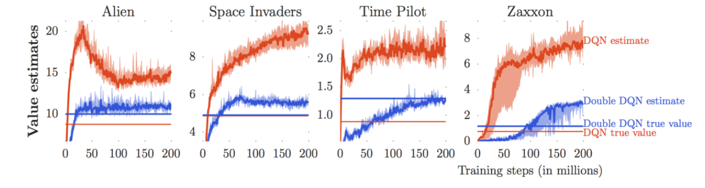{#fig-true-vs-estimate}

@fig-true-vs-estimate 는 @van2016deep 에서 진행한 실험으로 또다른 atari 게임인 Alien과 Space Invaders 등에서 모델이 추정한 Q 값과 실제 모델이 게임을 하면서 얻은 보상의 총합을 비교한 결과이다. 쉬운 비교를 위해서는 동일한 색상의 곡선과 직선을 비교하면 되는데, 확인해보면 추정한 Q값이 실제로 얻은 보상값에 비해서 매우 큰 경향을 보인다는 것을 알 수 있다. 즉, 모델은 "미래에 큰 보상을 얻을거야!"라고 예측했지만, 실제로 그만큼의 점수를 얻지 못하는 현상이 발생하는 것이다. 이런 현상을 **과대평가(Overestimation)** 이라고 한다. 

사실 이런 과대평가 현상이 나타나는 이유는 앞에서 살펴보았던 Bellman Optimality Equation (@eq-bellman-optimality) 에 있는 $\max$ 연산 때문이다. 신경망 자체가 학습 중간에는 완벽하지 않아서 추론시 약간의 오차가 발생하는데, 이 $\max$ 연산으로 인해서 그런 오차가 반영된 상태에서도 오차가 긍정적인 결과로 반영된 방향으로 action을 선택할 확률이 커지는 것이다. 

$$
\max_{a'} Q_{\phi'}(s', a') = Q_{\phi'}(s', \arg \max_{a'}(s', a'))
$$

그리고 위의 수식에서도 확인할 수 있는 것처럼 동일한 신경망 ($\phi'$) 에서 action도 결정하고, 이를 기반으로 Q value 를 계산하면서 이런 오차가 누적되면서 Q 값도 계속 켜지는 현상이 나타나게 된다.

### Double DQN

그래서 @van2016deep 에서는 이런 과대평가 현상을 완화시키기 위해서 action을 선택하는 신경망과 실제로 Q value를 계산하는 신경망을 분리하는 아이디어를 내놓았고, 이 방식이 **Double DQN** 이란 알고리즘으로 소개되었다. 큰 맥락은 **"double" Q-Learning** 이란 내용으로 Q-Learning에서 필요한, 신경망을 통한 Q값 추정을 두 개의 신경망(하나는 action을 결정하는 용도, 다른 하나는 실제 Q값을 추정하는 용도)으로 나눠서 계산하자는 것이다. 

$$
\begin{aligned}
Q_{\phi_A}(s, a) &\leftarrow r + \gamma Q_{\phi_B}(s', \arg \max_{a'}Q_{\phi_A}(s', a')) \\
Q_{\phi_B}(s, a) &\leftarrow r + \gamma Q_{\phi_A}(s', \arg \max_{a'}Q_{\phi_B}(s', a')) \\
\end{aligned}
$$

이렇게 나눠서 계산한 $Q_{\phi_A}$ 와 $Q_{\phi_B}$ 가 오차가 발생하더라도, 계산시에는 서로 다른 모델로 활용되기 때문에 오차가 중첩되어 과대평가가 되는 현상을 완화시킬 수 있다. 

그럼 이 두 개의 신경망은 어떻게 구현하냐? 사실 앞에서 소개했던 이전 논문인 @mnih2013playing 에서 target network이라는 별도의 신경망을 두면서 moving target 현상을 완화시키려고 했다. 이 target network를 실제 double q-learning에서의 신경망으로 활용하면 되는 것이다. 그러면 실제로 학습하는 신경망(current network)으로 action에 대해서 평가를 하고, 그렇게 선택된 action에 대한 Q value는 target network가 평가하는 식으로 구분하게 된다. 물론 초기의 DQN에서 제안한 Target Network의 의도는 **학습의 안정성**을 위한 분리였지만, **Double DQN** 에서는 해당 신경망을 overestimation을 막기 위한 용도로 재활용하는 식이 되겠다.

### N-step Returns for DQN

그리고 한가지 더 소개한 방식은 Actor-Critic에서 Value function을 계산할 때 설명했던 **N-Step Returns** 를 DQN에 적용해보는 것이다. 사실 Value function을 계산하는데 있어 실제 얻은 보상값을 쓰냐(Monte Carlo Estimation), 아니면 추정된 값을 활용하느냐(Bootstrapping Estimation)에 따른 방식의 차이가 존재했고, 이로써 야기되는 Bias-Variance Tradeoff에 대해서 이전 강의를 통해서 언급한 바가 있다. 그리고 이를 완화시킨 방안으로 실제 보상값을 $N$ 만큼 활용하는 N-step Returns 에 대해서 소개했었다. DQN에서는 이를 실제 target value 를 계산할때 활용하여 multi-step target을 따로 계산한다. 그래서 Monte Carlo 방식에 비해서는 variance가 낮아지고, 1-step bootstrapping에 비해서 bias가 적어지는 결과를 얻게 된다.

$$ 
\begin{aligned}
\text{Q-learning target: } & y_{j, t} = r_{j, t} + \gamma \max_{a_{j, t+1}} Q_{\phi'}(s_{j, t+1}, a_{j, t+1}) \\
\text{Multi-Step target: } & y_{j, t} = {\color{red} \sum_{t'=t}^{t + N - 1} \gamma^{t-t'} r_{j, t'}} + \gamma^N \max_{a_{j, t+N}}Q_{\phi'}(s_{j, t+N}, a_{j, t+N})
\end{aligned}
$$

위의 식과 같이 실제 얻은 보상을 N step에 걸쳐서 계산하고 이를 기반으로 target value를 계산함으로써, Q value가 부정확하더라도, bias가 상대적으로 낮은 값을 가지게 되고, 이를 통해 학습 효율성도 조금 개선되는 효과도 가져온다. 대신 문제는 위의 식이 성립되기 위해서는 실제 target value를 사용할 때의 실제 reward가 현재 Policy가 수집한 값, 즉 on-policy 일때만 가능하다는 것이다. 앞에서 replay buffer를 사용한 데이터 샘플도 multi-step target을 계산하기 위해서는 실제로 수행하고 난 데이터를 활용해야 이론적으로 가능하다는 의미이다.

그래서 교수는 일반적으로 이런 문제를 안고 그냥 무시하거나, 그냥 $N=1$ 로 정의하고 계산한다는 사례를 공유했다. 혹은 Policy의 차이에 따라 weight를 조절하는 Importance Sampling Weight을 활용하거나, 현재 policy를 수행했을 때의 데이터만 따로 모아 N-step을 수행하는 방안에 대해서도 언급했다.

## Q-Learning in Practice

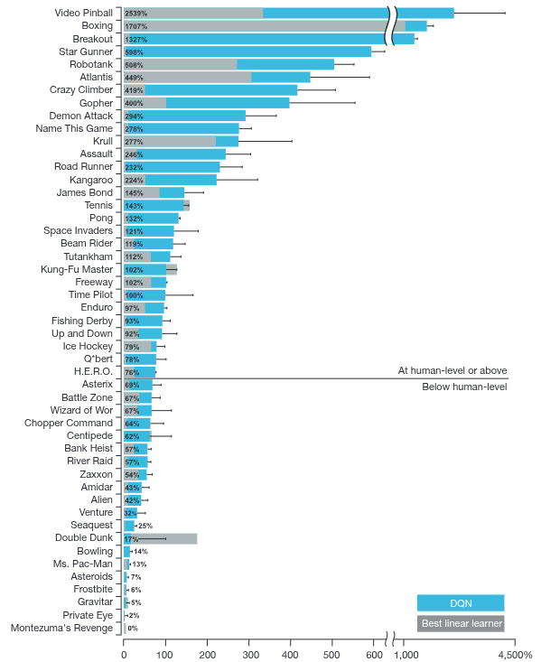

@mnih2013playing 내용이 정리가 되어 2015년에 @mnih2015humanlevel 를 통해 nature지에 소개가 되었으며, 이때 공유된 결과로는 대부분의Atari 게임에서 Q-Learning으로 학습한 모델이 사람보다 더 좋은 성능을 보여주었다고 소개되었다. 이 논문이 어떻게보면 그당시에 이슈가 되었던 AlphaGo (@Silver_2016) 와 더불어 Deep RL의 효용성을 보여준 대표적인 사례로 남아있다. 

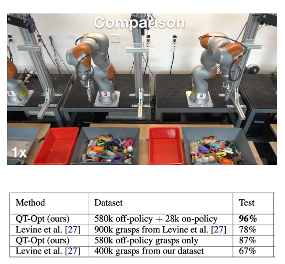

Q-Learning이 단순히 가상 현실에서만 좋은 성능을 보인 것이 아니라, 실제로 로봇 제어에서도 활용되어 제어할 수 있다는 사례 (@kalashnikov2018scalable) 도 공유되었다. 논문에서 소개된 **QT-Opt** 라는 알고리즘은 실제 로봇팔로 수집한 grasp 데이터셋을 바탕으로 Q-function을 학습시켜, 다양한 grasp task에 일반화시켰다는 내용이다.

## Summary

마지막으로 교수는 지금까지 살펴본 알고리즘을 언급하며, 어떤 상황에서 적용할 수 있는지에 대해서 잠깐 소개했다. 먼저 다뤘던 On-Policy Actor-Critic 방식인 **Proximal Policy Optimization(PPO)**는 안정적이고 상대적으로 hyperparameter tuning에 대한 필요성이 덜하기 때문에, 데이터 효율성이 중요하지 않는 환경이라면 적용해볼 수 있는 방법론이다. 다음으로 언급했던 Replay Buffer가 활용된 Off-Policy 기반의 **Soft Actor-Critic(SAC)**는 로봇 제어와 같이 실제 환경에서 제어해야 되는, 데이터 효율성이 중요하게 고려되는 환경에서 많이 활용되는 방법이다. 하지만 앞에서 소개한 PPO에 비하면 hyperparameter tuning이 필요하고, 상대적으로 불안정할 수 있다는 점을 고려해야 한다. 마지막으로 이번 강의에서 다룬 Off-policy 기반의 **Deep Q-Network(DQN)** 은 action space가 discrete하거나 low dimensional observation을 갖는 환경에서 잘 동작하고, replay buffer를 사용하기 때문에 데이터 효율성도 좋은 측면에 대해서 소개했다.

앞에서 다뤘던 **Q-Learning** 내용을 간단히 요약해보면, 기존의 Actor-Critic 방식에서 action을 선택하는 actor를 별도로 두지않고, 잘 학습된 Q-function을 활용하여 action을 취하는 방식이었고, 주어진 환경에서 **Exploration** 전략과 결합된 **Policy Iteration**을 통해서 최적의 action을 찾는 학습방법이다. 데이터 효율성을 개선하기 위해서 이전의 Off-policy 기법처럼 **replay buffer**를 활용할 수 있는데, 동일한 신경망에서 action을 취하고 Q value를 계산할때 발생하는 **Moving Target** 문제를 해결하기 위해서 **Target Network**이라는 별도의 신경망을 두어서 주기적으로 업데이트하는 방법이 제안되기도 했다. 또한 주어진 Q-function에서 최적의 action의 찾는 목적상 오차로 인해서 Q value를 과도하게 평가하는 **과대평가(overestimation)** 현상이 발생하는데, 이를 해결하기 위해서 기존에 제안된 Target Network을 활용해서 action을 선택하는 신경망과 Q value를 평가하는 신경망을 분리하는 **Double DQN** 방법에 대해서도 소개했다. 마지막으로 Q value를 추정하는데 있어서 발생할 수 있는 Bias-Variance Tradeoff를 완화하기 위해 제안되었던 N-step Return도 DQN에서 multi-step target이란 개념으로 적용해서 학습 효율을 개선할 수 있었다. Model-free RL의 대표적인 알고리즘은 **Deep Q-Learning**은 실제로도 인간과 대비하여 좋은 성능을 보여주며, 최근에는 로봇 학습과 같은 실제 환경에서도 잘 동작하는 결과를 보여주었다.