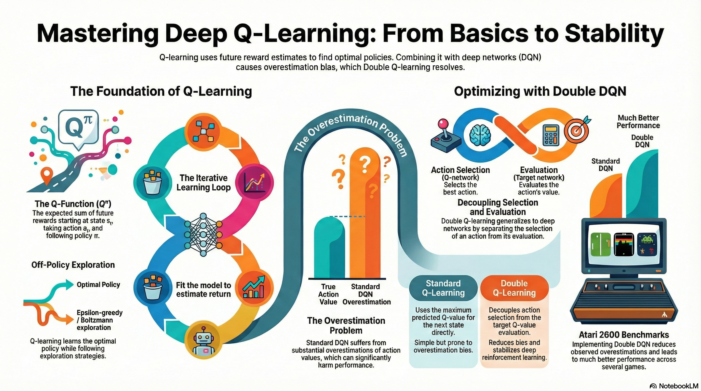

### Resource

::: {layout-ncol=2}
[](https://www.youtube.com/watch?v=-7kv6jf0isQ&list=PLoROMvodv4rPwxE0ONYRa_itZFdaKCylL&index=6)

[](https://cs224r.stanford.edu/slides/06_cs224r_qlearning_2025.pdf)
:::

## Lecture Summary with NotebookLM



## Recap

To set the stage for this post, let's briefly review the concepts covered in previous lectures.

::: {#fig-value-function layout-ncol=2}

{#fig-v-function}

{#fig-q-function}

:::

First, to make optimal decisions, Reinforcement Learning (RL) defines the concept of expected future return—the total expected reward an agent can accumulate until reaching the goal from a given state. Specifically, the expected future return when following a policy $\pi$ from the current state $s$ is defined as the **(State) Value Function** $V$ (@fig-v-function). Mathematically, it is expressed as:

$$
V^{\pi}(s_t) = \sum_{t'=t}^T \mathbb{E}_{\pi_{\theta}}[r(s_{t'}, a_{t'}) \vert s_t]
$$

Alternatively, we can evaluate the expected future return of taking a specific action $a$ in the current state $s$ (and following policy $\pi$ thereafter). This is called the **Q-Function** $Q$ (or State-Action Value Function) (@fig-q-function), formulated as:

$$
Q^{\pi}(s_t, a_t) = \sum_{t'=t}^T \mathbb{E}_{\pi_{\theta}}[r(s_{t'}, a_{t'}) \vert s_t, a_t]
$$ {#eq-q-function}

Building on these concepts, previous lectures covered (Online) RL algorithms such as **Policy Gradient** and **Actor-Critic**, as well as **Off-Policy Actor-Critic**, which allows learning from past experiences collected by older policies.

$$
\nabla_{\theta}J(\theta) \approx \frac{1}{N} \sum_{i=1}^N \sum_{t=1}^T \nabla_{\theta} \log \pi_{\theta} (a_{i, t} \vert s_{i, t}) \Big( \Big(\sum_{t'=t}^T r(s_{i, t'}, a_{i, t'}) \Big) - b \Big)
$$ {#eq-policy-gradient}

While @eq-policy-gradient incorporates several practical tricks for Policy Gradient, its core intuition is straightforward: update the policy parameters (via gradient ascent) to increase the probability of trajectories that yield higher rewards than a baseline, and decrease the probability of worse ones. Taking this a step further, the **Actor-Critic** method leverages the aforementioned value functions to explicitly evaluate how much better or worse a specific action $a$ is in state $s$, using this assessment to guide the policy updates.

$$
\nabla_{\theta} J(\theta) \approx \frac{1}{N} \sum_{i=1}^N \sum_{t=1}^T \nabla_{\theta} \log \pi_{\theta} (a_{i, t} \vert s_{i, t}) A^{\pi}(s_{i, t}, a_{i, t})
$$

Both standard Policy Gradient and Actor-Critic are On-Policy algorithms, meaning the policy being updated must be the exact same policy interacting with the environment. This leads to a severe sample inefficiency problem: any data generated by older policies must be discarded. To overcome this, we introduced the **Off-Policy Actor-Critic** architecture using a Replay Buffer. The key idea here is to estimate the Q-value by combining past transitions ($(s_i, a_i, s_i')$) sampled from the replay buffer with the next action ($\bar{a}'_i \sim \pi_{\theta}(\cdot \vert s_i')$) sampled from the current policy.

$$
Q^{\pi_{\theta}}(s_i, a_i) \approx r(s_i, a_i) + \gamma Q^{\pi_{\theta}}(s_i', \bar{a}_i')
$$

Ultimately, the Actor-Critic framework consists of two components that must be trained simultaneously: a **Critic** that evaluates the state, and an **Actor** that executes actions guided by the Critic's value estimations. However, this raises an intuitive question: If the Critic (specifically the Q-function) can accurately estimate the value of each action, couldn't we simply deduce the optimal action directly from the Q-function without needing a separate Actor? This precise question serves as the starting point for **Q-Learning**.

## Value-based RL methods

As questioned earlier, if we know the exact $Q^{\pi}(s, a)$ for a given policy $\pi$, there would be no need to train a separate Actor. Simply by taking the action with the highest Q-value in the current state, we can define a new policy that performs better than, or at least as well as, the existing one. Recalling the definition of the Q-function from @eq-q-function, it represents the expected future return obtained by taking action $a$ in a given state $s$ while following the current policy $\pi$. Based on this definition, we can explicitly define our new policy as follows:

$$
\pi_{\text{new}}(a_t \vert s_t) = 
\begin{cases}
 1  & \text{if } a_t = \arg \max_{a} Q_{\phi}(s_t, a) \\
 0  & \text{otherwise}
\end{cases}
$$ {#eq-greedy-policy}

To make this easier to understand, the lecture shared an example of finding a destination in a 2D GridWorld (@fig-grid-world), a classic environment widely used in reinforcement learning. This environment features sparse rewards: the agent receives a reward of 1 only when it reaches the goal, and 0 in all other cases. Note that for the sake of simplicity, the discount factor $\gamma$ is set to 1, treating future rewards equally to immediate ones.

::: {#fig-grid-world layout-ncol=2}

{#fig-grid-init}

{#fig-grid-1st}

:::

First, @fig-grid-init shows the current, untrained policy $\pi$ trying to find the destination. If we assume the agent takes actions according to @eq-greedy-policy, the current Q-function is not yet updated, meaning the action that maximizes $Q$ is undefined. Let's suppose, therefore, that the agent arbitrarily takes only the "move right" action. (Of course, to reach the goal from the starting point, the agent needs to move up as well as right. This is why the lecture later introduces the necessity of exploration). As the agent takes random actions, it will eventually hit the goal, which generates a trajectory that can be used to update the Q-function for the first time.

@fig-grid-1st displays the actions available in each state, represented by arrows, after updating $Q$ based on the previous trajectory. In the bottom row, the only action defined to maximize the Q-value is moving right ($\rightarrow$); however, following this action will never lead to the goal. Consequently, the Q-value for any cell in the bottom row remains 0. On the other hand, from the second row upward, the action that maximizes $Q$ is defined as moving up ($\uparrow$). Once the agent reaches the top row, the optimal action shifts to moving right ($\rightarrow$). Thus, if the agent follows this newly defined policy, it will eventually arrive at the goal and receive the reward.

:::{.callout-note title="Policy Iteration"}

During the lecture, a question was raised: shouldn't we recalculate the value function that ultimately leads to the goal and update the policy based on that value to find the ideal path? As the example above illustrates, defining a policy to find the ideal path in a problem like 2D GridWorld can be broadly divided into two steps:

- **Policy Evaluation**: Collect data using the current policy $\pi$ and use it to learn $Q^{\pi}(s, a)$.
- **Policy Improvement**: Use the learned Q-function to update the policy so that it selects the action yielding the highest Q in the next state ($\pi \leftarrow \arg \max_a Q(s, a)$).

The repetitive execution of Policy Evaluation and Policy Improvement is referred to as **Policy Iteration**. While the professor only briefly touched upon this process, it is inherently embedded within the Q-Learning algorithm that will be introduced later.

:::


This series of steps—estimating expected future returns using the updated value function and updating the policy based on those estimates—is similar to the processes of Policy Gradient or Actor-Critic methods introduced earlier. The key difference lies in how the policy is defined. In previous methods, the policy dictating the action was defined as a separate entity called an Actor (or policy network). In contrast, as shown in @eq-greedy-policy, Q-Learning sidesteps this entirely: as long as we can find the action that yields the highest Q-value in the current state $s$ ($\arg \max_a Q(s, a)$), we will naturally discover the optimal policy for the given environment.

## From Actor-Critic to Critic only

To summarize the previous points: if we can accurately estimate the value function $Q(s, a)$—the expected return of taking a specific action $a$ in the current state $s$—we can deduce the ideal policy. This approach of learning a policy purely based on the Q-function is known as **Q-Learning** (@algo-Q-Learning).

```pseudocode
#| html-indent-size: "1.2em"
#| html-comment-delimiter: "//"
#| html-line-number: true
#| html-line-number-punc: ":"
#| html-no-end: false
#| pdf-placement: "htb!"
#| pdf-line-number: true
#| label: algo-Q-Learning

\begin{algorithm}
\caption{Q-Learning with Replay Buffer / (SARSA-style) TD target}
\begin{algorithmic}
\State take action $a \sim \pi(a \vert s)$, get $(s, a, s', r)$, store in $\mathcal{R}$
\State sample a batch $\{s_i, a_i, r_i, s_i'\}$ from buffer $\mathcal{R}$
\State $\hat{Q}_{\phi}^{\pi}$ using targets $y_i = r_i + \gamma \hat{Q}_{\phi}^{\pi}(s_i', a_i')$ from $a_i' \sim \pi(\cdot \vert s_i')$
\State define new policy $\pi(a_t \vert s_t) = \begin{cases} 1  & \text{if } a_t = \arg \max_{a} \hat{Q}_{\phi}(s_t, a) \\
 0  & \text{otherwise} \end{cases}$
\State Iterate from step 1 to 4 until finding optimal policy
\end{algorithmic}
\end{algorithm}
```

As introduced earlier, @algo-Q-Learning inherently involves **Policy Iteration**, which consists of repeatedly performing **Policy Evaluation** (calculating the current value function) and **Policy Improvement** (updating the policy based on the calculated value function). While repeating this process infinitely guarantees finding the optimal policy in theory, repeatedly alternating between full policy evaluation and improvement is highly inefficient in practice—especially in the context of Deep RL, which is the main topic of this lecture. Because of this, we need to consider ways to improve the Q-function update process itself.

To understand these improvements, we first need to discuss the **Bellman Equation**, a fundamental concept in reinforcement learning theory.

$$
Q^{\pi}(s, a) = r(s, a) + \gamma \mathbb{E}_{s' \sim p(\cdot \vert s, a), a' \sim \pi(\cdot \vert s')} [Q^{\pi}(s', a')] \quad \text{for all} (s, a)
$$

In the Actor-Critic method, we used the expected return of the next state to estimate the Q-value of the current policy; this relationship is defined by the Bellman Equation. However, the goal of Q-Learning is not to evaluate the current policy, but to directly learn $Q^*(s, a)$, which is the Q-value of the optimal policy $\pi^*$. As explained earlier, because the optimal policy $\pi^*$ inherently selects the action that maximizes the Q-value, we can replace the expectation operator ($\mathbb{E}$) over actions in the equation above with a maximization operator ($\max$).

$$
Q^{\pi^*}(s, a) = r(s, a) + \gamma \mathbb{E}_{s' \sim p(\cdot \vert s, a)} [\max_{a'}Q^{\pi^*}(s', a')] \quad \text{for all} (s, a)
$${#eq-bellman-optimality}

Consequently, the next action $a'$ to be taken in the next state $s'$ is precisely the action that maximizes the Q-function, allowing us to compute it directly through the function itself. This redefined equation, assuming an optimal policy, is known as the **Bellman Optimality Equation**. All of this is possible precisely because the Q-function alone is sufficient for decision-making.

Based on this concept, we can refine the previously defined Q-Learning algorithm as follows:

```pseudocode
#| html-indent-size: "1.2em"
#| html-comment-delimiter: "//"
#| html-line-number: true
#| html-line-number-punc: ":"
#| html-no-end: false
#| pdf-placement: "htb!"
#| pdf-line-number: true
#| label: algo-improved-Q-Learning

\begin{algorithm}
\caption{Improved Q-Learning with Replay Buffer}
\begin{algorithmic}
\State take action $a \sim \pi(a \vert s)$, get $(s, a, s', r)$, store in $\mathcal{R}$
\State sample a batch $\{s_i, a_i, r_i, s_i'\}$ from buffer $\mathcal{R}$
\State $\hat{Q}_{\phi}$ using targets ${\color{red} y_i = r_i + \gamma \max_{a'} \hat{Q}_{\phi}(s_i', a')}$ 
\State define new policy $\pi(a_t \vert s_t) = \begin{cases} 1  & \text{if } a_t = \arg \max_{a} \hat{Q}_{\phi}(s_t, a) \\
 0  & \text{otherwise} \end{cases}$
\State Iterate from step 1 to 4 until finding optimal policy
\end{algorithmic}
\end{algorithm}
```

The lecture also addressed a critical question: Are the $Q^{\pi^*}$ obtained this way and the resulting policy $\pi^*$ truly optimal?* In simple environments like the 2D GridWorld mentioned above, where the values for all states and actions can be explicitly stored in a table (a tabular setting), we can indeed find the exact $\pi^*$ as defined in @algo-improved-Q-Learning. Furthermore, the professor explained that an optimal $Q$ can be found when the state and action spaces are discrete, provided that the agent engages in sufficient exploration.

However, in Deep RL—the primary focus of this lecture—we fundamentally rely on Value Function Approximation using neural networks. The lecture clarified that in such cases, strict convergence to the optimal policy is not always mathematically guaranteed. Instead, by employing tricks to stabilize the training process, as demonstrated in @mnih2013playing, these algorithms can approximate the optimal policy well enough to achieve superhuman performance in complex domains like gaming and robot control.

::: {.callout-note title="About the Lecture Structure"}

In @Sutton1998, widely considered the bible of reinforcement learning, **Q-Learning** is introduced early on. Later in the book, under a section dedicated to **Approximate Solution Methods**, it covers Policy Gradient and Actor-Critic methods. This sequence differs slightly from the flow of the current CS224R lecture.

In my personal opinion, @Sutton1998 intended to first establish how to define a policy from a value function, and then explore how to approximate that value function in complex environments. Conversely, the lecture's intent seems to be highlighting the importance of estimating value functions using neural networks right from the start, logically charting a path from Imitation Learning (introduced in the first lecture) all the way through Actor-Critic to Q-Learning.

:::

::: {.callout-note title="Why Q, not V?"}

A great question raised during the lecture was: "Why use the Q-function ($Q$) instead of the Value function ($V$)?" The professor provided a very clear intuition for this.

While both the $V$-function and the $Q$-function are similar in that they represent expected future returns, the crucial difference lies in **"the process of determining an action from the function."**

If we know the exact value function for the current state and a specific action, we can find the optimal action without any complex forward-looking calculations simply by using @eq-greedy-policy. In other words, the $Q$-function inherently contains the information about which action is good. Deciding actions directly through the value function without needing to know how the environment works internally is referred to as a **model-free** approach.

On the other hand, what happens if we only use $V(s)$? The $V$-function only tells us the intrinsic value of being in a given state; it does not tell us which action we need to take to transition to a next state with a higher value.To make decisions using only $V(s)$, we would need to act as an "Oracle." We would need a perfect model of the environment to simulate taking every possible action, predict the exact resulting next states, and then evaluate $V$ for those future states. However, in most real-world problems tackled by reinforcement learning, we do not have access to the underlying physical laws or transition rules (the dynamics) of the environment. Because we lack this Oracle, we rely on the $Q$-function instead of $V$, leading us to Q-Learning.

:::

## What kind of data should we collect?

One of the major advantages of Q-Learning is that it is an **Off-Policy** algorithm. As discussed earlier when covering Soft Actor-Critic (SAC) in the Off-Policy Actor-Critic section, this means the agent is not restricted to learning only from the experiences ($(s, a, r, s')$) collected by the current policy. Instead, it can randomly sample data from a Replay Buffer—a memory bank storing all past experiences—to update the value function and subsequently find $\pi^*$. This not only maximizes data efficiency but also breaks the correlation between consecutive samples, significantly contributing to the stabilization of the training process.

Of course, the behavior policy used to collect these past experiences shouldn't just be any standard trained policy. It needs to be an exploration policy capable of gathering a diverse set of training data representing various states and actions, which will then be fed into the neural network for approximation. The most straightforward idea is to have the agent take a completely random action with a certain probability ($\epsilon$). This strategy is known as **Epsilon-Greedy Exploration**.

$$
\pi(a_t \vert s_t) = 
\begin{cases}
 1 - \epsilon  & \text{if } a_t = \arg \max_{a} Q_{\phi}(s_t, a) \\
 \frac{\epsilon}{(\vert \mathcal{A} \vert - 1)}  & \text{otherwise}
\end{cases}
$$

In practice, it is common to start with a high $\epsilon$ value to encourage broad exploration initially, and then gradually decay $\epsilon$ as training progresses, allowing the agent to increasingly exploit the Q-function to choose actions.

Another widely used exploration strategy is **Boltzmann Exploration**, often referred to as Softmax Exploration. A drawback of the aforementioned Epsilon-Greedy method is that it treats all non-optimal (non-greedy) actions equally during exploration. It fails to distinguish between "slightly bad" and "terrible" actions. In contrast, the Boltzmann approach determines the action based on the following equation, @eq-bolzmann-exploration:

$$
\pi(a \vert s) \approx \frac{\text{exp}(Q(s, a))}{\sum_{a'} \text{exp}(Q(s, a'))}
$${#eq-bolzmann-exploration}

This formula might look familiar—it is essentially the Softmax function applied to the current Q-function. By going through this normalization process, the relative magnitudes of the given Q-values are converted into probabilities. Consequently, by transforming the Q-function into a probability distribution and sampling actions from it, the agent doesn't act purely randomly like in Epsilon-Greedy. Instead, it explores more efficiently by prioritizing actions that "look promising."

However, this method presents an implementation challenge. To express the softmax function as a probability distribution, the value for each possible action must be explicitly defined. This is straightforward in environments with discrete action spaces, but in environments with continuous action spaces, computing these probabilities—and particularly calculating the denominator over an infinite number of actions—is extremely difficult. Specifically, finding the $\arg \max_a Q(s, a)$ does not typically yield a closed-form solution. In such continuous cases, it is more common to simply add Gaussian noise to the deterministic action or employ separate sampling-based optimization techniques.

Incorporating all the concepts discussed so far, the final formulation of Q-Learning, which learns from trajectories sampled from a Replay Buffer, is defined as follows:

```pseudocode
#| html-indent-size: "1.2em"
#| html-comment-delimiter: "//"
#| html-line-number: true
#| html-line-number-punc: ":"
#| html-no-end: false
#| pdf-placement: "htb!"
#| pdf-line-number: true
#| label: algo-full-Q-Learning

\begin{algorithm}
\caption{Full Q-Learning with Replay Buffer}
\begin{algorithmic}
\State collect data $\{(s_i, a_i, r_i, s_i')\}$ using some policy, add it to $\mathcal{R}$
\Forall{K}
  \State sample a batch $(s_i, a_i, r_i, s_i')$ from $\mathcal{R}$
  \State $\phi \leftarrow - \alpha \sum_i \frac{d Q_{\phi}}{d \phi} (s_i, a_i) (Q_{\phi}(s_i, a_i) - [r(s_i, a_i) + \gamma \max_{a'}Q_{\phi}(s_i', a_i')])$
\EndFor
\end{algorithmic}
\end{algorithm}
```

To summarize @algo-full-Q-Learning above, we first randomly sample a batch of data from the replay buffer $\mathcal{R}$. Using this sampled data, we compute the target value $y_i$, which acts as the ground truth for our network update. During this step, in accordance with the Bellman Optimality Equation discussed earlier, we estimate the expected future return by assuming the agent will take the action that maximizes the Q-value ($\max$) in the next state $s'$.

Next, we update the parameters of the neural network approximating the value function via gradient descent for $K$ iterations. While $K=1$ is typically used, performing multiple gradient steps can be considered to enhance data efficiency. This entire process ultimately produces a well-trained Q-function $Q_{\phi}$. From then on, the agent simply follows the policy defined in @eq-greedy-policy, constantly executing the action that yields the highest Q-value.

{#fig-q-learning}

Naturally, because the Q-function needs to accurately reflect the changing environment, this Policy Iteration loop must be paired with the exploration strategies mentioned earlier to successfully train an ideal Q-Learning model. The fundamental difference between this approach and the Actor-Critic method covered in the previous lecture lies in the target calculation. Whereas Actor-Critic determines the next action $a'$ in the next state $s'$ using a dedicated actor (policy network), Q-Learning eliminates the need for an actor entirely. Instead, it calculates the target value directly by evaluating the maximum possible $Q$-value for the next state.

## How to make Q-Learning stable?

The concepts discussed up to @algo-full-Q-Learning represent the foundational idea of Deep RL, where the Q-function is approximated by a neural network. In @mnih2013playing, which demonstrated impressive empirical performance across various environments, the authors introduced the **Deep Q-Network (DQN)** by incorporating several crucial tricks into this foundational idea to ensure training stability.

### Target Network

In @algo-full-Q-Learning, step 2 (sampling data from the replay buffer) and step 3 (calculating the target value to update the parameters) are executed repeatedly. The issue arises in step 3: when determining the next action $a'$ that yields the highest Q-value, the reference Q-function used for this calculation is the exact same neural network that is currently being trained.

This might be acceptable if the Q-function converged smoothly and didn't fluctuate significantly across different states. However, neural networks are highly sensitive to factors like parameter initialization and recent parameter updates. Consequently, the target value shifts concurrently with the network updates, leading to a phenomenon known as the **"Moving Target"** problem. Simply put, the "answer key" keeps changing while the model is actively trying to learn it.

To solve this, the authors proposed fixing the network used to calculate the target values, only updating it periodically after a certain number of training steps. This ensures that the target Q-value changes much more slowly, resulting in a significantly more stable training process.

To implement this, they introduced a separate neural network structurally identical to the main network being trained. Using the paper's terminology, they deployed a dedicated target network solely for calculating target values. This target network is kept "frozen" during the continuous gradient updates of the main network, and its parameters are only periodically synchronized (copied over) from the main network.

```pseudocode
#| html-indent-size: "1.2em"
#| html-comment-delimiter: "//"
#| html-line-number: true
#| html-line-number-punc: ":"
#| html-no-end: false
#| pdf-placement: "htb!"
#| pdf-line-number: true
#| label: algo-full-Q-Learning-target-network

\begin{algorithm}
\caption{Q-Learning with Replay Buffer and target network}
\begin{algorithmic}
\State save target network parameters: ${\color{red}\phi'} \leftarrow \phi$
\Forall{N}
\State collect data $\{(s_i, a_i, r_i, s_i')\}$ using some policy, add it to $\mathcal{R}$
  \Forall{K}
    \State sample a batch $(s_i, a_i, r_i, s_i')$ from $\mathcal{R}$
    \State $\phi \leftarrow \phi - \alpha \sum_i \nabla_{\phi} Q_{\phi}(s_i, a_i) \left( Q_{\phi}(s_i, a_i) - [r(s_i, a_i) + \gamma \max_{a'} {\color{red}Q_{\phi'}(s_i', a_i')}] \right)$
  \EndFor
\EndFor
\end{algorithmic}
\end{algorithm}
```

Compared to @algo-full-Q-Learning, the defining difference in @algo-full-Q-Learning-target-network is the introduction of a separate target network $\phi'$, which is kept in a frozen state until the periodic network update occurs.

{#fig-dqn-result}

@fig-dqn-result illustrates the performance metrics of the model trained in @mnih2013playing, which incorporates the aforementioned target network along with several other stabilizing tricks. The graphs compare the Average Reward and the Average Q-value for the games Breakout and Seaquest from the Atari benchmark.

As shown, these two metrics rise in tandem. The Average Reward—the actual score the model achieves while playing the game—steadily increases as training progresses. Simultaneously, the Average Q-value, which represents the model's prediction of the score it will receive in the future, also trends upward over time.

Ultimately, these results confirm that the model isn't just stumbling upon higher scores by taking lucky, random actions. Instead, the consistently rising Q-values demonstrate that the model genuinely recognizes when its current state is improving, proving that it is learning a meaningful and accurate representation of the environment.

### Are the Q-values (really) accurate?

So, does a high Q-value inherently guarantee excellent actual performance? The lecture presented counter-evidence through the results of a follow-up paper.

{#fig-true-vs-estimate}

@fig-true-vs-estimate illustrates an experiment conducted by @van2016deep, comparing the Q-values estimated by the model with the actual sum of rewards the model accumulated while playing Atari games like Alien and Space Invaders. For an easy comparison, simply look at the curves and straight lines of the same color. As you can see, the estimated Q-values tend to be significantly larger than the actual rewards obtained. In other words, the model makes wildly optimistic predictions—"I'm going to get a massive reward in the future!"—but fails to actually score that high in reality. This phenomenon is known as **Overestimation**.

The root cause of this overestimation lies in the $\max$ operator within the Bellman Optimality Equation (@eq-bellman-optimality) we examined earlier. Because the neural network itself is imperfect during training, it inevitably produces small estimation errors during inference.

The $\max$ operator exacerbates this issue because it systematically favors actions whose estimation errors happen to be positive, significantly increasing the probability of selecting them.

$$
\max_{a'} Q_{\phi'}(s', a') = Q_{\phi'}(s', \arg \max_{a'}Q_{\phi'}(s', a'))
$$

As explicitly shown in the equation above, because the exact same neural network ($\phi'$) is responsible for both determining the optimal action (action selection) and calculating the Q-value for that action (action evaluation), these positive errors compound over time. This continuous accumulation causes the estimated Q-values to inflate uncontrollably.

### Double DQN

To mitigate this overestimation phenomenon, @van2016deep proposed an ingenious idea: separating the neural network used for selecting the action from the neural network used to actually calculate the Q-value. This approach was introduced as the **Double DQN** algorithm.

The overarching concept stems from **"Double" Q-Learning**, which suggests dividing the Q-value estimation required in standard Q-Learning between two distinct neural networks—one dedicated to deciding the best action, and the other to estimating the actual Q-value for that action.

$$
\begin{aligned}
Q_{\phi_A}(s, a) &\leftarrow r + \gamma Q_{\phi_B}(s', \arg \max_{a'}Q_{\phi_A}(s', a')) \\
Q_{\phi_B}(s, a) &\leftarrow r + \gamma Q_{\phi_A}(s', \arg \max_{a'}Q_{\phi_B}(s', a')) \\
\end{aligned}
$$

Even if errors occur in the separately calculated $Q_{\phi_A}$ and $Q_{\phi_B}$, using different models for action selection and value estimation prevents these errors from compounding. Consequently, this decoupling effectively mitigates the overestimation issue.

So, how do we implement these two separate neural networks in practice? We can actually look back at the previous paper, @mnih2013playing, which we discussed earlier. That paper introduced a separate target network to alleviate the moving target problem. We can simply repurpose this target network to serve as the second neural network for Double Q-Learning.

Under this setup, the network currently being trained (the **current network**) is used to evaluate and select the best action, while the **target network** evaluates the Q-value for that specifically chosen action.

Of course, the original intent of the Target Network proposed in the initial DQN was to provide separation for **training stability**. However, in **Double DQN**, this existing architecture is cleverly recycled to prevent the compounding of overestimation errors.

### N-step Returns for DQN

Another approach introduced in the lecture is applying the **N-Step Returns**, which we previously discussed when calculating the Value function in Actor-Critic, to DQN.

As covered in prior lectures, there is a fundamental difference in estimating the value function depending on whether we use the actual accumulated rewards (Monte Carlo Estimation) or rely on estimated future values (Bootstrapping Estimation). This difference naturally leads to the classic Bias-Variance Tradeoff.

To mitigate this tradeoff, we introduced N-step Returns, which incorporates the actual rewards observed over $N$ consecutive steps before bootstrapping. In DQN, this concept is leveraged to calculate a separate multi-step target. Consequently, it achieves lower variance compared to pure Monte Carlo methods and lower bias compared to standard 1-step bootstrapping.

$$
\begin{aligned}
\text{Q-learning target: } & y_{j, t} = r_{j, t} + \gamma \max_{a_{j, t+1}} Q_{\phi'}(s_{j, t+1}, a_{j, t+1}) \\
\text{Multi-Step target: } & y_{j, t} = {\color{red} \sum_{t'=t}^{t + N - 1} \gamma^{t-t'} r_{j, t'}} + \gamma^N \max_{a_{j, t+N}}Q_{\phi'}(s_{j, t+N}, a_{j, t+N})
\end{aligned}
$$

As shown in the equation above, by accumulating the actual rewards obtained over $N$ steps and computing the target value based on this sum, the target inherently possesses a relatively lower bias even if the underlying Q-value approximation is inaccurate. This reduction in bias also has the effect of slightly improving overall learning efficiency.

However, there is a catch. For the multi-step target equation to hold mathematically, the actual rewards used to compute the target must be collected by the current policy—meaning it strictly requires an on-policy setting. Theoretically, calculating a multi-step target using data sampled from a replay buffer is only valid if that specific trajectory was generated by the exact policy we are currently evaluating.

The professor shared that, in practice, researchers often either just ignore this theoretical inconsistency and proceed anyway, or simply default to $N=1$ to avoid the issue entirely. Strictly speaking, rigorous off-policy corrections, such as utilizing Importance Sampling Weights to adjust for the discrepancy between the behavior and target policies, are required. Nevertheless, in many practical implementations and papers—such as the N-step DQN or the renowned Rainbow algorithm—practitioners simply mix in $N$-step returns without rigorous corrections and still achieve state-of-the-art performance empirically.

## Q-Learning in Practice


The foundational work from @mnih2013playing was further refined and subsequently published in the journal Nature in 2015 (@mnih2015humanlevel). The results presented in this landmark paper were groundbreaking, demonstrating that an agent trained strictly with Q-Learning could achieve superhuman performance across the vast majority of classic Atari games. Alongside the highly publicized success of AlphaGo (@Silver_2016) during that era, this paper remains one of the most iconic milestones proving the immense potential and real-world efficacy of Deep RL.


Furthermore, the lecture shared a compelling case study (@kalashnikov2018scalable) highlighting that the capabilities of Q-Learning extend far beyond virtual environments and video games; it can be effectively deployed for real-world, physical robot control. This paper introduced the **QT-Opt** algorithm, which trained a robust Q-function using a massive real-world dataset of robotic arm grasping attempts. As a result, the model successfully generalized its learned policy to execute a wide variety of complex grasping tasks in the physical world.

## Summary

Finally, the professor briefly reviewed the algorithms discussed so far, providing a quick, practical guide on when to apply each one.

First, **Proximal Policy Optimization (PPO)**, the On-Policy Actor-Critic method covered previously, is highly stable and relatively robust to hyperparameter tuning. Therefore, it is a solid baseline choice for environments where data efficiency is not a strict requirement (i.e., where data is fast and cheap to generate).

Next, **Soft Actor-Critic (SAC)**, an Off-Policy method utilizing a Replay Buffer, is heavily favored in environments where data efficiency is highly critical, such as real-world robot control. However, one must consider that it requires more careful hyperparameter tuning and can be relatively less stable compared to PPO.

Lastly, the **Deep Q-Network (DQN)**, the Off-Policy algorithm covered extensively in this lecture, performs exceptionally well in environments with discrete action spaces or low-dimensional observations. By leveraging a replay buffer, it also boasts strong data efficiency.

To briefly summarize the core concepts of **Q-Learning** covered in this post:

Unlike the Actor-Critic approach, Q-Learning eliminates the need for a separate actor. Instead, it derives optimal actions directly from a well-trained Q-function. It learns the optimal policy through **Policy Iteration** combined with an **Exploration** strategy within a given environment.

To improve data efficiency, it utilizes a **Replay Buffer**, much like other Off-Policy methods. To resolve the **Moving Target** problem—which arises when the exact same neural network is used to both select the action and calculate the target Q-value—the concept of a **Target Network** was introduced. This separate network is kept frozen and only updated periodically.

Furthermore, because the algorithm inherently seeks the optimal action by taking the maximum Q-value, estimation errors inevitably lead to an **Overestimation** bias. To counteract this, we explored the **Double DQN** method, which ingeniously repurposes the Target Network to decouple the network responsible for action selection from the network used for actual Q-value evaluation.

Finally, to mitigate the Bias-Variance Tradeoff that occurs during Q-value estimation, the **N-step Return** method can be applied to DQN as a multi-step target, further improving learning efficiency.

As the most prominent algorithm in Model-Free RL, **Deep Q-Learning** has empirically demonstrated superhuman performance in simulations and continues to show remarkable, robust results even in complex, real-world applications like robotic learning.
