### 강의 및 자료

::: {layout-ncol=2}
[](https://www.youtube.com/watch?v=SUJCgisKW1Y&list=PLoROMvodv4rNjRoawgt72BBNwL2V7doGI&index=6)

[](https://cs330.stanford.edu/materials/cs330_nonparametric_2023.pdf)
:::

포스트에 소개되어 있는 자료는 강의 자료에서 따왔습니다.

## Lecture Summary with NotebookLM

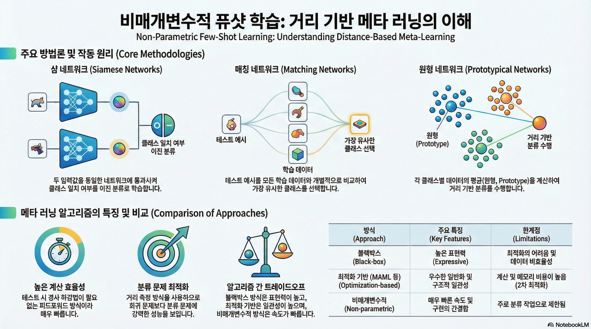

## Recap

앞에서 다룬 Meta Learning 방법론 중 Black-Box Meta Learning과 Optimization-based Meta Learning에 대해서 다뤘다.

::: {#fig-parametric-approach layout-ncol=2}

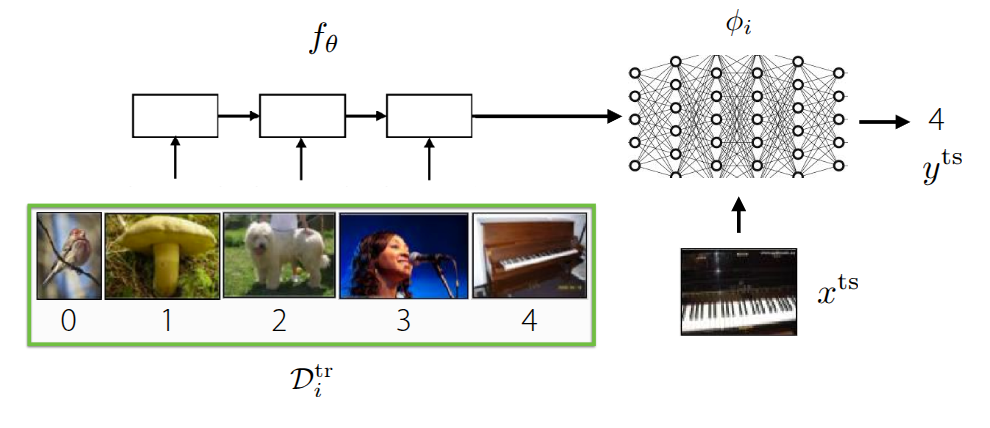{#fig-black-box}

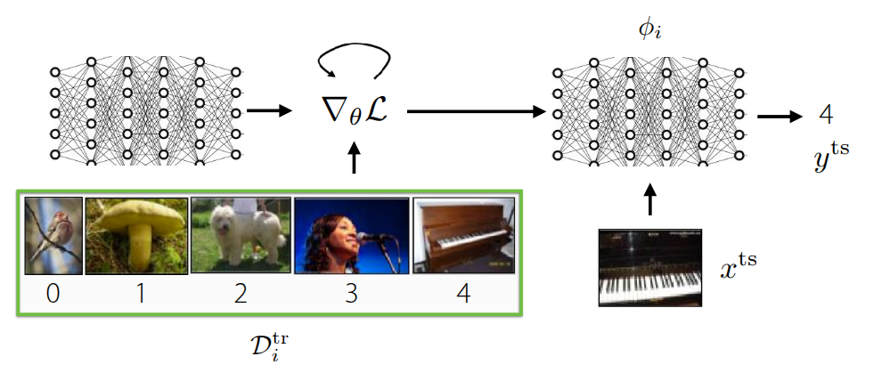{#fig-optimization}

:::

가장 먼저 언급했던 **Black-Box Meta Learning** (@fig-black-box) 은 훈련 데이터 $\mathcal{D}_{i}^{tr}$ 를 거대한 신경망에 통과시켜서 학습 과정 자체를 파라미터화(Parametrize) 하는 방식이다. 내부의 신경망의 동작에 대한 정의없이 마치 일종의 블랙박스와 같은 학습 형태로 되어 있고, 학습 데이터에 따라 모델의 출력도 제어할 수 있기 때문에 다양한 학습 절차를 표현할 수 있는 높은 표현력(Expressive)을 갖는 장점이 있지만, 어떤 hyperparameter를 가지고 있느냐에 따라 성능에 대한 차이도 크며, 이로 인해서 hyperparameter에 대한 최적화 과정이 매우 까다롭다. **Optimization-Based Meta Learning** (@fig-optimization) 은 앞의 Black-Box Adaptation과는 다르게 학습 과정 중 inner-loop내에서 발생하는 Gradient Descent 같은 최적화 과정을 내재화하여, 일종의 Bi-level optimization 형태로 문제를 해결하는 접근 방법이다. 그림에도 그 과정이 소개되어 있다시피 학습 데이터 내에서 주어진 task에서의 정보를 학습할 수 있는 positive inductive bias를 outer-loop에서 활용할 수 있기 때문에, 학습 초기 단계에서 조금 더 빠르게 학습되며, bi-level optimization 과정을 통해서 외부의 새로운 데이터가 들어와도 이에 대한 extrapolation 성능도 이전 방법에 비해 좋은 편이다. 무엇보다도 최적화 과정에 초점이 맞춰져 있어서, 모델 구조와 무관하게(Model-agnostic) 해당 방법을 적용할 수 있고, 일반적으로 네트워크가 커지면 커질수록 expressive 성능도 개선된다. 다만 bi-level optimization을 해야 되기 때문에, 이로 인한 계산량과 메모리 소모가 큰 편이고, 학습 과정이 불안정하기 때문에 이를 극복하기 위한 다양한 연구에 대해서 지난 강의에서 소개했었다. 

앞에서 소개한 두가지 방법 모두 meta-test 단계에서 학습되지 않은 새로운 task가 들어왔을 때, 이를 해결하기 위한 Task 고유의 parameter ($\phi_i$)가 학습과정 내에서 정의된다. Black-Box 방식에서는 거대한 신경망을 통해서 학습 과정 자체가 파라미터화되며, Optimization-Based 방식에서도 inner-loop에서 Gradient Descent를 통해서 parameter가 업데이트된다. 이렇게 parameter가 정의되고 이를 기반으로 학습이 진행되는 방식을 **Parametric Learning**이라고 한다. 그런데 이렇게 파라미터화에서 학습을 수행하게 되면, 앞에서 언급된 단점들처럼 연산량과 메모리 소모량이 많아지고, 일반적인 성능 확보를 위해서는 다량의 데이터가 필요하게 된다. 특히 Optimization-based 방법에서는 bi-level optimization이 수행되면서 이런 단점이 더 부각된다. 그러면 **이런 parameter를 일일히 연산하지 않고도 이런 학습 과정을 모델에 투영시키거나 반영할 수 있을까?**

## Non-Parametric Methods

앞에서 언급된 Parametric Model는 기본적으로 데이터에 대한 가정이 정의되어 있는 상태(예를 들어서 어떤 확률분포를 가진다? 같은...) 상태에서 입력 데이터와 출력 데이터간의 관계를 일종의 수학적으로 정의한 모델이고, 이런 데이터에 대한 가정없이 (결과적으로는 수학적으로 관계가 정의되지 않고), 데이터로부터 그 의미를 추출하는 방식을 **Non-Parametric Model**이라고 한다. 

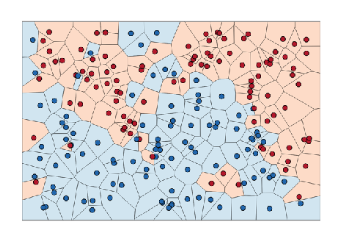

사실 이 개념은 신경망이 등장하기 전에도 나왔던 개념으로 흔히 알고있는 Decision Tree나 K-Nearest Neighborhood(KNN), Support Vector Machine(SVM) 등이 이 부류에 속한다. 각 알고리즘의 동작원리를 상기해보면 알겠지만, 대부분의 알고리즘이 데이터의 많고 적음을 떠나서 현재 상태에서의 데이터간의 관계를 도출해낼 수 있다. 특히 데이터가 매우 적은 상황(Low data regime) 에서도 Parametric 방식에 비해 구현도 쉬울 뿐더러 잘 동작하는 것을 확인할 수 있다. 그런데 이 low data regime의 상황을 meta learning에 투영해보면, meta-test 에서도 이와 유사하게 발생한다. 특히 meta test에서 수행하는 Few-Shot Learning 과 같은 경우는 학습되지 않은 task에 대한 sample ($x^{ts}$)이 얼마없는 상황에서도 이에 맞는 label($y^{ts}$)을 추정해야 되는데, 앞의 Parametric model은 바로 이 과정에서 task parameter $\phi_i$ 를 추론하면서 단점이 야기된다는 것이다. 

그러면 한가지 고려해볼 수 있는 부분이, 실제로 다양한 task에 대한 representation 방법을 학습하는 meta-train단계에서는 이전에 소개했던 parametric model을 활용하되, Few-Shot Learning이 발생하는 meta-test단계에서는 앞단계에서 뽑은 정보를 활용하는 non-parametric model을 사용하는 일종의 하이브리드 방식이 이 있을 것이다.

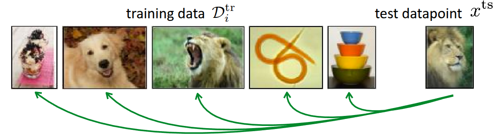{#fig-non-parametric}

@fig-non-parametric 은 앞에서도 많이 소개되었던 Few-shot classification 예시이며, 이 그림에서 소개하는 근본적인 방법은 meta-test 단계에서 주어진 test 데이터($x^{ts}$)가 있을때, 이 데이터를 실제 meta-train단계에서 학습할때 활용했던 데이터와 비교하는 것이다. 비교 방법이 어떠하던지 간에, 기존 학습 데이터와 가장 유사한 데이터가 있으면 학습 데이터에서의 label을 따르게 하면 된다. 그러면 이제 관건은 "어떤 기준으로 학습 데이터와 테스트 데이터가 유사하다고 할까?"이다. 흔히 유사성을 측정하는 metric으로는 **Euclidian Distance**라고 $\ell_2$ Distance같은 것도 있고, cosine similarity 같은 것도 있다. 우선은 이렇게 주어진 이미지들간의 $\ell_2$ Distance로 유사성을 판단한다고 가정해보자.

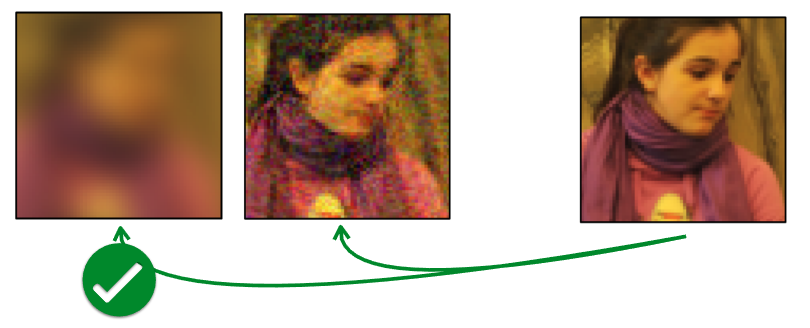{#fig-unreasonable}

@fig-unreasonable 는 @zhang2018unreasonable 논문에 소개된 실험 결과 중 하나로, 가장 오른쪽에 있는 Reference 이미지와 유사한 이미지를 왼쪽의 두개 이미지 중에서 찾는 것이다. 사람의 눈으로 봤을 때는 두개의 이미지 중 오른쪽의 이미지가 더 유사하다고 생각할 수 있겠지만, 앞에서 언급한 $\ell_2$ Distance나 동일하게 유사도를 측정하는 metric인 Peak Signal-to-Noise Ratio(PSNR) 이나, Structural Similarity Index (SSIM), Feature-based Similarity Index (FSIM) 를 활용했을 때는, 오히려 왼쪽의 이미지가 더 유사하다고 나온다. 이처럼 이미지가 입력으로 들어오는 문제에서 유사도 기반의 metric으로 수행한 Non-parametric Learning은 의도와 다르게 동작할 가능성이 크다. 무엇보다도 이렇게 distance function을 어떤 것으로 정의하느냐도 다른 관점에서는 Parametric Learning이라고 볼 수 있는 여지가 생긴다. 그래서 강의에서 제안하는 방식은 이렇게 **metric 자체를 측정하는 방법 자체를 meta-training data를 활용하여 학습하자는 것(Learn to Compare)**이다.

## Siamese Network for Non-Parametric Model

::: {#fig-siamese-network layout-ncol=2}

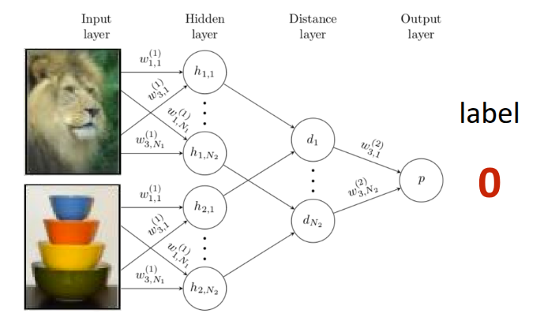

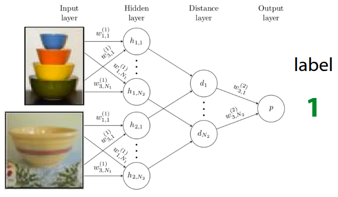

:::

**Siamese Network**는 @Bromley1993SignatureVU 에서 처음 소개된 간단한 신경망이 쌍둥이 형태로 되어 있는 구조로, 두개의 입력을 각각 받을 수 있는 신경망이 동일한 형태로 구성되어 완전히 동일한 parameter를 공유하는 방식으로 되어 있다. 원 논문에서는 Siamese Network을 활용하여 서명을 확인하는 예시로 소개되었다가, @Koch2015SiameseNN 에서 해당 구조를 활용하여 One-shot learning에 적용한 사례로 발전되었다. 해당 논문에서 제안했던 부분은 앞에서 소개했던 Similarity Metric을 정의하지 말고, meta-train단계에서 training data와 test data 간의 **Binary Classification**을 수행하는 것이다. 이 때 학습이 잘되면 @fig-siamese-network 에 나와있는 것처럼 유사한 이미지끼리는 $1$, 서로 다른 이미지끼리는 $0$ 이 나오는 형태로 Siamese Network이 학습이 될 것이고, 이 모델을 meta-test단계에서 일종의 **유사도 측정기**로 활용하게 된다. 그래서 test data가 주어지면, test data와 기존 support set에 있는 이미지를 하나씩 짝지어서 비교하는(Pairwise comparison) 과정이 진행되고, 이때, $K$ 개의 test data가 주어지면, Siamese Network에서는 총 $N \times K$ 만큼의 forward pass가 이뤄지고, 각 class별 비교 확률값이 나오게 된다. 이때 확률값이 가장 큰 class가 test data의 최종 label로 출력되는 방식으로 동작하는 것이다.

그런데 이 구조의 문제는 Binary Classification의 특성상 training data의 샘플과 test data간의 유사한지 여부만 파악할 수 있다는 점이다. 주어진 이미지 중에 어떤 이미지가 "더" 유사한지를 판별하는 로직이 학습시에는 반영되지 않기 때문에 이에 따른 성능의 한계가 발생한다. 이렇게 meta-train에서 수행하는 학습 목적(정답과 일치여부)과 meta-test단계에서 추구하는 가장 큰 확률을 가지는 label을 찾는 목적 자체가 다르기 때문에 이를 **불일치(Mismatch)**라고 표현하는 것 같다. 예를 들어서 학습할때는 정답과 유사한지 여부만 확인하다가, 테스트 단계에서 정답에 가장 가까운 데이터를 찾으라고 하는 셈이다. 

그리고 meta-test 단계에서 추론되는 label은

$$
\hat{y}_{ts} = \sum_{x_k, y_k \in \mathcal{D}^{tr}} \mathbb{1}(f_{\theta}(X_{ts}, x_k) > P_{pos}) y_k
$$

와 같이 정의되는데, 위 식에서 표현되는 indicator function $\mathbb{1}$ 은 일종의 step function이라서 auto differentiation을 수행할 수 없다. 그래서 뒤에서 이어서 설명한 **Matching Network** 이란 알고리즘에서 이런 제약사항을 보완하는 방법에 대해서 소개했다.

## Matching Networks for Non-Parametric Model

**Matching Networks**은 @vinyals2016matching 에서 소개된 방식으로, 앞에서 언급된 Siamese Network을 활용한 One-shot Learning에서 도출된 한계를 극복하기 위해서 제안되었다. 근본적으로는 "학습환경과 테스트환경간의 불일치" 문제를 해소하기 위해 몇가지 trick을 적용했다.

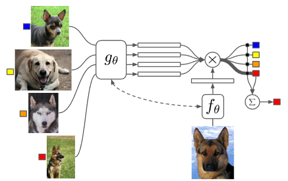{#fig-matching-network}

우선 불일치 문제를 해소하기 위해서 데이터 자체가 아닌, 데이터내에 잠재된 context를 활용하여 일치점을 찾으려 했고, 이를 위해 학습 데이터와 test 데이터에서 context를 뽑아낼 별도의 encoder network를 달았다. 학습 데이터와 test 데이터가 임베딩 공간에 매핑되면, 둘 사이의 dot product 등을 통해서 유사도를 계산한후, 계산된 유사도값에 softmax 함수($a(x^{ts}, x_k) = \frac{\exp(\text{cos}(f(x^{ts}), g(x_k)))}{\sum_{x_j} \exp(\text{cos}(f(x^{ts}), g(x_j)))}$) 를 취해서 모든 훈련데이터에 대한 가중치(확률값)을 구하게 된다. 이렇게 구한 값과 실제 학습 데이터의 정답 label을 곱한, 일종의 weighted sum으로 최종 label을 추론하게 되는데, 

$$
\hat{y}^{ts} = \sum_{x_k, y_k \in \mathcal{D}^{tr}} f_{\theta}(x^{ts}, x_k) y_k
$$

기존의 indicator function이 이렇게 softmax function으로 대체되면서 미분도 가능해지고, 오차를 통한 backpropagation도 가능해지면서 parameter를 **end-to-end**로 직접 최적화할 수 있게 된다. 추가로 주어진 test 데이터가 여러 개인 상황($K>1$) 에서도, Matching Networks는 기존의 수식을 활용하면서 일종의 투표방식(Voting)으로 동작하게 되는데, Support Set에서의 데이터와 test 데이터 간의 유사도를 기반으로 선택된 label에 투표가 많이 누적된 것으로 추론하는 방식으로 이뤄진다. 이 전체 과정을 알고리즘으로 표현하면 다음과 같다.

```pseudocode
#| html-indent-size: "1.2em"
#| html-comment-delimiter: "//"
#| html-line-number: true
#| html-line-number-punc: ":"
#| html-no-end: false
#| pdf-placement: "htb!"
#| pdf-line-number: true
#| label: algo-Matching-Networks

\begin{algorithm}
\caption{General Algorithm of Non-parametric approach}
\begin{algorithmic}
\State Sample task $\mathcal{T}_i \quad$ (or mini batch of tasks)
\State Sample disjoint datasets $\mathcal{D}_i^{tr}, \mathcal{D}_i^{ts}$ from $\mathcal{D}_i$
\State Compute $\hat{y}^{ts} = \sum_{x_k, y_k \in \mathcal{D}^{tr}} f_{\theta} (x^{ts}, x_k) y_k$
\State Update $\theta$ using $\nabla_{\theta}\mathcal{L}(\hat{y}^{ts}, y^{ts})$
\end{algorithmic}
\end{algorithm}
```

이렇게 하면 이전 강의에서 다뤘던 Parametric Model $\phi$ 가 없어진 Non-Parametric Model의 형태로 동작되는 것을 확인할 수 있다. 

사실 Matching을 하기 위한 목적으로 내부에서 별도의 유사도를 계산하고 이에 기반한 가중치를 계산하는데, 문제는 각각의 test 데이터를 **"독립적으로"** 비교하다보니 어느 잘못된 데이터로 인해서 편향이 발생할 수 있다. 만약 특정 데이터 하나가 잘못된 label을 가지거나 outlier인데, 우연히 test 데이터와의 유사도가 높게 나온다면, 이 잘못된 결과로 인해서 다른 정상적인 결과들이 묻혀버리는(Overpower) 현상이 나타날 수 있다. 이로 인해서 개별 예제가 아닌, class별 평균 정보를 모아서 일종의 **prototype**을 만드는 **Prototypical Networks** 방식이 이어서 설명된다.

:::{.callout-note}
실제 논문을 보면 Support Set에서 사용된 context encoder는 Bi-directional LSTM $g_{\theta}$ 를 사용했고, Query Set에서 사용된 encoder는 Support Set의 임베딩결과에 영향을 받는(Conditioned) Attention 기반의 LSTM $h_{\theta}$ 로 되어 있는데, 이 부분은 저자들이 선택한 구조라고 강의에서 소개하고 있다. 논문에도 특정 데이터 하나만 독립적으로 보는 것이 아니라, 데이터셋 내의 다른 task간의 관계를 함께 고려하기 위해서 LSTM 구조를 썼다고 언급되어 있다. 강의내 질문에서도 동일한 내용으로 질문이 나왔는데, 교수는 이 부분에 대해서 동일한 encoder를 사용해도 무방하다고 소개했으며, 원논문에서는 복잡한 LSTM기반의 앙상블 구조를 사용했지만, 후술될 **Prototypical Networks**과 더불어 이어지는 연구들에서는 동일한 encoder를 쓰는 형태로 일반화된 것을 확인할 수 있다.
:::

## Prototypical Networks for Non-Parametric Model

앞에서 언급한 바와 같이 각각의 test 데이터에 독립적으로 판단하면서 정상적인 결과가 묻혀버리는 Matching Networks의 한계를 극복하기 위해서 제안된 아이디어는 이렇게 개별 훈련 데이터를 일일이 distance를 비교하는 대신, 각 class별로 데이터들의 정보를 모아(aggregate) 하나의 대표값(prototypical embedding)을 만드는 것이었다. 그리고 만약 새로운 테스트 데이터가 들어오면, 개별 데이터가 아닌 이 대표값들과의 distance만 비교하는 형태(Nearest Neighbors to the prototypes)로 분류가 진행된다면, 앞에서 발생한 한계를 극복할 수 있을텐데 이 방법이 바로 **Prototypical Networks**란 이름으로 @snell2017prototypical 의 논문에 소개되었다.

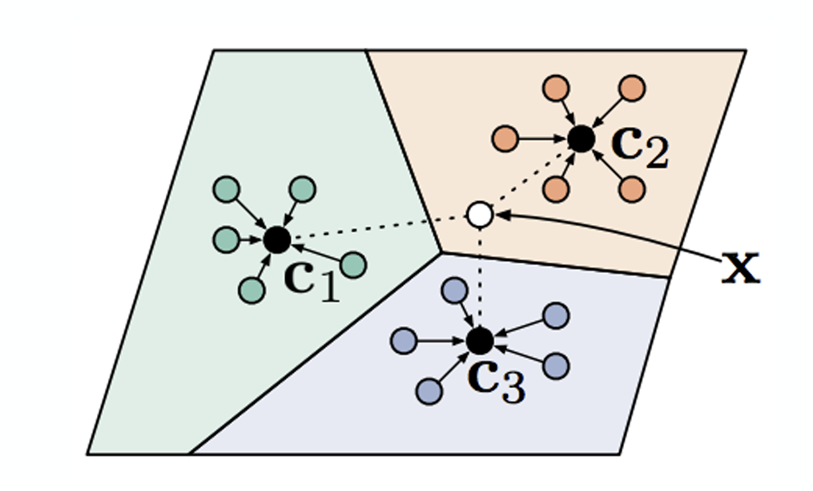{#fig-prototypical-networks}

@fig-prototypical-networks 는 앞에서 소개한 방식을 그림으로 표현한 것으로, 만약 $x$ 라는 흰점의 class를 알고자 할 경우, 각 class별 Prototype은 다음과 같이 계산한다. 앞에서 언급한 Nearest Neighbor방식으로 구한 결과의 평균을 구하는 과정이다.

$$
c_n = \frac{1}{K} \sum_{(x_k, y_k) \in \mathcal{D}_i^{tr}} \mathbb{1}(y == n) f_{\theta}(x_k)
$$

이후에 주어진 test 데이터와 prototype ($c_n$)간의 distance를 $d(c_n, x_k^{ts})$ 라고 정의할 경우, $y=n$ 이 될 확률은 @eq-prototype-softmax 과 같이 softmax 함수을 적용해서 계산할 수 있다. 참고로 distance 함수는 작을수록 유사하다는 의미를 가지므로, 수식에는 각각 음수의 형태 ($-d$)로 들어가게 된다.

$$
p_{\theta}(y_k=n \vert x_k) = \frac{\exp(-d(f_{\theta}(x), c_n))}{\sum_{n'}\exp(-d(f_{\theta}(x), c_{n'}))}
$${#eq-prototype-softmax}

참고로 교수는 이 부분에서 $d$ 함수에 대해서 부연설명을 했는데, @snell2017prototypical 에서는 euclidian distance나 consine similarity를 사용하긴 했지만, Matching Networks에서 언급했던 방법과 유사하게 이 distance를 구하는 방법 자체를 신경망으로 학습시킬 수 있다고 설명했다. 물론 이 경우 embedding 신경망에 대한 parameter $\theta_f$ 와 distance 를 구하는 신경망에 대한 parameter $\theta_d$ 를 최적화할 수 있도록 모델이 학습되는 형태 $\min_{\theta_f, \theta_d} \mathcal{L}(\hat{y}, y)$ 가 될 것이다.

## Challenges and Ideas

앞에서 소개한 것처럼 주어진 데이터에 대한 embedding space를 구하고, Nearest Neighbor 방식을 통해 test 데이터의 label을 추정하는 방법은 Non-parametric 기법에서 생각해볼 수 있는 가장 보편적인 방법이지만, 이런 방식에도 앞에서 언급한 바와 같이 한계점이 존재한다. 개별 데이터에 대해서 독립적으로 구한다던가, 단순한 distance 측정을 통해서 찾는 유사성보다도 데이터들간에 내재되어 있는 복잡한 관계에 대해서도 어떻게 대응할 수 있을지 생각해볼 필요가 있다. 

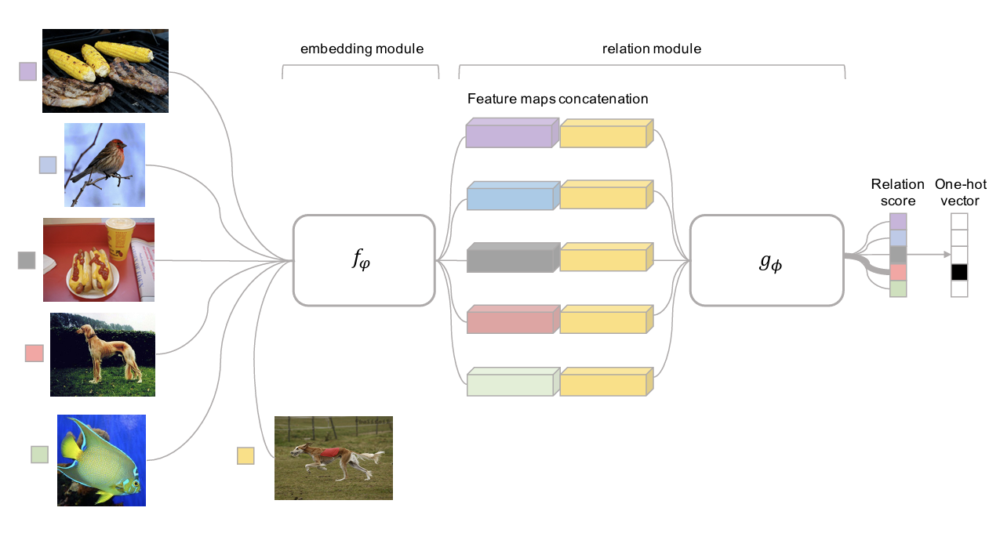{#fig-relation-networks}

@fig-relation-networks 는 @sung2018learning 논문에서 소개된 **Relation Networks** 라는 구조로, 앞에서 잠깐 언급했던 distanace를 구하는 과정 자체를 신경망으로 학습시키는 방식이다. 기존 방식은 embedding 후 $\ell_2$ Distance나 Cosine Similarity 같은 사전에 정의된 distance function을 활용했었는데, 이 경우 복잡한 관계를 가진 데이터들간에 대해서는 명확하게 계산하기가 어려웠다. 이를 해결하기 위해서 해당 논문에서는 우선 test 데이터와 training 데이터의 Feature map을 embedding module ($f_\phi$)을 통해서 추출한 후, 각 feature map들을 하나로 이어붙였다.(Concatenation) 그 후 이에 대한 출력값을 뒤에 있는 relation module ($g_\phi$) 에 넣음으로써 나오는 Relation Score를 통해 test 데이터가 어떤 label을 가지는지를 추정할 수 있도록 설계되었다.

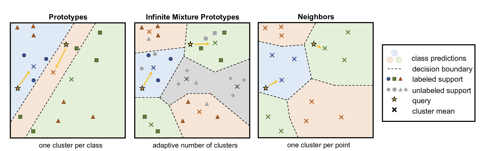{#fig-imp}

@fig-imp 도 데이터간의 복잡한 관계를 추출하기 위한 방법으로 소개된 **Infinite Mixture Prototypes (IMP)** 라는 구조에 대한 내용이다. 해당 구조는 @pmlr-v97-allen19b 논문에서 제안된 방식인데, 앞에서 언급된 Prototypical Networks 방식은 군집화가 이뤄진 데이터들의 대표값(Prototype)을 통해서 유사성을 계산하는 방식을 개선하고자 했다. 교수는 이 방식의 필요성에 대해서 예시를 들어 잠깐 설명했는데, 예를 들어 고양이란 class내에서도 