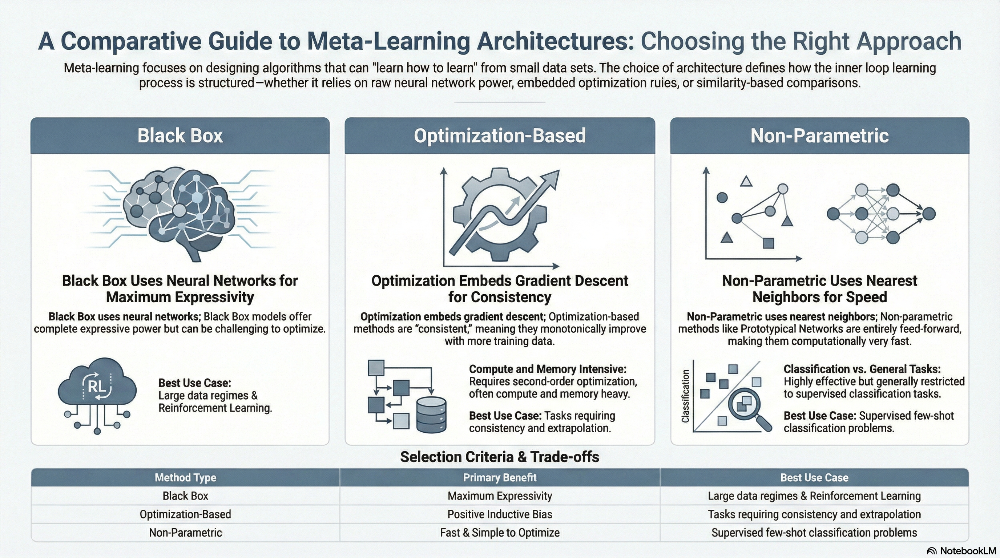
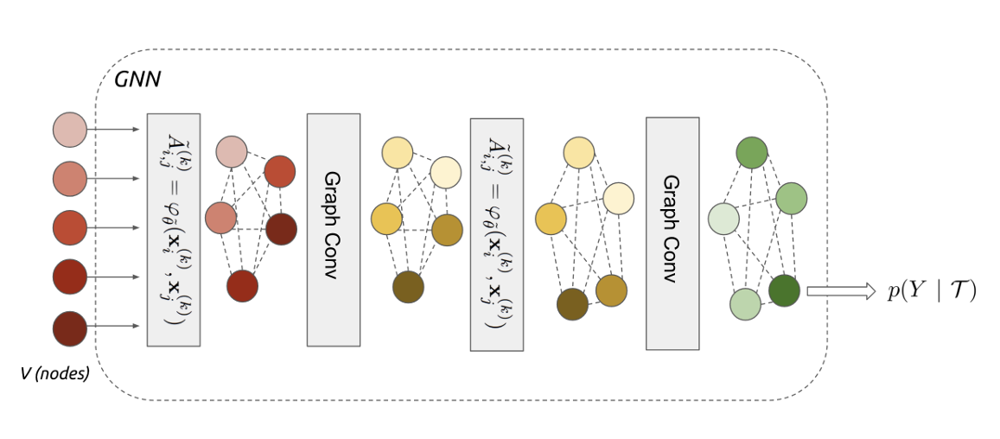
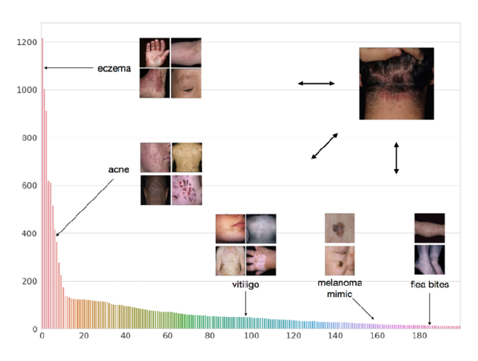
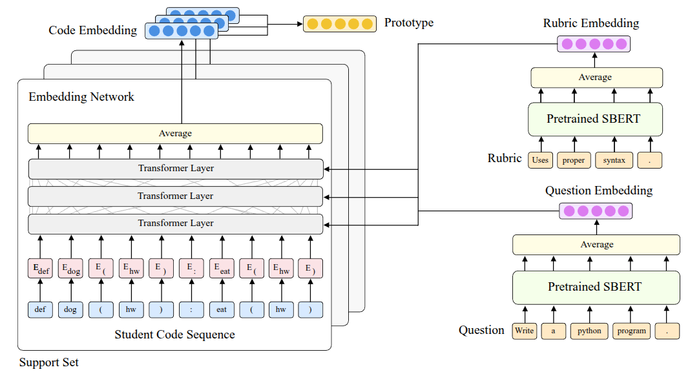
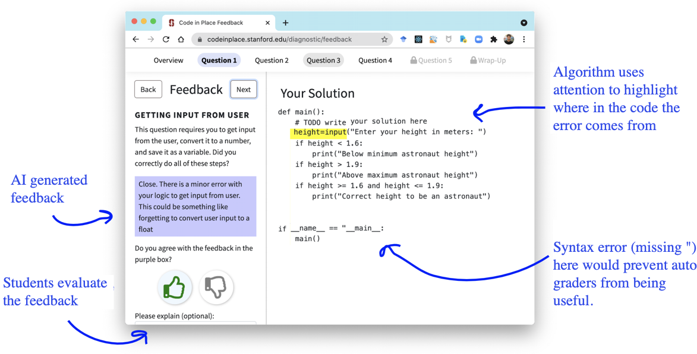

### Resource

::: {layout-ncol=2}
[](https://www.youtube.com/watch?v=SUJCgisKW1Y&list=PLoROMvodv4rNjRoawgt72BBNwL2V7doGI&index=6)

[](https://cs330.stanford.edu/materials/cs330_nonparametric_2023.pdf)
:::

## Lecture Summary with NotebookLM



## Recap

Previously, we discussed two meta-learning methodologies: **Black-Box Meta-Learning** and **Optimization-Based Meta-Learning**.

::: {#fig-parametric-approach layout-ncol=2}

{#fig-black-box}

{#fig-optimization}

:::

**Black-Box Meta-Learning** (@fig-black-box), which we mentioned first, is an approach that parameterizes the learning process itself by passing the training data $\mathcal{D}_{i}^{tr}$ through a massive neural network. It operates as a sort of black box without explicitly defining the inner workings of the neural network. Since the model's output can be controlled based on the training data, it has the advantage of being highly expressive, capable of representing a wide variety of learning procedures. However, its performance varies significantly depending on the hyperparameters, making the hyperparameter optimization process quite challenging.

**Optimization-Based Meta-Learning** (@fig-optimization), unlike the Black-Box Adaptation approach, internalizes optimization processes like Gradient Descent that occur within the inner-loop during training, solving the problem in the form of bi-level optimization. As shown in the figure, it can leverage a positive inductive bias in the outer-loop to learn task-specific information from the training data, allowing for slightly faster learning in the initial stages. Furthermore, thanks to the bi-level optimization process, it generally exhibits better extrapolation performance than the previous method when encountering new, unseen data. Above all, because it focuses on the optimization process, this method can be applied regardless of the model architecture (model-agnostic), and its expressive capacity generally improves as the network grows larger. However, the necessity of bi-level optimization leads to high computational and memory costs, and the training process can be unstable. We introduced various studies aimed at overcoming these challenges in the previous lecture.

In both methods introduced above, when a new, unseen task is presented during the meta-test phase, task-specific parameters ($\phi_i$) are defined within the learning process to solve it. In the Black-Box approach, the learning process itself is parameterized through a massive neural network, and in the Optimization-Based approach, parameters are updated via Gradient Descent in the inner-loop. This approach, where parameters are defined and learning proceeds based on them, is called **Parametric Learning**. However, performing learning through parameterization leads to increased computational and memory costs, as mentioned earlier, and requires a large amount of data to ensure generalized performance. These drawbacks are particularly pronounced in Optimization-based methods due to the execution of bi-level optimization. This raises the question: **Can we project or incorporate this learning process into the model without computing these parameters one by one?**

## Non-Parametric Methods

The aforementioned Parametric Models are basically models where assumptions about the data are predefined (e.g., assuming it follows a specific probability distribution), and the relationship between the input and output data is mathematically defined. In contrast, an approach that extracts meaning directly from the data without such assumptions (meaning the relationship is not explicitly defined mathematically) is called a **Non-Parametric Model**.


In fact, this concept existed long before the advent of neural networks. Well-known algorithms like Decision Trees, K-Nearest Neighbors (KNN), and Support Vector Machines (SVM) fall into this category. If you recall how each algorithm works, most of them can derive the relationships between data points in their current state, regardless of the amount of data available. Especially in a low data regime, it is evident that they are not only easier to implement than parametric methods but also perform quite well.

However, if we project this low data regime situation onto meta-learning, a very similar scenario occurs during the meta-test phase. Specifically, in cases like Few-Shot Learning performed during the meta-test, the model must estimate the correct label ($y^{ts}$) for an unseen task even when there are very few samples ($x^{ts}$) available. The parametric models mentioned earlier introduce drawbacks precisely during this process of inferring the task parameters $\phi_i$.

One possible approach to consider is a hybrid method: utilizing the previously introduced parametric models during the meta-train phase to learn representation methods across various tasks, and then employing a non-parametric model that leverages the extracted information during the meta-test phase where Few-Shot Learning actually occurs.

{#fig-non-parametric}

@fig-non-parametric illustrates an example of Few-shot classification that has been introduced many times before. The fundamental method shown in this figure is to compare the given test data ($x^{ts}$) during the meta-test phase with the data that was actually utilized during the meta-train phase. Regardless of the comparison method, if there is a highly similar data point among the existing training data, the model simply follows the label from that training data. The key question then becomes: "By what standard do we determine that the training data and the test data are similar?"

Common metrics for measuring similarity include the Euclidean Distance (or $\ell_2$ distance) and cosine similarity. First, let's assume we evaluate the similarity between the given images using the $\ell_2$ distance.

{#fig-unreasonable}

@fig-unreasonable illustrates one of the experimental results introduced in the @zhang2018unreasonable paper, where the task is to find the image most similar to the Reference image on the far right from the two image options on the left. To the human eye, the image on the right might appear more similar. However, when using the aforementioned $\ell_2$ distance or other standard similarity metrics like Peak Signal-to-Noise Ratio (PSNR), Structural Similarity Index (SSIM), or Feature-based Similarity Index (FSIM), the image on the left is actually evaluated as being more similar.

As such, in problems where images are provided as inputs, Non-parametric Learning performed with standard similarity-based metrics is highly likely to behave contrary to our intentions. Above all, how we define this distance function leaves room for it to be viewed as Parametric Learning from another perspective. Therefore, the approach proposed in the lecture is to **learn the method of measuring the metric itself by utilizing the meta-training data (Learn to Compare)**.

## Siamese Network for Non-Parametric Model

::: {#fig-siamese-network layout-ncol=2}


:::

The **Siamese Network**, first introduced in @Bromley1993SignatureVU, features a simple twin-like neural network architecture.  It consists of two identical neural networks that can each receive an input, configured in the exact same way to share the exact same parameters. In the original paper, the Siamese Network was introduced as an example for signature verification, and it was later advanced in @Koch2015SiameseNN, where this architecture was applied to One-shot learning. The approach proposed in that paper was to perform **Binary Classification** between the training data and the test data during the meta-train phase, rather than defining a predefined Similarity Metric as introduced earlier. If the training is successful, the Siamese Network will learn to output $1$ for similar images and $0$ for different images, as shown in @fig-siamese-network. This model is then utilized as a kind of **similarity evaluator** during the meta-test phase. Therefore, when test data is given, a pairwise comparison process is conducted by pairing the test data with each image in the existing support set. In this case, if $K$ test data points are given, a total of $N \times K$ forward passes are executed in the Siamese Network, yielding comparative probability values for each class. It operates in such a way that the class with the highest probability value is output as the final label for the test data.

However, the problem with this architecture is that, due to the nature of Binary Classification, it can only determine whether the training data sample and the test data are similar. Because the logic to determine which image is "more" similar among the given images is not reflected during training, a performance limitation arises accordingly. Since the learning objective performed in the meta-train phase (checking for a match with the ground truth) and the objective pursued in the meta-test phase (finding the label with the highest probability) are fundamentally different, this is often described as a **Mismatch**. For instance, it is akin to only checking whether an input is similar to the answer during training, but then being asked to find the data point closest to the answer during the testing phase.

Furthermore, the label inferred in the meta-test phase is defined as:

$$
\hat{y}_{ts} = \sum_{x_k, y_k \in \mathcal{D}^{tr}} \mathbb{1}(f_{\theta}(X_{ts}, x_k) > P_{pos}) y_k
$$

In the equation above, the indicator function $\mathbb{1}$ is a type of step function, meaning auto-differentiation cannot be performed on it. Therefore, the **Matching Network** algorithm, which will be explained next, introduces a method to overcome this limitation.

## Matching Networks for Non-Parametric Model

**Matching Networks**, introduced in @vinyals2016matching, were proposed to overcome the limitations derived from One-shot Learning using the aforementioned Siamese Network. Fundamentally, several tricks were applied to resolve the "mismatch between the training and testing environments."

{#fig-matching-network}

First, to resolve the mismatch issue, they attempted to find correspondences using the latent context within the data rather than the raw data itself. To achieve this, separate encoder networks were attached to extract context from both the training data and the test data. Once the training and test data are mapped into the embedding space, the similarity between them is calculated using methods like the dot product. Then, a softmax function ($a(x^{ts}, x_k) = \frac{\exp(\text{cos}(f(x^{ts}), g(x_k)))}{\sum_{x_j} \exp(\text{cos}(f(x^{ts}), g(x_j)))}$) is applied to these calculated similarity values to obtain weights (probabilities) across all training data.  The final label is then inferred through a kind of weighted sum, multiplying these obtained values by the actual ground truth labels of the training data:

$$
\hat{y}^{ts} = \sum_{x_k, y_k \in \mathcal{D}^{tr}} f_{\theta}(x^{ts}, x_k) y_k
$$

By replacing the previous indicator function with this softmax function, the equation becomes differentiable. This enables backpropagation through the error, allowing the parameters to be directly optimized end-to-end. Additionally, even in situations where multiple test data points are given ($K>1$), Matching Networks operate via a sort of voting mechanism utilizing the existing formula. Inference is performed by predicting the label that accumulates the most votes based on the similarities between the Support Set data and the test data. Expressing this entire process as an algorithm yields the following.

```pseudocode
#| html-indent-size: "1.2em"
#| html-comment-delimiter: "//"
#| html-line-number: true
#| html-line-number-punc: ":"
#| html-no-end: false
#| pdf-placement: "htb!"
#| pdf-line-number: true
#| label: algo-Matching-Networks

\begin{algorithm}
\caption{General Algorithm of Non-parametric approach}
\begin{algorithmic}
\State Sample task $\mathcal{T}_i \quad$ (or mini batch of tasks)
\State Sample disjoint datasets $\mathcal{D}_i^{tr}, \mathcal{D}_i^{ts}$ from $\mathcal{D}_i$
\State Compute $\hat{y}^{ts} = \sum_{x_k, y_k \in \mathcal{D}^{tr}} f_{\theta} (x^{ts}, x_k) y_k$
\State Update $\theta$ using $\nabla_{\theta}\mathcal{L}(\hat{y}^{ts}, y^{ts})$
\end{algorithmic}
\end{algorithm}
```

In this way, we can see that it operates as a Non-Parametric Model, eliminating the need for the task-specific parameters $\phi$ discussed in the previous lecture.

In fact, to perform this matching, the model internally calculates similarities and computes weights based on them. However, the problem lies in comparing each test data point **"independently"**. This independent pairwise comparison can lead to bias caused by an erroneous data point. If a specific data point is mislabeled or is an outlier, but happens to have a high similarity with the test data by chance, this incorrect result can easily overpower the other valid results. To address this issue, the lecture next introduces **Prototypical Networks**, an approach that aggregates the average information for each class to create a sort of prototype, rather than relying on individual examples.

:::{.callout-note}
Looking at the actual paper, the context encoder used for the Support Set is a Bi-directional LSTM $g_{\theta}$, and the encoder used for the Query Set is an Attention-based LSTM $h_{\theta}$ that is conditioned on the embedding results of the Support Set.  The lecture points out that this is the specific architecture chosen by the authors. The paper also mentions that they utilized the LSTM structure to consider the relationships among other elements within the dataset together, rather than looking at a single data point entirely independently. A similar question was raised during the lecture, and the professor explained that it is perfectly fine to use the same encoder for both. While the original paper employed a complex LSTM-based structure, subsequent research, including the **Prototypical Networks** discussed later, has generally simplified this to a generalized form by using identical encoders.
:::

## Prototypical Networks for Non-Parametric Model

As mentioned earlier, to overcome the limitations of Matching Networks—where valid results can be overpowered due to independent judgments on each test data point—the proposed idea was to aggregate the information of the data points for each class to create a single representative value (prototypical embedding), rather than comparing the distance to each individual training data point one by one. If classification proceeds by comparing the distance only to these representative values (Nearest Neighbors to the prototypes) rather than to individual data points when new test data arrives, the aforementioned limitations could be overcome. This very method was introduced in the paper by @snell2017prototypical under the name **Prototypical Networks**.

{#fig-prototypical-networks}

@fig-prototypical-networks visually represents the method introduced above. If we want to determine the class of the white dot, $x$, the prototype for each class is calculated as follows.  This is the process of computing the average of the embedded data points for each class.

$$
c_n = \frac{1}{K} \sum_{(x_k, y_k) \in \mathcal{D}_i^{tr}} \mathbb{1}(y == n) f_{\theta}(x_k)
$$

Subsequently, if we define the distance between the given test data and the prototype ($c_n$) as $d(c_n, x_k^{ts})$, the probability that $y=n$ can be calculated by applying the softmax function as shown in @eq-prototype-softmax. Note that since a smaller distance implies higher similarity, it enters the equation in a negative form ($-d$).

$$
p_{\theta}(y_k=n \vert x_k) = \frac{\exp(-d(f_{\theta}(x), c_n))}{\sum_{n'}\exp(-d(f_{\theta}(x), c_{n'}))}
$${#eq-prototype-softmax}

For reference, the professor added further explanation regarding this distance function $d$. Several studies, including the paper by @snell2017prototypical, used fixed functions such as Euclidean distance or Cosine similarity to measure similarity. (In particular, the Prototypical Networks paper mathematically proved the significant contribution to performance of choosing Euclidean distance as this distance function.) 

Going one step further, the professor explained that **the method of calculating this distance itself can also be learned by a neural network**. If this idea is applied, the model will optimize not only the parameters $\theta_f$ of the neural network that embeds the data, but also the parameters $\theta_d$ of the neural network that calculates the distance, meaning the training will proceed in the form of $\min_{\theta_f, \theta_d} \mathcal{L}(\hat{y}, y)$.

## Challenges and Ideas

As introduced earlier, calculating the embedding space for the given data and estimating the test data's label through the Nearest Neighbor method is the most common approach one might consider in Non-parametric techniques. However, as previously mentioned, this method also has its limitations. Rather than evaluating individual data points independently or relying on similarity found through simple distance measurements, it is necessary to consider how to handle the complex underlying relationships embedded among the data points.

{#fig-relation-networks}

@fig-relation-networks illustrates an architecture called **Relation Networks**, introduced in the paper by @sung2018learning, which is a method of training a neural network to perform the distance calculation process briefly mentioned earlier.  Previous methods utilized predefined distance functions like $\ell_2$ Distance or Cosine Similarity after embedding; however, in this case, it was difficult to accurately calculate the similarities between data points with complex relationships. To solve this, the paper first extracts the feature maps of the test data and training data through an embedding module ($f_\phi$) and then concatenates these feature maps. Afterwards, by feeding this output into the subsequent relation module ($g_\phi$), the model is designed to estimate the test data's label based on the resulting Relation Score.

{#fig-imp}

@fig-imp also describes an architecture called **Infinite Mixture Prototypes (IMP)**, introduced as a method for extracting complex relationships between data points.  This architecture was proposed in the paper by @pmlr-v97-allen19b to improve upon the aforementioned Prototypical Networks, which calculate similarity through the representative value (Prototype) of clustered data. The professor briefly explained the necessity of this method with an example: even within the 'cat' class, there might be unusual breeds that look similar to dogs. If we force such cases into a single prototype, the performance will actually degrade. Therefore, the idea proposed in the paper is not to unconditionally assign a single prototype per class, but to adaptively generate multiple prototypes based on the actual distribution of the data. Consequently, the number of clusters can also be flexibly adjusted, allowing the model to handle complex relationships between data points.

{#fig-gnn}

@garcia2017few introduced a method of utilizing the **Graph Neural Network (GNN)** architecture shown in @fig-gnn for Few-shot Learning.  The professor did not explain the architecture or the Message Passing detailed in the paper in depth, as it falls outside the scope of the lecture, but briefly touched upon the core idea. First, to resolve the aforementioned complex relationships among data points, the individual training and test data points are not viewed independently, but rather as Nodes within a single large Graph. Then, embedding data is extracted through Graph Convolutional Layers. During this process, Iterative Message Passing occurs between the nodes—meaning they continuously exchange information with one another. The overall operational principle is that, based on the updated information of these Nodes, the model infers the probability value of which class the new test data belongs to. For an in-depth understanding, it was recommended to refer to the Message Passing techniques or Undirected Graphical Models covered in Professor Stefano Ermon's [CS236.Deep Generative Models](https://deepgenerativemodels.github.io/) course.

:::{.callout-note title="Graph Neural Network"}
The Graph Neural Network is a neural network architecture where the idea of directly processing graph data structures was first proposed in @gori2005new, and its mathematical foundation was subsequently and formally defined in @Scarselli2029GraphNN. While conventional architectures like MLPs, CNNs, and RNNs are specialized for receiving structured data like images or sequential data like time-series (data typically described as lying in a Euclidean space), GNNs are designed to learn under the assumption that data consists of nodes and edges with irregular sizes and shapes (Non-Euclidean space).  Therefore, while the former relies on the i.i.d. assumption—that data points are fundamentally sampled from independent distributions—the latter assumes that explicit relationships exist between the data points. A key characteristic of GNNs is that they yield the same results regardless of the input order (permutation invariance). In particular, @kipf2016semi utilized this concept to introduce the **Graph Convolutional Network (GCN)**, an improved architecture trained by stacking layers sequentially, much like a CNN.
:::

## Case Study

While the lecture materials continued with the differences between each Meta-Learning algorithm, the actual lecture first introduced real-world case studies of Non-Parametric Few-shot Learning.

{#fig-prototypical-clustering}

The case study introduced in the previous year's lecture was the Dermatological Image Classification (@prabhu2018prototypical) research presented at the Machine Learning for Healthcare Conference (ML4HC). The problem this paper aimed to solve was accurately classifying numerous types of skin diseases and conditions based on skin images from various people. Generally, there is a vast variety of skin diseases, and since the amount of data is extremely small, especially for rare diseases, it was defined as a problem where Few-shot Learning could be usefully applied. Here, they used the previously introduced Prototypical Networks, but modified it slightly—similar to IMP—to have multiple prototypes. By generating multiple prototypes for a single disease, they were able to achieve good results.

The newly introduced case study in this lecture was an application of Meta-Learning to generate feedback for students in "Code in Place", a free, public course hosted by Stanford. (@wu2021prototransformer - [Paper](https://arxiv.org/abs/2107.14035), [Blog](https://ai.stanford.edu/blog/prototransformer/))

:::{.callout-note title="Code in Place"}
CS106A **Code In Place**, a course hosted by Stanford, is an introductory class teaching topics in computer science. It is publicly available for free and operates with the support of over 12,000 students and 1,120 volunteer teachers from around 150 countries worldwide.
:::

The goal in this context was to provide detailed feedback on the code submitted by students worldwide after completing their assignments. The format of the submitted code would vary for each student, and manually reviewing and providing feedback on all of them would be a massive workload taking approximately 8 months. To resolve this, they aimed to create a model that uses a grading Rubric for a specific problem to provide assigned feedback based on the user's input. However, the reason it was difficult to apply standard Supervised Learning was that evaluating the submissions required expertise, and manual labeling consumed a lot of time, resulting in a very small amount of data. In addition, the students' submissions came in highly diverse formats, forming a highly varied distribution (Long-tailed Distribution). Coupled with the fact that assignment contents could change depending on the instructor, this made it a difficult problem to solve using simple ML techniques.

Therefore, they attempted to solve this with Meta-Learning by representing the individual evaluation items of the aforementioned Rubric as different few-shot tasks. Here, the premise was that the Rubric consists of multiple items, and specific sub-items could be selected for each item. The data used for training consisted of 63 questions extracted from 4 midterms and 4 finals conducted in the CS106 course, along with the submitted answers from over 24,800 students.

The first method they tried was based on the Prototypical Networks (@eq-prototype-softmax) by @snell2017prototypical introduced earlier. They proposed a structure called **ProtoTransformer**, which applies the RoBERTa (@liu2019roberta) model—a heavily layered transformer architecture—as the method for extracting the embedding space. Through this model, they aimed to input Python code and extract embedding information about the code as the output. However, simply using it like this did not yield good performance, so they applied a few tricks to improve it:

- **Task Augmentation**: First, to overcome the lack of training data, they created and co-trained additional self-supervised tasks that predicted compile errors occurring in Python code or predicted Masked Tokens used in Language Models.
- **Side Information**: Rather than inputting just the code, they inputted the names of Rubric items or the text of the problem itself as supplementary information to try and reduce the ambiguity that can occur during Few-shot Learning.
- **Pre-train**: Instead of starting with randomly initialized weights from the beginning, they brought in the weights of CodeBERT (@feng2020codebert), which had been pre-trained on code publicly available on the internet (the CodeSearchNet dataset (@husain2019codesearchnet)).



The evaluation of this model was first conducted using an offline dataset, and a held-out test was performed to measure its generalization performance. During this phase, they evaluated submitted codes against a Held-out Rubric—meaning a "new Rubric" the model had never seen during the training process—and also conducted a test targeting a Held-out Exam, which involved new exam questions not present in the training data.

First, for the Held-out Rubric case, the performance was better than both human evaluation and standard Supervised methods; however, for the Held-out Exam, the performance fell short compared to human graders. In fact, since entirely new forms of code or variables can appear in the latter case, it has a significantly higher difficulty level than the Held-out Rubric case, confirming that there is still room for performance improvement.

Based on these experimental results, it was clear that the ProtoTransformer model did not simply memorize existing answers, but demonstrated how quickly and accurately it could generalize to new environments, such as new grading criteria or new questions.

{#fig-feedback}

In practice, they built a UI like @fig-feedback to provide students with the AI-generated feedback. They also created a separate evaluation window where students could rate whether the feedback they received was helpful or not. When students actually evaluated the AI feedback, it received slightly higher scores than the feedback provided by humans. To check for any potential bias, they also validated the results against gender and country-specific data, confirming that the AI graded fairly across these demographics as well.

## Properties of Meta-Learning Algorithms

Through the lectures so far, we have covered the Parametric Black-box Approach (which treats task information as a kind of parameter), the Optimization-based Approach, and the Non-parametric Approach. I would like to summarize these by comparing each approach to determine which method is appropriate for the problem that needs to be solved.

### Computation Graph perspective

All three methods can be viewed as a single, massive neural network that takes training data ($\mathcal{D}^{tr}_i$) and new test data ($x^{ts}$) as inputs to estimate the label ($y^{ts}$) for the test data. Therefore, while their internal structures may look completely different on the surface, they all take the exact same form in terms of the internally processed steps (computation graph). The specific difference lies in how the predicted values are derived within the **inner-loop**.

The Black-box approach passes data directly through a neural network, such as an RNN, without any structural constraints. The Optimization-based approach internalizes the Gradient Descent optimization process itself so that it can be handled within the inner-loop. Finally, the Non-parametric approach estimates predicted values by calculating Nearest Neighbor-based Similarity within the projected Embedding space. Because they operate similarly from a computation graph perspective, it is possible to create Hybrid models that combine the internal components of each approach to highlight their respective advantages.

The professor introduced three related papers regarding this:

- The first is **Class-Aware Meta-Learning (CAML)** (@Jiang2018LearningTL), which is a combination of the Black-box method and the Optimization-based method. It conditions the neural network that makes inferences based on the data, while internally proposing an optimization process that performs Gradient Descent.
- The second paper, **Latent Embedding Optimization (LEO)** (@rusu2018meta), combined the Non-parametric and Optimization-based methods. Its basic framework follows the approach of directly learning a distance function, like the previously introduced Relation Networks, but it operates by performing Gradient Descent on the Embedding Space derived from this.
- The lastly introduced **Proto-MAML** (@Triantafillou2020Meta-Dataset) is also a hybrid method combining the Non-parametric and Optimization-based approaches. Fundamentally, it uses the Optimization-based method, MAML, but attempts to combine the strengths of both by initializing the final layer of the neural network with the previously introduced Prototypical Networks and training it during Meta-training.

### Algorithmic properties perspective

The lecture also compared the mathematical and algorithmic properties of each approach. The main aspects to examine here are **Expressive Power** and **Consistency**.

- **Expressiveness**: This refers to the learning model's ability to represent and depict a diverse and broad range of learning procedures. The higher a model's expressive power, the more advantageous it is in terms of scalability in environments where massive meta-training data is provided, as well as its applicability in complex domains.
- **Consistency**: This refers to the property that guarantees the model's performance will consistently improve as more training data is provided to it. Simply put, since securing more data guarantees better performance, ensuring this property reduces the strict need to gather a massive amount of task-related data during the meta-training phase. Furthermore, even if an out-of-distribution (OOD) task appears during the meta-test phase, a consistent model can still achieve much more stable and reasonable performance.

From these perspectives, the characteristics of each approach can be listed as follows:

| Aspect | Black-box | Optimization | Non-parametric |
|---------|:-----|------:|:------:|
| Expressiveness      | Complete Expressive   |    Expressive only for very deep models |   Mostly expressive  |
| Consistency     | Not consistent  |   Consistent; reduces to Gradient Descent |  Consistent only under specific conditions   |
| Advantages       | Easy to combine with other methodologies like SL and RL    | Positive inductive bias, model diversity |   Requires few resources and is easy to optimize    |
| Disadvantages       | Hard to optimize and data-inefficiency    |     Computationally expensive due to second-order optimization |   Hard to generalize    |

: Characteristics, Pros, and Cons by Meta-Learning Algorithm

From the perspective of expressive power, the Black-box approach possesses complete expressive power because it can approximate any form of function. The Optimization-based approach also exhibits high expressive power provided the neural network is sufficiently deep, and the Non-parametric approach has excellent expressive power in most architectures. On the other hand, the methods differ slightly in terms of consistency. The Black-box approach, which relies heavily on data characteristics, does not unconditionally guarantee performance improvement just because the amount of data increases. In contrast, the Optimization-based approach strongly guarantees consistency because it inherently includes the process of optimizing on the given data. The lecture also explains that the Non-parametric approach maintains consistency as long as data information is not lost during the transition to the Embedding space.

Summarizing the pros and cons, the Black-box approach is easy enough to handle that it can be seamlessly utilized alongside Supervised Learning or Reinforcement Learning. However, because task information (inductive bias) is not provided in the initial stages, training can be unstable. Additionally, there is an element of inefficiency due to its heavy reliance on data. Unlike the Black-box approach, the Optimization-based approach provides an inductive bias early on, which allows for stable execution at the beginning of training. While it can be used without needing to consider the structural characteristics of the model, it has the disadvantage of consuming a large amount of computing resources due to the nested optimization processes. Finally, the Non-parametric approach does not perform optimization during the meta-test phase like the other methods do; it can be executed entirely through a feedforward process, making computations faster and consuming far fewer computing resources. On the downside, this method has predominantly been applied only to Classification tasks so far, presenting challenges in terms of scalability.

Furthermore, regarding the criteria for selecting an algorithm, the ability to infer the ambiguity of a problem during the learning process—being **Uncertainty-aware**—must also be considered. The lecture explained that this aspect will be highly useful for problem-solving in areas covered later, such as Active Learning, Safety-critical settings, and Reinforcement Learning.

## Summary

Through the previous section, we covered the fundamental algorithms dealt with in Meta-Learning: the Black-box Approach, the Optimization-based Approach, and the Non-parametric Approach, briefly introducing the pros and cons of each. In particular, regarding the Non-parametric Approach covered in this lecture, rather than parameterizing the task information, it estimates predicted values by determining similarity using the Nearest Neighbor method—a technique widely used in traditional machine learning. Furthermore, it introduced improved architectures like Matching Networks and Prototypical Networks, which learn the metric itself and consider aspects like data correlation and robustness. Finally, by sharing practical applications, it demonstrated that excellent results can be achieved by utilizing Meta-Learning even in Non-parametric Few-shot Learning.

Considering their algorithmic characteristics, the professor mentioned that in actual benchmarks, all three methods generally show similarly good performance as long as they are tuned well. However, she explained that you can choose a different approach depending on the definition or conditions of the problem you are facing. For instance, the professor shared the following empirical suggestions:

- If data is abundant, you can choose the **Black-box** approach.
- If generalized performance is critical even in Out-of-Distribution (OOD) situations, the **Optimization-based** approach is preferable.
- If there is a need to quickly apply a model to a Classification problem, you might opt for the **Non-parametric** approach.

Finally, addressing a closing question, an answer was provided regarding the different directions of Multi-task Learning and Meta-Learning. The professor added a supplementary explanation noting that Meta-Learning generally requires the capacity to handle a massive number of tasks; if you only need to address a small, specific set of tasks, Multi-task Learning is actually the more appropriate choice.

