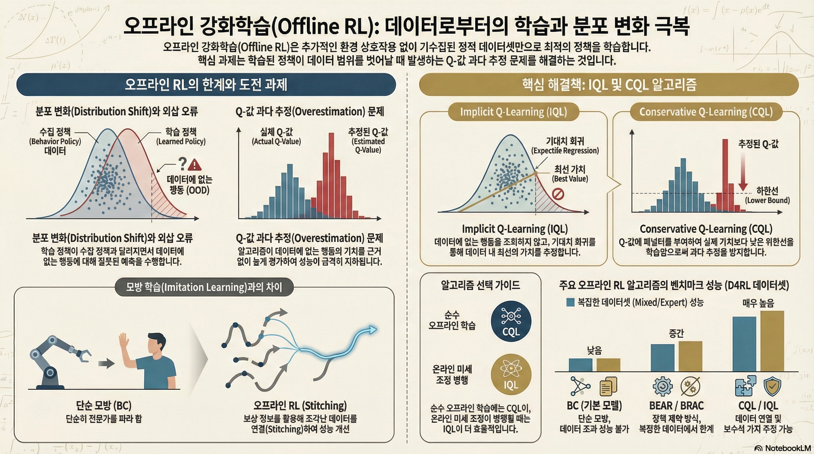

### 강의 및 자료

::: {layout-ncol=2}
[](https://www.youtube.com/watch?v=lRDaXnPIzks&list=PLoROMvodv4rPwxE0ONYRa_itZFdaKCylL&index=7)

[](https://cs224r.stanford.edu/slides/07_cs224r_offline_rl_2025.pdf)
:::

## Lecture Summary with NotebookLM



## Recap

이전 강의를 통해서 강화학습의 대표적인 알고리즘 형태인 Policy Gradient와 Actor-Critic Methods, Q-Learning에 대해서 다뤘다. 강화학습의 궁극적인 목표는 모델이 수집한 데이터를 바탕으로, 결과에 도달했을 때 받을 수 있는 총 보상합의 기대치가 최대치가 되는 policy를 학습하는 것이었다. 이를 위해서 전체 trajectory를 모아놓고, 평균보다 좋은 보상을 받은 trajectory를 이끈 행동에 대해서는 더 하게끔 하고, 안좋은 보상을 받은 trajectory를 유발한 행동에 대해서는 덜 하게 하는 **Policy Gradient** 방식이 있었고, 현재 State에 대한 가치를 추정해(Critic), 이에 기반하여 총 보상합의 기대치를 높이는 action을 취하는(Actor) **Actor-Critic** 방식도 있었다. 그리고 Actor에 대한 별도의 학습없이 현재 state에 대한 가치의 추정값이 최대화가 되는 action을 취하게끔 사전에 정책을 정의한 **Q-Learning** 같은 방법도 있었다. 그 중 이번 강의에서 다룰 **Offline RL** 과 크게 연관되어 있는 Off-Policy Actor-Critic Method의 알고리즘을 다시 살펴보자.

```pseudocode
#| html-indent-size: "1.2em"
#| html-comment-delimiter: "//"
#| html-line-number: true
#| html-line-number-punc: ":"
#| html-no-end: false
#| pdf-placement: "htb!"
#| pdf-line-number: true
#| label: algo-Replay-Buffer

\begin{algorithm}
\caption{Full Off-policy Actor-Critic Method}
\begin{algorithmic}
\State take action $a \sim \pi_{\theta}(a \vert s)$, get $(s, a, s', r)$, store in $\mathcal{R}$
\State Sample a batch $\{s_i, a_i, r_i, s_i'\}$ from replay buffer $\mathcal{R}$
\State Update $\hat{Q}_{\phi}^{\pi}$ using targets $y_i = r_i + \gamma \hat{Q}^{\pi}_{\phi}(s_i', a_i')$ where $a_i' \sim \pi_{\theta}(\cdot \vert s_i')$
\State $\nabla_{\theta} J(\theta) \approx \frac{1}{N} \sum_i \nabla_{\theta} \log \pi_{\theta}(a_i^{\pi} \vert s_i) \hat{Q}^{\pi}(s_i, a_i^{\pi})$ where $a_i^{\pi} \sim \pi_{\theta}(a \vert s_t)$
\State $\theta \leftarrow \theta + \alpha \nabla_{\theta} J(\theta)$
\State Repeat 1 to 5 until convergence
\end{algorithmic}
\end{algorithm}
```

해당 강의에서도 언급된 내용이지만, Off-policy 방법은 현재 학습중인 policy가 아닌 과거의 policy들이 수집한 경험 trajectory를 일종의 **replay buffer**에 저장해두고, 이 buffer로부터 trajectory를 샘플링해서 Value function과 Policy를 반복적으로 업데이트하는 방식이다. 이는 현재 학습중인 policy로 경험을 쌓고, 학습을 반복하는 On-policy의 Sample Efficiency가 낮은 단점을 보완할 수 있지만, 수집된 데이터를 통해서 Value function을 추정하는 과정이 포함되기 때문에 데이터가 전체 환경의 다양성을 대변할만큼 충분한 커버리지를 가지고 있어야 한다. 

사실 이렇게 과거의 정책들이 수집한 trajectory를 샘플링해서 학습을 수행하긴 하지만, 정작 value function을 추정하기 위해 취하는 action은 현재 학습중인 policy에서 도출되어야 하기 때문에, 여전히 환경과의 interaction이 이뤄져야 한다. 다시 말해, 지금까지 언급된 알고리즘 모두 환경과의 interaction이 학습중에 이뤄져야 하는 **Online** 설정이 기본적으로 전제되어야 한다. 그러면 여기에서 한가지 던질수 있는 질문은 **"과연 환경과의 interaction없이 static한 데이터셋만으로도 모델을 학습시킬 수 있을까?"**이다. 이 질문에 대한 답변이 이번 강의에서 다뤘던 Offline RL에서 추구하고자 하는 목적이기도 하다.

## Why Offline RL?