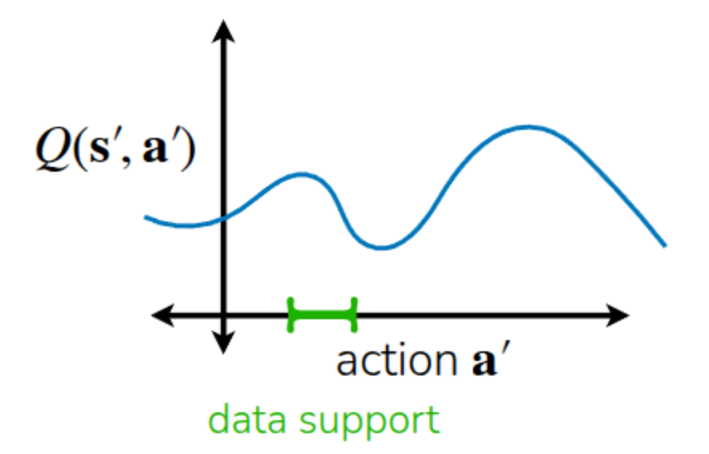
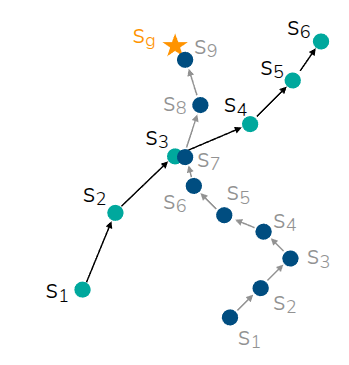
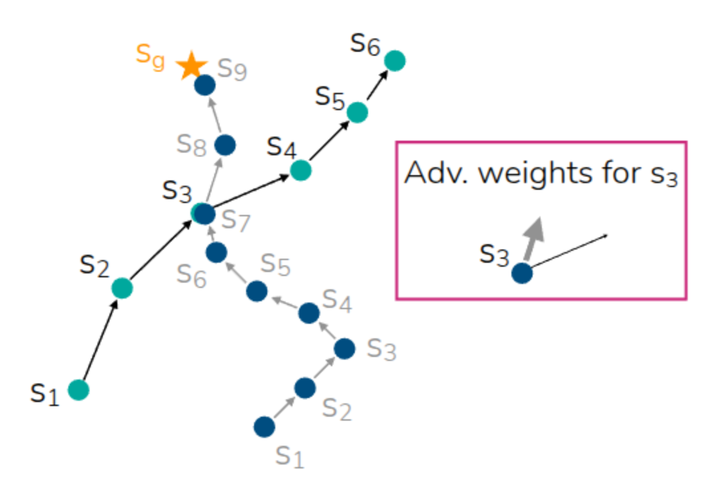
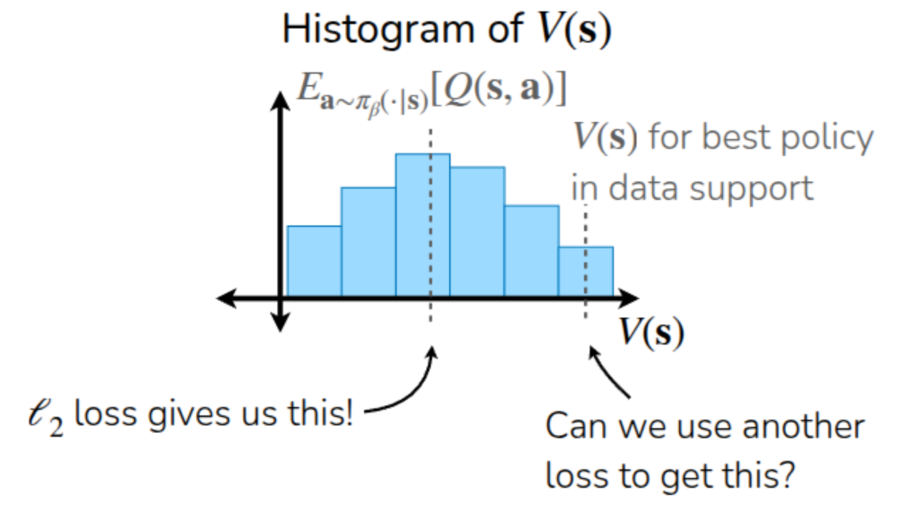
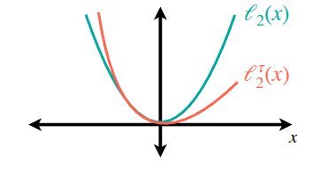
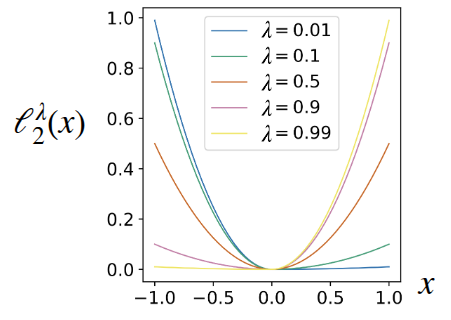
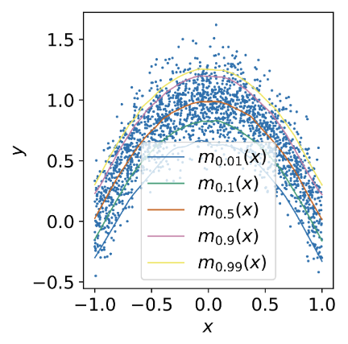

### 강의 및 자료

::: {layout-ncol=2}
[](https://www.youtube.com/watch?v=lRDaXnPIzks&list=PLoROMvodv4rPwxE0ONYRa_itZFdaKCylL&index=7)

[](https://cs224r.stanford.edu/slides/07_cs224r_offline_rl_2025.pdf)
:::

## Lecture Summary with NotebookLM


## Recap

이전 강의를 통해서 강화학습의 대표적인 알고리즘 형태인 Policy Gradient와 Actor-Critic Methods, Q-Learning에 대해서 다뤘다. 강화학습의 궁극적인 목표는 모델이 수집한 데이터를 바탕으로, 결과에 도달했을 때 받을 수 있는 총 보상합의 기대치가 최대치가 되는 policy를 학습하는 것이었다. 이를 위해서 전체 trajectory를 모아놓고, 평균보다 좋은 보상을 받은 trajectory를 이끈 행동에 대해서는 더 하게끔 하고, 안좋은 보상을 받은 trajectory를 유발한 행동에 대해서는 덜 하게 하는 **Policy Gradient** 방식이 있었고, 현재 State에 대한 가치를 추정해(Critic), 이에 기반하여 총 보상합의 기대치를 높이는 action을 취하는(Actor) **Actor-Critic** 방식도 있었다. 그리고 Actor에 대한 별도의 학습없이 현재 state에 대한 가치의 추정값이 최대화가 되는 action을 취하게끔 사전에 정책을 정의한 **Q-Learning** 같은 방법도 있었다. 그 중 이번 강의에서 다룰 **Offline RL** 과 크게 연관되어 있는 Off-Policy Actor-Critic Method의 알고리즘을 다시 살펴보자.

```pseudocode
#| html-indent-size: "1.2em"
#| html-comment-delimiter: "//"
#| html-line-number: true
#| html-line-number-punc: ":"
#| html-no-end: false
#| pdf-placement: "htb!"
#| pdf-line-number: true
#| label: algo-Off-Policy-Actor-Critic

\begin{algorithm}
\caption{Full Off-policy Actor-Critic Method (SAC)}
\begin{algorithmic}
\State take action $a \sim \pi_{\theta}(a \vert s)$, get $(s, a, s', r)$, store in $\mathcal{R}$
\State Sample a batch $\{s_i, a_i, r_i, s_i'\}$ from replay buffer $\mathcal{R}$
\State Update $\hat{Q}_{\phi}^{\pi}$ using targets $y_i = r_i + \gamma \hat{Q}^{\pi}_{\phi}(s_i', a_i')$ where $a_i' \sim \pi_{\theta}(\cdot \vert s_i')$
\State $\nabla_{\theta} J(\theta) \approx \frac{1}{N} \sum_i \nabla_{\theta} \log \pi_{\theta}(a_i^{\pi} \vert s_i) \hat{Q}^{\pi}(s_i, a_i^{\pi})$ where $a_i^{\pi} \sim \pi_{\theta}(a \vert s_t)$
\State $\theta \leftarrow \theta + \alpha \nabla_{\theta} J(\theta)$
\State Repeat 1 to 5 until convergence
\end{algorithmic}
\end{algorithm}
```

해당 강의에서도 언급된 내용이지만, Off-policy 방법은 현재 학습중인 policy가 아닌 과거의 policy들이 수집한 경험 trajectory를 일종의 **replay buffer**에 저장해두고, 이 buffer로부터 trajectory를 샘플링해서 Value function과 Policy를 반복적으로 업데이트하는 방식이다. 이는 현재 학습중인 policy로 경험을 쌓고, 학습을 반복하는 On-policy의 Sample Efficiency가 낮은 단점을 보완할 수 있지만, 수집된 데이터를 통해서 Value function을 추정하는 과정이 포함되기 때문에 데이터가 전체 환경의 다양성을 대변할만큼 충분한 커버리지를 가지고 있어야 한다. 

사실 이렇게 과거의 정책들이 수집한 trajectory를 샘플링해서 학습을 수행하긴 하지만, 정작 value function을 추정하기 위해 취하는 action은 현재 학습중인 policy에서 도출되어야 하기 때문에, 여전히 환경과의 interaction이 이뤄져야 한다. 다시 말해, 지금까지 언급된 알고리즘 모두 환경과의 interaction이 학습중에 이뤄져야 하는 **Online** 설정이 기본적으로 전제되어야 한다. 그러면 여기에서 한가지 던질수 있는 질문은 **"과연 환경과의 interaction없이 static한 데이터셋만으로도 모델을 학습시킬 수 있을까?"**이다. 이 질문에 대한 답변이 이번 강의에서 다뤘던 Offline RL에서 추구하고자 하는 목적이기도 하다.

## Why Offline RL?

**Online RL**을 하기 위해서는 On-Policy던, Off-Policy간에 환경과의 interaction이 전제되어야 한다. 즉, 데이터를 수집하고, 이를 기반으로 policy를 학습하되, 현재 policy가 수집한 최신 데이터로 학습할 것이냐(On-Policy), 과거의 여러 policy가 수집한 이전 데이터로 학습할 것이냐(Off-Policy)의 차이인 것이다. 반면 **Offline RL**에서는 이런 전제없이, static 데이터셋만으로 policy를 학습한다. 이때의 데이터는 동일한 MDP 환경에서 수행한 어떠한 데이터셋도 상관이 없다. 사람이 수집해도 상관이 없고, 잘 학습된 모델이나 그렇지 않은 모델이 환경을 탐색하면서 수집한 데이터도 모두 Offline RL에서 활용할 수 있다. 무엇보다도 타 방법론에 비해서 Sample Efficiency가 크게 떨어지는 강화학습에서 데이터를 효율적으로 재사용할 수 있다는 장점이 크다. 일반적으로 Offline RL을 적용할 수 있는 사례는 실제로 Online RL을 통해서 데이터를 수집하기 어렵거나, 또는 데이터 수집을 위한 탐색 과정이 위험한 경우에 많이 활용된다. 대표적으로 강화학습을 통해서 자율주행 모델 학습이나 의료 모델을 학습시킨 내용이 실제 환경에 적용된 대표적인 예시가 되지 않을까 생각한다. 참고로 **Offline-to-Online (O2O) RL** 과 같은 Offline RL과 Online RL이 적절하게 조합된 주제도 존재한다.

그래서 Offline RL에서 활용되는 Notation을 정리해보면 다음과 같다.

- Offline Dataset ($\mathcal{D} : \{(s, a, s', r)\}$) : 정의되지 않은 policy $\pi_{\beta}$ 로부터 샘플링된 데이터. 이전 Off-Policy RL에서는 $\pi_{\beta}$ 를 **Behavior Policy**라고 표현했으며, 정의되지 않았기 때문에 다양한 policy들의 조합으로도 볼 수 있다.
- State ($s \sim p_{\pi_{\beta}}(\cdot)$) : Behavior Policy $\pi_{\beta}$ 가 겪었던 State
- Action ($a \sim \pi_{\beta}(\cdot \vert s)$) : Behavior Policy $\pi_{\beta}$ 가 State $s$ 에서 취했던 Action
- Next State ($s' \sim p(\cdot \vert s, a)$) : Behavior Policy $\pi_{\beta}$ 가 State $s$ 에서 action $a$를 취했을 때의 State Transition
- Reward ($r = r(s, a)$) : 해당 환경에서 정의된 Reward function

교수는 이에 대한 예시로 자율주행 차량을 Offline RL로 학습시키는 과정을 들어 설명했는데, 실제로 차량마다 동일한 목적지를 가더라도 다양한 경로를 가기도 하고, 혹은 차량을 운전하는 운전자에 따라서도 수집된 데이터가 다 다를 것이고, 이에 따라서 궁극적으로 학습된 policy도 이런 다양한 behavior policy들의 weighted average 형태가 될 것임을 언급했다. Offline RL의 Objective도 Online 과 유사하게 미래에 얻을 총 보상합의 기대값을 최대화하는 것($\max_{\theta} \mathbb{E}_{p_{\theta}(\tau)}[\sum_{t} r(s_t, a_t)]$)인데, 유념해야 할 부분은 이 때 보상을 최대화하기 위해 수행될 policy는 앞에서 언급한 behavior policy $\pi_{\beta}$ 가 아닌, 학습될 policy $\pi_{\theta}$ 라는 것이다. 일반적인 지도학습이나 강화학습 알고리즘은 학습에 사용하는 데이터와 실제 테스트시 경험할 데이터가 동일한 분푸에서 샘플링된다는 i.i.d 가정을 전제로 두지만, 위와 같이 행하는 policy에서 차이가 발생하면(보통 이런 현상을 **Distribution Shift**라고 표현한다.), 해당 가정이 깨지면서 실제 환경에서 수행시 데이터셋에 존재하지 않는 action(**Out-of-Distribution action**)에 대해서는 잘못된 가치 평가를 하게될 가능성이 크다. 이 부분에 대한 내용은 뒤에서 Overestimation이란 내용으로 이어서 언급된다.

## Can we just use off-policy algorithms?

사실 과거의 정책들이 쌓은 경험을 바탕을 학습한다는 측면에서 바라보면 이전에 다뤘던 Off-policy 방법론과 유사하다. 먼저 Soft Actor-Critic(SAC)에서의 학습 과정을 다시 살펴보자.

- **Q-function Update**: $\min_{\phi} \sum_{(s, a, s') \sim \mathcal{D}} \Vert \hat{Q}_{\phi}^{\pi_{\theta}}(s, a) - \Big(r(s, a) + \gamma \mathbb{E}_{\color{red} {a' \sim \pi_{\theta}(\cdot \vert s')}}[\hat{Q}^{\pi_{\theta}}_{\phi}(s', {\color{red} a'})] \Big) \Vert^2$
- **Policy Update**: $\nabla_{\theta}J(\theta) \approx \frac{1}{N} \sum_i \nabla_{\theta}\log \pi_{\theta}(a_i^{\pi} \vert s_i) \hat{Q}_{\phi}^{\pi_{\theta}}(s_i, a_{i}^{\pi})$ where $a_i^{\pi} \sim \pi_{\theta}(a \vert s)$

기존 Off-policy를 학습할 때, 모델은 현재 학습중인 policy를 update하기 위해서는 다음 state $s'$ 에서 취할 다음 action $a'$ 에 대한 Q-value를 계산해야 한다. 하지만 이는 현재 학습주인 policy $\pi_{\theta}$ 에서 뽑히는 action이지, 이전의 behavior policy $\pi_{\beta}$ 가 쌓은 데이터 내에는 없을 가능성이 존재한다. Online RL이라면 탐색하면서 해당 action에 대한 Q-value를 바로 update하면 되지만, Offline RL에서는 Static 데이터셋을 사용하기 때문에 해당 action이 없으면, 이에 대한 Q-function 역시 부정확할 수밖에 없다. 앞에서 들었던 자율주행 모델 학습시에도 가령 고속도로에서 U턴을 한다던가 데이터셋에 없는 위험한 행동을 탐색할 수도 있게 된다.

{#fig-ood-action}

강의에서도 @fig-ood-action 과 같은 예시를 설명했는데, 실제 데이터셋에 포함되어 있는 action은 초록색으로 표기된 부분이고, 데이터셋만 가지고는 해당 영역에 대한 Q-function만 알 수 있게 된다. 하지만 policy는 기본적으로 Q function을 최대화하는 방향으로 action을 취하게 될 것이고, 그러다보면 데이터셋에서 보지 못했던 action에 대해서도 초기에 랜덤하게 초기화된 Q-function를 가지고, Q-value가 최대화될 거란 기대를 가지면서(Exploitation) 계속 action을 취하게 된다. 이전 Q-learning 강의에서도 이렇게 미래에 얻을 기대치를 과도하게 평가하는 현상으로 **과도평가(Overestimation)**이란 표현을 썼었다. Offline RL에서도 랜덤하게 초기화된 Q function내에서 Out-of-Distribution Action에 대한 과대평가가 발생하면서 학습이 망가지게 된다. 

그러면 어떻게 보면 실제 학습된 policy가 Out-of-Distribution Action을 취하지 않게끔 하면 되지 않을까 하는 생각을 해볼 수 있겠지만, 실제 해당 policy가 주어진 state에서 action을 취하지 전까지는 해당 action이 기존의 분포와 유사한지(In-Distribution), 혹은 분포외(Out-of-Distribution)인지는 알수가 없다. 그래서 대부분의 Offline RL 알고리즘이 보편적으로 취하는 방법은 과거의 policy들의 분포에서 너무 떨어지지 않게끔 안전장치를 걸거나, 조금 보수적으로 action으로 취하게끔 하는 것이다.

## How to mitigate overestimation in Offline RL?

Overestimation을 완화시킬 수 있는 가장 쉬운 방법은 데이터셋에 이미 존재한 action들만으로 **Imitation Learning** 하는 것이다. Imitation Learning은 일종의 Supervised Learning으로, 학습되는 모델로 하여금 데이터셋에 있는 action만 수행하도록 학습시키는 방법인데, 이 경우 데이터셋에 없는 action은 시도하지도, 평가하지도 않기 때문에 Overestimation이 발생할 여지가 없다. 다만 일반적인 강화학습과는 다르게 주어진 행동에 대해서만 수행하기 때문에 단순하게 모방만 하는 방식(Vanila Imitation Learning)으로 학습이 이뤄질 경우 보상 정보를 활용하지 않고 결과적으로 데이터셋을 쌓을 때의 policy가 얻은 성능을 뛰어넘을 수는 없다. 만약 데이터셋이 RL의 탐색과정동안 수집되었거나, 덜 학습된 policy에 의해서 모아졌다면 더 좋은 성능을 얻을 수 없는 것이다. 또한 상태간의 연계도 고려되지 않기 때문에 뭔가 여러 데이터의 trajectory 내에서 좋은 구간만 선별하여 더 좋은 trajectory를 찾을 가능성도 없다.

{#fig-stitching}

Offline RL이 Imitation Learning에 비해서 강점을 얻을 수 있는 부분은 @fig-stitching 에서 소개하는 **Trajectory Stitching** 이란 것이다. 그림과 같이 offline 데이터셋내에 두개의 trajectory($s_1 \rightarrow s_6, s_1 \rightarrow s_9$) 가 존재하고, $s_3$ 와 $s_7$ 어느정도 근접한 State라고 가정할때, 단순히 Imitation Learning을 수행한다면, 완전히 동일한 State에서 시작하지 않는다면 목표지점인 $s_9$ 까지 도달하지 못하지만, Offline RL에서는 내부의 정보를 활용하여, $s_1 \rightarrow s_3$, $s_7 \rightarrow s_9$ 가 부분적으로 좋은 trajectory라는 것을 판단하여 결과적으로 $s_1 \rightarrow s_9$ 라는 최적의 trajectory를 찾을 수 있게끔 학습시킬 수 있다.

이를 해소하기 위해서 Imitation Learning을 개선시킬 수 있는 포인트는 데이터셋 중에서도 보상이 높은 trajectory 몇개만 선택해서 모방하는 일종의 **Filtered Behavior Cloning** 방식이다. 이 경우 앞에서 언급한 stitching 같은 능력은 없지만, 구현이 매우 간단하고 초기 데이터셋만으로 개선된 모델을 학습시킬 수 있는 좋은 baseline으로 활용할 수 있다.

```pseudocode
#| html-indent-size: "1.2em"
#| html-comment-delimiter: "//"
#| html-line-number: true
#| html-line-number-punc: ":"
#| html-no-end: false
#| pdf-placement: "htb!"
#| pdf-line-number: true
#| label: algo-Filtered-Behavior-Cloning

\begin{algorithm}
\caption{Filtered Behavior Cloning}
\begin{algorithmic}
\State Rank trajectories by return $r(\tau) = \sum_{(s_t, a_t) \in \tau}r(s_t, a_t)$
\State Filter dataset to include top $k\%$ of data: $\tilde{\mathcal{D}} = \{\tau \vert r(\tau) \gt \eta \}$
\State Imitate filtered dataset: $\max_{\theta} \sum_{(s, a) \in \tilde{\mathcal{D}}} \log \pi_{\theta}(a \vert s)$
\end{algorithmic}
\end{algorithm}
```

앞의 방식도 좋은 trajectory들을 선정해서 학습시킨 것처럼, 데이터셋에 본 action 중에서도 좋고 나쁜 것에 따라서 가중치를 줄 수 있지 않을까 하는 아이디어도 적용해볼 수 있다. 사실 이미 다뤘던 **Advantage** function에서 이런 것을 계산한 바 있다.

$$
A(s_t, a_t) = Q(s_t, a_t) - V(s_t)
$$

Advantage function에서는 어떤 State $s_t$ 에서 취한 action $a_t$ 가 평균적인 state value $V(s_t)$ 보다 얼마나 더 나은지를 수치화한 것인데, 이를 기존의 Imitation Learning 식에 일종의 weight로 추가한 형태가 된다.

$$
\theta \leftarrow \arg \max_{\theta} \mathbb{E}_{(s, a) \sim \mathcal{D}} [ \log \pi_{\theta}(a \vert s) \exp (A(s, a))]
$${#eq-advantage-weighted}

:::{.callout-note title="Implicit Policy Constraint"}
@eq-advantage-weighted 식을 보면 단순히 Advantage function을 사용한게 아니라 Exponentiated Advantage 의 형태로 가중치가 사용된 것을 확인할 수 있는데, 이는 암시적으로 학습되는 policy에 대한 제약을 거는 용도때문이다. 이 부분은 Sergey Levine 교수의 강의 중 **Implicit Policy Constraint** 란 내용으로 설명되어 있다. 현재 다루고 있는 Offline RL 알고리즘의 궁극적인 방향은 새로운 policy $\pi_{\theta}$ 가 기존 데이터를 수집한 behavior policy $\pi_{\beta}$ 에서 너무 크게 벗어나지 않도록 제약을 두면서, 동시에 Q-value를 극대화하는 쪽으로 모델을 학습을 시키는 것이다. 그래서 두 개의 분포간의 유사도를 측정하는 KL Divergence가 일정 threshold 이상으로 벗어나지 않게끔 제약으로 정의한 KL Constraint($D_{KL}(\pi_{\theta} \vert \pi_{\beta}) \lt \epsilon$) 을 가정한다. 그래서 해당 constraint가 가정된 상태에서 모델 학습은 $\pi_{\theta} \leftarrow \arg\max_{\theta} \mathbb{E}_{a \sim \pi_{\theta}(\cdot \vert s)} Q(s, a)$ 와 같이 KL-contrained objective를 가지게 된다.

그런데 문제는 이렇게 제약이 걸린 환경에서의 최적화 문제(Constrained Optimization)은 풀기가 매우 어렵다. 이전에 잠깐 언급했던 Trust Region Policy Optimization (TRPO)도 내부 식 도출시 Conjugate Gradient 라는 것을 구하기 위해서 별도의 정보치인 Fisher Information Matrix(FIM)을 계산해야 하는 등 복잡함으로 인해서 실제 적용된 사례가 드물었다. 하지만 @Peters_Mulling_Altun_2010 에서 소개된 **Relative Entropy Policy Search (REPS)** 와 @Rawlik-RSS-12 에서 소개된 $\psi$**-learning** 은 위와 같은 Constrained objective를 바로 앞에서 다룬 지수형태의 Advantage-weighted objective로 근사할 수 있다는 것을 수학적으로 증명했다. 이로 인해서 복잡한 Constrained Optimization을 가중치가 부여된 Supervised Learning으로 바꿔서 우리가 잘 아는 방식으로도 학습시킬 수 있게 되었다. 또한 KL-constraint를 위해서 behavior policy $\pi_{\beta}$ 에 대한 확률 밀도 함수를 구하지 않더라도, 데이터셋에서 샘플링된 trajectory를 활용함으로써 암시적으로 policy에 constraint를 준 효과를 주게 된다. 
:::



그러면 앞의 Stitching 예시에서도 실제로 두 trajectory간에 유사한 state에서도 좋은 action에 대한 가치를 Advantage weight를 통해 파악함으로써, 학습에 도움이 되는 trajectory를 만들어낼 수 있다. 참고로 강의 중간에 꼭 이 사례처럼 데이터셋 내에 trajectory간에 동일한 State가 있어야 가능한지에 대한 질문이 나왔는데, 교수는 신경망의 representation 특성에 따라 꼭 동일한 State가 아니더라도 유사한 State에 대한 Advantage를 활용할 수 있다고 언급했다. 또한 위 식에서는 Exponentiated Advantage 형태로 표기되어 있긴 하지만, 실제로는 해당 값이 너무 커지는 것을 방지하기 위해서 임의의  hyperparameter를 추가한 형태($\frac{1}{\alpha}\exp(A(s, a))$) 를 사용한다고 첨언했다.

지금까지 Advantage를 Weight로 주어, 데이터셋 내에서 유용한 trajectory를 선별하는 과정을 거쳤다. 결과적으로 데이터셋 내의 trajectory를 활용하여 advantage를 계산했으니 $A^{\pi_{\beta}}$ 가 될텐데, 이제 생각해볼 일은 과연 "이 Advantage를 어떻게 추정할수 있을까?"이다

## Advantage-Weighted Regression

가장 쉽게 생각해볼 수 있는 방법은 주어진 데이터셋을 활용하여 Advantage function을 Regression해보는 것이다. 먼저 Behavior Policy $\pi_{\beta}$ 의 Advantage function은 아래 식과 같이 1-step Temporal Difference 형태로 정의할 수 있다.

$$
A^{\pi_{\beta}}(s_t, a_t) = r(s_t, a_t) + V^{\pi_{\beta}}(s_{t+1}) - V^{\pi_{\beta}}(s_t)
$$

그런데 이렇게 Temporal Difference 형태로 Advantage를 계산하기 위해서는 Value function이 매우 정확하게 학습되어야 하지만, 데이터셋에 의존해서 학습하는 특성상 학습초기에는 힘들수도 있다. 그래서 이렇게 구하는 대신 실제 데이터셋 내에 존재하는 보상의 총합(Empirical return)에서 추정된 Value Function를 빼는 Monte Carlo Estimation 방식을 취한다. 이렇게 정의하면 TD 연산을 하지 않아도 되기 때문에 구현도 매우 단순해지고, 데이터셋에 없는 행동에 대해서 평가할 위험도 없다. 대신 이전에 언급했던 Monte Carlo Estimation의 단점과 동일하게 Variance가 크다는 문제가 남아있고, Monte Carlo Estimation을 사용하면서 실제 에피소드의 empirical return에만 의존하기 때문에 앞에서 언급했던 trajectory stitching 기능이 크게 제한된다. 이렇게 데이터셋 내에서 Advantage function을 추정하여 모델을 학습하는 알고리즘을 **Advantage-Weighted Regression (AWR)** 이란 이름으로 @peng2019advantage 논문을 통해 소개했다. AWR의 간단한 식 전개는 아래와 같다.

```pseudocode
#| html-indent-size: "1.2em"
#| html-comment-delimiter: "//"
#| html-line-number: true
#| html-line-number-punc: ":"
#| html-no-end: false
#| pdf-placement: "htb!"
#| pdf-line-number: true
#| label: algo-Advantage-weighted-Regression

\begin{algorithm}
\caption{Advantage Weighted Regression (AWR)}
\begin{algorithmic}
\State Fit value function: $\min_{\phi} \sum_{s_t \sim \mathcal{D}} \Vert \hat{V}_{\phi^{\pi_{\beta}}}(s_t) - \sum_{t'=t}^Tr(s_{t'}, a_{t'}) \Vert^2$
\State Train Policy: $\max_{\theta} \mathbb{E}_{(s_t, a_t) \sim \mathcal{D}}\Big[ \log \pi_{\theta}(a_t \vert s_t) \exp \Big( \frac{1}{\alpha} \Big( \sum_{t'=t}^T(s_{t'}, a_{t'}) - \hat{V}_{\phi}^{\pi_{\beta}}(s_t) \Big) \Big) \Big]$
\end{algorithmic}
\end{algorithm}
```

## Advantage-Weighted Actor-Critic

AWR은 Monte Carlo Estimation을 사용하여 Out-of-Distribution action을 사용한 Q value 계산을 하지는 않지만, 추정된 값의 variance와 noise가 크다는 단점이 있었다. 이전의 Value function 관련 내용을 다룰 때 언급했던 내용처럼 Monte Carlo Estimation의 높은 Variance를 완화시키기 위해서 Q-function을 활용한 Bootstrapping Estimation을 활용해볼 수 있다. 그런데 기존의 Off-policy 알고리즘내의 TD update 부분을 살펴보면,

$$
\min_{\psi} \mathbb{E}_{(s, a, s') \sim \mathcal{D}} \Big[ \big( \hat{Q}_{\psi}^{\pi}(s, a) - (r + \gamma \mathbb{E}_{a' \sim \pi(\cdot \vert s)}[\hat{Q}_{\psi}^{\pi}(s', a')]) \big) \Big]
$$

와 같이 표현되는데, 이때 다음 state $s'$ 에서 취하는 action $a'$ 을 현재 학습중인 policy $\pi_{\theta}$ 로부터 샘플링하기 때문에, 이 방법을 그대로 Offline RL에서 적용하면 Out-of-Distribution Action을 취하여 Overestimation을 유발하는 문제가 발생한다. 그래서 **Advantage-Weighted Actor-Critic (AWAC)** (@nair2020awac) 이란 방식에서는 이때 문제가 되는 $a'$을 데이터셋에서 샘플링해서 target Q를 계산하도록 변경했다.

$$
\begin{aligned}
\text{Estimated Q-function: } & \min_{\psi} \mathbb{E}_{(s, a, s') \sim \mathcal{D}} \Big[ \big( \hat{Q}_{\psi}^{\pi}(s, a) - (r + \gamma \mathbb{E}_{\color{red} a' \sim \mathcal{D}}[\hat{Q}_{\psi}^{\pi}(s', a')]) \big) \Big] \\
\text{AWAC Update: } & \hat{Q}^{\pi_{\beta}} \leftarrow \arg \min_Q \mathbb{E}_{ (s, a, s', {\color{red}a'}) \sim \mathcal{D}} \Big[ \big( Q(s, a) - (r + \gamma Q(s', a')) \big)^2 \Big]
\end{aligned}
$$

간단하게 해당 부분만 수정하면서 데이터셋 내의 action만 보게 되므로 Overestimation 위험을 줄이면서 Bootstrapping 방식을 사용해서 Variance를 낮출 수 있었다. 하지만 역시 과거 $\pi_{\beta}$ 로부터 수집된 데이터 기반으로 value를 추정하는 방식이기 때문에 성능 개선폭이 제한된다는 한계는 여전히 남아있다.

## Implicit Q-Learning

앞에서 언급된 AWAC 방식은 결과적으로 데이터를 활용하여 advantage를 추정하는 하되, Monte Carlo Estimation이 아닌 TD update를 사용하여 Variance를 줄이고자 했다. 하지만 그런데 Advantage function을 추정할 때의 TD update 수식을 잠깐 살펴보면,

$$
A(s, a) = Q(s, a) - (r + \underbrace{\gamma Q(s', a')}_{\text{a sample of } V^{\pi_{\beta}(s')}})
$$

같이 정의되는데, 원래의 정의대로 살펴보면 해당식은 내가 현재 state $s$ 에서 취한 action $a$ 의 가치가 평균적인 가치보다 얼마나 높은지를 알려주는 것이다. 다시 말하자면 $s$ 에서 behavior policy $\pi_{\beta}$ 의 Value function인 $V^{\pi_{\beta}}(s')$ 를 기준으로 좋은지를 판단하게 되는데, 사실 이렇게 되면, 주어진 state에서 좋은 Q-value를 가진 state, action 쌍이 있어도 안좋은 Q-value에 묻혀서 더 좋은 action을 찾을 여지를 주지 못하게 된다. 이어 $\ell_2$ loss를 사용하여 target Q를 맞추도록 학습하게 되면, 예측값이 크든 작든간에 error에 대해서 동일하게(혹은 대칭적으로) penalty를 주기 때문에 학습된 value function은 단순한 평균값을 가리키게 된다. 그러면 이렇게 평균값 대신 뭔가 상위 기준을 둬서 Advantage를 추정할 수 없을까? 만약 평균값 대신 통계에서 다뤄지는 백분위수(Percentile)같은 것을 적용해볼 수 있지 않을까? 이 아이디어가 바로 **Implicit Q-Learning (IQL)** (@kostrikov2021offline) 알고리즘의 전개 방향이다. 

{#fig-percentile}

강의에서는 @fig-percentile 의 예시를 통해서 이에 대한 설명을 진행했는데, 앞에서 설명했던 것처럼 $\pi_{\beta}$ 를 사용하여 수집한 데이터를 통해 $V(s)$ 를 추정하는 모델을 $\ell_2$ loss를 사용하여 학습시킨다면, $\mathbb{E}_{a \sim \pi_{\beta}(\cdot \vert s)}[Q(s, a)]$ 에 해당하는 중간 지점을 추정하게끔 학습하게 된다. 그래서 @kostrikov2021offline 논문에서 제안한 것은 $\ell_2$ loss가 아닌 Asymmetric loss, 즉 error의 방향에 따라서 penalty를 다르게 주는 loss function을 사용하는 것이었다. 이를 통해서 평균이 아닌 상위 70%, 90%(Upper Expectile)의 value function을 추정할 수 있다면, 그만큼 기존 방식보다 조금더 좋은 action을 찾을 여지도 커질 것이다. 물론 데이터셋 내에서만 action을 query하므로 Out-of-Distribution Action으로 인한 Overestimation 문제도 없게 된다.

:::{.callout-note title="Expectile Regression"}
{#fig-asymmetric}

IQL에서 활용된 **Expectile Regression**은 @fig-asymmetric 에서도 보여지는 것처럼 error의 방향(양수인지 음수인지)에 따라 penalty를 다르게 부여하는 asymmetric loss function을 활용하여 기대치(Expectile)을 추정하는 방법이다. 비대칭적인 특성답게, $\ell_2$ loss와는 다르게 양의 영역에서는 loss의 증가폭이 상대적으로 적은 것을 확인할 수 있다. 실제 논문에서는 

$$
\ell_2^{\lambda}(x) = \begin{cases}
(1 - \lambda) x^2 &\text{if } x < 0 \\
\lambda x^2 &\text{otherwise}
\end{cases}
$$

의 형태로 활용했고, 이때 $\lambda$ 를 조절하면서 Overestimation 으로 인한 Penalty값을 조정하고자 했다.

::: {#fig-expectile-regression layout-ncol=2}

{#fig-expectile}

{#fig-expectile-example}

:::

@fig-expectile-regression 은 논문에서도 표현된 $\lambda$ 에 따른 loss의 변화정도(@fig-expectile) 와 실제로 이를 활용하여 2D random variable을 추정하는 것에 대한 예시(@fig-expectile-example) 에 대한 내용이다. 특히 @fig-expectile-example 을 통해서 $\lambda$ 가 점점 커질수록 그만큼 높은 추정값을 보여주는 경향을 확인할 수 있다. 
:::

이와 함께 앞에서 설명된 AWR 방식의 Exponentiated Weight가 부여된 Advantage를 활용하여 policy를 학습하는 것이 IQL의 동작 방식이다. 강의자료에 설명된 알고리즘은 다음과 같다.

```pseudocode
#| html-indent-size: "1.2em"
#| html-comment-delimiter: "//"
#| html-line-number: true
#| html-line-number-punc: ":"
#| html-no-end: false
#| pdf-placement: "htb!"
#| pdf-line-number: true
#| label: algo-Implicit-Q-Learning

\begin{algorithm}
\caption{Implicit Q Learning (IQL)}
\begin{algorithmic}
\State Fit $V$ with expectile loss: $\hat{V}(s) \leftarrow \arg \min_V \mathbb{E}_{(s, a) \sim \mathcal{D}} [ \ell_2^{\lambda}(V(s) - \hat{Q}(s, a))]$ using small $\lambda \lt 0.5$
\State Update $Q$ with typical MSE loss: $\hat{Q}(s, a) \leftarrow \arg \min_Q \mathbb{E}_{(s, a, s') \sim \mathcal{D}} [(Q(s, a) - (r + \gamma \hat{V}(s')))^2]$
\State Repeat 1, 2 until convergence
\State Extract policy with AWR: $\hat{\pi} \leftarrow \arg \max_{\pi} \mathbb{E}_{(s, a) \sim \mathcal{D}} [ \log \pi(a \vert s) \exp (\frac{1}{\alpha} (\hat{Q}(s, a) - \hat{V}(s)))]$
\end{algorithmic}
\end{algorithm}
```

이렇게 되면 AWR에서 추구하던 Out-of-Distribution action을 query하지 않아서 overestimation도 발생하지 않고, AWAC에서처럼 Actor와 Critic으로 분리시키면서 TD Learning을 수행해 Variance를 줄이면서 구조가 단순하고 연산도 빠르며, asymmetric loss을 활용한 Expectile Regression을 통해서 데이터 내의 좋은 부분을 엮어 새로운 최적 경로를 만들어내는데 탁월한 성능을 얻을 수 있었다. 실제로 논문에서는 [D4RL](https://github.com/Farama-Foundation/D4RL)에 포함되어 있는 다양한 MuJoCo task와 Ant Maze, Adroit, Kitichen robotics manipulation에 대해서 다양한 비교 알고리즘 (BC, DT, CQL 등)보다 좋은 성능을 보여주었다. 강의에서는 설명되지 않았지만, 해당 논문에서는 IQL을 앞에서도 잠깐 언급한 Offline-to-Online(O2O) RL로 확장하는 실험까지 시도했는데, 이 역시 비교군이 AWAC이나 CQL(Conservative Q-Learning)보다도 fine-tuning 후 더 좋은 결과를 선보였다. 참고로 @algo-Implicit-Q-Learning 에선 여타 강화학습 알고리즘에서 보여지는 Policy Improvement(Update)가 데이터셋으로부터 policy가 extract되는 형태와 같이 **암시적(Implicit)**으로 나타나있기 때문에 Implicit Q-Learning 이란 이름이 붙여졌다.

## Summary

지금까지의 강의를 통해서 이전에 다뤘던 Online RL과 다르게 과거의 다양한 원천으로부터 수집된 데이터(static dataset)을 통해서 모델을 학습시키는 방법인 Offline RL에 대해서 강의가 이뤄졌다. 실시간으로 환경과의 interaction 기본적으로 전제되는 Online RL의 Sample efficiency 측면에서의 한계를 Offline RL에서는 offline data를 재사용할 수 있다는 점은 data 생성 비용이 많이 들거나, 실제 환경에서의 exploration이 제한적인 환경에서는 큰 장점으로 작용한다. 다만 다양한 behavior policy $\pi_{\beta}$ 로부터 수집된 데이터를 활용하다보니 실제로 학습되는 policy $\pi_{\theta}$ 간에 발생하는 distribution shift로 인해서 Q value가 **overestimation**되는 문제를 가지고 있기 때문에, 데이터상에 존재하지 않는 Out-of-Distribution Action이 query되어 Q value가 추정되지 않도록 방향으로 알고리즘이 개선되어왔다. 처음으로 제안된 접근 방법은 단순히 데이터셋에 있는 trajectory에 대해서만 따라는 방식의 **Imitation Learning**과 같은 baseline이었고, 실제 취할 action에 대해서 평균보다 얼마나 더 좋은지를 판단하는 Advantage function을 추정해 이를 기반으로 더 나은 value를 얻을 수 있는 action을 찾을 수 있는 Advantage-Weighted Regression (AWR) 같은 방법론도 제안되었다. 여기에서 평균보다 더 좋은 방향으로 학습될 수 있도록 Asymmetric loss function이 적용된 Expectile Regression 기법을 활용해 조금 더 성능을 개선시킬 수 있는 방식이었던 **Implicit Q-Learning (IQL)** 에 대한 내용까지 살펴보았다. (강의자료에는 Conservative objective를 적용한 Conservative Q-Learing (CQL)에 대한 내용도 다뤄져 있지만, 강의에서는 시간관계상 생략된 것 같다.)물론 강의가 4년여전에 진행되었기 때문에, 최근에도 Offline RL과 관련한 선행연구와 알고리즘들이 계속 진행되고 있다. 교수는 마지막으로 다양한 알고리즘들이 제안되었긴 하지만, 성능 개선 측면에서나 앞에서 설명했던 Offline-to-Online RL같은 방향까지 고려한다면 IQL을 사용해봄직하다고 언급했다. 또한 Behavior Cloning 계열 중 하나인 Diffusion Policy를 IQL에 적용한 **Implicit Diffusion Q-Learning (IDQL)** (@hansen2023idql) 도 살펴볼 것을 추천했다.