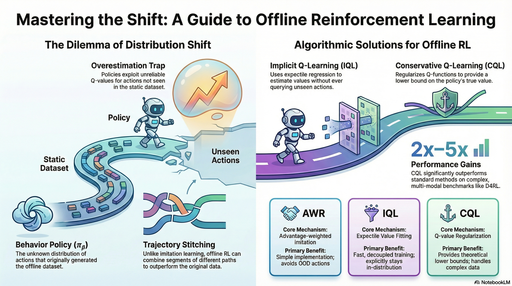

### 강의 및 자료

::: {layout-ncol=2}
[](https://www.youtube.com/watch?v=lRDaXnPIzks&list=PLoROMvodv4rPwxE0ONYRa_itZFdaKCylL&index=7)

[](https://cs224r.stanford.edu/slides/07_cs224r_offline_rl_2025.pdf)
:::

## Lecture Summary with NotebookLM



## Recap

Through previous lectures, we have covered representative reinforcement learning algorithms: Policy Gradient, Actor-Critic Methods, and Q-Learning. The ultimate goal of reinforcement learning is to learn a policy that maximizes the expected total reward the model can receive upon reaching an outcome, based on the data it has collected. To achieve this, there was the **Policy Gradient** method, which gathers entire trajectories, encouraging actions that led to better-than-average rewards while discouraging actions that resulted in poor rewards. There was also the **Actor-Critic** method, which estimates the value of the current state (Critic) and takes actions that increase the expected total reward based on this estimation (Actor). Furthermore, there were methods like **Q-Learning**, which implicitly defines a policy to take actions that maximize the estimated value of the current state without training a separate Actor. Among these, let's revisit the algorithm of the Off-Policy Actor-Critic Method, which is highly related to **Offline RL**, the main topic of this lecture.

```pseudocode
#| html-indent-size: "1.2em"
#| html-comment-delimiter: "//"
#| html-line-number: true
#| html-line-number-punc: ":"
#| html-no-end: false
#| pdf-placement: "htb!"
#| pdf-line-number: true
#| label: algo-Off-Policy-Actor-Critic

\begin{algorithm}
\caption{Full Off-policy Actor-Critic Method (SAC-style)}
\begin{algorithmic}
\State take action $a \sim \pi_{\theta}(a \vert s)$, get $(s, a, s', r)$, store in $\mathcal{R}$
\State Sample a batch $\{s_i, a_i, r_i, s_i'\}$ from replay buffer $\mathcal{R}$
\State Update $\hat{Q}_{\phi}^{\pi}$ using targets $y_i = r_i + \gamma \hat{Q}^{\pi}_{\phi}(s_i', a_i')$ where $a_i' \sim \pi_{\theta}(\cdot \vert s_i')$
\State $\nabla_{\theta} J(\theta) \approx \frac{1}{N} \sum_i \nabla_{\theta} \log \pi_{\theta}(a_i^{\pi} \vert s_i) \hat{Q}^{\pi}(s_i, a_i^{\pi})$ where $a_i^{\pi} \sim \pi_{\theta}(a \vert s_t)$
\State $\theta \leftarrow \theta + \alpha \nabla_{\theta} J(\theta)$
\State Repeat 1 to 5 until convergence
\end{algorithmic}
\end{algorithm}
```

As mentioned in the corresponding lecture, the Off-policy method stores experience trajectories collected by past policies—rather than the policy currently being trained—in a sort of **replay buffer**, and repeatedly updates the Value function and Policy by sampling trajectories from this buffer. This can compensate for the low sample efficiency of On-policy methods, which have to alternate between gathering experiences with the current policy and training. However, since it involves estimating the Value function through the collected data, the dataset must have sufficient coverage to represent the diversity of the entire environment.

In fact, although training is performed by sampling trajectories collected by past policies like this, the action taken to estimate the value function must actually be derived from the policy currently being trained, meaning that interaction with the environment must still occur. In other words, all the algorithms mentioned so far fundamentally presuppose an Online setting where interaction with the environment must happen during training. Then, one question we can ask here is, **"Can we train a model solely on a static dataset without interacting with the environment?"** The answer to this question is precisely the objective pursued by Offline RL, which is covered in this lecture.

## Why Offline RL?

To perform **Online RL**, whether it is On-Policy or Off-Policy, interaction with the environment is a prerequisite. In other words, while both collect data and learn a policy based on it, the difference lies in whether to learn from the latest data collected by the current policy (On-Policy) or from previous data collected by various past policies (Off-Policy). In contrast, **Offline RL** learns a policy solely from a static dataset, without this prerequisite.

The data used here can be any dataset collected within the same MDP environment. It doesn't matter if it was collected by humans; data collected by well-trained models or even poorly trained models exploring the environment can all be utilized in Offline RL. Above all, a major advantage is the efficient reuse of data in reinforcement learning, a field where sample efficiency is typically much lower compared to other methodologies. Generally, Offline RL is widely applied in scenarios where it is difficult to collect data through actual Online RL, or where the exploration process for data collection is dangerous. Learning autonomous driving models or medical models through reinforcement learning and applying them to real-world environments would be representative examples. For reference, there are also topics that appropriately combine Offline RL and Online RL, such as **Offline-to-Online (O2O) RL**.

Therefore, the notations utilized in Offline RL can be summarized as follows:

- **Offline Dataset** ($\mathcal{D} : \{(s, a, s', r)\}$) : Data sampled from an undefined policy $\pi_{\beta}$. In previous Off-Policy RL, $\pi_{\beta}$ was expressed as the **Behavior Policy**, and since it is undefined, it can also be viewed as a combination of various policies.
- **State** ($s \sim p_{\pi_{\beta}}(\cdot)$) : The state experienced by the Behavior Policy $\pi_{\beta}$.
- **Action** ($a \sim \pi_{\beta}(\cdot \vert s)$) : The action taken by the Behavior Policy $\pi_{\beta}$ in state $s$.
- **Next State** ($s' \sim p(\cdot \vert s, a)$) : The state transition when the Behavior Policy $\pi_{\beta}$ takes action $a$ in state $s$.
- **Reward** ($r = r(s, a)$) : The reward function defined in the corresponding environment.

The professor used the process of training autonomous vehicles with Offline RL as an example to explain this. In reality, even if vehicles are heading to the same destination, they might take various routes, or the collected data will differ depending on the driver. Consequently, he mentioned that the ultimately learned policy will also take the form of a weighted average of these diverse behavior policies. The objective of Offline RL, similar to Online RL, is to maximize the expected sum of future rewards ($\max_{\theta} \mathbb{E}_{p_{\theta}(\tau)}[\sum_{t} r(s_t, a_t)]$). However, what must be kept in mind is that the policy executed to maximize this reward is not the previously mentioned behavior policy $\pi_{\beta}$, but rather the policy to be learned, $\pi_{\theta}$. Standard supervised learning or reinforcement learning algorithms operate under the i.i.d. assumption that the data used for training and the data experienced during actual testing are sampled from the same distribution. However, if a difference arises in the executing policies as described above (a phenomenon usually referred to as **Distribution Shift**), this assumption is broken. Consequently, when executed in a real environment, there is a high probability of making incorrect value evaluations for actions that do not exist in the dataset (**Out-of-Distribution action**). This specific issue will be further discussed later under the topic of Overestimation.

## Can we just use off-policy algorithms?

In fact, from the perspective of learning based on experiences accumulated by past policies, it is similar to the Off-policy methodology covered previously. First, let's revisit the learning process in Soft Actor-Critic (SAC).

- **Q-function Update**: $\min_{\phi} \sum_{(s, a, s') \sim \mathcal{D}} \Vert \hat{Q}_{\phi}^{\pi_{\theta}}(s, a) - \Big(r(s, a) + \gamma \mathbb{E}_{\color{red} {a' \sim \pi_{\theta}(\cdot \vert s')}}[\hat{Q}^{\pi_{\theta}}_{\phi}(s', {\color{red} a'})] \Big) \Vert^2$
- **Policy Update**: $\nabla_{\theta}J(\theta) \approx \frac{1}{N} \sum_i \nabla_{\theta}\log \pi_{\theta}(a_i^{\pi} \vert s_i) \hat{Q}_{\phi}^{\pi_{\theta}}(s_i, a_{i}^{\pi})$ where $a_i^{\pi} \sim \pi_{\theta}(a \vert s)$

When training a traditional Off-policy method, the model must calculate the Q-value for the next action $a'$ to be taken in the next state $s'$ in order to update the policy currently being trained. However, this is an action sampled from the current policy $\pi_{\theta}$, and there is a possibility that it does not exist within the data accumulated by the previous behavior policy $\pi_{\beta}$. If it were Online RL, the model could simply explore and immediately update the Q-value for that action. But since Offline RL uses a static dataset, if the action is absent, the corresponding Q-function will inevitably be inaccurate. Just like the autonomous driving model training example mentioned earlier, the model might attempt to explore dangerous behaviors not present in the dataset, such as making a U-turn on a highway.

{#fig-ood-action}

The lecture also explained this using an example like @fig-ood-action. The actions actually included in the dataset correspond to the area marked in green, and relying solely on the dataset means we can only accurately know the Q-function for that specific region. However, the policy fundamentally tends to take actions in a direction that maximizes the Q-function. Consequently, relying on an initially randomized Q-function, the policy will continue taking actions unseen in the dataset with the expectation that their Q-values will be maximized (Exploitation). In the previous Q-learning lecture, we used the term **Overestimation** to describe this phenomenon of excessively evaluating expected future values. In Offline RL as well, this overestimation of Out-of-Distribution Actions within the randomly initialized Q-function causes the training process to collapse.

One might then think, "In that case, shouldn't we just prevent the learned policy from taking Out-of-Distribution Actions?" However, until the policy actually takes an action in a given state, it is impossible to know whether that action is similar to the existing distribution (In-Distribution) or outside of it (Out-of-Distribution). Therefore, the universal approach taken by most Offline RL algorithms is to apply safety mechanisms to prevent the policy from straying too far from the distributions of past policies, or to constrain it to take actions a bit more conservatively.

## How to mitigate overestimation in Offline RL?

The easiest way to mitigate Overestimation is to perform **Imitation Learning** using only the actions already present in the dataset. Imitation Learning is a form of Supervised Learning that trains the model to execute only the actions found in the dataset. In this case, actions not in the dataset are neither attempted nor evaluated, leaving no room for Overestimation to occur. However, unlike general reinforcement learning, it only executes given actions. Thus, if training is done through simple mimicry (Vanilla Imitation Learning), it does not utilize reward information and, consequently, cannot surpass the performance of the policy that originally collected the dataset. If the dataset was collected during the exploration phase of RL or gathered by an under-trained policy, better performance cannot be achieved. Furthermore, since connections between states are not considered, there is no possibility of finding a better trajectory by selecting only the good segments from various data trajectories.

{#fig-stitching}

The area where Offline RL gains a strong advantage over Imitation Learning is **Trajectory Stitching**, introduced in @fig-stitching. As shown in the figure, assuming there are two trajectories ($s_1 \rightarrow s_6, s_1 \rightarrow s_9$) in the offline dataset, and $s_3$ and $s_7$ are states in close proximity: if we simply perform Imitation Learning, the model wouldn't reach the target destination $s_9$ unless it starts from the exact same state. However, Offline RL can utilize internal information to determine that $s_1 \rightarrow s_3$ and $s_7 \rightarrow s_9$ are partially good trajectories, and can ultimately be trained to find and stitch together the optimal trajectory of $s_1 \rightarrow s_9$.

A way to improve Imitation Learning and address these limitations is a method called **Filtered Behavior Cloning**, which selects and imitates only a few trajectories with high rewards from the dataset. While this approach lacks the aforementioned stitching capability, it is very simple to implement and serves as a excellent baseline for training an improved model using only the initial dataset.

```pseudocode
#| html-indent-size: "1.2em"
#| html-comment-delimiter: "//"
#| html-line-number: true
#| html-line-number-punc: ":"
#| html-no-end: false
#| pdf-placement: "htb!"
#| pdf-line-number: true
#| label: algo-Filtered-Behavior-Cloning

\begin{algorithm}
\caption{Filtered Behavior Cloning}
\begin{algorithmic}
\State Rank trajectories by return $r(\tau) = \sum_{(s_t, a_t) \in \tau}r(s_t, a_t)$
\State Filter dataset to include top $k\%$ of data: $\tilde{\mathcal{D}} = \{\tau \vert r(\tau) \gt \eta \}$
\State Imitate filtered dataset: $\max_{\theta} \sum_{(s, a) \in \tilde{\mathcal{D}}} \log \pi_{\theta}(a \vert s)$
\end{algorithmic}
\end{algorithm}
```

Just as the previous method selected and trained on good trajectories, we can apply the idea of assigning weights to the actions seen in the dataset based on whether they are good or bad. In fact, we have already calculated this using the **Advantage** function covered previously.

$$
A(s_t, a_t) = Q(s_t, a_t) - V(s_t)
$$

The Advantage function quantifies how much better an action $a_t$ taken in a certain state $s_t$ is compared to the average state value $V(s_t)$. This takes the form of adding it as a kind of weight to the existing Imitation Learning equation.

$$
\theta \leftarrow \arg \max_{\theta} \mathbb{E}_{(s, a) \sim \mathcal{D}} [ \log \pi_{\theta}(a \vert s) \exp (A(s, a))]
$${#eq-advantage-weighted}

:::{.callout-note title="Implicit Policy Constraint"}
Looking at @eq-advantage-weighted, we can see that the weight is used in the form of an Exponentiated Advantage rather than simply using the Advantage function. This is intended to place an implicit constraint on the policy being learned. This part is explained under the topic of **Implicit Policy Constraint** in Professor Sergey Levine's lecture. The ultimate direction of the Offline RL algorithms we are currently discussing is to train the model to maximize the Q-value while constraining the new policy $\pi_{\theta}$ so that it does not deviate too far from the behavior policy $\pi_{\beta}$ that collected the existing data. Therefore, we assume a KL Constraint ($D_{KL}(\pi_{\theta} \vert \pi_{\beta}) < \epsilon$), which is defined to ensure that the KL Divergence measuring the similarity between the two distributions does not exceed a certain threshold. Thus, with this constraint assumed, the model training takes on a KL-constrained objective such as $\pi_{\theta} \leftarrow \arg\max_{\theta} \mathbb{E}_{a \sim \pi_{\theta}(\cdot \vert s)} Q(s, a)$.

The problem, however, is that Constrained Optimization in such an environment is very difficult to solve. Trust Region Policy Optimization (TRPO), briefly mentioned earlier, was rarely applied in practice due to its complexity, such as having to calculate the Fisher Information Matrix (FIM)—a separate information matrix—to find the Conjugate Gradient when deriving the internal equation. However, **Relative Entropy Policy Search (REPS)** introduced in @Peters_Mulling_Altun_2010 and $\psi$-learning introduced in @Rawlik-RSS-12 mathematically proved that the Constrained objective mentioned above can be approximated into the exponential Advantage-weighted objective covered just before. This allowed the complex Constrained Optimization to be transformed into weighted Supervised Learning, making it possible to train using a familiar approach. Furthermore, even without calculating the probability density function for the behavior policy $\pi_{\beta}$ for the KL-constraint, utilizing the trajectories sampled from the dataset implicitly provides the effect of constraining the policy.
:::


Then, even in the previous Stitching example, by identifying the value of a good action through the Advantage weight even in similar states between two trajectories, we can create a trajectory that is helpful for learning. For reference, a question arose during the lecture asking if identical states between trajectories in the dataset were strictly necessary, as in this example. The professor mentioned that, due to the representation characteristics of neural networks, the Advantage for similar states can be utilized even if they are not exactly identical. He also added that while it is written in the form of Exponentiated Advantage in the equation above, in practice, a form with an arbitrary hyperparameter added ($\exp(\frac{1}{\alpha}A(s, a))$) is used to prevent the value from becoming excessively large.

Up until now, we have gone through the process of selecting useful trajectories from the dataset by applying the Advantage as a weight. As a result, since we calculated the advantage utilizing the trajectories in the dataset, it will be $A^{\pi_{\beta}}$. The next thing to consider is, "How can we estimate this Advantage?"

## Advantage-Weighted Regression
