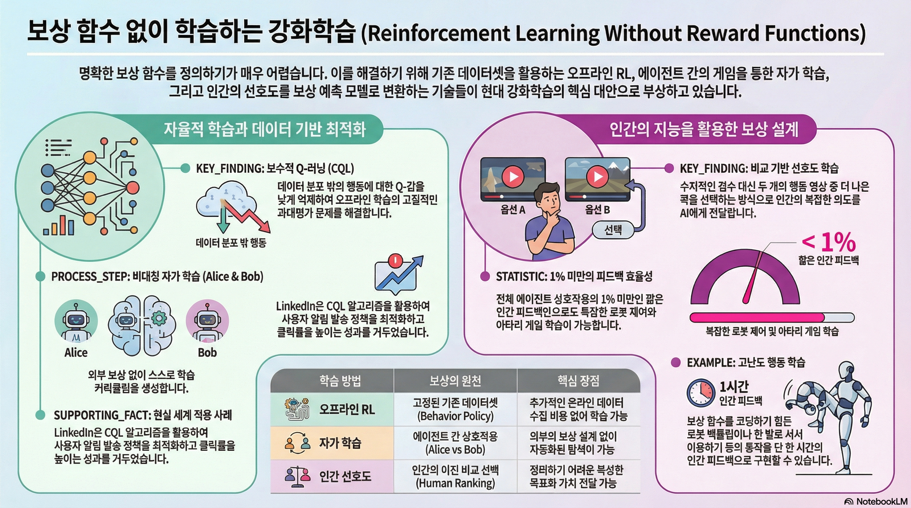

### 강의 및 자료

::: {layout-ncol=2}
[](https://www.youtube.com/watch?v=PDIxDhA9Z6Y&list=PLoROMvodv4rPwxE0ONYRa_itZFdaKCylL&index=8)

[](https://cs224r.stanford.edu/slides/08_cs224r_reward_learning_2025.pdf)
:::

## Lecture Summary with NotebookLM



## Recap

이전 강의를 통해서 Offline RL 이라는 개념에 대해서 다뤘다. 환경과의 실시간 interaction을 통한 학습이 이뤄지는 Online RL과는 다르게, Offline RL에서는 online data collection이 없는 상태에서 주어진 데이터셋만으로 이상적인 policy를 학습시키는 것이 목적이다. 이 때 replay buffer를 쓰는 Off-policy RL에서도 다뤄졌던 내용처럼, 실제 데이터를 수집했을 때 사용한 policy ($= \text{behavior policy} \quad \pi_{\beta}$) 에 대한 정보를 모르는 상태에서, 해당 policy들을 통해 수집된 데이터를 바탕으로 실제 학습될 policy $\pi_{\theta}$ 의 expected return을 최대화할 수 있어야 한다. 

$$ 
\min_{\phi} \sum_{(s, a, s') \sim \mathcal{D}} \Vert \hat{Q}_{\phi}^{\pi_{\theta}}(s, a) - \big( r(s, a) + \gamma \mathbb{E}_{\color{blue} a' \sim \pi_{\theta}(\cdot \vert s')}[{\color{blue} \hat{Q}_{\phi}^{\pi_{\theta}}(s', a')}] \big)
$$ {#eq-off-policy-critic-objective}

@eq-off-policy-critic-objective 은 Off-policy RL에서 Critic의 objective function을 나타낸 것인데, 파란색 부분처럼 현재 State의 Q-value를 추정하기 위한 과정 중 필요한 다음 state에서 취할 action $a'$ 은 실제 데이터를 수집할 때 사용했던 $\pi_{\beta}$ 가 아닌, 현재 학습중인 $\pi_{\theta}$ 에서 추출하기 때문에, 이로 인해 overestimation이 발생할 수 있다고 언급했었다. 즉, Out-of-Distribution (OoD) Action으로 Q-value를 추정하는데 있어 문제가 발생하는 것이다.

그래서 지난 강의의 후반부에 소개했던 **Implicit Q-Learning (IQL)** 에서는 이렇게 Overestimation을 야기하는 OoD action을 샘플링하는 과정을 막는 것과 더불어 몇가지 trick이 더해졌다. 먼저 비대칭 loss인 **expectile loss** 를 사용해서 $\pi_{\beta}$ 에 대한 평균이 아닌, percentile 결과에 기반해여 value function을 추정하도록 학습시켰다.

$$
\hat{V}(s) \leftarrow \arg \min_{V} \mathbb{E}_{(s, a) \sim \mathcal{D}}[\ell_2^{\lambda}(V(s) - \hat{Q}(s, a))]
$$

그리고 TD-Learning을 사용해서 위에서 구한 $V(s)$ 를 활용하여 $Q$를 추정함으로써, Variance를 줄이는 방식까지 적용되었다.

$$
\hat{Q}(s, a) \leftarrow \arg \min_{Q} \mathbb{E}_{(s, a, s') \sim \mathcal{D}} \big[ \big( Q(s, a) - \big( r + \gamma \hat{V}(s')\big) \big) \big]
$$

## Mitigating Overestimation in Offline RL

사실 이렇게 OoD Action을 아예 추출하지 않게 하는 방법이외에도 Overestimation을 대응할 수 있는 방법은 여러가지가 있는데, 강의에서 소개한 방법은 Estimation 자체를 약간 보수적으로 바라보고 이에 기반하여 Q-value를 추정하는 것이다. 흔히 Pessimistic (@shi2022pessimistic), Conservative (@kumar2020conservative) 라는 표현을 사용하는데, 단어 표현 그대로 어떤 Q-value가 과도하게 크게 나타나면, 이를 보수적으로(혹은 비관적으로) 보고 Q-value estimation을 하자는 것이다. 

$$
\hat{Q}^{\pi} = \arg \min_Q \max_{\mu} \mathbb{E}_{(s, a, s') \sim \mathcal{D}} \big[ \big(\underbrace{Q(s, a) - (r(s, a) + \gamma \mathbb{E}_{a' \sim \pi}[Q(s', a')])}_{\text{standard critic update}} \big)^2  \big] + \underbrace{\alpha \mathbb{E}_{s \sim \mathcal{D}, a \sim \mu(\cdot \vert s)}[Q(s, a)]}_{\text{push down on large Q-values}} 
$$ {#eq-cql-1st}

@eq-cql-1st 식에서 첫번째 term은 앞에서 많이 다뤄졌던 cricit update 에 대한 항이고, 앞의 과도하게 큰 Q-value를 낮추는 방법으로 두번째 term이 들어간 것인데, 여기에서 새롭게 나타나는 $\mu$ 는 실제 주어진 state $s$ 에서의 Q-value estimation시 필요한 action에 대한 임의의 policy distribution을 나타낸다. 이 분포에는 당연히 OoD Action도 포함되어 있다. 그래서 위의 식을 다시 설명해보면 첫번째와 두번째 항을 합쳐서 우선은 $\mu$ 가 최대화가 되는 방향을 찾으면서, 동시에 기존의 목표였던 Q를 낮추는 방향으로 학습을 수행하게끔 하자는 것이다. 그러면 결과적으로 $\mu$ 가 커지면서 두번째 항이 커지게 되겠지만, 전체적으로는 이 constraint상에서 Q를 낮추는 방향으로 Critic을 학습시킬 수 있게 된다.

여기에서 $\alpha$ 가 이 과대하게 큰 Q에 대한 penalty를 추는 일종의 hyperparameter가 되는데, 만약 이 값이 잘못 잡혀서 **너무** 과도하게 Q-value estimation을 수행하는 경우도 고려해볼 수 있다. 이런 경우를 막기 위해서, 실제 OoD action까지 포함된 $\mu$ 란 분포 내에서도 실제 데이터셋 내에 존재한 action $a$ 에 대한 Q에 대해서는 조금 완화시켜주는 세번째 term이 등장한다.

$$
\begin{aligned}
\hat{Q}^{\pi} &= \arg \min_Q \max_{\mu} \mathbb{E}_{(s, a, s') \sim \mathcal{D}} \big[ \big(\underbrace{Q(s, a) - (r(s, a) + \gamma \mathbb{E}_{a' \sim \pi}[Q(s', a')])}_{\text{standard critic update}} \big)^2  \big] + \underbrace{\alpha \mathbb{E}_{s \sim \mathcal{D}, a \sim \mu(\cdot \vert s)}[Q(s, a)]}_{\text{push down on large Q-values}} \\
&- \underbrace{\alpha \mathbb{E}_{(s, a) \sim \mathcal{D}}[Q(s, a)]}_{\text{push up on Q-values for }(s, a) \text{ in the } \mathcal{D}}
\end{aligned}
$$ {#eq-cql-final}

물론 이렇게 하면, 모든 $(s, a)$ 에서의 추정된 $\hat{Q}^{\pi}$ 가 실제 $Q^{\pi}$ 보다 낮게(보수적으로) 계산될 것이라는 부분이 @eq-cql-1st 에 비해 보장되지는 않겠지만, 적어도 $\mathcal{D}$ 에 있는 $s$ 에 대한 $Q$ 의 평균값에 대해서는 항상 보수적으로 계산되는 것으로 보장할 수 있다. 이 접근 방식이 **Conservative Q-Learning (CQL)** (@kumar2020conservative) 에 대한 내용이다. 식에 대한 자세한 증명은 논문에 소개되어 있다.

:::{.callout-note}
참고로 위의 식과 @kumar2020conservative 논문에서 소개된 식이 조금 다르다고 느낄 수 있는데, 논문에서는 $\mathcal{D}$ 에 대한 term을 묶어서 표기했을 뿐 결과적으로 같은 의미를 가진다.
:::

{#fig-CQL}

@fig-CQL 이 [소개자료](https://bair.berkeley.edu/blog/2020/12/07/offline/) 에 있는 내용으로 실제로 데이터셋 내에 있는 action(Action support)이 아닌 OoD action에 대해서 overestimation이 발생하는 일반적인 Q-function과는 다르게 Conservative하게 Q-function을 구하게 되면, Action support 내에서는 나름대로 좋은 방향대로 Q-value를 추정하되, OoD action 영역에서는 Q-function이 실제 Q-function보다 낮게 추정되는 것을 확인할 수 있다.

실제 논문에서는 @eq-cql-final 의 식외에 $\mathcal{R}(\mu)$ 라는 항이 하나 더 붙어있는 것을 확인할 수 있는데, 이는 앞에서 설명한 임의의 policy distribution인 $\mu$ 의 범주를 더 넓혀주는 일종의 regulizer의 역할을 수행한다. 일반적으로 Offline RL에서는 다양한 state, action 에서의 정확한 Q-value를 추정하는 것이 관건이 되는데, 그러면 우리가 정의하는 임의의 분포인 $\mu$ 역시도 조금더 다양한 영역을 담고 있을수록 좋을 것이다. 이때문에 entropy $\mathcal{H}$ 를 사용해서 다음과 같이 $\mathcal{R}(\mu)$ 를 일반적으로 정의한다.

$$
\mathcal{R}(\mu) = \mathbb{E}_{s \sim \mathcal{D}}[\mathcal{H}(\cdot \vert s)]
$$

강의에서는 이에 대한 자세한 설명을 하지는 않았지만, 이렇게 regularizer를 정의하게 되면 $\mu(a \vert s) \propto \exp (Q(s, a))$ 형태가 되고, 결과적으로 이런 regularizer 를 추가한 것도 앞의 objective와 동일한 Q에 대한 형태로 표현된다고 설명하고 있다. 이렇게 되면 앞의 $\min_Q \max_{\mu}$ 의 형태가 $\min_Q$ 라는 간단한 형태로 바뀌게 되는 것이다. 그러면 임의의 policy distribution $\mu$ 도 정의할 필요가 없어지게 된다.

$$ 
\mathbb{E}_{s \sim \mathcal{D}, a \sim \mu(\cdot \vert s)}[Q(s, a)] = \log \sum_a \exp (Q(s, a))
$$

## Example Application of CQL


CQL이 적용된 사례로 KDD '22에 소개된 @prabhakar2022multi 에 대한 예시를 공유했다. 해당 논문에서는 LinkedIn에서 CTR(Click-Through-Rate)와 WAU(Weekly-Active-User)를 늘리기 위해 Offline RL을 사용한 사례를 공유했다. 보통 CTR과 WAU는 IT 서비스에서 주로 활용되는 KPI 중 하나로, 일반적으로는 어떤 서비스에 대해서 Notification이 가면, 사용자가 이에 반응해 해당 서비스를 이용하는 형태로 되어 있다. 물론 Notification을 많이 줄수록 사용자의 접근성이 늘겠지만, 이에 대한 비용이나 단점도 고려해야 되기 때문에 모든 요소를 고려한 적절한 점을 찾아야 하는 것이 목적(Multi-objective)이다. 그래서 논문의 저자들은 기존에 구현되어 있던 baseline(@10.1145/3488560.3510017) 과 Online RL 알고리즘인 Double DQN(DDQN), 그리고 앞에서 언급한 CQL을 결합했을 때의 결과를 Online A/B 테스트를 통해서 뽑고 성능을 비교하였다. 이 결과 단순하게 DDQN을 적용했을때는 WAU와 CTR이 줄어들면서 notification이 많아지는 안 좋은 방향으로 학습이 되었지만, DDQN과 CQL Loss가 결합된 형태는 모든 지표에서 성능이 개선되는 결과를 확인할 수 있었다.


## Where does the reward come from?

이제 Offline RL이 아닌, 이번 강의의 주제인 **Reward Learning**에 대한 내용이다.



강의에 소개된 영상인데, 이 영상은 어린 아이가 스스로 물이 들어있는 병에서 컵에다 물을 따르고, 따른 물을 마시는 일련의 과정을 보여주고 있다. 여기에서 주목할 부분은 어린 아이가 어떻게 병에서 컵에다가 물을 따르고, 이 물을 마시는 과정을 "학습"할 수 있었느냐는 것이다. 이 영상에는 표현되지 않았지만, 아마 처음에는 시행착오를 겪으면서도 컵에 물을 따르고, 마시는 과정을 통해서 일련의 만족감을 느꼈기 때문에 이를 통해서 배우지 않았을까 하는 추측을 해볼 수 있다. 이처럼 이런 만족감을 일종의 보상(Reward)로 표현할 수 있는데, 로봇에게 동일한 과정을 시키게 된다면 어떻게 Reward를 줄 수 있을까? 컵에 물을 따를때 물을 얼마나 흘리지 않고 따를 수 있나? 아니면 따라진 물을 마셨을 때 물의 양을 바탕으로 보상의 정도를 설정할 수 있을까? 이런 다양한 요소를 Reward로 정의하기가 Real World에서는 어렵다. 게임과 같은 경우는 명확하게 Score나 Termination과 같은 기준이 존재하기 때문에 모델에게 명확한 보상을 전달할 수 있지만, 강의에서 예시로 든 dialog나 자율주행에서는 이런 보상(혹은 reward function)을 정의하는 것이 어렵다.

사실 이런 일련의 과정을 다루는 가장 쉬운 방법은 바로 전문가의 행동을 따라하는 **Imitation Learning** 과 같은 방법을 활용하는 것이다. 하지만 Imitation Learning 역시 일종의 Supervised Learning이기 때문에 실제 환경에 내재된 dynamic에 대한 고려(reasoning)없이 전문가의 행동을 따라하는 경향을 가지며, 전문가 데이터를 모으거나 활용하는 것이 실제환경에서는 제한된 경우가 많다.



해당 내용을 설명할때 교수는 하나의 재미있는 영상을 공유했다. 이 영상에서는 어른(전문가)의 행동을 보고 어린 아이와 침팬지가 행동을 배우는 과정에 대해서 소개하고 있는데, 눈여겨 볼 부분은 전문가가 잘못된 행동을 보여줬음에도, 어린 아이/침팬지가 그 행동을 따라하는 것이 아니라, 올바른 행동으로 고쳐서 수행했다는 것이다. 이를 통해 어떤 학습 과정도 전문가의 행동을 그대로 따라하는 것외에도 좋은 행동이라는 것을 표현하는 뭔가를 학습했다는 것을 의미한다. 이 부분이 바로 Reward Learning에서 다루는 아이디어의 기반이다.

## Goal Classifiers

Reward를 직접적으로 학습하는 방법보다 조금더 쉽게 접근할 수 있는 방법은 현재 주어진 상태를 통해서 목표 상태를 분류하는 **Goal Classifier**를 만드는 것이다.


위의 그림은 Goal Classifier의 동작원리를 소개한 그림이다. 큰 과정으로 나눠서 살펴보면

1. 로봇팔을 통해서 노트북 뒤로 필통을 놓는 것을 학습하고자 할때 로봇팔의 입력으로 들어오는 이미지에 대해서 실제로 노트북 뒤로 필통이 놓여진 좋은 케이스와 그렇지 않은 나쁜 케이스에 대한 데이터를 쌓는다.
2. 이 데이터를 활용하여 이미지가 들어왔을 때 좋은 케이스인지 여부를 구별하는 binary classifier를 학습시킨다. 이때 입력은 $s_i$, 출력은 $0/1$ 형태로 나온다.
3. 그리고 이렇게 학습된 classifier의 output을 강화학습시 reward로 활용한다.

와 같다. 쉬운 방법이지만, 여기에서도 생각해볼 부분이, 과연 강화학습 알고리즘이 goal classifier가 내놓은 reward를 바탕으로 좋은 action을 취하는 policy를 학습시킬 수 있느냐 하는 점이다. 사실 goal classifier가 입력될 수 있는 모든 state에 대해서 좋은지 나쁜지를 판단할 수 있는 범용적인 형태라면 좋겠지만, 대부분의 경우는 학습되지 않은 상태에서는 보간이 되는 형태로 학습된다. 그렇기 때문에 실제로 학습되지 않은 state에 대해서는 좋은지 나쁜지 확실치 않은 상태에서 그 상태에 대한 출력을 바탕으로 강화학습이 수행된다면, 모델은 좋은 상태를 따라가기 보다는 오히려 classifier가 학습되지 않은 영역에 대한 약점을 추구할 가능성이 존재한다.(exploiting the classifiers weakness) 이런 현상을 **Reward Hacking** 이란 표현으로 정의하기도 하는데, 말그대로 목적을 달성하기 위해서 reward를 최대화하는 방향이 아닌 약점을 통해서 reward를 최대화하는 방법을 말한다. 

사실 이 맥락에서보면 뭔가 학습되어야 할 policy는 앞에서 언급했던 CQL처럼 보수적으로 접근할 필요성이 있다. 그래서 강의에서 제안한 방법은 이미 경험하고 판정이 끝난 state에 대해서는 무조건 나쁜 케이스라고 정의하고 classifier를 계속 update 하는 것이다. 세부적으로 나누면

1. 성공 케이스 ($\mathcal{D}_{+}$)와 실패 케이스 ($\mathcal{D}_{-}$)에 대한 초기 집합을 구성한다.
2. $\mathcal{D}_{+}$ 와 $\mathcal{D}_{-}$ 를 50:50 비율로 맞춘뒤 classifier를 학습시킨다.
3. 학습하려는 policy $\pi$ 를 사용해서 trajectory ($s_t, a_t, \dots$) 를 수집한다.
4. Classifier로부터 얻은 reward를 활용하여 $\pi$를 업데이트한다.
5. 이미 방문했던 state $s_t$ 를 무조건 실패 케이스에 추가한다. ($\mathcal{D}_{-} \leftarrow \mathcal{D}_{-} \cup \{s_t\}$)
6. 2번부터 재수행한다.

그러면 상대적으로 모델은 나쁜 reward를 받는 것에 대해서 CQL과 같이 보수적인 관점에서 action을 선택하게 된다. 다만 안 좋은 점이라면, 실제로 policy를 수행했을때 쌓은 trajectory 중에서도 분명 성공 케이스가 있을텐데, 이 경우도 실패케이스로 간주할 경우 궁극적으로 좋은 action을 취할 가능성이 적어진다는 것이다. 하지만, 데이터를 수집할 여건 자체가 앞에서 정의한 것처럼 50:50의 비율로 균형있게 쌓을수만 있다면, 적어도 classifier가 잘못 구별하는 케이스는 줄어들 것이다.

::: {layout-ncol=2}
 Direct Imitation Learning

 Medal++
:::

위의 영상은 실제로 앞에서 정의한 Goal Classifier를 Robotics RL에 적용한 사례이다.(@sharma2023self) 이 논문에서는 goal classifier를 학습하기 위해서 먼저 50개의 전문가 데이터를 수집하고, 전문가 데이터의 마지막 state를 성공 케이스로 정의하고, 이를 강화학습시 replay buffer안에 저장해서 학습하는 off-policy 방법을 따랐다. 이를 통해서 단순히 Imitation Learning을 취했던 첫번째 영상의 경우는 성공율이 26%에 그쳤던 반면, 학습된 goal classifier를 사용한 케이스인 MEDAL++에선 62%까지 성공율을 높였다. 교수는 한편으로 실험 결과를 통해서 단순히 50:50 비율로 데이터를 확보하는 것 이상으로 classifier를 regularize 하는 방법이 필요하다고 언급했다.

::: {#fig-gan layout-ncol="2"}

{#fig-vqgan}

{#fig-phenaki}

:::

사실 앞에서 소개한 학습 방법은 **Generative Adversairal Networks (GAN)**의 학습 방법과 유사하다. GAN에서는 Classifier와 Generator 두개의 요소로 나눠서 각각을 학습시키는 형태로 되어 있는데, Classifier로 하여금 실제의 이미지와 생성된 이미지를 잘 구분시키도록 학습시키고, Generator에게는 Classifier가 생성한 이미지를 진짜라고 생각할 수 있을만큼 생성하는 방향으로 학습시킨다. @fig-vqgan 은 @yu2021vector 논문에 소개된 **ViT-VQGAN**의 동작 예시인데, 내부적으로는 Vector-Quantized GAN(VQ-GAN)을 통해서 생성한 이미지를 바탕으로 Vision Transformer(ViT)을 학습시키는 형태로 되어 있다. 그래서 서로 다른 viewpoint와 겉모습이 다른 이미지를 생성하면서 ViT의 일반화 성능을 높이는 것을 소개했다. @fig-phenaki (@villegas2022phenaki) 는 **Phenaki** 라는 Video Generation Model 에 대한 내용인데, 주어진 text에 대해서 알맞는 video를 생성할 수 있도록 모델을 학습시키는데 GAN loss를 사용했다는게 특징이다. 결과적으로 GAN에서도 Generator가 실제에 가까운 이미지를 생성할 수 있도록 학습시키면서 궁극적으로는 생성된 이미지의 분포가 원래의 이미지 분포와 가까워지게 된다는 점은 앞에서 소개한 Goal Classifier도 동일한 관점에서 봤을때 잘 동작할 것임을 유추할 수 있다.

Reward Classifier에 대해서 간단하게 요약해보자면, 어떤 현재 상태에 대해서 성공/실패 여부를 판별하는 별도의 모델을 만들어 이를 강화학습시 활용하자는 것인데, 단순하게 학습하고 활용하는 형태는 강화학습 모델에게 Reward Hacking으로 인한 exploitation을 유발할 수 있다. 그래서 추가로 적용해볼 수 있는 방법은 RL 수행 중에도 생성한 데이터를 가지고 Classifier를 추가로 업데이트하는 것이었고, 이때 이미 경험한 trajectory에 대해서는 실패로 간주함으로써 보수적으로 학습시키는 방법을 추구할 수 있다고 소개했다. 이런 방법론은 구현하기도 쉽고, task specification에 있어서는 실용적으로 접근할 수 있는 Framework이지만, 강화학습 모델의 탐색을 통해서 생성한 trajectory를 바탕으로 학습하고 이를 보상으로 삼는 케이스는 GAN에서도 겪는것처럼 학습이 불안정할 여지가 존재하다. 그리고 근본적으로 이런 접근 방식이 잘 동작하려면 기본적으로 성공하는 케이스에 대한 데이터가 필요하다는 한계도 내재하고 있다. 물론 이를 완화하기 위해서 @sharma2023self 처럼 사전에 전문가 데이터를 수집하여 replay buffer에 해당 데이터를 미리 집어넣어서 학습에 활용하는 케이스도 존재한다.

## Learning Rewards from Human Preferences

앞의 케이스처럼 전문가 데이터를 활용하여 Reward Classifier를 학습할 수도 있지만, 사실 이를 위해서는 어떤 데이터가 좋은지 나쁜지를 판단하는 기준이 필요하고, 기준이 불명확한 경우에는 이를 도출하기 위한 일정량의 데이터가 필요하다. 그러면 다른 방식으로 좋고 나쁜지를 판단하는 방법도 생각해볼 수 있다.

::: {#fig-preference layout-ncol="2" title="Goodness of Trajectory"}

{#fig-how-good}

{#fig-which}

:::

위의 그림은 goal까지 도달하는 trajectory가 있다고 가정했을때, 해당 trajectory의 좋은 정도를 판단하는 예시이다. @fig-how-good 같은 경우에서는 사전에 정의된 reward function과 같이 좋고 나쁜 정도에 대한 기준이 있어야 해당 trajectory가 좋은지 여부를 판단할 수 있다. 대신 @fig-which 처럼 여러 개의 trajectory가 같이 놓여져 있다면 좋고 나쁜 정도의 기준이 앞의 케이스와 다르게 상대적으로 바뀐다. 대부분의 사람들이 이 케이스에는 파란색의 trajectory보다 짧고 간결하기 때문에 다른 trajectory보다 더 좋다고 평가할 수 있다. 이렇게 상대적인 기준에 따른 선호도(preference)는 절대적 기준에 따르는 것보다 부여하기가 쉽다.

### How to learn a reward function from human preferences?

그러면 우선은 RL을 위한 reward function이 필요하다는 전제하여, 위의 경우처럼 여러개의 trajectory중 좋은 trajectory ($\tau_{\text{win}}$)과 나쁜 trajectory ($\tau_{\text{lose}}$)가 있다고 가정해보자. 이때의 표현은 $\tau_{\text{win}} > \tau_{\text{lose}}$ 로 할 수 있다. 참고로 $\tau$는 전체 episode에 대한 trajectory일 수도 있고, 부분적인 policy roll-out 일 수도 있다. 그러면 우리가 찾고자 하는 reward function의 형태는 

$$
\sum_{(s, a) \in \tau_{\text{win}}} r_{\theta}(s, a) > \sum_{(s, a) \in \tau_{\text{lose}}}r_{\theta}(s, a)
$$

로 정의할 수 있다. 그러면 위의 식을 간단하게 축약해 각각 $r_{\theta}(\tau_{\text{win}}), r_{\theta}(\tau_{\text{lose}})$ 라고 표현한다면, 이를 활용하여 $r_{\theta}(\tau_{\text{win}})$ 가 $r_{\theta}(\tau_{\text{lose}})$ 에 비해서 얼마나 좋은지를 다음과 같이 정의할 수 있다.

$$
\sigma (r_{\theta}(\tau_{\text{win}}) - r_{\theta}(\tau_{\text{lose}}))
$$

그러면 **Maximum likelihood Estimation(MLE)**을 다음의 objective function을 가지는 reward function model을 학습시킬 수 있다.

$$
\max_{\theta} \mathbb{E}_{\tau_{\text{win}}, \tau_{\text{lose}}} [ \log \sigma (r_{\theta}(\tau_{\text{win}}) - r_{\theta}(\tau_{\text{lose}}))]
$$

이렇게 선호도에 기반한 reward function 을 학습시키는, **reward learning** 의 동작은 다음과 같이 표현된다.

```pseudocode
#| html-indent-size: "1.2em"
#| html-comment-delimiter: "//"
#| html-line-number: true
#| html-line-number-punc: ":"
#| html-no-end: false
#| pdf-placement: "htb!"
#| pdf-line-number: true
#| label: algo-reward-learning

\begin{algorithm}
\caption{Complete Reward Learning}
\begin{algorithmic}
\State Given dataset $\{\tau_i\}$, sample batches of $k$ trajectories and ask humans to rank.
\State Compute $r_{\theta}(\tau_1), \dots, r_{\theta}(\tau_k)$ under current reward model $r_{\theta}$
\State For all $\big(\begin{smallmatrix}k \\ 2 \end{smallmatrix}\big)$ pairs per batch, compute $\nabla_{\theta} \mathbb{E}_{\tau_{\text{win}}, \tau_{\text{lose}}}[\log \sigma (r_{\theta}(\tau_{\text{win}}) - r_{\theta}(\tau_{\text{lose}}))]$ where $\tau_{\text{win}} > \tau_{\text{lose}}$
\State Update $\theta$ using computed gradient
\State Repeat from 2 to 4
\end{algorithmic}
\end{algorithm}
```

이런 reward learning 방식은 Language Model 학습시에도 많이 활용되며, 특히 첫번째 단계에서는 동일한 prompt에 대해서 $k$ 개의 trajectory를 뽑을 수 있다. 그리고 이에 대한 평가를 사람이 하는 방식으로 이뤄진다. 보통 언어에는 단어의 위치에 따라서 의미가 달라지고, 이에 대한 선호도가 변경될 수 있기 때문에 다른 prompt가 아닌, 동일한 prompt내에서 trajectory sampling이 이뤄진다.

이 모든 과정이 실제로 Online RL을 할때도 수행할 수 있기 때문에, policy를 update하는 와중에도 수집된 trajectory에 대해서 human이 평가한 것을 활용하여 reward model을 계속 업데이트할 수 있다. 이런 과정을 통해서 reward model을 정확하게 만들 수 있다면 선호도 기반의 policy optimization이 가능하게 될 것이다. 이런 연구 주제를 **Preference-based RL (PbRL)** 이라고 표현하는 것 같다.

::: {#fig-human layout="[[1, 1], [1]]"}

{#fig-backflip}

{#fig-active}

{#fig-rlhf}

:::

강의에서는 선호도 기반의 강화학습이 적용된 세 개의 사례에 대해서 소개했다. @fig-backflip 은 NeurIPS 2017에서 @christiano2017deep 논문에서 소개된, human preference가 강화학습에 적용된 첫 사례이다. 실제로 Online RL을 수행하는 루프 내에서 이런 reward learning 과정을 수행하기 위해서 사전에 사람이 평가한 900개의 preference query를 사용했다고 한다. preference를 정하는 내용은 [OpenAI 블로그](https://openai.com/index/learning-from-human-preferences/)에 정리되어 있다. 자율주행에서도 다양한 케이스에 대한 reward function을 정의하기가 어려운데, @Sadigh2017ActivePL 논문에서는 가상 자율주행 환경 내에서 다양한 케이스에 대한 Preference를 모아서 학습시킨 예시를 공유했다.

사실 사람들에게 많이 알려져있는 사례는 @fig-rlhf 와 같이 Prompt에 대한 Preference를 활용하여 LLM을 학습시키는 방법일 것이다. **Reinforcement Learning from Human Feedback (RLHF)**(@ouyang2022training) 란 이름으로 소개된 이 기법은 GPT-3를 Fine-tuning한 InstructGPT를 학습시킨 핵심 기술 중 하나이며,[링크](https://openai.com/index/instruction-following/)에서도 해당 기술이 앞에서 소개한 @christiano2017deep 에서 발전된 내용임을 밝히고 있다.

### Learning Rewards from Human/AI Feedback for LLMs


마지막으로 앞에서 소개한 LLM을 학습시키는데 있어 강화학습을 활용하는 과정을 소개했다. 우선 주어진 데이터셋을 통해서 초기의 Language Model을 학습시키는 **Large-scale Pre-Training**을 수행한다. 이때는 보통 어떤 단어나 문맥이 주어졌을때 다음 token이 뭔지를 예측하는 형태의 학습이 이뤄지고, 주어진 데이터셋 역시 정제된 데이터가 아닌, 일반적인 형태대로 학습에 활용된다. 이후 Language Model이 학습되면, 추가로 주어진 prompt에 대한 사용자가 원하는 response를 pair로 한 고품질의 데이터셋을 확보하여 **Supervised Fine-Tuning(SFT)**를 수행한다. 그러고 나서 바로 앞에서 설명한 **RL from Human Feedback**을 수행한다.

이때 마지막 단계를 오늘 다룬 내용과 맞춰서 살펴보면 우선은 주어진 데이터에 대해서 사람의 선호도가 반영된 데이터를 확보한다. 이를테면 어떤 prompt가 주어졌을 때, LLM이 출력한 서로 다른 두개의 response 중에서 사람이 어떤 response가 더 좋은지를 선정하는 것이다.(**Gather preference data**) 이렇게 확보된 데이터를 바탕으로 주어진 prompt에 대해서 response의 좋은 정도를 나타낼 reward model $r(x, y)$ 를 학습하고(**Train reward model**), 이 reward function을 활용하여 expected return을 최대화할 수 있는 강화학습을 수행해서 모델을 fine-tuning을 할 수 있게 된다. (@ouyang2022training 논문에서는 PPO를 사용했다고 알려져 있다.)


사실 이쯤되면 preference를 human이 아닌 AI가 주는 방법에 대해서 고민해볼 수 있고, 이에 대한 내용은 **RL from AI Feedback(RLAIF)**라는 주제로 연구가 이뤄지고 있다. **Constitutional RL**(@bai2022constitutional) 이라 표현된 이 논문에서는 LLM이 출력한 결과에 대해서 또다른 LLM이 어떻게 평가하는지에 대해서 연구한 내용을 소개했다. 강의에서는 간단하게 소개했지만, 핵심 내용은 일반적인 RLHF를 통한 모델 성능 개선보다 LLM내의 Chain-of-Thought (CoT) 같은 기술이 연계되면 조금더 성능을 끌어올 수 있다는 Pareto Improvement 결과를 보여주었다. 개인적으로도 ideation 중 해당 기술을 활용해보려고 찾다보니 **Motif**(@klissarov2023motif) 라는 논문도 찾았었다. 해당 논문에서는 [NetHack](https://github.com/facebookresearch/nle) 이란 일종의 강화학습 환경에서 게이머의 행동에 대한 평가를 LLM이 하고, 이를 통해 Reward Model을 활용하면서 일종의 Motivation을 유발한다는 내용인데, 관심이 있으면 읽어보면 좋을것 같다.


또한 이런 reward나 preference가 없는 상태(no supervision)에서도 모델이 원하는 목적까지 도달할 수 있는지에 대한 연구도 **Unsupervised RL**이란 주제로 활발히 진행되고 있다. (@sukhbaatar2017intrinsic)

## Summary

이번 강의에서는 초반부에는 Offline RL에서 발생할 수 있는 Overestimation을 완화시켜줄 수 있도록 OoD action으로 인해서 과도하게 큰 Q-value를 낮추는 방향으로 학습되게끔 구성된 **Conservative Q-Learning(CQL)**을 다뤘고, 후반부에는 강화학습시 필요한 Reward를 신경망을 통해서 추론하는 **Reward Learning**에 대해서 다뤘다. 그중 Reward Learning에 대한 내용을 정리해보면, 우선 실제 환경을 포함한 대부분의 환경이 Reward Function이라는 것을 정의하기가 어렵고, 이를 극복하기 위해서 어떤 목표지점에서의 state를 잘 구별할 수 있는 일종의 **Goal Classifier**를 학습시키는 방안을 소개했다. 물론 이와중에 발생할 수 있는 Reward Hacking같은 현상을 완화하기 위해서 보수적으로 데이터를 수집하여 Classifier를 재학습하는 방식, 그리고 더 나아가 전문가가 쌓은 trajectory를 확보하여 이를 기반으로 **Reward Classifier**를 학습시킨 사례도 공유했다. 이런 방식은 task specification을 할때는 실용적으로 적용할 수 있는 방법이기는 하나, 아무래도 임의로 레이블링한 데이터를 기반으로 학습하는 adversarial training이다보니 학습이 불안정한 부분도 존재한다. 또한 목표치에 해당하는 데이터가 어느정도 필요하다는 한계도 있다.

한편으로는 **사람의 선호도(Preference)** 를 기반으로 reward를 학습시키는 방법도 있다. 어떤 좋고 나쁜것에 대한 절대적인 기준보다는 여러개의 trajectory에 대해서 상대적인 선호도를 평가하는 것은 쉽기 때문에, 이를 기반으로 사용자가 원하는 목적에 맞게 학습시키는 방법이다. 이 경우 앞에서 지적했던 전문가의 데이터가 없어도 주어진 데이터에 대한 상대적인 선호도를 바탕으로 reward가 매겨지기 때문에, 전문가 데이터가 필요하다는 한계를 극복할 수 있다. 또한 최근에 LLM에 적용된 사례처럼, scale을 크게 넓혀서 적용할 수도 있고, 대부분의 LLM을 학습하는 핵심 기술로도 활용되고 있다. 다만, 선호도를 매기기 위해선 결과적으로 주어진 샘플에 대한 supervision이 필요하고, 강화학습 내에서 사람을 통해서 이런 supervision을 제공하는 경우 비용이 많이 든다는 단점도 존재한다. 물론 이를 해결하기 위해서 마지막에 설명된 **RLAIF**같은 기술도 연구가 되고 있다.