### Resource

::: {layout-ncol=2}
[](https://www.youtube.com/watch?v=PDIxDhA9Z6Y&list=PLoROMvodv4rPwxE0ONYRa_itZFdaKCylL&index=8)

[](https://cs224r.stanford.edu/slides/08_cs224r_reward_learning_2025.pdf)
:::

## Lecture Summary with NotebookLM

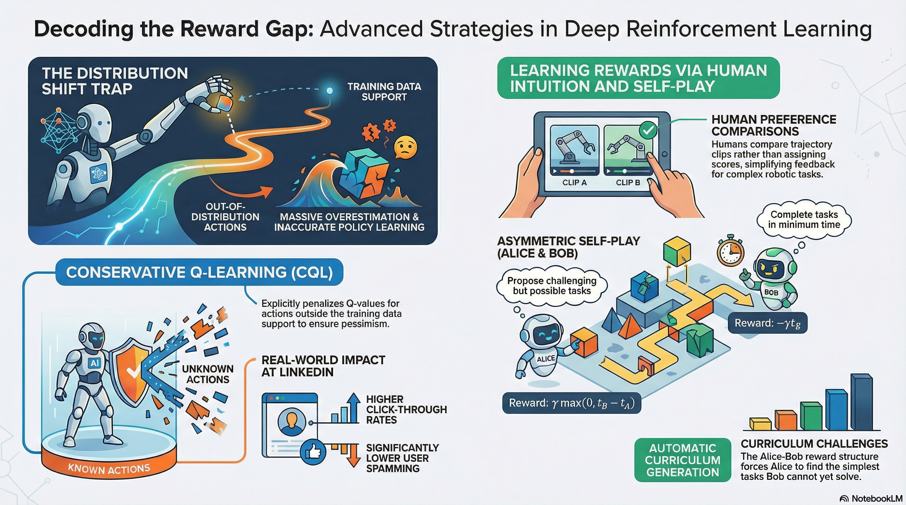

## Recap

In the previous lecture, we covered the concept of Offline Reinforcement Learning. Unlike Online RL, where learning happens through real-time interaction with the environment, the goal of Offline RL is to learn an ideal policy using only a fixed dataset, without collecting new data online. As in off-policy RL with a replay buffer, the challenge is to maximize the expected return of the learned policy ($\pi_{\theta}$) even when the behavior policy ($\pi_{\beta}$) that generated the data is unknown.

$$ 
\min_{\phi} \sum_{(s, a, s') \sim \mathcal{D}} \Vert \hat{Q}_{\phi}^{\pi_{\theta}}(s, a) - \big( r(s, a) + \gamma \mathbb{E}_{\color{blue} a' \sim \pi_{\theta}(\cdot \vert s')}[{\color{blue} \hat{Q}_{\phi}^{\pi_{\theta}}(s', a')}] \big)
$$ {#eq-off-policy-critic-objective}

@eq-off-policy-critic-objective describes the critic objective in off-policy RL. As mentioned before, when estimating the Q-value for the current state, the next action $a'$ is sampled not from the behavior policy $\pi_{\beta}$ that collected the data, but from the current policy $\pi_{\theta}$ being trained. This can lead to overestimation. In other words, the problem comes from estimating Q-values using out-of-distribution (OoD) actions.

That is why **Implicit Q-Learning (IQL)**, introduced at the end of the previous lecture, adds several tricks to avoid sampling the OoD actions that cause overestimation. First, it uses an asymmetric expectile loss so that the value function is estimated not from the mean under $\pi_{\beta}$, but from a upper expectile-based target. 

$$
\hat{V}(s) \leftarrow \arg \min_{V} \mathbb{E}_{(s, a) \sim \mathcal{D}}[\ell_2^{\lambda}(V(s) - \hat{Q}(s, a))]
$$

Then, it uses TD learning to estimate $Q$ from the learned $V(s)$, which also helps reduce variance.

$$
\hat{Q}(s, a) \leftarrow \arg \min_{Q} \mathbb{E}_{(s, a, s') \sim \mathcal{D}} \big[ \big( Q(s, a) - \big( r + \gamma \hat{V}(s')\big) \big)^2 \big]
$$

## Mitigating Overestimation in Offline RL

Besides completely avoiding OoD actions, there are other ways to address overestimation. The approach introduced in the lecture was to estimate Q-values more conservatively. This idea is often described as pessimistic(@shi2022pessimistic) or conservative(@kumar2020conservative): when a Q-value appears excessively large, we deliberately push it downward and estimate it more cautiously.

$$
\hat{Q}^{\pi} = \arg \min_Q \max_{\mu} \mathbb{E}_{(s, a, s') \sim \mathcal{D}} \big[ \big(\underbrace{Q(s, a) - (r(s, a) + \gamma \mathbb{E}_{a' \sim \pi}[Q(s', a')])}_{\text{standard critic update}} \big)^2  \big] + \underbrace{\alpha \mathbb{E}_{s \sim \mathcal{D}, a \sim \mu(\cdot \vert s)}[Q(s, a)]}_{\text{push down on large Q-values}} 
$$ {#eq-cql-1st}

In @eq-cql-1st, the first term is the standard critic update, while the second term is added to suppress excessively large Q-values. The new distribution $\mu$ represents an arbitrary policy distribution over actions for a given state $s$, and naturally includes OoD actions as well. Intuitively, the objective first looks for a distribution $\mu$ that makes the penalty large, while simultaneously learning $Q$ in a direction that lowers those inflated values. As a result, the critic is trained under a constraint that penalizes overly optimistic Q estimates.

Here, $\alpha$ acts as a hyperparameter controlling the penalty strength. If it is chosen poorly, Q-values may be pushed down too aggressively. To prevent that, @eq-cql-final adds a third term that slightly relaxes the penalty for actions that actually appear in the dataset. 

$$
\begin{aligned}
\hat{Q}^{\pi} &= \arg \min_Q \max_{\mu} \mathbb{E}_{(s, a, s') \sim \mathcal{D}} \big[ \big(\underbrace{Q(s, a) - (r(s, a) + \gamma \mathbb{E}_{a' \sim \pi}[Q(s', a')])}_{\text{standard critic update}} \big)^2  \big] + \underbrace{\alpha \mathbb{E}_{s \sim \mathcal{D}, a \sim \mu(\cdot \vert s)}[Q(s, a)]}_{\text{push down on large Q-values}} \\
&- \underbrace{\alpha \mathbb{E}_{(s, a) \sim \mathcal{D}}[Q(s, a)]}_{\text{push up on Q-values for }(s, a) \text{ in the } \mathcal{D}}
\end{aligned}
$$ {#eq-cql-final}

Although this does not guarantee that every estimated $\hat{Q}^{\pi}$ will be lower than the true $Q^{\pi}$, it does guarantee conservative estimation, at least on average, over states contained in the dataset. This is the key idea behind **Conservative Q-Learning (CQL)** (@kumar2020conservative).

:::{.callout-note}
The equation shown in the lecture may look slightly different from the one in @kumar2020conservative, but the meaning is effectively the same because the paper groups the dataset-related terms differently.
:::

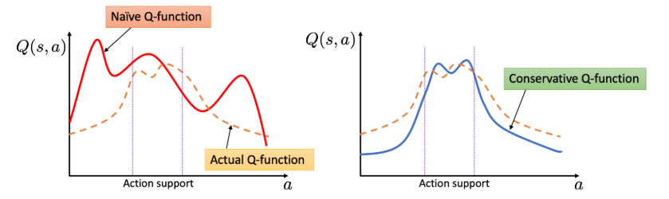{#fig-CQL}

@fig-CQL also illustrates that, unlike a standard Q-function that overestimates on OoD actions, a conservative Q-function keeps reasonable estimates within the action support while assigning lower values in OoD regions. The lecture also mentions an additional regularizer $\mathcal{R}(\mu)$, typically defined using entropy, to broaden the action coverage of $\mu$. With this regularizer, $\mu(a \vert s) \propto \exp (Q(s, a))$, which simplifies the original $\min_Q \max_{\mu}$ form into a simpler objective depending only on $Q$.

## Example Application of CQL

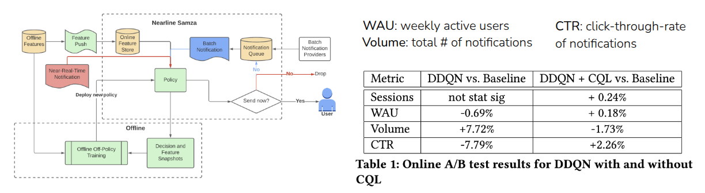

As an example of CQL in practice, the lecture introduced the KDD 2022 work by @prabhakar2022multi, which applied Offline RL at LinkedIn to improve CTR (Click-Through Rate) and WAU (Weekly Active Users). In this setting, notifications can increase user engagement, but sending too many notifications also has costs and downsides. The task is therefore a multi-objective optimization problem.

The authors compared an existing baseline(@10.1145/3488560.3510017), Double DQN (DDQN), and a version combining DDQN with CQL loss through online A/B testing. Plain DDQN led to an undesirable result: WAU and CTR dropped while the number of notifications increased. In contrast, combining DDQN with CQL improved all metrics.

## Where does the reward come from?

The lecture then moved from Offline RL to **Reward Learning**.



It introduced a video of a young child pouring water from a bottle into a cup and then drinking it. The key question is how the child could have learned that sequence of actions. Although the video does not show it directly, we can imagine that the child learned through trial and error, guided by some internal sense of satisfaction. That sense of satisfaction can be viewed as a kind of reward.

But if we asked a robot to do the same task, how would we define the reward? Should the reward depend on how little water is spilled, or how much water ends up in the cup? In real-world settings, it is hard to define all such reward components explicitly. In games, by contrast, rewards are usually clear because there are obvious signals like scores or termination conditions. In domains like dialogue or autonomous driving, defining a reward function is much harder.

One easy way to handle such tasks is **Imitation Learning**, where the system simply imitates expert behavior. However, imitation learning is still a form of supervised learning, so it often copies expert actions without reasoning about the true dynamics of the environment. It also depends on collecting and using expert data, which is often limited in real-world settings.



The lecture illustrated this with a video in which a child and a chimpanzee observed an adult performing an action incorrectly, yet corrected the mistake instead of copying it exactly. This suggests that learning is not just about imitating behavior, but also about internalizing what counts as good behavior. That is the central motivation behind reward learning.

## Goal Classifiers

An easier alternative to directly learning a reward is to build a **goal classifier** that predicts whether the current state matches a desired goal state.

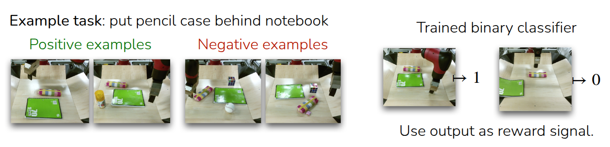

The example in the lecture was a robot arm learning to place a pencil case behind a notebook.

1. First, we collect images of successful and unsuccessful cases.
2. Then we train a binary classifier that takes a state $s_i$ as input and predicts whether it is a good case or not.
3. Finally, we use the classifier’s output as the reward signal for reinforcement learning.

This is a simple approach, but it raises an important concern: can the RL algorithm really learn a good policy from the classifier’s reward? Ideally, the classifier would correctly judge every possible state, but in practice it usually only interpolates around the states it has seen. As a result, when RL encounters unseen states, it may exploit weaknesses in the classifier rather than pursue genuinely good behavior. This phenomenon is often called **Reward Hacking**: instead of maximizing the intended objective, the agent finds loopholes that maximize the reward.

From this perspective, the policy should again be trained conservatively, much like CQL. The lecture therefore suggested an iterative scheme:

1. start with initial sets of successful states ($\mathcal{D}_{+}$) and failed states ($\mathcal{D}_{-}$)
2. balance them 50:50 when training the classifier
3. collect trajectories with the current policy, update the policy using the classifier-derived reward
4. add every visited state $s_t$ to the failure set ($\mathcal{D}_{-}$)	​
5. Repeating this process

This process encourages the model to act conservatively by treating previously visited states as failures. The downside is that even some genuinely successful states from collected trajectories may be labeled as failures, which can reduce the chance of learning the best actions. Still, if the dataset can be kept balanced, this helps reduce classifier mistakes.

::: {layout-ncol=2}
 Direct Imitation Learning

 Medal++
:::

The professor then introduces **MEDAL++**, a robotics RL example from @sharma2023self. In that work, the authors first collected 50 expert demonstrations, treated the last state of each expert trajectory as a success case, and stored those examples in the replay buffer for off-policy learning. Compared with direct imitation learning, which achieved only a 26% success rate, MEDAL++ using the learned goal classifier reached 62%. The lecture also noted that beyond simply balancing the dataset, additional regularization of the classifier seems necessary.

::: {#fig-gan layout-ncol="2"}

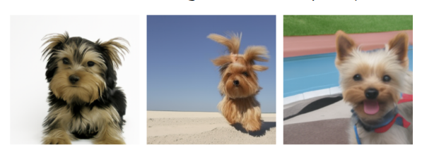{#fig-vqgan}

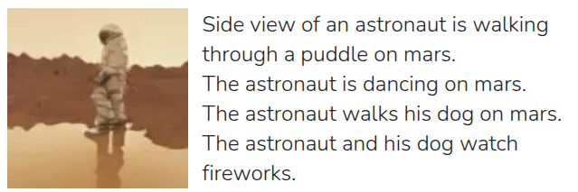{#fig-phenaki}

:::

The professor further notes that this training style resembles **Generative Adversarial Networks (GAN)**, where a classifier and a generator are trained together. The classifier learns to distinguish real from generated samples, while the generator learns to fool the classifier. The examples of **ViT-VQGAN**(@yu2021vector) and **Phenaki**(@villegas2022phenaki) are used to illustrate how generated images or videos can help generalization. In the same spirit, a reward classifier can serve as a useful framework for task specification, but because it relies on adversarial-style interaction with trajectories produced during RL, training can be unstable. More fundamentally, it also requires some successful examples to begin with, though this limitation can be partly alleviated by seeding the replay buffer with expert data(@sharma2023self). 

## Learning Rewards from Human Preferences

Instead of learning a reward classifier from expert-labeled data, we can also learn rewards from human preferences. The problem with the classifier approach is that we need a criterion for deciding which data are good or bad, and when that criterion is unclear, we must first gather some amount of labeled data to infer it. This motivates a different strategy for judging quality.

::: {#fig-preference layout-ncol="2" title="Goodness of Trajectory"}

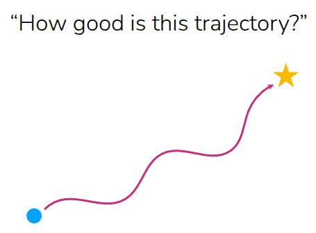{#fig-how-good}

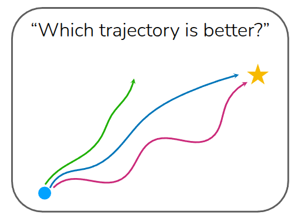{#fig-which}

:::

The professor explains this using two cases. In one case, we ask, “How good is this trajectory?” That requires an absolute standard, like a predefined reward function. In the other case, we ask, “Which trajectory is better?” When multiple trajectories are shown together, people can often judge them relatively. For example, most people would prefer a shorter, more direct blue trajectory over a longer alternative. Relative preference is often easier to provide than an absolute score.

### How to learn a reward function from human preferences?

Suppose we have a better trajectory ($\tau_{\text{win}}$) and a worse trajectory ($\tau_{\text{lose}}$), written as $\tau_{\text{win}} > \tau_{\text{lose}}$. Here, $\tau$ may be a full episode trajectory or just a partial rollout. The goal is to learn a reward function such that the total reward assigned to the better trajectory is greater than the total reward assigned to the worse one. 

$$
\sum_{(s, a) \in \tau_{\text{win}}} r_{\theta}(s, a) > \sum_{(s, a) \in \tau_{\text{lose}}}r_{\theta}(s, a)
$$

In shorthand, this becomes $r_{\theta}(\tau_{\text{win}}), r_{\theta}(\tau_{\text{lose}})$. The degree to which one is better than the other can then be modeled with a sigmoid over the reward difference.

$$
\sigma (r_{\theta}(\tau_{\text{win}}) - r_{\theta}(\tau_{\text{lose}}))
$$

Using that formulation, we can train the reward model with **maximum likelihood estimation (MLE)** by maximizing the log probability that the preferred trajectory receives the higher reward. 

$$
\max_{\theta} \mathbb{E}_{\tau_{\text{win}}, \tau_{\text{lose}}} [ \log \sigma (r_{\theta}(\tau_{\text{win}}) - r_{\theta}(\tau_{\text{lose}}))]
$$

The lecture then summarizes the full algorithm: 

```pseudocode
#| html-indent-size: "1.2em"
#| html-comment-delimiter: "//"
#| html-line-number: true
#| html-line-number-punc: ":"
#| html-no-end: false
#| pdf-placement: "htb!"
#| pdf-line-number: true
#| label: algo-reward-learning

\begin{algorithm}
\caption{Complete Reward Learning}
\begin{algorithmic}
\State Given dataset $\{\tau_i\}$, sample batches of $k$ trajectories and ask humans to rank.
\State Compute $r_{\theta}(\tau_1), \dots, r_{\theta}(\tau_k)$ under current reward model $r_{\theta}$
\State For all $\big(\begin{smallmatrix}k \\ 2 \end{smallmatrix}\big)$ pairs per batch, compute $\nabla_{\theta} \mathbb{E}_{\tau_{\text{win}}, \tau_{\text{lose}}}[\log \sigma (r_{\theta}(\tau_{\text{win}}) - r_{\theta}(\tau_{\text{lose}}))]$ where $\tau_{\text{win}} > \tau_{\text{lose}}$
\State Update $\theta$ using computed gradient
\State Repeat from 2 to 4
\end{algorithmic}
\end{algorithm}
```

This style of reward learning is also widely used for language models. In that setting, the $k$ trajectories correspond to multiple candidate outputs for the same prompt, and humans compare them. Because word order and phrasing matter, these comparisons are usually made among outputs generated from the same prompt, rather than across different prompts. This process can also run alongside online RL, meaning that a reward model can keep improving as the policy collects more data and humans continue providing feedback. This overall research direction is commonly known as **Preference-based RL (PbRL)**.

::: {#fig-human layout="[[1, 1], [1]]"}

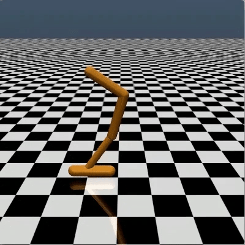{#fig-backflip}

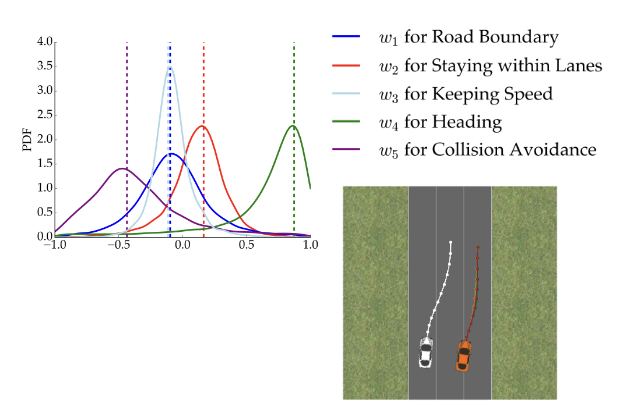{#fig-active}

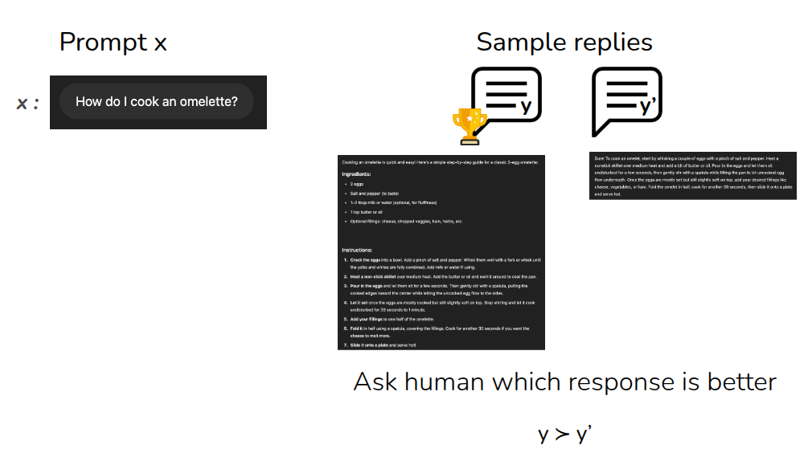{#fig-rlhf}

:::

The lecture introduced three major examples. @fig-backflip is the early work by @christiano2017deep, one of the first demonstrations of using human preferences inside an online RL loop. According to the lecture, the approach used 900 human-labeled preference queries. Further details are described in OpenAI's [Blog](https://openai.com/index/learning-from-human-preferences/). Another example is autonomous driving(@Sadigh2017ActivePL), where it is difficult to define reward functions for all cases explicitly, so preferences over driving behavior can instead be collected and learned. The article also notes that the best-known modern example is **Reinforcement Learning from Human Feedback (RLHF)**, where LLMs are trained from preference comparisons over prompt responses. This is the one of core technique for training InstructGPT, which is fine-tuned from GPT-3, [Link](https://openai.com/index/instruction-following/) described that it is originated from @christiano2017deep.

### Learning Rewards from Human/AI Feedback for LLMs

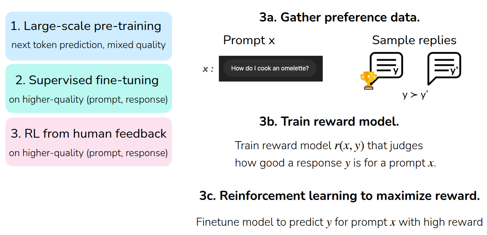

Finally, the lecture explains how RL is used in training LLMs. First, a language model is trained through **large-scale Pre-Training**, usually by predicting the next token from large, general-purpose datasets. After that, **supervised fine-tuning (SFT)** is performed using a higher-quality dataset of prompt-response pairs aligned with user intent. Then **RL from Human Feedback (RLHF)** is applied.

Viewed through the lens of reward learning, the final stage works as follows: collect human preference data over multiple responses to the same prompt, train a reward model $r(x, y)$ that scores the quality of a response for a given prompt, and then run reinforcement learning to maximize expected return under that reward. The lecture notes that @ouyang2022training used **PPO** for this step.

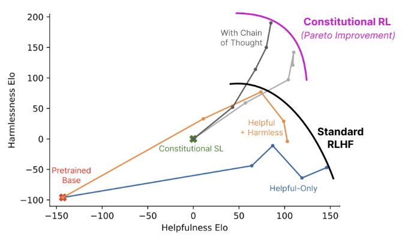

At this point, we can also ask whether the preferences must come from humans at all. That leads to **RL from AI Feedback (RLAIF)**. The article mentions **Constitutional AI** by @bai2022constitutional, where one LLM evaluates the outputs of another LLM. The lecture only touched on this briefly, but the main message was that when such techniques are combined with mechanisms like chain-of-thought (CoT), they can produce Pareto improvements over standard RLHF. I also have interests in this topic such as **Motif**(@klissarov2023motif), which studies AI-generated feedback in RL environments like [NetHack](https://github.com/facebookresearch/nle), where an LLM evaluates player behavior and helps provide motivation-like reward signals. 

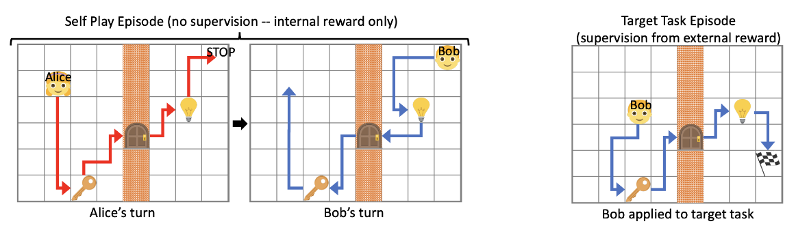

The section ends by mentioning that even in the absence of explicit rewards or preferences, research on Unsupervised RL explores whether agents can still learn to reach meaningful goals. (@sukhbaatar2017intrinsic)

## Summary

In the first half of the lecture, the focus was on **Conservative Q-Learning (CQL)**, which mitigates overestimation in Offline RL by pushing down Q-values that become too large due to OoD actions. In the second half, the lecture covered **Reward Learning**, where the reward needed for reinforcement learning is inferred by a neural network rather than being manually specified.

To summarize the reward-learning part: in most real environments, it is hard to define an explicit reward function. One practical solution is to train a **goal classifier** that distinguishes goal states from non-goal states and use its output as reward. To reduce problems like reward hacking, one can conservatively collect data and repeatedly retrain the classifier; some works also bootstrap this process using expert trajectories. This is practical for task specification, but because it relies on adversarial-style training over labeled data, instability can arise, and it still needs at least some expert examples.

Another route is to learn rewards from **human preferences**. Because relative judgments across trajectories are often easier than defining absolute standards, this approach can align training with desired behavior without requiring expert demonstrations in the same way. It also scales well, which is why it has become a key technique in LLM training. That said, preference-based methods still require supervision over sampled outputs, and collecting that supervision from humans can be expensive. Techniques like **RLAIF** are being studied to reduce that cost.

