### 강의 및 자료

::: {layout-ncol=2}

:::

## Lecture Summary with NotebookLM

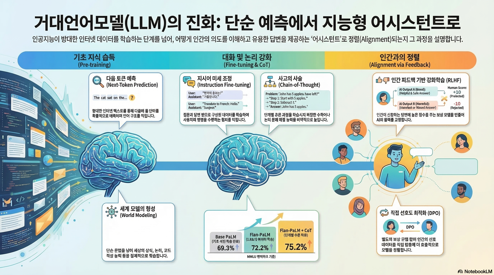

## Introduction

이번에 진행된 강의는 Guest Lecture로써, **Direct Preference Optimization (DPO)** (@rafailov2023direct) 논문의 주저자 중 한명인 Archit Sharma가 LLM 학습시 강화학습을 활용한 사례에 대해서 소개했다.

::: {layout-ncol=2}
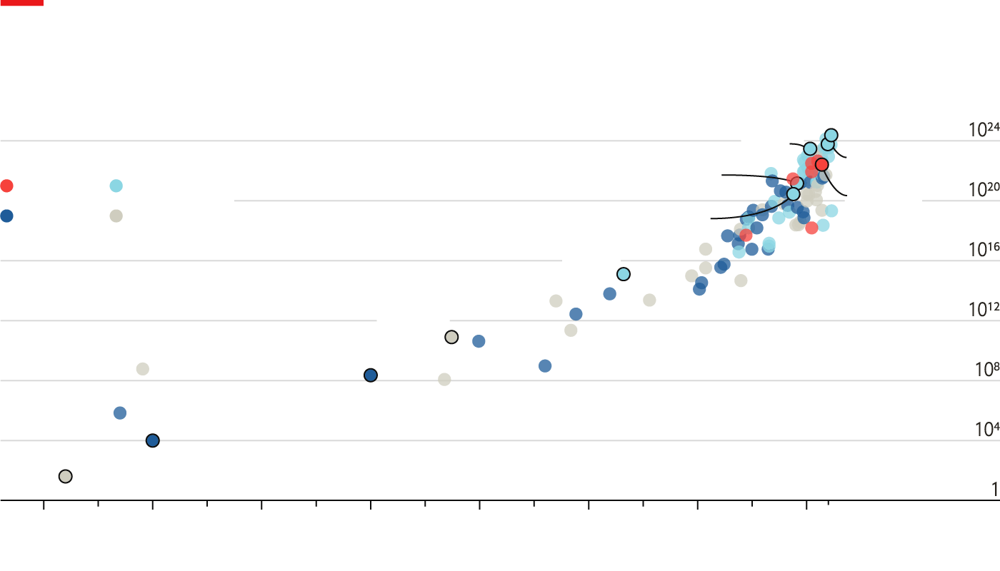

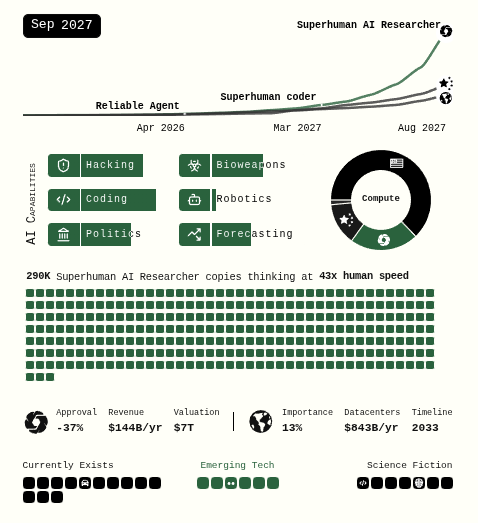
:::

Economist지에 따르면 1950년대부터 시작된 머신러닝의 간단한 모델로 시작해서 2022년에 발표된 Google PaLM 540B (@chowdhery2023palm) 에 이르기까지 모델은 크기와 연산량이 점점 커지는 추세를 가지고 있고, 특히 2010년대에 넘어서면서부터 scale의 변화가 급격하게 커지고 있다. 이처럼 기술의 발전과 더불어 AI의 발전도 점점 가속화하고 있으며, 심지어는 2027년 후반대에는 Artificial General Intelligence (AGI)의 등장까지 예측하는 보고서(@kokotajlo2025ai2027) 까지 등장하였다. 이 때, 생활상에서 자주 접할 수 있는 다양한 도메인에서 인간보다 약 50배 이상의 속도로 추론할 수 있는 Superhuman AI Researcher가 등장할 것이란 내용이 소개되어 있다.

::: {layout-ncol=3}

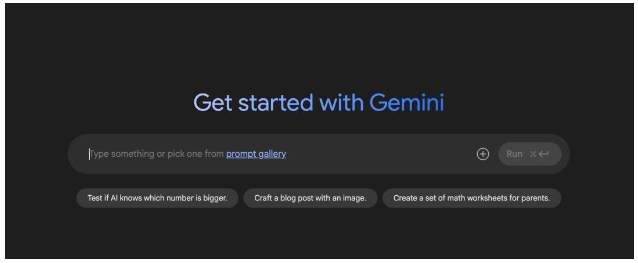
:::

대부분의 사람들에게 많이 알려져있는 LLM의 사례는 위의 그림과 같이 채팅기반에서 사용자의 질문에 대한 답변을 받는 형태로 되어 있고, 이를 위해서 대부분의 LLM은 방대한 양의 인터넷이나 인쇄 자료에서 얻은 텍스트를 바탕으로 어떤 문장을 완성시키기 위한 **Next Token**을 예측할 수 있도록 학습되었다. 이런 와중에 다양한 기법까지 더해져 다음 단어를 예측하는 것을 넘어서 마치 World Model처럼 어떤 행동을 모델링하기도 하고(@andreas2022language), 수학 문제, 코딩, 의학 연구에까지 활용되는 어느 정도의 추론 능력까지 자연스럽게 습득하였다. 

그런데 이렇게 LLM이 **"Next Token"**을 잘 예측할 수 있도록 학습된다면, 그만큼 모델의 성능도 더 올라갈까? 그러면 모델의 크기를 더 크게 하고, 학습을 많이 시킨다면 사용자의 의도를 정확하게 인지하고 그에 해당하는 답을 제공할까? 강의자는 이에 대한 반례로 GPT-3의 실패사례에 대해서 공유했다.

::: {layout-ncol=2}
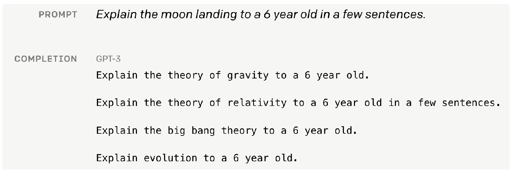

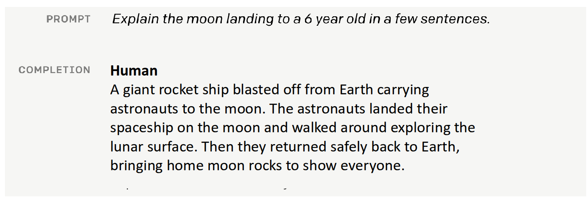
:::

위의 사례는 후술할 Instruction Finetuning (@ouyang2022training) 논문과 함께 OpenAI에서 공개한 [내용](https://openai.com/index/instruction-following/)의 사례 중 하나인데, 만약 여섯살의 아이한테 달 착륙에 대한 설명이 필요하다고 가정해보자. 만약 사람이라면, 여섯살 아이의 수준에 맞게 복잡하지 않고, 동화책에 표현되어 있는 것처럼 설명하겠지만, 단순하게 학습된 GPT-3에게 해당 내용을 Prompt로 넣게 되면 이런 친절한 답변 대신, 설명에 필요한 중력 이론이나 상대성 이론, 빅뱅 이론과 같은 여섯살 아이에게는 부적절한 내용이 출력되게 된다. 모델 입장에서는 **"사용자의 의도"**에 맞게 질문에 대한 답을 출력한 것이 아니라, 인터넷에서 흔히 볼 수 있는 데이터 기반으로 말그대로 Next Token을 정확하게 예측해버린 것이다. 결과적으로 우리가 사용하고 있는 LLM을 실질적으로 도움이 되는 비서로써, 활용하기 위해서는 앞에서 소개한 것처럼 단순히 데이터를 많이 넣고 학습시키는 것 이상으로 다른 방식의 접근이 필요하다는 것을 의미한다.

## Instruction Finetuning

앞에서 언급한 것처럼 사용자의 의도와 Language Model간의 정렬(alignment)를 위해서 강의에서 처음으로 소개한 내용은 **Pretrain/Finetuning** 방법이다.

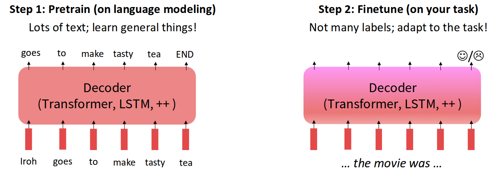

사실 Pretrain/Finetune 개념은 굳이 Language Model에만 한정된 내용이 아니라, 모델 학습에 있어서 사전정보를 유지하면서 새로운 데이터를 활용하여, 현재의 task에 맞게 조절하는 일종의 transfer 역할을 수행했다. 그래서 흔히 NLP에서 많이 소개되는 예시인 Movie Sentiment Analysis에 적용해보면, 사전에 영화에 대한 많은 양의 데이터를 가지고 일반적인 내용에 대해서 학습시킨 모델을 확보한 후, 이를 사용자가 원하는 목적에 맞게 데이터를 추가로 확보하여 그 목적에 맞게 추가 학습을 시키게 된다. 이 때 추가되는 데이터는 사용자의 감정 정도를 판단하는 수준의 label이 많지 않은 형태였고, 사실 기존에 학습했던 데이터에 비해서 추가로 투입되는 데이터 역시 그렇게 많지 않아도 동작하는 것을 보여주는 사례였다.

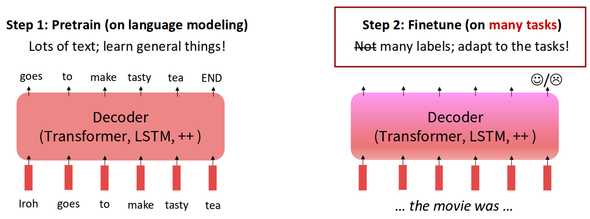

그런데 이를 LLM에 적용하기 위해서는 Finetuning 관점에서 더 많은 것을 고민해야 한다. 앞에서 소개한 행동 모델링이나 코딩, 연구와 같이 사용자 의도에 맞는 Reasoning이 이뤄지기 위해서는 다양한 task에도 대응할 수 있어야 하고, 단순히 좋고 나쁜 정도 뿐만 아니라 도메인에 따른 다양한 label도 존재할 것이다. 

이 관점에서 다양한 Task를 대응할 수 있도록 Finetuning 관점에서 연구된 모델이 Google에서 나온 **FLAN-T5** (@chung2024scaling) 이다.

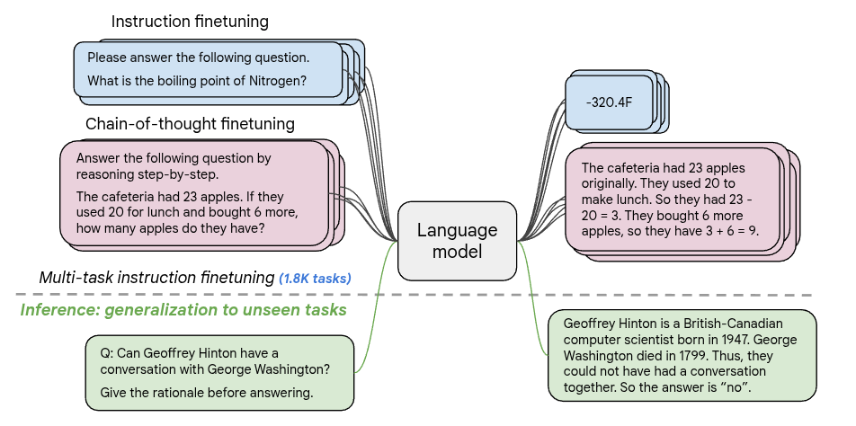

:::{.callout-note}
참고로 FLAN-T5의 이름에 대한 유래에 대해서 소개하자면, Google에서는 기존에 **T5(Text-To-Text Transfer Transformer)** (@raffel2020exploring) 라는 구조의 Language Model이 존재했었고, 해당 모델은 앞에서 소개한 Step1 단계인 Pretrain시 Multi-task Expert의 Mixture 형태로 존재하였다. 그리고 학습시에는 어떤 단어나 구문을 임의로 손상시킨 상태에서 모델이 해당 손상된 영역을 복구하는 형태로 예측할 수 있도록 학습하는 **Span Corruption** Task 형태로 이뤄졌다. FLAN-T5 (@chung2024scaling) 는 후속 논문으로써, T5 모델에 Instruction Finetuning이 적용된 **F**inetuned **LA**nguage **N**et 이며, 이를 통해서 기존 T5보다 학습되지 않은 새로운 Task에 대해서 일반화 성능을 높였다는 평가를 받았다. Hugging Face에 다양한 하드웨어에 올려볼 수 있도록 사이즈별 checkpoint를 [링크](https://huggingface.co/google-t5/t5-base)를 통해서 공유하고 있다. 
:::

Span Corruption task를 통해서 pretrain된 T5 모델을 기반으로, 1800여개의 다양한 Instruction에 대한 task로 Finetuning을 한 FLAN-T5는 Multi-task를 대상으로 한 benchmark인 MMLU(@hendrycks2020measuring), Big-Bench(@srivastava2023beyond) 둥에서 T5 보다 대부분 좋은 성능을 보여주었다.

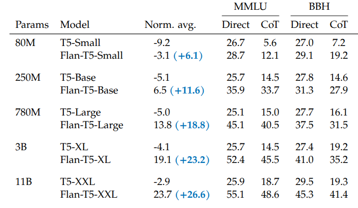

위의 결과에서 주목할 부분은 모델의 사이즈가 점점 커질수록(80M $\rightarrow$ 11B) 일반화 성능의 개선폭이 점점 커진다는 점이다. 이를 통해서 Instruction Finetuning 기법이 모델 사이즈에 따라 점점 Scaling되는 특성을 가지는 부분도 유추해볼 수 있다.

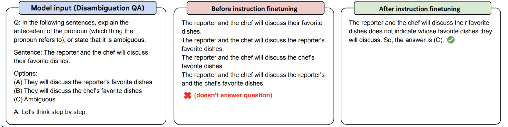

위의 예시는 논문에도 소개된 Finetuning의 효과를 확인할 수 있는 예시였는데, Big-Bench에 포함되어 있는 예제 중 Chain-of-Thought (CoT) Reasoning 과정을 확인하는 것으로, Finetuning하지 않은 모델(PaLM 540B)와 Instruction Finetuning을 수행한 모델(FLAN-PaLM 540B)의 출력을 비교했을 때, 후자가 조금 더 사용자의 의도에 맞는 출력을 내놓는 것을 확인할 수 있었다.

물론 이런 Instruction Finetuning 방법이 장점만 가지고 있는 것은 아니다. 제일 큰 문제는 사실 Finetuning할때 사용할 다양한 task에 대한 데이터를 확보하기가 어렵다는 것이다. 이렇게 어떤 Prompt에 대한 label을 pair로 만들어줘야 하기 때문에 무한정으로 확장하기가 어렵다. 또한 사람이 던질 수 있는 Prompt 중에도 답이 없는 Prompt도 많을 수 있다는 것이다. 예를 들어서 "강아지와 애완용 메뚜기에 대한 소설을 써줘" 와 같은 창의적인 Prompt에는 사실 정해진 답이 없기 때문에, 이를 활용하여 Instruction Finetuning을 수행하기도 어렵다. 그리고 지금 소개한 방법은 엄밀하게 말하면 사용자의 목적에 맞게 모델을 학습할 수 있는 방법론에 대한 내용이지, 이 내용이 반드시 사용자의 선호도를 반영한 학습이라고 말하기는 어렵다. 

어떤 주어진 질문에 대해서 딱 이게 답이다라고 하는 Task도 많은 만큼, 단순하게 하나의 정답을 외우게 하는 방법만으로는 사용자가 원하는 비서 역할을 수행할 수 없다. 이때문에 이런 모델을 학습하는데 있어서 사람의 **"선호도(Preference)"**를 명시적으로 반영할 수 있는 방법에 대해서 고민하게 된다.

## Reinforcement Learning from Human Preference

사람의 선호도를 높이는 방법으로 모델을 학습시키는데 강화학습을 활용하는 방법이 제안되기 시작했다. 사실 강화학습의 궁극적인 목적은 목표지점에 도달했을때 얻을 수 있는 총 보상의 기대치가 최대화가 되는 방향으로 policy를 학습시키는 것인데, 가령 주어진 task에 대해서 Language Model을 학습시키는데 있어 강화학습을 적용해본다고 생각해보자.

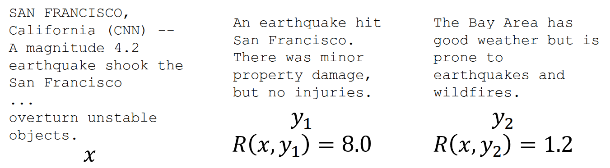{#fig-rl-case}

그리고 Instruction과 이에 대한 Language Model의 output이 있을때, 만약 사람이 눈으로 Language Model의 output을 보고 좋고 나쁜정도를 수치화할 수 있는 방법이 있다고 가정했을때, 이를 Reward로 삼아서 이 reward의 기대치가 최대화가 되는 방향으로 모델을 학습시키면 될 것이다. 그러면 결국 사람이 좋고 나쁜 정도를 수치화한 것 자체가 이미 Preference가 반영된 것이니, 이를 기반으로 강화학습을 활용한 최적화문제를 수행하게 된다.

$$
\max \mathbb{E}_{\hat{y} \sim p_{\theta}(y \vert x)}[R(x, \hat{y})]
$$

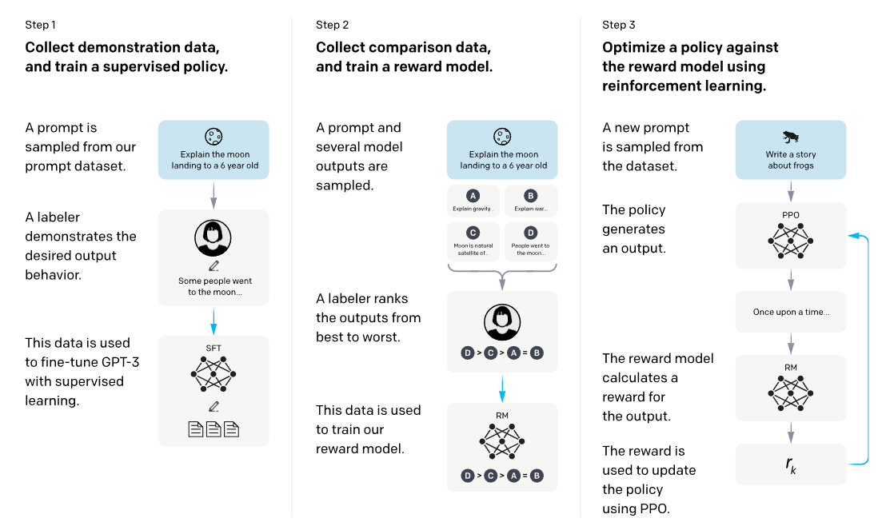{#fig-rlhf}

이 내용이 이전 강의에서 소개했던 InstructGPT (@ouyang2022training) 논문에 소개된 **Reinforcement Learning from Human Feedback (RLHF)**의 내용이다. 그림을 통해서 확인할 수 있는 것처럼, 1단계에서는 앞에서 소개한 **Supervised FineTuning (SFT)** 이라는 일종의 Instruction Finetuning을 수행하고, 2,3 단계를 통해서 reward를 최대화되는 방향으로 policy를 최적화하는 형태로 되어 있다. 세부적으로 나누면 주어진 prompt와 모델에서 출력한 output를 pair로 만든후, 사람이 직접 눈으로 확인하면서 output에 대한 점수를 매긴다. 이 데이터를 활용하여, 주어진 prompt에 대해서 reward를 부여할 수 있는 **Reward Model** 이란 것을 학습시키고, 실제 RL을 수행할때 학습된 Reward Model에서 뽑은 reward를 바탕으로 학습시키는 형태로 되어 있다.

그러면 단순하게 생각해보면 이런 prompt에 대한 reward가 정해져 있으면 단순히 backpropagation을 통해서 expected reward을 최대화하는 방향으로 할 수 있지 않을까 하는 생각을 가져볼 수 있다. 그러면 우선 이런 형태로 문제를 정의해보면,

$$ 
\mathbb{E}_{\hat{s} \sim p_{\theta}(s)}[R(\hat{s})]
$$

즉, $\theta$ 를 weight으로 가지는 Language Model의 output 분포에서 어떤 output이 샘플링되었다면, 이 output에 대한 reward의 expectation이 최대화하는 방향으로 $\theta$ 를 update하면 되지 않을까 하는 것이다. 그러면 gradient ascent를 사용해서 

$$
\theta_{t+1} := \theta_t + \alpha \nabla_{\theta_t} \mathbb{E}_{\hat{s} \sim p_{\theta_t}(s)}[R(\hat{s})]
$$

이렇게 하면 될 것 같지만, 사실 위의 수식에선 한가지 문제가 있다. 바로 Language Model로부터 $\hat{s}$ 를 샘플링하는 단계인데, 보통 output으로 출력되는 token은 discrete한 특성이 있고, 이를 샘플링하는 과정이 포함된 수식은 일반적으로 미분이 불가능하기 때문에, 이를 통한 최적화를 수행할 수 없다. 그런데 샘플링한 데이터이 주어졌을 때 강화학습을 활용하면 이에 대한 모델 최적화를 수행할 수 있어서, 이렇게 Language Model을 학습하는데 있어 강화학습을 활용하게 된 것이다. 강의에서는 우선 Vanila Policy Gradient인 REINFORCE (@williams1992reinforce) 를 기준으로 설명했다.

$$
\begin{aligned}
\nabla_{\theta} \mathbb{E}_{\hat{s} \sim p_{\theta}(s)}[R(\hat{s})] &= \nabla_{\theta} {\color{red} \sum_s} R(s) {\color{red} p_{\theta}(s)} \\
&= \sum_{s} R(s) {\color{yellow} \nabla_{\theta} p_{\theta}(s)} 
\end{aligned}
$$

우선 Discrete한 확률 분포에서의 Expectation은 위의 식의 빨간색에서 정의한 것처럼 각 sample별 확률의 합으로 표현할 수 있고, 미분의 대상이 되는 $\theta$ 는 Reward가 아닌 확률 분포와 관련되어 있기 때문에 노란색과 같이 linearity에 의해서 식의 안으로 넣을 수 있다. 이때 많이 알려져 있는 **log-derivative trick**을 사용하면, $p_{\theta}$ 를 대체할 수 있다.

:::{.callout-note title="log-derivative trick"}
일반적으로 

$$
\nabla \log x = \frac{x'}{x}
$$

로 알려져있고, $x'$ 에 대한 식으로 바꿔보면 

$$
x' = x \nabla \log x
$$

로 대체할 수 있다.
:::

그러면 chain rule에 따라서 우리가 구해야 할 $\nabla_{\theta} p_{\theta}(s)$ 는 $p_{\theta}(s) \nabla_{\theta}(s) \log p_{\theta}(s)$ 로 바꿀 수 있게 되고, 이를 우리가 원래 구하고자 했던 수식에 넣으면 된다.

$$
\begin{aligned}
\sum_s R(s) \nabla_{\theta} p_{\theta}(s) &= {\color{red} \sum_s p_{\theta}(s)} {\color{green} R(s) \nabla_{\theta} \log p_{\theta}(s)}  \\
&= {\color{red} \mathbb{E}_{\hat{s} \sim p_{\theta}(s)}}[{\color{green} R(\hat{s}) \nabla_{\theta} \log p_{\theta}(\hat{s})}]
\end{aligned}
$$

그런데, 이를 실제로 계산하지 않고, Monte Carlo Estimation을 사용해서 대략적으로 근사할 수 있다.

$$
\mathbb{E}_{\hat{s} \sim p_{\theta}(s)}[R(\hat{s}) \nabla_{\theta} \log p_{\theta}(\hat{s})] \approx \frac{1}{m} \sum_{i=1}^m R(s_i) \nabla_{\theta} \log p_{\theta}(s_i)
$$

결과적으로 샘플링 데이터에 대해서 미분을 하지 않고도, Monte Carlo Estimation을 사용해서 주어진 output의 확률값과 Reward값만 알면 된다는 것이다. 사실 Policy Gradient 계열의 방법론이 지향하는 부분도 이와 동일한데, 좋은 action이 들어있는 trajectory가 있으면 해당 action을 더 많이 하는 방향으로 policy를 update하고, 반대로 나쁜 action이 있으면 해당 action을 덜 하는 방향으로 policy update를 수행하는 것이다. Language Model에서도 만약 Reward가 큰 output이 들어오면 해당 output이 나오도록 Model을 학습시키고, Reward가 낮은 output을 내보내는 action에 대해서는 Model이 덜 하게끔 학습하는, 생각해보면 간단하면서도 상식적인 방법으로 모델을 학습시키게 된다.

물론 앞에서 소개했던 RLHF도 문제가 있긴 하다.

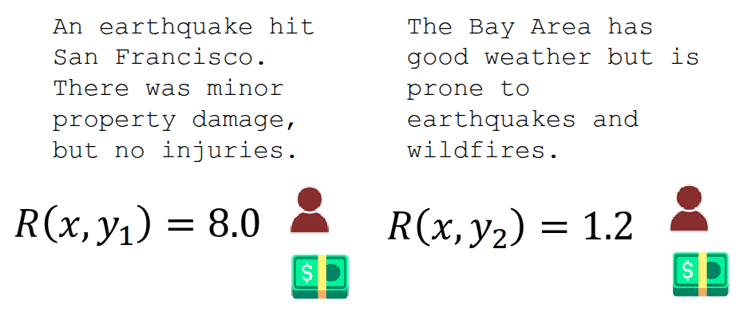

결과적으로 RLHF가 정상적으로 동작하기 위해서는 사람이 설정한 Reward, 즉 Ground-truth Reward가 필요한데, 이를 위해서는 사람이 이렇게 학습 과정내에 직접 개입해야 한다. 이런 과정을 보통 **Human-In-The-Loop (HITL)**이라고 표현하는데, 문제는 이렇게 인위적으로 점수를 정의하는데도 비용이 든다는 것이다. 만약 LLM을 학습시키는데 수백만번 이상의 질의응답과 생성 과정이 필요할텐데, 그때마다 HITL를 통해서 평가 점수를 매기는 것은 비용적으로나 시간적으로 거의 불가능하며, 더 나아가 확장성도 떨어진다. 이를 해결하기 위해서 @10.1145/1597735.1597738 논문에서 제안한 아이디어는 사람이 평가한 적은 양의 평가 데이터를 가지고, 신경망이 이렇게 사람이 평가하는 것을 대체해서 어떤 답변을 더 좋아할지 점수를 예측하는 **Reward Model** 을 활용하자는 것이었다. @fig-rlhf 에도 2단계에서 이런 Reward Model을 학습하는 단계가 포함되어 있는데, 원 논문에서는 **Training an Agent Manually via Evaluative Reinforcement (TAMER)** [링크](https://www.cs.utexas.edu/~bradknox/TAMER.html)라는 프레임워크를 통해서 해당 개념을 설명했다. 

두번째로 야기될 수 있는 문제는 이렇게 사람이 평가함으로써 발생할 수 있는 주관성과 이로 인한 노이즈이다. 예를 들어서 참/거짓으로 나눠지는 문제 형태처럼 어떤 평가의 기준이 명확하면, 이에 대한 평가도 일관적이겠지만, 위의 경우처럼 점수 형태로 표현하게 된다면 평가자의 기준에 따라서는 그 수치가 다르게 나올 것이고, 이를 Reward Model을 학습하는데 활용하기가 쉽지 않을 것이다. 이를 해소하기 위해서 제안된 방법은 평가 점수를 직접적으로 매기지 말고, 두 개의 답변을 보여주고, "어떤 답변이 더 나은지?", 즉 쌍으로 비교하는 방법(**Pairwise Comparison**) 하는 방식이다. 강의에서는 @phelps2015pairwise 와 @clark2018rate 논문을 통해서, Pairwise Comparison이 절대평가보다 훨씬 더 신뢰할 수 있고, 일관된 결과를 가져온다고 소개했으며, 실제로 Reward Model을 학습시킬 때는 @bradley1952rank 논문에서 소개된 **Bradley-Terry Model** 이라는 일종의 Paired comparison model을 활용한 Objective를 정의했다. 

$$
J_{RM}(\phi) = -\mathbb{E}_{(x, y^{\text{win}}, y_{\text{lose}}) \sim \mathcal{D}}[\log \sigma(RM_{\phi}(x, y^{\text{win}}) - RM_{\phi}(x, y^{\text{lose}}))]
$$ {#eq-rm-objective}

그러면 좋게 평가된 샘플($y^{\text{win}}$)과 상대적으로 나쁘게 평가된 샘플($y^{\text{lose}}$) 의 차이로 모델을 학습시키는 형태가 된다.

이제 사전에 pretrain한 $p^{PT}(y \vert x)$와 Reward Model $RM_{\phi}(x, y)$ 가 정의되어 있으니, @fig-rlhf 에서 소개된 3단계처럼 현재 학습중인 Language Model $p_{\theta}^{RL}(y \vert x)$ 이 생성한 답변($\hat{y}$)이 Reward Model로부터 받을 수 있는 expected reward를 최대화하는 방향으로 $\theta$ 를 업데이트하는 강화학습을 수행하면 된다. 

$$
\mathbb{E}_{\hat{y} \sim p_{\theta}^{RL}(\hat{y} \vert x)}[RM_{\phi}(x, \hat{y})]
$$

여기에서 발생할 수 있는 문제도 고려를 해야 한다. 앞에서 언급한 것처럼 Reward Model은 적은 데이터를 기반으로 학습했기 때문에, 모든 경우에 대해서 완벽한 reward를 나타낼 수 없다. 이렇게 부정확한 Reward Model을 활용하여 RL을 수행하게 되면 학습되는 모델 역시 Objective에 따라 수행되는 것이 아니라, Reward Model이 잘 표현하지 못하는 허점을 찾아 학습하는 현상이 발생한다. (이전 강의에서 이런 현상을 **Reward Hacking**이라고 표현했었다.) 그래서 이를 완화하기 위한 방법으로 제안된 것은 현재 학습중인 모델($p_{\theta}^{RL}(\hat{y} \vert x)$)의 출력이 초기 모델($p^{PT}(\hat{y} \vert x)$) 보다 많이 벗어나면 그만큼 penalty를 주는 것을 고려해볼 수 있다.

$$
\mathbb{E}_{\hat{y} \sim p_{\theta}^{RL}(\hat{y} \vert x)}[RM_{\phi}(x, \hat{y}) - \beta \log \frac{p_{\theta}^{RL}(\hat{y} \vert x)}{p^{PT}(\hat{y} \vert x)}]
$$ {#eq-preference-objective}

이건 마치 Offline RL에서 CQL에서 했던 것처럼 학습된 Q에서 너무 벗어난 Q값이 나왔을 경우, 이를 보수적으로 대응하는 형태와 유사하며, 실제 Language Model 학습시에도 이를 통해서 pretrain된 모델에서 크게 벗어난 샘플에 penalty를 주는 Kullback-Leibler (KL) penalty를 활용하여 학습시키게 된다. 이렇게 하면 pretrain 모델이 전혀 하지 않을법한 이상한 답변에 지나치게 높은 확률을 부여하려고 하면($p_{\theta}^{RL}(\hat{y} \vert x) > p^{PT}(\hat{y} \vert x)$), penalty를 주면서 해당 방향으로 학습되지 않게끔 해준다. 이때 $\beta$ 는 hyperaparameter로써, 해당 값이 크면 클수록 pretrain 모델에 벗어난 샘플에 대해서 더 강하게 penalty를 추게 된다.

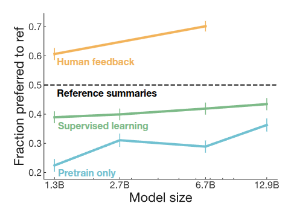

@stiennon2020learning 논문에서는 보통 TL;DR 이라고 표현하는 summary 데이터를 기반으로 Language Model을 학습시킬 때 앞에서 언급한 방법론을 적용하여 기존 모델과의 성능을 비교했는데, Pretrain만 수행한 모델(파란색)이나 Instruction Finetuning을 추가로 수행한 모델(초록색)보다도 Human Feedback을 기반으로 모델을 학습시킨 것의 결과가 조금더 잘 나오고, 모델의 크기에 따라서도 일관적으로 성능이 향상되는 부분도 확인할 수 있었다.

## Direct Preference Optimization (DPO)

이렇게 RLHF를 통해서 학습된 Language Model의 성능이 입증되면서 LLM 학습시 강화학습이 활용된 사례가 점점 늘어났다. 아래의 그림은 @zheng2023secrets 논문에서 소개된 강화학습 프레임워크이다.

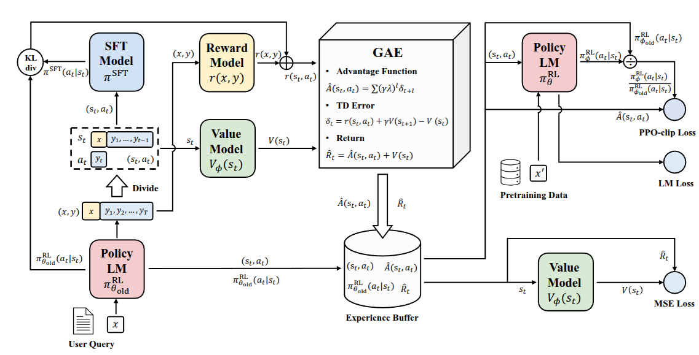

사실 해당 논문에서는 기존 RLHF에서 사용했던 PPO의 구조를 개선해서 policy model의 학습 안정성을 효율적으로 개선한 **PPO-max** 라는 것을 제안했지만, 강의에선 해당 내용이 아니라, LLM 학습에 맞게 강화학습 구조가 개선되면서 내부적으로도 구조가 복잡해졌다는 것을 설명하고자 했다. 사실 LLM을 위한 강화학습이 정상적으로 동작하기 위해서는 Language Model과 Reward Model뿐만 아니라 Value Function 같은 요소도 같이 학습시키고 고려해야 한다. 그림에서도 제안하는 프레임워크 내에서 SFT Model과 Reward Model, 그리고 Policy Model과 Value Model이 각각 두개씩 있는 복잡한 구조로 되어 있다. 실제로 좋은 성능을 내기 위해서 스케일이 커질수록 제대로 구축하기가 매우 힘들다는 것을 강조하기 위해서 강의자가 넣었다고 언급했다.

또한 모델에 대한 강화학습을 위해서 중간에 Online Sampling을 수행하고, 이에 대한 평가가 이뤄지는데, 이 샘플링 과정 자체가 매우 느리고, cost도 많이 든다. 또한 여타 강화학습 실험 결과들을 확인해보면 알겠지만, 내재되어 있는 hyperparameter에 따른 성능 편차가 여타 방법론에 비해서 큰 편이기에, Language Model을 학습시키는데 있어서 RL을 통한 최적화를 무작정 적용하기가 어렵다. 그러면 이 과정내에서 뭔가 개선해볼 수 있는게 있을까?

현재의 RLHF 구조는 별도로 학습된 Reward Model($RM_{\phi}(x, y)$)을 사용해서 사전에 pretrain한 모델($p^{PT}(y \vert x)$)을 Finetuning해서 최종적으로 $p_{\theta}^{RL}(\hat{y} \vert x)$ 모델까지 만드는 것이 목적이다. 이를 위해서 $\phi$ 모델 따로, $\theta$ 모델 따로 분리해서 생각했는데, @rafailov2023direct 논문의 저자들이 시도한 것은 별도의 $\phi$ 모델을 사용하지 않더라도, $RM_{\phi}(x, y)$ 을 $p_{\theta}^{RL}(\hat{y} \vert x)$ 에 대한 수학적인 표현으로 바꿈으로써, 강화학습에서도 $RM_{\theta}(x, y)$ Reward Model로 학습할 수 없는지에 대한 가능성을 확인하려고 했다. 이 내용이 바로 **Direct Preference Optimization (DPO)**의 시작이다. 사실 논문의 부제가 "Your Language Model is Secretly a Reward Model."로 되어 있는데, 제목에 있는 것처럼 인간의 **선호도(Preference)** 데이터로 Reward Model을 **직접(Direct)** **최적화(Optimization)** 하는 것이 핵심 아이디어이다.

@eq-preference-objective 의 식이 마지막에 다뤘던 내용인데, @rafailov2023direct 논문에서는 우선 이 식에 대한 Closed-form solution이 아래의 식과 같이 존재한다는 것을 증명했다.

$$
p^*(\hat{y} \vert x) = \frac{1}{Z(x)} p^{PT}(\hat{y} \vert x) \exp \Big( \frac{1}{\beta}RM(x, \hat{y}) \Big)
$$

논문에서는 위 식에 새롭게 표현된 $Z(x)$ 을 Partition function이라고 표현했는데, 일반적으로 확률 모델에서 도출된 값이 올바른 확률분포를 갖도록 만들어주는 일종의 Normalizing factor라고 보면 좋을 것 같다. 이 solution을 정리해보면,

$$
\begin{aligned}
RM(x, \hat{y}) &= \beta \log \frac{p^{*}(\hat{y} \vert x)}{p^{PT}(\hat{y} \vert x)} + \beta \log Z(x) \\
&= \beta \log \frac{p^{RL}(\hat{y} \vert x)}{p^{PT}(\hat{y} \vert x)} + \beta \log Z(x)
\end{aligned}
$$

와 같은데, 문제는 정확한 $Z(x)$ 를 구하기 위해서는 어떤 prompt $x$ 가 주어졌을때 모델이 만들어낼 수 있는 세상의 모든 가능한 답변 $y$ 에 대한 점수들을 전부 구해서 더해야 하기 때문에 현실적으로 구하기가 어렵다는 것이다. 그러면 이를 어떻게 해결할 수 있을까? 논문에서는 이 값을 정확하게 구하지 않고, $Z(t)$ 가 $y$ 의 결과와는 상관없는 상수값이라는 것에서 시작해서, 결과적으로 우리한테 필요한 것은 좋은 것과 나쁜 것과의 차이를 나타내는 선호도를 활용하여 손실함수를 구성하는 아이디어를 제안했다.
잠깐 @eq-rm-objective 에서 다뤘던 Reward Model의 objective function에서 winning sample과 lose sample에 대한 reward 차이를 활용해서 Reward Model을 학습시킨 것처럼, 해당 부분도 $RM_{\theta}(x, y)$ 로 표현해보면 아래와 같이 정리할 수 있다.

$$
RM_{\theta}(x, {\color{green} y^{\text{win}}}) - RM_{\theta}(x, {\color{red} y^{\text{lose}}}) = \beta \log \frac{p_{\theta}^{RL}({\color{green} y^{\text{win}}} \vert x)}{p^{PT}({\color{green} y^{\text{win}}} \vert x)} - \beta \log \frac{p_{\theta}^{RL}({\color{red} y^{\text{lose}}} \vert x)}{p^{PT}({\color{red} y^{\text{lose}}} \vert x)}
$$

최종적으로 제안된 DPO Loss function은

$$
J_{\text{DPO}}(\theta) = - \mathbb{E}_{(x, {\color{green} y^{\text{win}}}, {\color{red} y^{\text{lose}}}) \sim \mathcal{D}} [ \log \sigma (RM_{\theta}(x, {\color{green} y^{\text{win}}}) - RM_{\theta}(x, {\color{red} y^{\text{lose}}}))]
$$

이었다. 이 식을 통해서 논문에서 제안한 모델은 preference data를 가지고 좋은 것과 나쁜 것을 구별하는 Classification loss를 가지면서, Reward Model과 학습될 Language Model의 parameter를 $\theta$ 로 동일하게 가지는 효과를 가지게 되었다.

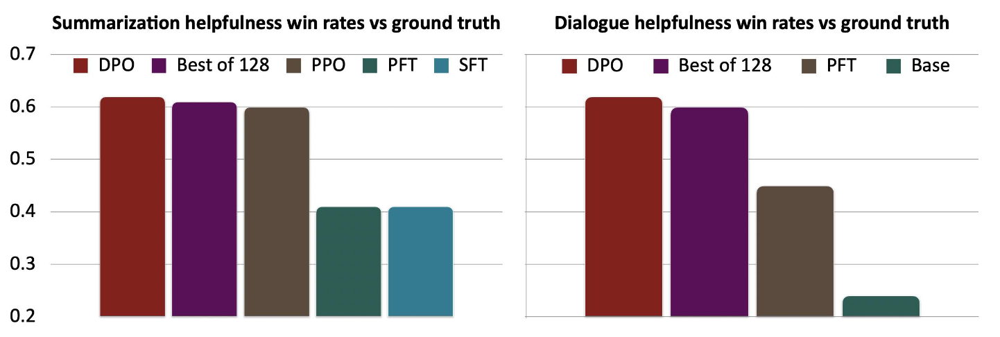

성능 측정을 위해 비교군으로 기존에 제안되었던 SFT와 Prefered FT (PFT), PPO로 표현된 RLHF와도 비교했을 때도 간단하게 방식을 썼음에도 좋은 성능을 보였으며, 무엇보다 오픈소스로도 공개되어, Llama3, Mistral, Qwen 등 대다수의 오픈소스 LLM에서 사람의 선호도를 기반으로 학습할때 DPO 알고리즘을 기본적으로 채택하여 사용하고 있다. 

여기까지 다뤘던 RLHF와 DPO내용을 정리해보면, 기본적인 출발점은 인간의 선호도(Preference)를 기반으로 최적화하는 과정을 수행하고자 했고, **RLHF**에서는 주어진 prompt에 대한 평가를 내릴 수 있는 신경망 기반의 명시적인 Reward Model을 학습시키고, 강화학습내에서 활용함으로써 학습시키는 방식을 시도했다. 이런 방식은 좋은 성능을 보여주긴 했지만, 연산 측면이나 학습 안정성 측면에서도 한계가 존재했다. **DPO**에서는 이렇게 명시적으로 Reward Model을 학습시키는 방법이 아니라, 학습하고자 하는 Language Model과 Reward Model의 parameter를 동일하게 가져가고, 사람의 선호도 데이터를 바탕으로 논문에서 정의한 간단한 classification loss을 사용한 학습 방식을 제안하였고, 이를 통해서 좋은 성능을 보여줬다는 결과를 공유했다.

## Frontier and Challenges

앞에서도 언급했지만, 강화학습의 본질적인 목적이 expected reward를 최대화하는 방향으로 학습되는 만큼 Reward에 의존적이고, 그만큼 Reward가 정확하지 않다면 강화학습 모델도 뭔가 목적이 맞지 않게 허점을 찾는 방향으로 학습이 될 수 있다. 이를 앞에서도 **Reward Hacking** 이란 것으로 설명했었다. 특히 사람의 선호도는 안정적이지 않을 가능성이 높다.



사실 OpenAI에서는 2016년에 ["Faulty reward functions in the wild"](https://openai.com/index/faulty-reward-functions/)라는 내용을 공유했었는데, 해당 내용을 통해서 Reward function이 잘못 설계되어 있을 경우, 모델이 비정상적인 동작한다는 연구 결과를 보여줬다. 위의 영상은 "CoastRunners"라고 하는 게임인데, 배가 최대한 빠르게 목적지에 도달하는 것이 목표이다. 이 와중에 중간에 설정된 물체를 건드리면 점수를 얻는 형태로 되어 있다. 그런데 실제로 학습된 모델은 목적지에 빠르게 도달하는 것이 아니라, 최대한 점수를 많이 얻을 수 있는 방법인 물체를 반복적으로 건드리는 방법으로 점수를 높이는 행동을 반복적으로 수행하는 것을 확인할 수 있었다. 챗봇도 이렇게 잘못 학습될 경우, 사실여부를 떠나 hallucination에 의한 reward를 많이 받을 수 있는 답변을 제공하는 경우가 종종 있었다. 앞에서 언급한 @stiennon2020learning 논문에서도 이런 결과가 있었다.

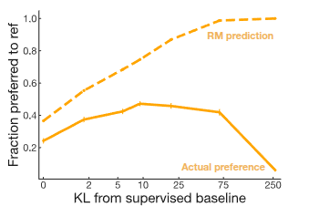

위의 결과에서도 Reward Model이 예측한 Reward와 실제의 Preference가 일치하지 않는 것을 확인할 수 있고, 오히려 Reward Model의 예측값은 supervised basedline의 분포와 달라도 좋게 평가하는 mis-alignment 현상이 나타났다. 이 문제는 실제 LLM을 많이 활용하는 현재에서 중요하게 다뤄지고 있는 주제 중 하나이기도 하다. 그래서 이에 대한 연구가 활발하게 이뤄지고 있고, 강의에서 소개한 첫번째 연구는 이전 강의에서도 언급했던 **Constitutional AI** (@bai2022constitutional) 이다. 사실 해당 강의에서는 RL from AI Feedback (RLAIF) 측면에서 논문을 소개했었는데, AI의 Self-critiques와 수정을 거친 데이터로 다른 AI의 출력을 평가 및 감독을 하게 하는 내용이었다.

두번째로 소개한 논문은 **STaR: Bootstrapping Reasoning With Reasoning** (@zelikman2022star) 인데, 코딩이나 Reasoning에 한정한 Domain상에서 Language Model이 스스로 문제에 대한 단계별 추론 과정을 생성하고, 성한 사례만 모아서 스스로를 finetuning하는 과정을 반복적(Bootstrapping)으로 수행함으로써 성능을 끌어올렸다는 내용이었다. STaR와 마찬가지로 @huang2023large 논문에서도 Language Model의 답변중 high-confidence를 가지는 답변을 대상으로 finetuning하면서 self-improvement를 수행한다는 비슷한 내용을 담고 있다. 마지막으로 다양성을 확대하는 측면에서 연구되었던 두 개의 논문(@kirk2024prism, @singh2025fspo) 도 같이 공유되었다.

