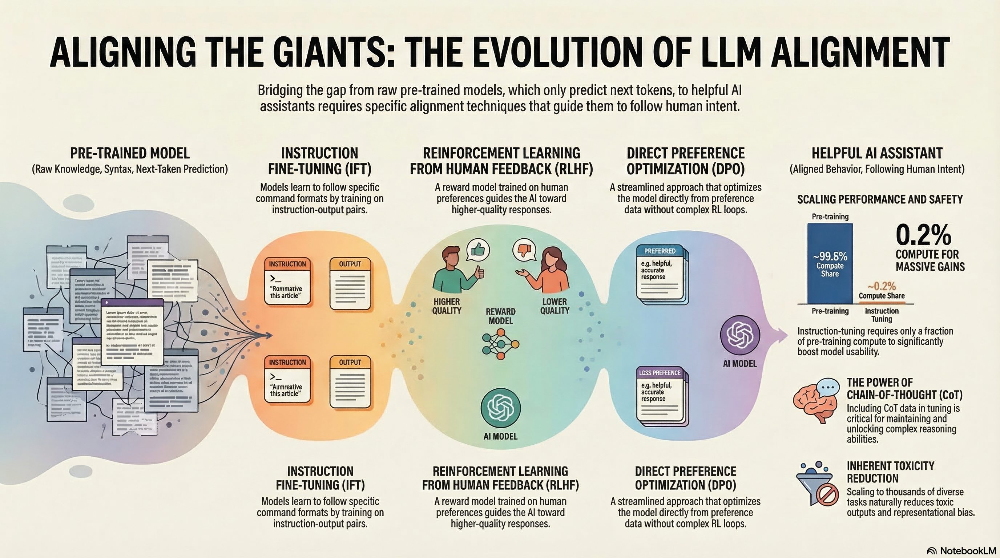

### Resource

::: {layout-ncol=2}

:::

## Lecture Summary with NotebookLM

## Introduction

This lecture was delivered as a guest lecture by Archit Sharma, one of the co-authors of the **Direct Preference Optimization (DPO)** paper (@rafailov2023direct), and it introduced cases where reinforcement learning has been used in LLM training.

::: {layout-ncol=2}

:::

According to *The Economist*, models have followed a trend of increasing size and computation, starting from simple machine learning models in the 1950s and progressing all the way to Google PaLM 540B (@chowdhery2023palm), released in 2022. In particular, the pace of scaling has accelerated sharply since the 2010s. As technology continues to advance, AI development is also speeding up, and there are even reports predicting the emergence of Artificial General Intelligence (AGI) by the latter half of 2027 (@kokotajlo2025ai2027). One such report describes the possible arrival of a superhuman AI researcher capable of reasoning more than 50 times faster than humans across many domains encountered in daily life.

::: {layout-ncol=3}

:::

For most people, the best-known examples of LLMs are chat-based systems like those shown above, where users ask questions and receive answers. To enable this behavior, most LLMs are trained to predict the **next token** needed to complete a sentence, based on massive amounts of text gathered from the internet or printed materials. Over time, with additional techniques layered on top, these models have gone beyond simple next-word prediction and have naturally acquired abilities such as modeling behavior almost like a world model (@andreas2022language), and performing a certain degree of reasoning in areas like mathematics, coding, and medical research.

But if an LLM is trained to predict the **"next token"** well, does that alone guarantee better performance? If we simply increase model size and train longer, will the model accurately understand the user's intent and provide the answer they truly want? As a counterexample, the lecturer shared a failure case from GPT-3.

::: {layout-ncol=2}

:::

The example above comes from material released by OpenAI together with the later **Instruction Finetuning** paper (@ouyang2022training). Suppose that a six-year-old child needs an explanation of the moon landing. A human would likely explain it in a simple, age-appropriate way, almost like a storybook. However, when this prompt is given to a naively trained GPT-3 model, instead of producing a kind and accessible answer, it may generate content involving gravitational theory, relativity, or the Big Bang—topics that are obviously inappropriate for a six-year-old. From the model's perspective, it did not answer according to the **"user's intent"**; it simply predicted the next token accurately based on patterns common in internet text. In other words, if we want the LLMs we use to function as genuinely helpful assistants, then, as suggested earlier, we need approaches that go beyond simply feeding in more data and scaling training.

## Instruction Finetuning

As mentioned above, the first method introduced in the lecture for aligning the user's intent with a language model was the **pretrain/finetune** approach.

In fact, the pretrain/finetune concept is not limited to language models. More generally, it plays a transfer-learning role: it preserves prior knowledge from pretraining while adapting the model to a new task using additional data. A common NLP example is movie sentiment analysis. One first trains a model on a large amount of general movie-related data, and then collects extra task-specific data to further train the model for the user's desired purpose. In this case, the additional data may consist of only a limited number of labels indicating sentiment, and the amount of new data required can be much smaller than the original pretraining data while still producing useful results.

However, applying this idea to LLMs raises many more issues from a finetuning perspective. To support user-intended reasoning across diverse tasks—such as behavior modeling, coding, and research—the model must handle many kinds of tasks, and there are also many possible labels beyond a simple good/bad distinction, depending on the domain.

From this perspective, one model studied from a finetuning standpoint to support many different tasks is Google's **FLAN-T5** (@chung2024scaling).

:::{.callout-note}
As a side note on the origin of the name FLAN-T5: Google had previously developed **T5 (Text-to-Text Transfer Transformer)** (@raffel2020exploring), an encoder-decoder Transformer that casts a wide range of NLP tasks into a unified text-to-text format. Its pretraining uses a span-corruption objective, in which spans of text are masked and the model is trained to reconstruct them. FLAN-T5 (@chung2024scaling) is a follow-up line of work that applies large-scale **instruction finetuning** to T5-family checkpoints. In the FLAN scaling study, instruction finetuning was expanded to roughly **1.8K tasks**, and the resulting models showed substantially stronger generalization on held-out benchmarks. Hugging Face also provides checkpoints of different sizes so the model can be run on a variety of hardware through this [link](https://huggingface.co/google-t5/t5-base).
:::

Built on a T5 model pretrained with the span corruption task, FLAN-T5 was finetuned on roughly 1,800 instruction-based tasks, and it outperformed T5 on most multitask benchmarks such as MMLU (@hendrycks2020measuring) and Big-Bench (@srivastava2023beyond).

An especially noteworthy point in the results above is that as model size increases (from 80M $\rightarrow$ 11B), the gain in generalization performance also increases. This suggests that instruction finetuning itself has a scaling property with respect to model size.

The example above, also introduced in the paper, shows the effect of finetuning through a Chain-of-Thought (CoT) reasoning example from Big-Bench. When comparing the output of a model without finetuning (PaLM 540B) to that of a model trained with instruction finetuning (FLAN-PaLM 540B), the latter produces responses that more closely match the user's intent.

Of course, instruction finetuning does not offer only advantages. The biggest problem is that it is difficult to obtain data for the many different tasks needed for finetuning. Because one must construct prompt-label pairs, the approach is not easy to scale indefinitely. In addition, many prompts do not have a single correct answer. For example, for a creative prompt such as "Write a story about a puppy and a pet grasshopper," there is no fixed target answer, which makes instruction finetuning difficult to apply directly. Also, strictly speaking, the method described so far is about training a model to respond to the user's goal, but that does not necessarily mean the training explicitly reflects the user's preferences.

There are many tasks for which one can say, "this is the correct answer," but simply memorizing one correct answer is not enough for a model to serve as the kind of assistant users actually want. For this reason, researchers began to consider methods that can explicitly incorporate human **preference** into model training.

## Reinforcement Learning from Human Preference

Researchers began proposing methods that use reinforcement learning to train models in ways that increase human preference. In reinforcement learning, the ultimate goal is to train a policy in the direction that maximizes the expected total reward obtainable when reaching the target. Suppose, for example, that we apply reinforcement learning to train a language model for a given task.

{#fig-rl-case}

Now suppose we have an instruction and a language model output, and suppose further that a human can look at that output and assign a numerical score representing how good or bad it is. Then we could treat that score as a reward and train the model so that the expected value of that reward is maximized. Since the very act of assigning a good-or-bad score already reflects human preference, the resulting optimization problem becomes one of performing reinforcement learning based on human preference.

$$
\max \mathbb{E}_{\hat{y} \sim p_{\theta}(y \vert x)}[R(x, \hat{y})]
$$

{#fig-rlhf}

This is the core idea of **Reinforcement Learning from Human Feedback (RLHF)**, introduced in the InstructGPT paper (@ouyang2022training) discussed in an previous lecture. As shown in the figure, the first stage performs **Supervised Fine-Tuning (SFT)** using human-written demonstrations. Next, humans compare or rank multiple model outputs for the same prompt, and these comparison data are used to train a **reward model**. Finally, the language model is further optimized with reinforcement learning, typically PPO, so that it produces responses that receive high reward while remaining close to the reference model.

At first glance, one might wonder whether, once a reward has been defined for outputs to prompts, we could simply maximize expected reward through backpropagation. If we define the problem as follows,

$$ 
\mathbb{E}_{\hat{s} \sim p_{\theta}(s)}[R(\hat{s})]
$$

then, if an output is sampled from the output distribution of a language model parameterized by $\theta$, perhaps we could update $\theta$ to maximize the expectation of the reward assigned to that output. Then, using gradient ascent,

$$
\theta_{t+1} := \theta_t + \alpha \nabla_{\theta_t} \mathbb{E}_{\hat{s} \sim p_{\theta_t}(s)}[R(\hat{s})]
$$

this seems like it should work. However, there is a problem hidden in the expression above: the step where we sample $\hat{s}$ from the language model. Output tokens are typically discrete, and any expression involving the sampling process is generally not differentiable, which prevents direct optimization through that path. Reinforcement learning, however, allows model optimization even when sampling is involved. This is why RL became a natural tool for training language models in such settings. In the lecture, the explanation began with vanilla policy gradients, specifically REINFORCE (@williams1992reinforce).

$$
\begin{aligned}
\nabla_{\theta} \mathbb{E}_{\hat{s} \sim p_{\theta}(s)}[R(\hat{s})] &= \nabla_{\theta} {\color{red} \sum_s} R(s) {\color{red} p_{\theta}(s)} \\
&= \sum_{s} R(s) {\color{yellow} \nabla_{\theta} p_{\theta}(s)} 
\end{aligned}
$$

First, as indicated in red above, the expectation under a discrete probability distribution can be written as a sum over the probabilities of each sample. Since the parameter $\theta$ affects the probability distribution rather than the reward, the gradient can be brought inside by linearity, as shown in yellow. At this point, we can replace $p_{\theta}$ using the well-known **log-derivative trick**.

:::{.callout-note title="log-derivative trick"}
In general,

$$
\nabla \log x = \frac{x'}{x}
$$

and if we rewrite this in terms of $x'$,

$$
x' = x \nabla \log x
$$

which gives us the substitution we need.
:::

Then, by the chain rule, the quantity we want, $\nabla_{\theta} p_{\theta}(s)$, can be rewritten as $p_{\theta}(s)\nabla_{\theta}\log p_{\theta}(s)$, and we can substitute that into the original expression.

$$
\begin{aligned}
\sum_s R(s) \nabla_{\theta} p_{\theta}(s) &= {\color{red} \sum_s p_{\theta}(s)} {\color{green} R(s) \nabla_{\theta} \log p_{\theta}(s)}  \\
&= {\color{red} \mathbb{E}_{\hat{s} \sim p_{\theta}(s)}}[{\color{green} R(\hat{s}) \nabla_{\theta} \log p_{\theta}(\hat{s})}]
\end{aligned}
$$

Moreover, instead of computing this exactly, we can approximate it using Monte Carlo estimation:

$$
\mathbb{E}_{\hat{s} \sim p_{\theta}(s)}[R(\hat{s}) \nabla_{\theta} \log p_{\theta}(\hat{s})] \approx \frac{1}{m} \sum_{i=1}^m R(s_i) \nabla_{\theta} \log p_{\theta}(s_i)
$$

As a result, we do not need to differentiate through the sampled data itself. With Monte Carlo estimation, it is enough to know the probability of a given output and its reward value. In fact, this is exactly what policy-gradient methods aim to do: if there is a trajectory containing good actions, update the policy so those actions become more likely; if there are bad actions, update the policy so they become less likely. In language models, if an output receives a high reward, the model is trained to produce that output more often; if an action leads to low-reward outputs, the model is trained to produce it less often. In that sense, the learning rule is both simple and intuitively reasonable.

Of course, RLHF also has its own problems.

In the end, RLHF requires a human-defined reward—that is, a ground-truth reward—to function properly. This means humans must directly intervene in the training process. This setup is often called **human-in-the-loop (HITL)**, and the problem is that assigning scores in this way is costly. Training an LLM may require millions of queries and generations, and assigning evaluation scores through HITL at every step becomes nearly impossible in terms of both cost and time, while also scaling poorly. To address this, the paper @10.1145/1597735.1597738 proposed using a small amount of human evaluation data to train a neural network that can replace human judgment by predicting which answer would be preferred. This model is the **reward model**. As shown in @fig-rlhf, stage 2 includes training such a reward model. The original paper explained this idea through a framework called **Training an Agent Manually via Evaluative Reinforcement (TAMER)**, available [here](https://www.cs.utexas.edu/~bradknox/TAMER.html).

A second problem is the subjectivity and noise that arise from human evaluation. For example, if the evaluation standard is clear, as in a true/false task, judgments can be fairly consistent. But if the evaluation is expressed as a score, as in the example above, the value may differ depending on the evaluator's standard, making it hard to use the data reliably to train a reward model. A method proposed to address this issue is to avoid direct scoring and instead show two responses and ask, "Which answer is better?" In other words, use **pairwise comparison**. In the lecture, the papers @phelps2015pairwise and @clark2018rate were cited to explain that pairwise comparison is much more reliable and consistent than absolute scoring. In practice, when training a reward model, an objective based on the **Bradley-Terry model** from @bradley1952rank—a paired-comparison model—is commonly used.

$$
J_{RM}(\phi) = -\mathbb{E}_{(x, y^{\text{win}}, y_{\text{lose}}) \sim \mathcal{D}}[\log \sigma(RM_{\phi}(x, y^{\text{win}}) - RM_{\phi}(x, y^{\text{lose}}))]
$$ {#eq-rm-objective}

This means the model is trained using the difference between a positively rated sample ($y^{\text{win}}$) and a relatively worse sample ($y^{\text{lose}}$).

Now that a pretrained model $p^{PT}(y \vert x)$ and a reward model $RM_{\phi}(x, y)$ have been defined, we can perform reinforcement learning as in stage 3 of @fig-rlhf by updating $\theta$ in the direction that maximizes the expected reward assigned by the reward model to the response ($\hat{y}$) generated by the currently trained language model $p_{\theta}^{RL}(y \vert x)$.

$$
\mathbb{E}_{\hat{y} \sim p_{\theta}^{RL}(\hat{y} \vert x)}[RM_{\phi}(x, \hat{y})]
$$

There is another issue to consider here. As mentioned earlier, the reward model is trained on a limited amount of data, so it cannot represent the correct reward perfectly in all cases. If RL is performed using such an imperfect reward model, the learned policy may fail to optimize the true objective and instead learn to exploit weaknesses in the reward model. (In a previous lecture, this phenomenon was described as **reward hacking**.) To mitigate this, one proposed idea is to penalize the currently trained model $p_{\theta}^{RL}(\hat{y} \vert x)$ when its output deviates too much from that of the initial model $p^{PT}(\hat{y} \vert x)$.

$$
\mathbb{E}_{\hat{y} \sim p_{\theta}^{RL}(\hat{y} \vert x)}[RM_{\phi}(x, \hat{y}) - \beta \log \frac{p_{\theta}^{RL}(\hat{y} \vert x)}{p^{PT}(\hat{y} \vert x)}]
$$ {#eq-preference-objective}

This is similar in spirit to how CQL in offline RL responds conservatively when the learned Q-values drift too far from those supported by the data. In language-model training, this idea appears as a Kullback-Leibler (KL) penalty applied to samples that depart too much from the pretrained model. If the model begins assigning excessively high probability to strange answers that the pretrained model would almost never produce ($p_{\theta}^{RL}(\hat{y} \vert x) > p^{PT}(\hat{y} \vert x)$), the penalty discourages learning in that direction. Here, $\beta$ is a hyperparameter: the larger it is, the more strongly the model is penalized for moving away from the pretrained model.

In @stiennon2020learning, the authors applied the method above to summary data, often referred to as TL;DR, and compared performance against earlier models. They found that models trained using human feedback performed slightly better than models that were only pretrained (blue) or additionally instruction-finetuned (green). They also observed that performance improved consistently as model size increased.

## Direct Preference Optimization (DPO)

As the performance of language models trained with RLHF became increasingly validated, the use of reinforcement learning in LLM training also became more common. The figure below shows a reinforcement learning framework introduced in @zheng2023secrets.

In that paper, the authors proposed **PPO-max**, an improved version of PPO, the algorithm commonly used in RLHF, to more efficiently improve the stability of policy learning. In the lecture, however, the point was not the PPO-max method itself, but rather that as RL architectures were adapted to LLM training, the internal structure became increasingly complicated. For RL to work properly for LLMs, one must consider not only the language model and reward model, but also components such as a value function. As the figure suggests, the proposed framework includes a complex structure with two copies each of the SFT model, reward model, policy model, and value model. The lecturer mentioned that this example was included to emphasize how difficult it becomes to properly build these systems as scale increases, even if they can achieve strong performance.

In addition, reinforcement learning for these models requires online sampling and evaluation during training, and the sampling process itself is very slow and expensive. As is clear from many other RL experiments, performance can vary substantially depending on the choice of hyperparameters, often more so than in other methods. Because of this, it is not easy to blindly apply RL-based optimization to language-model training. So the question becomes: can something in this pipeline be improved?

The current RLHF framework uses a separately trained reward model $RM_{\phi}(x, y)$ to finetune a pretrained model $p^{PT}(y \vert x)$, eventually producing a final model $p_{\theta}^{RL}(\hat{y} \vert x)$. In doing so, one typically treats the parameters $\phi$ and $\theta$ as belonging to separate models. What the authors of @rafailov2023direct attempted was to ask whether $RM_{\phi}(x, y)$ could be rewritten in mathematical form using $p_{\theta}^{RL}(\hat{y} \vert x)$ itself, so that one might train with a reward model of the form $RM_{\theta}(x, y)$ without needing a separate $\phi$-parameterized model. This is the starting point of **Direct Preference Optimization (DPO)**. In fact, the subtitle of the paper is *"Your Language Model is Secretly a Reward Model."* As the title suggests, the core idea is to **directly** **optimize** a reward model using human **preference** data.

Equation @eq-preference-objective was the last expression discussed above. In @rafailov2023direct, the authors first proved that this objective has the following closed-form solution:

$$
p^*(\hat{y} \vert x) = \frac{1}{Z(x)} p^{PT}(\hat{y} \vert x) \exp \Big( \frac{1}{\beta}RM(x, \hat{y}) \Big)
$$

The paper refers to the newly introduced $Z(x)$ as a partition function. In general, it can be understood as a normalizing factor that ensures the resulting quantity forms a proper probability distribution. Rearranging the solution gives

$$
\begin{aligned}
RM(x, \hat{y}) &= \beta \log \frac{p^{*}(\hat{y} \vert x)}{p^{PT}(\hat{y} \vert x)} + \beta \log Z(x) \\
&= \beta \log \frac{p^{RL}(\hat{y} \vert x)}{p^{PT}(\hat{y} \vert x)} + \beta \log Z(x)
\end{aligned}
$$

The problem is that computing the exact $Z(x)$ is practically infeasible, because for a given prompt $x$, one would need to score and sum over every possible response $y$ the model could generate. So how can this be addressed? Instead of computing the value exactly, the paper begins from the observation that $Z(x)$ is a constant independent of the specific output $y$. From there, it proposes constructing a loss function using preference differences between good and bad responses, which is all we really need.

Recall the reward-model objective from @eq-rm-objective, where the model was trained using the reward difference between a winning sample and a losing sample. If we express that same idea using $RM_{\theta}(x, y)$, we obtain

$$
RM_{\theta}(x, {\color{green} y^{\text{win}}}) - RM_{\theta}(x, {\color{red} y^{\text{lose}}}) = \beta \log \frac{p_{\theta}^{RL}({\color{green} y^{\text{win}}} \vert x)}{p^{PT}({\color{green} y^{\text{win}}} \vert x)} - \beta \log \frac{p_{\theta}^{RL}({\color{red} y^{\text{lose}}} \vert x)}{p^{PT}({\color{red} y^{\text{lose}}} \vert x)}
$$

The final DPO loss function proposed in the paper is

$$
J_{\text{DPO}}(\theta) = - \mathbb{E}_{(x, {\color{green} y^{\text{win}}}, {\color{red} y^{\text{lose}}}) \sim \mathcal{D}} [ \log \sigma (RM_{\theta}(x, {\color{green} y^{\text{win}}}) - RM_{\theta}(x, {\color{red} y^{\text{lose}}}))]
$$

Through this formulation, the model proposed in the paper uses preference data to distinguish good samples from bad ones via a classification loss, while also making the reward model and the language model to be trained share the same parameter set $\theta$.

When compared for performance against previously proposed baselines such as SFT, Preferred FT (PFT), and PPO-based RLHF, DPO showed strong performance despite its relatively simple formulation. More importantly, because it was made available as open source, most open-source LLMs—including Llama 3, Mistral, and Qwen—have adopted the DPO algorithm as a standard method for training on human preference data.

To summarize the RLHF and DPO content discussed so far: both start from the goal of optimizing models based on human **preference**. In **RLHF**, one first trains an explicit neural **reward model** that can score responses to prompts, and then uses that reward model inside reinforcement learning to train the policy. This approach showed good performance, but it also had limitations in terms of computation and training stability. In **DPO**, instead of training an explicit reward model, the parameters of the language model and the reward model are shared, and training is performed using the simple classification loss defined in the paper over human preference data. The lecture presented this as a method that achieves strong performance with a simpler pipeline.

## Frontier and Challenges

As mentioned earlier, reinforcement learning is fundamentally driven by maximizing expected reward, which means it is heavily dependent on the reward definition. If the reward is inaccurate, the learned RL model may also discover loopholes and optimize in unintended ways. Earlier, this was described as **reward hacking**. Human preference, in particular, may not be stable.



In fact, OpenAI shared a post in 2016 titled ["Faulty reward functions in the wild"](https://openai.com/index/faulty-reward-functions/), showing research results in which poorly designed reward functions led models to behave abnormally. The video above features a game called *CoastRunners*, where the goal is for the boat to reach the destination as quickly as possible. Along the way, the player gains points by touching certain objects. However, the trained model did not learn to reach the destination quickly. Instead, it repeatedly touched the score-giving objects, because that was the most effective way to maximize reward. Similar issues can arise in chatbots: if they are trained incorrectly, they may produce answers that receive high reward despite containing hallucinations or factual errors. The paper @stiennon2020learning, mentioned earlier, also reported results related to this phenomenon.

The result above also shows that the reward predicted by the reward model does not necessarily match actual human preference. In fact, a kind of misalignment appears in which the reward model evaluates outputs favorably even when their distribution differs from that of the supervised baseline. This problem is one of the major themes currently being studied in earnest as LLMs become more widely used in practice. As a result, active research is ongoing in this area, and the first direction introduced in the lecture was **Constitutional AI** (@bai2022constitutional), which had also been mentioned in a previous lecture. In that lecture, the paper was introduced from the perspective of RL from AI Feedback (RLAIF), where one AI evaluates and supervises another AI's outputs using self-critiques and revised responses.

The second paper introduced was **STaR: Bootstrapping Reasoning With Reasoning** (@zelikman2022star). In domains focused on coding or reasoning, the key idea is that the language model generates its own step-by-step reasoning traces, collects only successful cases, and repeatedly finetunes itself in a bootstrapping manner to improve performance. Similarly, @huang2023large presents a related idea of self-improvement by finetuning on high-confidence answers produced by the language model. Finally, two additional papers (@kirk2024prism, @singh2025fspo) that studied ways to expand diversity were also shared in the lecture.