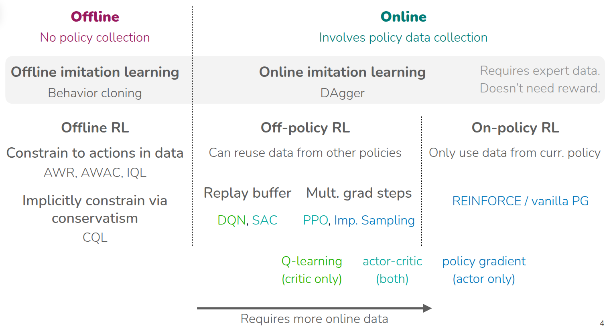
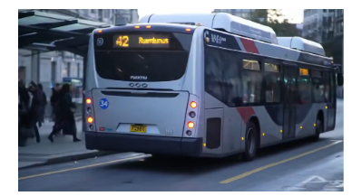

### 강의 및 자료

::: {layout-ncol=2}
[](https://www.youtube.com/watch?v=PDIxDhA9Z6Y&list=PLoROMvodv4rPwxE0ONYRa_itZFdaKCylL&index=11)

[](https://cs224r.stanford.edu/slides/11_cs224r_mbrl_2025.pdf)
:::

## Lecture Summary with NotebookLM


## Recap

지금까지 다룬 강화학습 강의 요약을 통해서 다양한 알고리즘들을 살펴보았다.

{#fig-model-free}

먼저 블로그에선 다루지 않았지만, 현재 학습중인 policy가 경험한 trajectory들을 활용하여 policy를 update하는 **On-Policy RL**에 대해서 소개하였고, 이때 가장 기본적인 Policy Gradient인 **REINFORCE**(@williams1992reinforce) 에 대해서 다뤘다. 물론 학습중인 policy를 직접적으로 학습하면, interaction에 따른 feedback을 바로 반영할 수 있기 때문에 학습 효율성은 좋겠지만, 그만큼 데이터를 많이 활용할 수 없는 Data Inefficiency 문제가 존재한다. 반면, 다음으로 소개된 **Off-Policy RL**에서는 학습중인 policy가 아니더라도, 과거의 다른 정책들이 쌓았던 경험을 바탕으로 policy를 update할 수 있게 되었고, 해당 강의에서 처음 소개한 내용이 Off-Policy Actor-Critic 기법인 **PPO** (@schulman2017proximal) 이었다. Off-Policy RL에서는 기본적으로 학습하는 policy와 분리된 Behavior Policy, 즉 경험을 수집하는 policy가 따로 존재하기 때문에, 수집된 분포의 경향에 따라 Weight를 다르게 부여하는 **Importance Sampling** 같은 기법도 소개했었다. 소개된 두 기법은 샘플링된 trajectory에 대해서 여러번 gradient step을 밟아 update하는 형태로 되어 있다. 이어서 설명된 **Q-Learning** 강의에서는 Actor-Critic 방식에서 Action을 취하는 Actor를 빼고, 현재 state에 대한 가치를 최대화하는 방향으로 policy를 정의하는 **DQN** (@mnih2013playing) 나 **SAC** (@haarnoja2018soft) 을 소개했었다. 이 두 방법에서는 Replay Buffer를 사용해서 과거에 수집된 trajectory를 활용함으로써 Data Efficiency를 높인 사례로 소개되었다.

앞에서 소개한 알고리즘들이 환경과의 실시간 interaction이 전제가 된 **Online RL**이었고, 이어진 강의에서는 이런 전제없이 static dataset을 기반으로 policy learning이 이뤄지는 **Offline RL**에 대해서 설명했다. 여러번 강의에서도 설명되었던 내용이지만 Offline RL에서 발생할 수 있는 가장 큰 문제는 dataset에 없는 action, 즉 Out-of-Distribution Action을 통해서 Q-value를 추정함으로서 발생하는 overestimation이었고, 이를 완화하기 위해서 아예 dataset에 없는 Action을 취하지 않게 하거나(**AWR** (@peng2019advantage), **AWAC** (@nair2020awac), **IQL** (@kostrikov2021offline)), 아니면 Q-value를 비관적으로 추정해서 Overestimation에 빠지지 않게 하는 방법 (**CQL** (@kumar2020conservative)) 들이 제안되었다. 물론 이렇게 강화학습처럼 학습하는 것이 아니라, expert data를 바탕으로 지도학습 방식으로 학습한 경우도 존재한다. 해당 내용은 강의 첫 주제였던 **Imitation Learning**에서 다뤄졌으며, offline 데이터만으로 학습하는 기본적인 **Behavior Cloning**과, online demonstration으로 Imitation Learning을 수행하는 **DAgger** (@ross2011reduction) 에 대해서 소개했다.

지금까지 Policy Gradient, Actor-Critic, Q-Learning, Offline RL 등 다양한 terminology가 등장했는데, 지금까지 다룬 알고리즘은 모두 환경에 대한 정보를 dataset으로든, 환경과의 interaction을 통해서 policy를 학습하는 방식이다. 한마디로 **"환경에 대한 사전 정보가 없는 상태"**에서 실제 환경에서 탐색을 통해서 경험을 쌓고, 이를 기반으로 policy를 update하는 방식이었다. 그런데 만약 사람이 뭔가 머리속에서 환경에 대해 상상하면서 학습한다고 가정해보자. 물론 그 상상속의 환경이 실제와는 전혀 다를수도 있겠지만, 적어도 이런 상황이 왔을때는 어떤 action을 취해야 한다는 규칙정도는 알 수 있지 않을까? 사실 상상속의 환경이 실제 환경과 유사하다면, 그만큼 agent가 어떤 상황에 대해 대처할 수 있는 policy는 그만큼 더 빨리 학습할 수 있을 것이다. 여기에서 환경에 대한 사전 정보를 가진 개체를 **Model**이라고 하고, 앞에서 소개했던 (그리고 @fig-model-free 에서 소개된) 알고리즘들은 이 Model이 없는 상태에서 학습하는 **Model-Free RL**이었다. 그리고 이번 강의에서는 이 Model이 있다는 것을 가정하고 학습하는 **Model-Based RL**에 대해서 다룬다.

## "Simulator"

바로 앞에서 설명했던 것처럼 Model이란 것은 환경에 대한 사전 정보를 줄 수 있는 개체를 나타내고, 일반적으로는 어떤 state $s_t$ 에서 action $a_t$ 를 취했을때 next state $s_{t+1}$ 를 알수 있는 Dynamics Model을 지칭한다. 그리고 이를 **"Simulator"** 라고 표현하기도 한다. 실제 환경에서 이런 simulator를 활용한 사례가 많은데, 강화학습 분야에서 많이 알려져있는 것은 **MuJoCo** (Multi-Joint Dynamics with Contact - @todorov2012mujoco) 일 것이다. MuJoCo는 범용적으로 사용할 수 있는 다관절 Physics Engine이며, 실제로 실험하기 어려운 다관절 객체를 가상환경에서 제어할 수 있도록 simulation 환경을 제공한다. 그래서 강화학습은 이런 simulator를 통해서 주어진 task에 대해 최적화된 policy를 학습하게 된다.

::: {#fig-video-model layout-ncol=2}



:::

이뿐만 아니라 @fig-video-model 에서 소개된 Google Veo2나 OpenAI Sora처럼 어떤 text 입력이 들어왔을 때, 이에 대한 영상을 만들어주는 형태도 Model이 될 수 있다. 한편으로는 주식시장을 예측할 수 있는 영역에서도 다양한 기법이 적용되기도 했다. 그리고 초창기의 강화학습 성공사례는 Atari같은 게임 환경에서 적용된 Case가 많은데, 게임도 게임속에 내재되어 있는 규칙을 학습할 수 있는 Model이라고 할 수 있다. 물론 게임중에서도 바둑이나 체스와 같이 규칙이 명확한 게임이라면 Model이 학습하는데 필요하지 않을 수도 있겠지만, 뭔가 다른 플레이어가 개입한다던지 규칙 자체가 전체 dynamics의 일부 영역으로 되어 있는 게임에서는 Model이 학습하는데 필요하다. 그리고 이전 강의에서 다뤘던 "Reward Learning"에서의 Reward Model 역시 주어진 환경에서의 Reward를 추정할 수 있는 일종의 Model이기도 하다.


일반적으로 학습된 Simlator를 활용하여 강화학습을 수행하는 과정은 크게 다음과 같다.

```pseudocode
#| html-indent-size: "1.2em"
#| html-comment-delimiter: "//"
#| html-line-number: true
#| html-line-number-punc: ":"
#| html-no-end: false
#| pdf-placement: "htb!"
#| pdf-line-number: true
#| label: algo-learned-simulator

\begin{algorithm}
\caption{Notional "learned simulator" algorithm}
\begin{algorithmic}
\State Get some data $\mathcal{D} = \{s_i, a_i, s_i' \}$ collected using some base policy $\pi_0(a \vert s)$
\State Learn "simulator" $f(a, s) = s'$ using $\min_f \sum_i \Vert f(s_i, a_i) - s_i' \Vert^2$
\State Run your favorite RL method inside "simulator" $f$
\end{algorithmic}
\end{algorithm}
```

먼저 환경에 대한 dynamics를 이해하기 위해서 현재 학습중인 policy가 아닌, 여러개의 base policy $\pi_0(a \vert s)$ 를 사용해서 앞에서 언급한 것처럼 주어진 state $s$ 와 action $a$ 이 있을 때의 next state $s'$ 에 대한 dataset을 구축한다. 그 후 학습된 데이터 기반으로 supervised learning을 수행해, 주어진 state와 action을 통해서 next_state를 예측할 수 있는 "Simulator"를 학습시킨다. 그리고 이렇게 학습된 "Simulator"를 사용해서 이전 강의에서 다뤘던 강화학습 알고리즘이나 일종의 planning 과정을 수행해 해당 환경에 최적화된 policy를 찾는 과정으로 되어 있는데, 이야기로만 들으면 이런 방식을 통해서 잘 학습될 것 같은데 어떤 부분이 문제가 될까?

::: {#fig-learned-simulator layout-ncol=2}
{#fig-maze}

{#fig-sora-humanoid}
:::

@algo-learned-simulator 에서 각 과정을 살펴보면 각각에 따른 한계점이 존재한다. @fig-maze 처럼 Maze에서 Goal까지 도달하는 이상적인 경로를 찾는 과정을 학습한다고 가정했을때, 만약 simulator를 학습시킬 $\{s, a, s' \}$ pair가 노란색으로 표현된 것처럼 Maze의 일부만을 대변한다고 가정한다면, Simulator 역시 노란색 데이터 영역만 학습될 뿐, 학습되지 않은 영역은 정확하게 표현할 수가 없다. 그만큼 simulator를 학습시킬 데이터의 양이나 질에 따라 표현력에도 영향을 끼친다. @fig-sora-humanoid 는 Sora로 특정 Prompt에 따른 동영상을 생성한 것인데, 얼핏 봤을때는 Video Generation Model이 정상적인 물리현상을 표현한 것처럼 보이지만, 동영상을 보면 아무 상자가 없는 상태에서 갑자기 상자가 색깔이 변경되면서 나타나는 이상한 동작들이 나타난다. 동영상 생성 모델은 나름의 로직대로 입력에 따른 결과를 내놓은 것이지만, 결과적으로 학습된 simulator는 실제로 사용할 domain에 따라서 달라지며, 그런 domain에 따라서도 실제현상을 표현할 수 있는 난이도도 달라지게 된다. 무엇보다도, simulator 자체가 정확성이 보장되지 않기 때문에 이를 기반으로 학습하는 것 역시 어려운 부분이다.

강화학습 주제는 아니지만, 교수는 간단하게 dynamics model을 학습하는 방법에 대해서 간단하게 언급했다.


강화학습이 잘 동작한다고 알려진 게임 환경처럼 환경에 대한 Model이 잘 정의된 도메인도 있고, 앞에서 잠깐 언급한 MuJoCo처럼 physics를 모사할 수 있는 엔진의 도움을 받아 대략적으로 알 수 있는 도메인도 있지만 아마 대부분의 실제 환경은 이런 환경을 모사할 수 있는 Model이 정의되어 있지 않다. 이 때문에 처음부터 끝까지 데이터 기반으로 학습하는 형태로 Dynamics Model을 학습시키는데, 교수가 설명한 첫번째 사례처럼 Video Model을 학습시키는 케이스에서도 모든 pixel에서 어떤 action을 가했을 때, 그 픽셀의 변화를 모두 표현하기란 쉽지 않다. 그렇기 때문에 대안으로 많이 활용되는 것은 주어진 State $s_t$ 에서 그 state를 함축적으로 표현할 수 있는 저차원의 state representation $z_t$ 로 변환하여, 그 상태에서 dynamics model을 학습시키는 방법이다. 물론 여기에서도 이렇게 저차원으로 낮추게 되면 본래의 state가 가지고 있는 정보량이 줄어들텐데, 어떻게 해야 좋은 State Representation을 뽑을 수 있느냐는 것이 고민해야될 부분이긴 하다. 하지만 좋은 State Representation을 뽑는 방법을 알고만 있다면, 이 방법은 기존의 State를 사용해서 Dynamics Model을 활용하는 것보다 computational cost를 많이 줄일 수 있기 때문에 이에 대한 연구가 계속 이뤄지고 있다. 어떻게 보면 추후 강의를 통해 소개될 Meta RL 에서도 연결될 부분이기도 하다.

## How to use a learned dynamics model?

{#fig-planning}

만약 앞에서 소개한 방법들을 고려해 학습된 dynamics model을 만들었을 때, 어떻게 하면 이 model을 사용해서 policy를 학습시킬 수 있을까? 가장 쉽게 해볼 수 있는 방법은 주어진 model을 기반을 상상을 해보는 **"planning"**을 해보는 것이다. 실제로 환경에서 interaction을 하지 않더라도, Model을 통해서 주어진 State와 action을 통해서 Next State를 추론할 수 있기 때문에, 이를 기반으로 정해진 목표지점까지 경험을 쭉 쌓는 것이다. 이 경험을 바탕으로 일반적인 강화학습의 objective처럼 expected reward가 최대화가 되는 방향($\max_{a_t:t+H} \sum_t r(s_t, a_t)$)으로 policy를 학습하게 되고, 이를 backpropagation을 통해서 최적화를 수행하면 된다.

```pseudocode
#| html-indent-size: "1.2em"
#| html-comment-delimiter: "//"
#| html-line-number: true
#| html-line-number-punc: ":"
#| html-no-end: false
#| pdf-placement: "htb!"
#| pdf-line-number: true
#| label: algo-backpropagation-planning

\begin{algorithm}
\caption{Planning via backpropagation}
\begin{algorithmic}
\State Run some policy (e.g. random policy) to collect data $\mathcal{D} = \{ (s, a, s')_i\}$
\State Learn model $f_{\phi}(s, a)$ to minimize $\sum_i \Vert f_{\phi}(s_i, a_i) - s_i' \Vert^2$
\State Backpropagate through $f_{\phi}(s, a)$ to choose actions. ($\hat{a}_{t:t+H} \leftarrow \arg\max \sum_{t'=t}^{t+H} r_{t'}$)
\end{algorithmic}
\end{algorithm}
```

:::{.callout-note title='Computing Gradient to choose action'}
교수가 질판에 서술한 내용이지만, $\hat{a}_{t:t+H}$ 를 얻기 위한 backpropagration을 수행하기 위해선 expected reward를 최대화할 수 있는 방향을 나타내는 gradient를 계산할 수 있어야 한다. 아래 식은 이를 표현한 것이다.

```pseudocode
#| html-indent-size: "1.2em"
#| html-comment-delimiter: "//"
#| html-line-number: true
#| html-line-number-punc: ":"
#| html-no-end: false
#| pdf-placement: "htb!"
#| pdf-line-number: true
#| label: algo-compute-gradient

\begin{algorithm}
\caption{Compute Gradient}
\begin{algorithmic}
\State Initialize $\hat{a}_{t:t+H}$
\State Compute Gradient $\nabla_{a_{t:t+H}} \sum r$
\State $\hat{a}_{t:t+H} \leftarrow \hat{a}_{t:t+H} - \alpha \nabla_{a_{t:t+H}} \sum r$
\end{algorithmic}
\end{algorithm}
```
여기에서 $\nabla_{a_{t:t+H}} \sum r$ 부분은 Dynamics Model로부터 계산하는데, Chain rule이 적용된다.

$$
\nabla_{a_{t:t+H}} \sum r = \frac{\partial \sum r}{\partial s_{t:t+H}} \frac{\partial s_{t:t+H}}{\partial a_{t:t+H}}
$$

:::