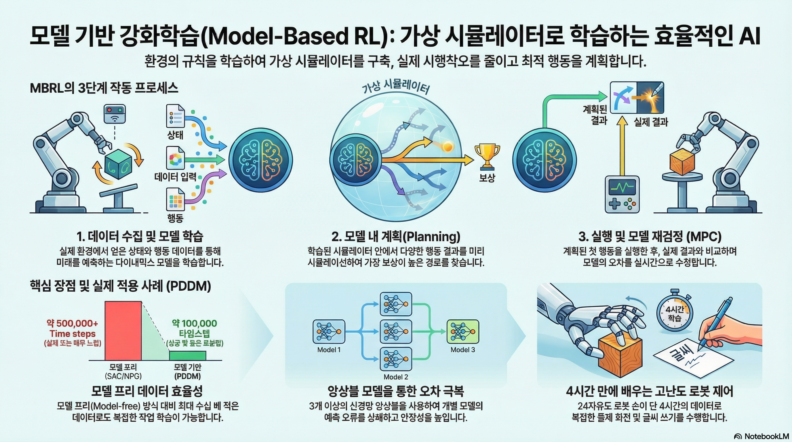

### 강의 및 자료

::: {layout-ncol=2}
[](https://www.youtube.com/watch?v=PDIxDhA9Z6Y&list=PLoROMvodv4rPwxE0ONYRa_itZFdaKCylL&index=11)

[](https://cs224r.stanford.edu/slides/11_cs224r_mbrl_2025.pdf)
:::

## Lecture Summary with NotebookLM



## Recap

지금까지 다룬 강화학습 강의 요약을 통해서 다양한 알고리즘들을 살펴보았다.

{#fig-model-free}

먼저 블로그에선 다루지 않았지만, 현재 학습중인 policy가 경험한 trajectory들을 활용하여 policy를 update하는 **On-Policy RL**에 대해서 소개하였고, 이때 가장 기본적인 Policy Gradient인 **REINFORCE**(@williams1992reinforce) 에 대해서 다뤘다. 물론 학습중인 policy를 직접적으로 학습하면, interaction에 따른 feedback을 바로 반영할 수 있기 때문에 학습 효율성은 좋겠지만, 그만큼 데이터를 많이 활용할 수 없는 Data Inefficiency 문제가 존재한다. 반면, 다음으로 소개된 **Off-Policy RL**에서는 학습중인 policy가 아니더라도, 과거의 다른 정책들이 쌓았던 경험을 바탕으로 policy를 update할 수 있게 되었고, 해당 강의에서 처음 소개한 내용이 Off-Policy Actor-Critic 기법인 **PPO** (@schulman2017proximal) 이었다. Off-Policy RL에서는 기본적으로 학습하는 policy와 분리된 Behavior Policy, 즉 경험을 수집하는 policy가 따로 존재하기 때문에, 수집된 분포의 경향에 따라 Weight를 다르게 부여하는 **Importance Sampling** 같은 기법도 소개했었다. 소개된 두 기법은 샘플링된 trajectory에 대해서 여러번 gradient step을 밟아 update하는 형태로 되어 있다. 이어서 설명된 **Q-Learning** 강의에서는 Actor-Critic 방식에서 Action을 취하는 Actor를 빼고, 현재 state에 대한 가치를 최대화하는 방향으로 policy를 정의하는 **DQN** (@mnih2013playing) 나 **SAC** (@haarnoja2018soft) 을 소개했었다. 이 두 방법에서는 Replay Buffer를 사용해서 과거에 수집된 trajectory를 활용함으로써 Data Efficiency를 높인 사례로 소개되었다.

앞에서 소개한 알고리즘들이 환경과의 실시간 interaction이 전제가 된 **Online RL**이었고, 이어진 강의에서는 이런 전제없이 static dataset을 기반으로 policy learning이 이뤄지는 **Offline RL**에 대해서 설명했다. 여러번 강의에서도 설명되었던 내용이지만 Offline RL에서 발생할 수 있는 가장 큰 문제는 dataset에 없는 action, 즉 Out-of-Distribution Action을 통해서 Q-value를 추정함으로서 발생하는 overestimation이었고, 이를 완화하기 위해서 아예 dataset에 없는 Action을 취하지 않게 하거나(**AWR** (@peng2019advantage), **AWAC** (@nair2020awac), **IQL** (@kostrikov2021offline)), 아니면 Q-value를 비관적으로 추정해서 Overestimation에 빠지지 않게 하는 방법 (**CQL** (@kumar2020conservative)) 들이 제안되었다. 물론 이렇게 강화학습처럼 학습하는 것이 아니라, expert data를 바탕으로 지도학습 방식으로 학습한 경우도 존재한다. 해당 내용은 강의 첫 주제였던 **Imitation Learning**에서 다뤄졌으며, offline 데이터만으로 학습하는 기본적인 **Behavior Cloning**과, online demonstration으로 Imitation Learning을 수행하는 **DAgger** (@ross2011reduction) 에 대해서 소개했다.

지금까지 Policy Gradient, Actor-Critic, Q-Learning, Offline RL 등 다양한 terminology가 등장했는데, 지금까지 다룬 알고리즘은 모두 환경에 대한 정보를 dataset으로든, 환경과의 interaction을 통해서 policy를 학습하는 방식이다. 한마디로 **"환경에 대한 사전 정보가 없는 상태"**에서 실제 환경에서 탐색을 통해서 경험을 쌓고, 이를 기반으로 policy를 update하는 방식이었다. 그런데 만약 사람이 뭔가 머리속에서 환경에 대해 상상하면서 학습한다고 가정해보자. 물론 그 상상속의 환경이 실제와는 전혀 다를수도 있겠지만, 적어도 이런 상황이 왔을때는 어떤 action을 취해야 한다는 규칙정도는 알 수 있지 않을까? 사실 상상속의 환경이 실제 환경과 유사하다면, 그만큼 agent가 어떤 상황에 대해 대처할 수 있는 policy는 그만큼 더 빨리 학습할 수 있을 것이다. 여기에서 환경에 대한 사전 정보를 가진 개체를 **Model**이라고 하고, 앞에서 소개했던 (그리고 @fig-model-free 에서 소개된) 알고리즘들은 이 Model이 없는 상태에서 학습하는 **Model-Free RL**이었다. 그리고 이번 강의에서는 이 Model이 있다는 것을 가정하고 학습하는 **Model-Based RL**에 대해서 다룬다.

## "Simulator"

바로 앞에서 설명했던 것처럼 Model이란 것은 환경에 대한 사전 정보를 줄 수 있는 개체를 나타내고, 일반적으로는 어떤 state $s_t$ 에서 action $a_t$ 를 취했을때 next state $s_{t+1}$ 를 알수 있는 Dynamics Model을 지칭한다. 그리고 이를 **"Simulator"** 라고 표현하기도 한다. 실제 환경에서 이런 simulator를 활용한 사례가 많은데, 강화학습 분야에서 많이 알려져있는 것은 **MuJoCo** (Multi-Joint Dynamics with Contact - @todorov2012mujoco) 일 것이다. MuJoCo는 범용적으로 사용할 수 있는 다관절 Physics Engine이며, 실제로 실험하기 어려운 다관절 객체를 가상환경에서 제어할 수 있도록 simulation 환경을 제공한다. 그래서 강화학습은 이런 simulator를 통해서 주어진 task에 대해 최적화된 policy를 학습하게 된다.

::: {#fig-video-model layout-ncol=2}


:::

이뿐만 아니라 @fig-video-model 에서 소개된 Google Veo2나 OpenAI Sora처럼 어떤 text 입력이 들어왔을 때, 이에 대한 영상을 만들어주는 형태도 Model이 될 수 있다. 한편으로는 주식시장을 예측할 수 있는 영역에서도 다양한 기법이 적용되기도 했다. 그리고 초창기의 강화학습 성공사례는 Atari같은 게임 환경에서 적용된 Case가 많은데, 게임도 게임속에 내재되어 있는 규칙을 학습할 수 있는 Model이라고 할 수 있다. 물론 게임중에서도 바둑이나 체스와 같이 규칙이 명확한 게임이라면 Model이 학습하는데 필요하지 않을 수도 있겠지만, 뭔가 다른 플레이어가 개입한다던지 규칙 자체가 전체 dynamics의 일부 영역으로 되어 있는 게임에서는 Model이 학습하는데 필요하다. 그리고 이전 강의에서 다뤘던 "Reward Learning"에서의 Reward Model 역시 주어진 환경에서의 Reward를 추정할 수 있는 일종의 Model이기도 하다.


일반적으로 학습된 Simlator를 활용하여 강화학습을 수행하는 과정은 크게 다음과 같다.

```pseudocode
#| html-indent-size: "1.2em"
#| html-comment-delimiter: "//"
#| html-line-number: true
#| html-line-number-punc: ":"
#| html-no-end: false
#| pdf-placement: "htb!"
#| pdf-line-number: true
#| label: algo-learned-simulator

\begin{algorithm}
\caption{Notional "learned simulator" algorithm}
\begin{algorithmic}
\State Get some data $\mathcal{D} = \{s_i, a_i, s_i' \}$ collected using some base policy $\pi_0(a \vert s)$
\State Learn "simulator" $f(a, s) = s'$ using $\min_f \sum_i \Vert f(s_i, a_i) - s_i' \Vert^2$
\State Run your favorite RL method inside "simulator" $f$
\end{algorithmic}
\end{algorithm}
```

먼저 환경에 대한 dynamics를 이해하기 위해서 현재 학습중인 policy가 아닌, 여러개의 base policy $\pi_0(a \vert s)$ 를 사용해서 앞에서 언급한 것처럼 주어진 state $s$ 와 action $a$ 이 있을 때의 next state $s'$ 에 대한 dataset을 구축한다. 그 후 학습된 데이터 기반으로 supervised learning을 수행해, 주어진 state와 action을 통해서 next_state를 예측할 수 있는 "Simulator"를 학습시킨다. 그리고 이렇게 학습된 "Simulator"를 사용해서 이전 강의에서 다뤘던 강화학습 알고리즘이나 일종의 planning 과정을 수행해 해당 환경에 최적화된 policy를 찾는 과정으로 되어 있는데, 이야기로만 들으면 이런 방식을 통해서 잘 학습될 것 같은데 어떤 부분이 문제가 될까?

::: {#fig-learned-simulator layout-ncol=2}
{#fig-maze}

{#fig-sora-humanoid}
:::

@algo-learned-simulator 에서 각 과정을 살펴보면 각각에 따른 한계점이 존재한다. @fig-maze 처럼 Maze에서 Goal까지 도달하는 이상적인 경로를 찾는 과정을 학습한다고 가정했을때, 만약 simulator를 학습시킬 $\{s, a, s' \}$ pair가 노란색으로 표현된 것처럼 Maze의 일부만을 대변한다고 가정한다면, Simulator 역시 노란색 데이터 영역만 학습될 뿐, 학습되지 않은 영역은 정확하게 표현할 수가 없다. 그만큼 simulator를 학습시킬 데이터의 양이나 질에 따라 표현력에도 영향을 끼친다. @fig-sora-humanoid 는 Sora로 특정 Prompt에 따른 동영상을 생성한 것인데, 얼핏 봤을때는 Video Generation Model이 정상적인 물리현상을 표현한 것처럼 보이지만, 동영상을 보면 아무 상자가 없는 상태에서 갑자기 상자가 색깔이 변경되면서 나타나는 이상한 동작들이 나타난다. 동영상 생성 모델은 나름의 로직대로 입력에 따른 결과를 내놓은 것이지만, 결과적으로 학습된 simulator는 실제로 사용할 domain에 따라서 달라지며, 그런 domain에 따라서도 실제현상을 표현할 수 있는 난이도도 달라지게 된다. 무엇보다도, simulator 자체가 정확성이 보장되지 않기 때문에 이를 기반으로 학습하는 것 역시 어려운 부분이다.

강화학습 주제는 아니지만, 교수는 간단하게 dynamics model을 학습하는 방법에 대해서 간단하게 언급했다.


강화학습이 잘 동작한다고 알려진 게임 환경처럼 환경에 대한 Model이 잘 정의된 도메인도 있고, 앞에서 잠깐 언급한 MuJoCo처럼 physics를 모사할 수 있는 엔진의 도움을 받아 대략적으로 알 수 있는 도메인도 있지만 아마 대부분의 실제 환경은 이런 환경을 모사할 수 있는 Model이 정의되어 있지 않다. 이 때문에 처음부터 끝까지 데이터 기반으로 학습하는 형태로 Dynamics Model을 학습시키는데, 교수가 설명한 첫번째 사례처럼 Video Model을 학습시키는 케이스에서도 모든 pixel에서 어떤 action을 가했을 때, 그 픽셀의 변화를 모두 표현하기란 쉽지 않다. 그렇기 때문에 대안으로 많이 활용되는 것은 주어진 State $s_t$ 에서 그 state를 함축적으로 표현할 수 있는 저차원의 state representation $z_t$ 로 변환하여, 그 상태에서 dynamics model을 학습시키는 방법이다. 물론 여기에서도 이렇게 저차원으로 낮추게 되면 본래의 state가 가지고 있는 정보량이 줄어들텐데, 어떻게 해야 좋은 State Representation을 뽑을 수 있느냐는 것이 고민해야될 부분이긴 하다. 하지만 좋은 State Representation을 뽑는 방법을 알고만 있다면, 이 방법은 기존의 State를 사용해서 Dynamics Model을 활용하는 것보다 computational cost를 많이 줄일 수 있기 때문에 이에 대한 연구가 계속 이뤄지고 있다. 어떻게 보면 추후 강의를 통해 소개될 Meta RL 에서도 연결될 부분이기도 하다.

## Optimize over actions using model

{#fig-planning}

만약 앞에서 소개한 방법들을 고려해 학습된 dynamics model을 만들었을 때, 어떻게 하면 이 model을 사용해서 policy를 학습시킬 수 있을까? 가장 쉽게 해볼 수 있는 방법은 주어진 model을 기반을 상상을 해보는 **"planning"**을 해보는 것이다. 실제로 환경에서 interaction을 하지 않더라도, Model을 통해서 주어진 State와 action을 통해서 Next State를 추론할 수 있기 때문에, 이를 기반으로 정해진 목표지점까지 경험을 쭉 쌓는 것이다. 이 경험을 바탕으로 일반적인 강화학습의 objective처럼 expected reward가 최대화가 되는 방향($\max_{a_t:t+H} \sum_t r(s_t, a_t)$)으로 policy를 학습하게 되고, 이를 backpropagation을 통해서 최적화를 수행하면 된다. 

```pseudocode
#| html-indent-size: "1.2em"
#| html-comment-delimiter: "//"
#| html-line-number: true
#| html-line-number-punc: ":"
#| html-no-end: false
#| pdf-placement: "htb!"
#| pdf-line-number: true
#| label: algo-backpropagation-planning

\begin{algorithm}
\caption{Planning via backpropagation}
\begin{algorithmic}
\State Run some policy (e.g. random policy) to collect data $\mathcal{D} = \{ (s, a, s')_i\}$
\State Learn model $f_{\phi}(s, a)$ to minimize $\sum_i \Vert f_{\phi}(s_i, a_i) - s_i' \Vert^2$
\State Backpropagate through $f_{\phi}(s, a)$ to choose actions. ($\hat{a}_{t:t+H} \leftarrow \arg\max \sum_{t'=t}^{t+H} r_{t'}$)
\State Execute $\hat{a}_{t:t+H}$ in real environment.
\end{algorithmic}
\end{algorithm}
```

:::{.callout-note title='Computing Gradient to choose action'}
교수가 질판에 서술한 내용이지만, $\hat{a}_{t:t+H}$ 를 얻기 위한 backpropagration을 수행하기 위해선 expected reward를 최대화할 수 있는 방향을 나타내는 gradient를 계산할 수 있어야 한다. 아래 식은 이를 표현한 것이다.

```pseudocode
#| html-indent-size: "1.2em"
#| html-comment-delimiter: "//"
#| html-line-number: true
#| html-line-number-punc: ":"
#| html-no-end: false
#| pdf-placement: "htb!"
#| pdf-line-number: true
#| label: algo-compute-gradient

\begin{algorithm}
\caption{Compute Gradient}
\begin{algorithmic}
\State Initialize $\hat{a}_{t:t+H}$
\State Compute Gradient $\nabla_{a_{t:t+H}} \sum r$
\State $\hat{a}_{t:t+H} \leftarrow \hat{a}_{t:t+H} - \alpha \nabla_{a_{t:t+H}} \sum r$
\end{algorithmic}
\end{algorithm}
```
여기에서 $\nabla_{a_{t:t+H}} \sum r$ 부분은 Dynamics Model로부터 계산하는데, Chain rule이 적용된다.

$$
\nabla_{a_{t:t+H}} \sum r = \frac{\partial \sum r}{\partial s_{t:t+H}} \frac{\partial s_{t:t+H}}{\partial a_{t:t+H}}
$$

:::

이렇게 gradient에 기반하여 action을 최적화하는 방법도 있지만, 이 방법은 gradient가 계산되는 영역에서만 최적화가 가능하기 때문에, gradient를 계산할 수 없는 non-linear한 영역에서는 적용하기 어렵다. 강의에서는 이 방법과 비교해 Sampling 기반으로 최적화하는 과정에 대해서도 소개했다.

::: {#fig-optimization layout-ncol=2}

{#fig-gradient}

{#fig-sampling}

:::

@fig-gradient 에서 최적화가 수행되는 과정처럼 어느 한 점에서 시작해, expected reward가 최대화가 되는 방향으로 최적화가 수행되는 것과 다르게, Sampling 기반 최적화 기법에서는 여러 점에서의 action에 대한 reward를 보고, 이를 최대화시킬 수 있는 action을 유추하는 것이다. 이 과정에서 gradient를 계산하지 않기 때문에 **Gradient-free optimization**이라고 표현하기도 한다. 물론 주어진 데이터의 패턴을 보고 최적화 지점을 찾는 방법이기 때문에, 실제 sampling되지 않은 영역에서의 값이 부정확하기 때문에 interpolation 같은 방법을 쓰겠지만, gradient를 구할 필요가 없다는 장점때문에 앞에서 언급한 discrete action space와 같은 non-linear한 영역에서도 활용이 가능하다.

```pseudocode
#| html-indent-size: "1.2em"
#| html-comment-delimiter: "//"
#| html-line-number: true
#| html-line-number-punc: ":"
#| html-no-end: false
#| pdf-placement: "htb!"
#| pdf-line-number: true
#| label: algo-sampling-planning

\begin{algorithm}
\caption{Planning via Sampling}
\begin{algorithmic}
\State Run some policy (e.g. random policy) to collect data $\mathcal{D} = \{ (s, a, s')_i\}$
\State Learn model $f_{\phi}(s, a)$ to minimize $\sum_i \Vert f_{\phi}(s_i, a_i) - s_i' \Vert^2$
\State Iteratively sample action sequences, run through model $f_{\phi}(s, a)$ to choose actions
\State Execute $\hat{a}_{t:t+H}$ in real environment.
\end{algorithmic}
\end{algorithm}
```

Sampling 기반의 최적화 방법 중에서 가장 간단하게 생각해볼 수 있는 방법은 그냥 어림 짐작으로 맞추는 것이다. 강의에서는 이를 **"Random Shooting"**이라고 표현했는데, 말 그대로 어떤 주어진 distribution내에서 $N$ 개의 action sample을 구하고, 주어진 state $s$ 에서의 action $a$ 를 대입했을때 expected reward가 가장 커지는 action을 뽑는 것이다. 

1. 특정 분포로부터 $A_1, \dots, A_N$ 을 sampling한다. (e.g. uniform)
2. $\arg \max_i \sum_{t'=t}^{t+H}r(s_{t'}, a_{t'})$ 에 맞는 $A_i$ 를 구한다.

물론 이 경우, 어떤 distribution 형태로 sample을 추출할 것인지 정의하는 단계가 남아있기 때문에, 다음으로 설명한 부분이 **Cross-Entropy Method (CEM)** 이란 것이었다. 이 방법은 간단하게 말하자면, 어떤 정답지가 포함된 분포를 일종의 Distribution (일반적으로는 Gaussian) 이라고 가정하고, 샘플링한 데이터들이 그 분포에 맞게끔 fitting하는 것이다. 

1. $p_i(A)$ 분포에서 $A_1, \dots, A_N$ 을 sampling한다. 
2. $J(A_i) = \sum_{t'=t}^{t+H}r(s_{t'}, a_{t'})$ 을 계산한다.
3. $M < N$ 인 조건 상에서 $J(A)$ 를 크게 만드는 상위 sample $A_{i_1}, \dots, A_{i_M}$ 을 구한다.
4. $A_{i_1}, \dots, A_{i_M}$ 를 가지고 $p_{i+1}(A)$ 를 fit한다.
5. 1부터 4까지의 과정을 반복적으로 수행한다.

위의 과정을 반복적으로 수행하다 보면 최종적으로 $A_1$ 이란 하나의 최적값으로 수렴하게 된다. 

이렇게 두 방법을 간단하게 비교하면서 각각의 장단점에 대해서 소개했는데, Gradient-based Method의 경우, 여타 딥러닝 계열에서도 많이 활용되는 것처럼 고차원 공간으로 확장이 매우 용이하고, 특히 신경망과 같이 내부 parameter가 엄청나게 많은 overparametrized regimes 환경에서도 잘 동작한다는 장점이 있다. 대신 최적점을 찾기위한 적절한 optimization 기법도 동반되어야 한다. Sampling-based Method에서는 앞에서 소개한 것처럼 데이터 기반으로 최적점을 찾기 때문에, 병렬화가 가능하고, gradient를 계산하기 위한 미분 과정이 필요없기 때문에 연산이 Gradient-based Method에 비해서 적다는 장점이 있다. 대신 주어진 점들을 가지고 어떤 분포에 맞추는 과정이 포함되어 있기 때문에, 데이터가 많아진다던지 하는 고차원 영역으로의 확장이 어렵다는 부분이 한계로 남아있다.

{#fig-fail-case}

강의에서는 @fig-fail-case 의 예시를 통해서 이 방법이 적절하지 않은 케이스에 대해서도 소개했다. @fig-fail-case 에서는 절벽에서 가장 멋진 광경을 보기 위해서 경로를 찾는 과정에 앞에서 소개한 Sampling-based Approach를 적용했는데, 실제로 빨간 경로에 대한 샘플만 추출이 된 상태로 어떤 Model이 학습되고, 이에 기반하여 Action을 취하게 된다면, policy는 오른쪽으로 가는 행동이 expected reward를 높이는 이상적인 policy라고 학습하게 될 것이다. 하지만 그림에도 보다시피 오른쪽으로만 가게되면 끝에서는 절벽에서 떨어지는 문제가 발생한다. 여기에서 언급한 것은 어떤 분포라고 가정된 상태에서 샘플링된 데이터 외에도 실제 환경에서 나올 수 있는 데이터는 그 분포에서 벗어난 Out-of-Distribution Sample이 나올 수 있다는 점이다. 즉, 이 상태에서 초기의 policy에 의한 distribution $p_{\pi_0}(s)$ 와 완전히 학습된 후 접할 수 있는 distribution $p_{\pi_f}(s)$ 가 달라지는 **Data Distribution Mismatch**가 발생하는 것이다.

이를 해결하기 위해서 간단하게 개선해볼 수 있는 방법은 실제 환경에서 Model에 의해 planning된 action을 수행했을 때 겪은 trajectory도 Model을 학습시키는데 활용하자는 것이다. 

```pseudocode
#| html-indent-size: "1.2em"
#| html-comment-delimiter: "//"
#| html-line-number: true
#| html-line-number-punc: ":"
#| html-no-end: false
#| pdf-placement: "htb!"
#| pdf-line-number: true
#| label: algo-sampling-planning-2

\begin{algorithm}
\caption{Planning via Sampling (Updated)}
\begin{algorithmic}
\State Run some policy (e.g. random policy) to collect data $\mathcal{D} = \{ (s, a, s')_i\}$
\State Learn model $f_{\phi}(s, a)$ to minimize $\sum_i \Vert f_{\phi}(s_i, a_i) - s_i' \Vert^2$
\State Iteratively sample action sequences, run through model $f_{\phi}(s, a)$ to choose actions
\State Execute planned actions, appending visiting tuples $(s, a, s')$ to $\mathcal{D}$
\end{algorithmic}
\end{algorithm}
```

{#fig-success-case}

이렇게 실제 취한 action에 대한 trajectory도 dynamics 모델에 반영됨으로써, Model과 실제 환경간의 gap을 줄이고, 그만큼 policy도 이상적인 방향으로 학습시킬 수 있다.

## Plan And Replan using Model

::: {#fig-plan layout-ncol=2}

{#fig-open}

{#fig-close}

:::

지금까지 다룬 Model-based Approach는 어떤 Model로부터 현재 상태 $s$ 에서 시작해 expected reward를 최대화할 수 있는 action에 대한 trajectory를 도출해 그대로 수행하는 것이다. 다시 말해, 현재 수행하는 policy가 $H$ 만큼의 planning 범주를 가지고 Model로부터 어떤 action trajectory($a_1, \dots, a_H$)가 가장 좋은 reward를 받을 수 있는지 planning을 미리 수행하고, 그대로 action trajectory대로 수행하는 것이다. Model을 통해서 미리 해본셈이므로, 어느 정도는 맞겠지만 만약 Model이 실제 환경을 그대로 표현하지 못한다던지, 아니면 환경의 dynamic가 변화하는 조건이 있는 상태에서는 이렇게 action trajectory를 그대로 수행하는 것은 이상적인 방법이 아닐 수 있다. 이 방법을 강의에서는 **Open-loop**라고 소개했다. 반면, 이렇게 action trajectory를 그대로 수행할 것이 아니라, planning을 통해서 어떤 action trajectory가 도출되어 있을때, 이 중 첫번째 action $a_t$ 을 실제 환경에서 수행하고 받은 next_state $s_{t+1}$ 를 보고, 그 상태에서 다시 action trajectory를 replanning 하는 것도 생각해볼 수 있다. 이 방법을 **Closed-loop** 라고 소개했다.

```pseudocode
#| html-indent-size: "1.2em"
#| html-comment-delimiter: "//"
#| html-line-number: true
#| html-line-number-punc: ":"
#| html-no-end: false
#| pdf-placement: "htb!"
#| pdf-line-number: true
#| label: algo-mpc

\begin{algorithm}
\caption{Model Predictive Control (MPC)}
\begin{algorithmic}
\State Run some policy (e.g. random policy) to collect data $\mathcal{D} = \{ (s, a, s')_i\}$
\State Learn model $f_{\phi}(s, a)$ to minimize $\sum_i \Vert f_{\phi}(s_i, a_i) - s_i' \Vert^2$
\State Use model $f_{\phi}(s, a)$ to optimize action sequence
\State Execute **the first** planned action, observe resulting state $s'$
\State Append $(s, a, s')$ to dataset $\mathcal{D}$
\end{algorithmic}
\end{algorithm}
```

이렇게 Closed-loop 형식으로 action을 취하는 Sampling-based Approach를 **Model-Predictive Control** (@GARCIA1989335) 라고 한다. 이름 그대로 Model이 예측한 action trejectory에 대해서 첫번째 action을 취하고, 다음 state에 대해서 또 action trajectory를 예측하는 식으로 제어하는 것이다. 이를 통해서 plan후 실제 환경에서 수행시 발생하는 Model Error를 줄일 수 있고, 더 나아가 Replan을 통해서 Model의 정확성을 높일 수 있는 방법이기 때문에, 산업계의 다양한 분야에서도 많이 활용되는 알고리즘이기도 하다. 대신 매 interaction을 수행할 때마다 정해진 step $H$ 만큼을 계속 planning하기 때문에, 단순한 Closed-loop Sampling-based Approach보다는 연산량이 크다는 부분을 고려해야 한다. 그리고 @algo-mpc 에서 보이는 것처럼 Replay buffer를 활용해서 policy를 학습하기 때문에 Off-policy 방식이다. 

강의중에 나온 질문 중에 MPC를 수행하면, 매번 Model error를 줄이는 방향으로 replan이 수행되면, action도 매번 달라지면서 일종의 oscillation 같은 현상을 유발할 수 있지 않을까 하는 내용도 나왔는데, 이에 대한 교수의 답변으로는 충분히 나올 수 있는 문제이며 이를 대응하기 위해서 "Warm-Start" 개념에 대해서도 언급했다. 예를 들어서 지금처럼 $H$ step만큼 미리 planning을 수행하고, 이중 첫번째 action만 수행하던 것이 기본 MPC라면, Warm-Start에서는 어느정도 threshold에 도달하기 전까지는 동일한 planning한 action을 유지하다가 다시 planning을 하게 하는 방식으로 oscillation등을 피할 수 있다고 소개했다.

## Planning with Learned Models

지금까지 수집된 데이터 내에서 dynamics model을 학습하고, 이를 기반으로 planning을 수행해서 policy를 학습하는 형태의 Model-based RL 방법론에 대해서 소개했다. 크게 수행 과정을 나눠보자면,

1. Gradient-based Optimization이나 Sampling-based Optimization을 통해서 action trajectory $a_1, \dots, a_H$ 를 미리 planning한다.
2. planning을 통해 도출된 action을 실제 환경에서 수행해서 수집된 데이터로 dynamics model을 update한다.
3. 기존의 Model과 실제 환경사이에 발생한 Model error를 대응하기 위해서 replanning을 수행한다.

와 같다. 핵심적인 내용은 실제 환경의 dynamics를 정확하게 묘사할 수 있는 Model을 학습하고, 이를 통해서 planning을 수행하는 것이며, 구현 방법 자체가 쉽게 되어 있고, 사용자가 정의한 개별적인 goals이나 reward에 대해서도 데이터를 가지고 개별 model을 학습시킬 수 있기 때문에, Model-free 방식에 비해서 조금더 다양한 문제에 적용해볼 수 있다. (여기서 다양한 문제에 적용해볼 수 있다는 것은 그 문제에 최적화된 policy를 빠르게 찾을 수 있다기 보다는 다양한 환경에 따라서 모델을 변형하고 학습에 활용할 수 있다는 것을 의미한다.) 대신 매번 state에서의 action trajectory를 도출하기 위한 plan과정이 이뤄지기 때문에 다른 방식에 비해서 Computation이 많이 들고, 그만큼 Model의 Accuracy가 전체 성능을 좌우하기 때문에 infinite하거나 long-horizon 보다는 short horizon 같은 환경에서만 적용이 가능하다. 생각해보면 먼 미래에 대해서 미리 생각한 것보다는 가까운 미래에 대해서 미리 생각한 것이 조금더 실현 가능성이 높은 것과 동일한 개념이다.

## Case Study - Online Planning with Deep Dynamics Model (PDDM)

강의에서는 Dynamics Model을 실제로 적용한 사례에 대해서 소개했다.



이 내용은 @nagabandi2020deep 논문에서 소개된, 24-DoF를 가진 dexterous multi-fingered hand를 Dynamics Model로 학습시켜서 Online으로 Planning을 수행하면서 좋은 성능을 보여준다는 내용이다. 논문 제목으로 소개된 [**online Planning with Deep Dynamics Model (PDDM)**](https://sites.google.com/view/pddm/) 에도 표현되어 있는 것처럼, 일반적인 강화학습처럼 별도의 policy network없이, 학습된 dynamics model을 가지고도 online planning을 통해서 좋은 성능을 보여준다. 교수도 본인이 봐왔던 로봇 관련 프로젝트 중에서 가장 인상깊었던 내용 중 하나로 소개하며, 무엇보다도 다른 알고리즘과의 비교가 잘되어 있어서 강의에서 소개했다고 언급했다.

우선 주어진 문제는 24 DoF를 가진, 손가락이 5개 달려있는 손을 제어하는 것이고, 손과 객체에 대한 정보가 State로 들어온다. 이 때의 Reward는 목표 객체의 trajectory를 따라가면서 얼마나 task를 잘 수행했느냐에 따라 부여되며, 동작중 객체를 떨어뜨리면 penalty가 부여되는 형태로 되어 있다. 이에 대한 Dynamics Model을 학습시키기 위해서 논문에서는 3개의 신경망을 ensemble에서 사용했으며, 각 신경망마다 다른 batch sampling 방법과 방식을 다르게 하여 학습함으로써 model error에 효과적으로 대응할 수 있게끔 했다. Planning시 앞에서 소개했던 Cross-Entropy Method (CEM)을 변형하여, 행동을 샘플링하고, 보상을 평가한 뒤 다음 행동을 결정하는 Model Predictive Control 방식을 취했다.

비교실험은 이전 강의에서 다뤘던 **Soft Actor-Critic (SAC)**와 **Natural Policy Gradient** (NPG - @kakade2001natural) 와 같은 Model-free 계열과 Model-based 계열인 **Model-Based Policy Optimization** (MBPO - @janner2019trust) 와 **Probabilistic Ensembles with Trajectory Sampling** (PETS - @chua2018deep) 을 같이 놓고 비교하였다. (추가로 저자가 이전에 제안했던 **Model-Based Deep RL with Model-Free Fine-Tuning** (MBMF - @nagabandi2018neural) 도 비교군에 두었다. 사실 이 방법은 앞에서 잠깐 언급했던 random shooting 방식이라고 보면 될 것 같다.)

::: {#fig-result layout-ncol=2}

{#fig-baoding}

{#fig-handwriting}

:::

@fig-result 가 실제 비교군과의 결과인데, Model-based 계열과 Model-free 계열로 구분하고 비교했을때, Model-based 계열이 조금 더 빠르게 성능을 높이는 것을 확인할 수 있었고, 이는 Dynamics Model을 통한 Planning이 Data efficiency 측면에서 도움이 된다는 것을 보여주었다. 또한 Model-based 계열끼리 비교해도 Random Sampling보다는 3개의 Ensemble Model을 통한 Planning이 복잡한 Task에서도 잘 동작하는 결과도 확인할 수 있었다. Hand-Writing task는 오히려 Model-Free 계열이 Model-Based 계열보다 좋은 성능을 보여주고 있으나, 제안한 알고리즘은 Model-Free보다도 더 빠르게 좋은 성능에 보여주었다. 이를 통해서 Model-Free 계열보다 데이터 효율성 측면에서 개선되고, 여타 Model-based 알고리즘보다 성능이 좋다는 결과도 같이 공유되었다. 

사실 Data Efficiency 관점은 Real World에서는 조금더 중점적으로 봐야할 부분인데, 특히 강의에서 소개한 고장이 잘 나기 쉬운 Task (Fragile Hardware) 에서는 학습 후 다시 reset하는 과정이 들어있어서, 제어나 데이터 수집 측면에서 제한을 두게 되는데, 역시 이 부분에 대해서도 학습을 수행할수록 성능이 개선되는 효과를 확인할 수 있었다.

## Model-Based Policy Optimization (MBPO)

사실 Model-Based RL에서는 앞에서 소개했던 것처럼 Planning을 위한 방법이 있지만, 또다른 측면으로는 Dynamics Model을 활용하여 임의의 Trajectory를 생성(augment)하는 방법도 존재한다. 그래서 첫강의에서는 이 Planning에 대한 내용을 소개했고, 다음 강의의 전반부에서 Data Augmentation으로 활용한 Model-Based RL에 대한 내용을 다뤄서 이에 대한 내용도 여기에 소개한다.

서두에도 이야기했던 부분이긴 하지만, Model은 agent가 생각하는 실제 환경의 모사체이다. 그래서 실제로 환경과 직접적으로 interaction하지 않고도, 주어진 state와 action에 대한 next state를 뽑을 수 있기 때문에, 이를 simulator로도 활용할 수 있다. 그러면 이 simulator를 활용하여, 이전의 Model-Based RL에서는 없었던 Policy Network을 직접적으로 학습할 수 있지 않을까 생각해볼 수 있다. 그러면 더이상 실제 환경에서 수행할때는 Planning 과정이 없어지므로 Computation Cost도 줄일 수 있게 된다. 이를 위해서 **Model-Based Policy Optimization** (MBPO - @janner2019trust) 알고리즘에서는 Dynamics Model로부터 생성한 데이터로 Model-Free RL 알고리즘을 수행하는 것에 대한 내용을 담고 있다.

{#fig-augmented}

@fig-augmented 에서도 검정색 Trajectory로 표현된 실제 데이터가 있다고 가정해보자. 여기에서 파란색은 initial state이고, $s_1, \dots s_6$ 에 이르기까지의 데이터가 있다. 그러면 실제로 Policy Network을 학습하기 위해서는 data augmentation을 수행해야 할텐데, 몇가지 케이스를 고려해볼 수 있다. 아예 처음부터 terminal에 이르기까지의 모든 state에 대한 action trajectory를 뽑아볼 수도 있고, initial state에서 partial action trajectory만 생성할 수 있다. 하지만 전자의 경우, 앞에서 언급한 것처럼 long-horizon 에 대해서는 dynamics model도 정확한 상태를 예측한다는 보장이 없고, 후자의 경우도 initial state에서 커버하는 partial trajectory 외의 부분에서는 어떻게 될지 모른다. 그래서 생각해본 대안은 MPC 처럼 data 내에 있는 모든 State에 대해서 full trajectory가 아닌 partial trajectory를 생성하자는 것이다. 

```pseudocode
#| html-indent-size: "1.2em"
#| html-comment-delimiter: "//"
#| html-line-number: true
#| html-line-number-punc: ":"
#| html-no-end: false
#| pdf-placement: "htb!"
#| pdf-line-number: true
#| label: algo-mbpo

\begin{algorithm}
\caption{Model-Based Policy Optimization (MBPO)}
\begin{algorithmic}
\State Collect data using current policy $\pi_{\phi}$, add to $\mathcal{D}_{env}$
\State Update model $p_{\theta}(s' \vert s, a)$ using $\mathcal{D}_{env}$
\State Collect synthetic roll-outs using $\pi_{\phi}$ in model $p_{\theta}$ from states in $\mathcal{D}_{env}$
\State Update policy $\pi_{\theta}$ (and critic $Q$) using $\mathcal{D}_{env} \cup \mathcal{D}_{model}$
\State Repeat 1 to 4 until convergence
\end{algorithmic}
\end{algorithm}
```

핵심 아이디어는 Dynamics Model로부터 simulated된 roll-out으로 policy network을 학습하자는 것이고, 학습된 policy network을 실제 환경에서 수행하면서 수집된 trajectory를 다시 Dynamics Model과 Policy network, Critic 을 학습하는데 재활용하자는 것이다. 지금 @algo-mbpo 는 Online 구조로 되어 있긴 하지만, Offline RL에서처럼 Static Dataset 환경으로도 MBPO를 변형할 수도 있고, 학습 알고리즘보다는 프로세스 측면에서 개선시킬 수 있는 부분이기 때문에 이전 강의에서 언급했던 다른 Model-free RL 알고리즘과 결합해서도 사용할 수 있다.

## Takeways

지금까지 Model-Based RL의 동작 원리와 많이 알려져있는 Model Predictive Control과 Model-Based Policy Optimization을 통해서 Planning과 Data Augmentation관점에서 활용되는 Model-Based RL에 대해서 소개했다. Model이 존재한다면, 실제 환경에서도 interaction할 필요없이 next state를 추정할 수 있기 때문에 model만 잘 학습시킬 수 있다면 이전에 다뤘던 Model-free 방식에 비해 Data Efficiency를 높일 수 있다. 마찬가지로, Dynamics Model 학습에만 한정하고 보자면, 주어진 trajectory 기반으로 Self-Supervised Learning 형태로 학습시킬 수 있기 때문에 Reward 정의가 필요없다. (물론 planning시에는 Reward가 있어야 가능하긴 하다.) 그리고 하나의 모델을 만들어 놓으면 다른 유사한 Task에서도 활용할 수 있을만큼 task-agnostic한 특성을 가진다. 예를 들어서 로봇이 움직이는 것에 대한 dynamics model을 학습시켰다면, 이를 활용하여 앞으로 걷는 task도 학습시킬 수도 있고, 점프하거나 다른 동작을 하는 task에 대해서 학습시키는데도 활용할 수 있다. 결과적으로 reward와 dynamics model이 분리되어 있어 Plug-in 형식으로 Planning에 활용할 수 있다는 것이다.

뮬론 Model-based RL의 한계점도 존재한다. 지금까지 다룬 내용이 다 Dynamics Model을 학습시키는데 초점이 맞춰져 있지, 사실 이를 잘 학습시킨다고 해서 이에 최적화된 policy를 학습시킬 수 있다는 것은 아니다. 어쩌면 최적화된 policy를 학습시키는 것보다도 이 Dynamics model을 학습시키는 것이 더 어려울 수도 있다. 또한 Model과 연계된 hyperparameter나 학습절차가 Model-free 방식과 다르게 포함되어 있어, 어쩌면 연산량이 늘어났다고 볼수 있다. 다양한 장단점이 있기 때문에 Model-based RL 방식을 선택할지 말지에 대한 고민은 해당 문제에 대한 domain knowledge에 따라 결정해야 될 부분이다.

강의에서 소개한 dynamics model($p(s_{t+1} \vert s_t, a_t)$)외에도 다양한 형태의 model들이 존재한다. 먼저 다음 state를 예측하는 것이 아니라, 상태 전이를 보고, 어떤 action이 취해졌는지를 유추하는 inverse dynamics model ($p(a_t \vert s_t, s_{t+1})$) 도 있고, 이를 multi-step으로 확장한 multi-step inverse model도 있다.($p(a_t \vert s_t, a_{t+n})$ or $p(a_{t:t+n} \vert s_t, s_{t+n})$). 아니면 action 정보 없이 next state만 예측하는 model($p(s_{t+1:t+n} \vert s_t)$)도 있고, 맨 처음의 예시처럼 비디오 생성시 중간을 보간하는 모델 ($p(s_{t+1:t+n} \vert s_t, s_{t+n+1})$) 도 존재하고, dynamics 자체를 표현하는 transition distribution model($p(s_t, a_t, s_{t+1}$)도 생각해볼 수 있다.