### Resource

::: {layout-ncol=2}
[](https://www.youtube.com/watch?v=XKLGuwvSKvI&list=PLoROMvodv4rPwxE0ONYRa_itZFdaKCylL&index=11)

[](https://cs224r.stanford.edu/spring_2025/slides/11_cs224r_mbrl_2025.pdf)
:::

## Lecture Summary with NotebookLM

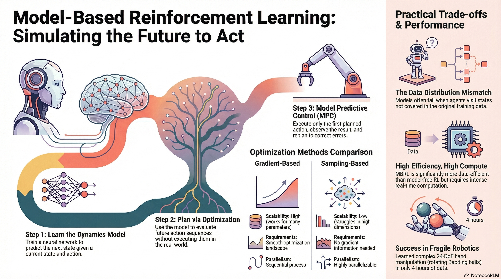

## Recap

So far, the lecture series has covered a wide range of reinforcement learning algorithms.

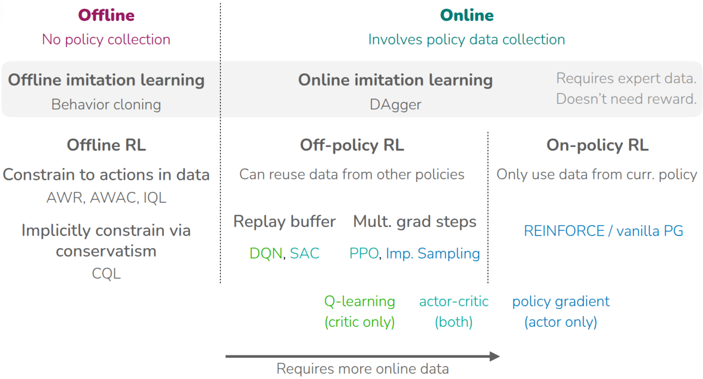{#fig-model-free}

It first introduced **on-policy RL**, where the current policy is updated using trajectories collected by that same policy, and discussed **REINFORCE** (@williams1992reinforce) as the basic policy-gradient method. This family of methods can incorporate fresh interaction data immediately, but tends to be data-inefficient because old data cannot be reused very effectively. The course then moved to off-policy RL, where the current policy can be updated using experience collected by older or different policies, and therefore discussed tools such as importance sampling. At the first of lecture, **PPO** (@schulman2017proximal) is introduced as an On-Policy Actor-Critic, while algorithms such as **DQN** (@mnih2013playing) and **SAC** (@haarnoja2018soft) are canonical off-policy methods that improve data efficiency by reusing past experience through replay buffers.

The lectures then turned to **offline RL**, where policy learning is performed from a fixed dataset without further environment interaction. A central challenge in offline RL is overestimation caused by evaluating actions that are not supported by the dataset, that is, out-of-distribution actions. To address this, some methods try to keep the learned policy close to the dataset support(**AWR** (@peng2019advantage), **AWAC**(@nair2020awac), **IQL**(@kostrikov2021offline)), while others estimate values more conservatively(**CQL**(@kumar2020conservative)). Earlier in the course, **imitation-learning** methods such as behavior cloning and **DAgger** (@ross2011reduction) were also introduced as ways of learning behavior from demonstrations instead of direct reward optimization. The common thread across all of these methods is that they learn from real interaction data or from logged datasets without assuming a **prior predictive model of the environment**. That is the point at which the lecture contrasts **model-free RL** with **model-based RL**.

## "Simulator"

The lecture defines a model as an object that provides prior information about the environment, usually a dynamics model that predicts the next state $s_{t+1}$ from the current state $s_t$ and action $a_t$. In that sense, the model is also a simulator. A canonical example is **MuJoCo** (@todorov2012mujoco), a general-purpose multi-joint physics engine widely used in RL research to simulate environments that are difficult to experiment with directly in the real world.

::: {#fig-video-model layout-ncol=2}
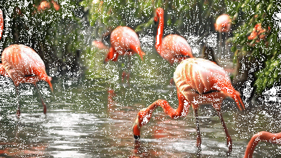


:::

The lecture broadens the notion of a model, that video-generation systems(@fig-video-model) such as Google Veo 2 or OpenAI Sora can also be viewed as models, in the sense that they produce future observations from input descriptions. It also mentions stock-market prediction and games as domains where some kind of model can be useful. In chess or Go, where the rules are explicit, a learned model may be less necessary, but in settings where the rules are only partially known or are entangled with other agents and complicated dynamics, a model becomes important. The post also remarks that the "reward model" introduced in the previous lecture can itself be seen as a type of model.

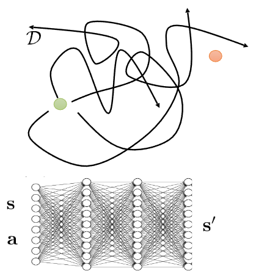

A typical learned-simulator pipeline is then described as follows:

```pseudocode
#| html-indent-size: "1.2em"
#| html-comment-delimiter: "//"
#| html-line-number: true
#| html-line-number-punc: ":"
#| html-no-end: false
#| pdf-placement: "htb!"
#| pdf-line-number: true
#| label: algo-learned-simulator

\begin{algorithm}
\caption{Notional "learned simulator" algorithm}
\begin{algorithmic}
\State Get some data $\mathcal{D} = \{s_i, a_i, s_i' \}$ collected using some base policy $\pi_0(a \vert s)$
\State Learn "simulator" $f(a, s) = s'$ using $\min_f \sum_i \Vert f(s_i, a_i) - s_i' \Vert^2$
\State Run your favorite RL method inside "simulator" $f$
\end{algorithmic}
\end{algorithm}
```

At firstm collect transition data $\mathcal{D}=\{(s_i, a_i, s_i')\}$ using one or more base policies $\pi_0(a \vert s)$, train a supervised model $f(s, a) \approx s'$ by minimizing next-state prediction error, and then run an RL algorithm or a planning method inside that learned simulator. At first glance this sounds straightforward, then what can go wrong in this circumstance?

::: {#fig-learned-simulator layout-ncol=2}
{#fig-maze}

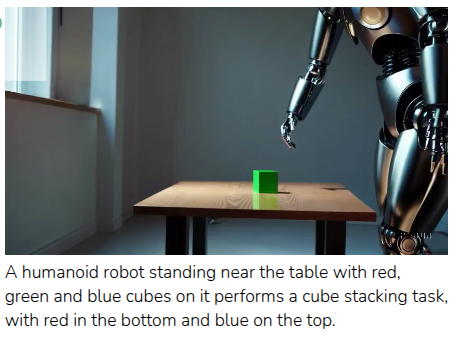{#fig-sora-humanoid}
:::

As shown in @fig-learned-simulator, the answer is **coverage** and **model fidelity**. If the collected data cover only a small part of the state-action space, then the simulator only learns that region well and will be inaccurate elsewhere. The maze example(@fig-maze) illustrates this by showing a dataset that covers only one region of the maze. The Sora example(@fig-sora-humanoid) makes the same point from another angle: a model may generate visually plausible outputs while still violating basic physical consistency. So the usefulness of the simulator depends heavily on the quality of the data and on how hard the target domain is to model faithfully.

The section ends by briefly discussing how dynamics models are learned in practice.

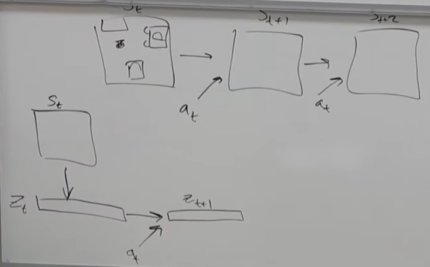

In many real environments, we do not have a clean analytical model, so we learn one entirely from data. Instead of predicting raw high-dimensional observations directly, a common alternative is to compress the state into a low-dimensional latent representation $z_t$ and learn the dynamics there. This reduces computational cost, although it raises the separate problem of how to choose a good state representation.

## Optimize over actions using model

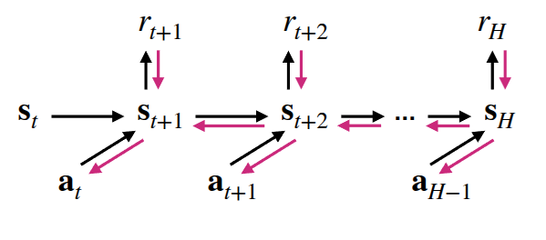{#fig-planning}

Once a learned dynamics model is available, the simplest way to use it is **"planning"**. Even without interacting with the real environment, the model can be rolled forward to predict future states under candidate actions. This lets us search for an action sequence that maximizes expected reward over a finite horizon, i.e. solve something like $\max_{a_t:t+H} \sum_t r(s_t, a_t)$. This can be expressed as “imagining” trajectories inside the model and optimizing actions through backpropagation.

To do that, the lecture introduces a **“planning via backpropagation”** algorithm:

```pseudocode
#| html-indent-size: "1.2em"
#| html-comment-delimiter: "//"
#| html-line-number: true
#| html-line-number-punc: ":"
#| html-no-end: false
#| pdf-placement: "htb!"
#| pdf-line-number: true
#| label: algo-backpropagation-planning

\begin{algorithm}
\caption{Planning via backpropagation}
\begin{algorithmic}
\State Run some policy (e.g. random policy) to collect data $\mathcal{D} = \{ (s, a, s')_i\}$
\State Learn model $f_{\phi}(s, a)$ to minimize $\sum_i \Vert f_{\phi}(s_i, a_i) - s_i' \Vert^2$
\State Backpropagate through $f_{\phi}(s, a)$ to choose actions. ($\hat{a}_{t:t+H} \leftarrow \arg\max \sum_{t'=t}^{t+H} r_{t'}$)
\State Execute $\hat{a}_{t:t+H}$ in real environment.
\end{algorithmic}
\end{algorithm}
```

:::{.callout-note title='Computing Gradient to choose action'}
As the professor described in hand, To do backpropagation for $\hat{a}_{t:t+H}$, we need to calculate the direction of gradient that maxmize expected reward. Below is the detailed expression.

```pseudocode
#| html-indent-size: "1.2em"
#| html-comment-delimiter: "//"
#| html-line-number: true
#| html-line-number-punc: ":"
#| html-no-end: false
#| pdf-placement: "htb!"
#| pdf-line-number: true
#| label: algo-compute-gradient

\begin{algorithm}
\caption{Compute Gradient}
\begin{algorithmic}
\State Initialize $\hat{a}_{t:t+H}$
\State Compute Gradient $\nabla_{a_{t:t+H}} \sum r$
\State $\hat{a}_{t:t+H} \leftarrow \hat{a}_{t:t+H} + \alpha \nabla_{a_{t:t+H}} \sum r$
\end{algorithmic}
\end{algorithm}
```
Here, $\nabla_{a_{t:t+H}} \sum r$ is calculated from the dynamics model. We can use chain rule.

$$
\nabla_{a_{t:t+H}} \sum r = \frac{\partial \sum r}{\partial s_{t:t+H}} \frac{\partial s_{t:t+H}}{\partial a_{t:t+H}}
$$

:::

The lecture then contrasts gradient-based planning with sampling-based planning. 

::: {#fig-optimization layout-ncol=2}

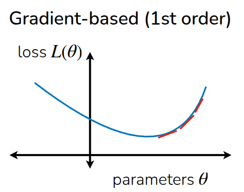{#fig-gradient}

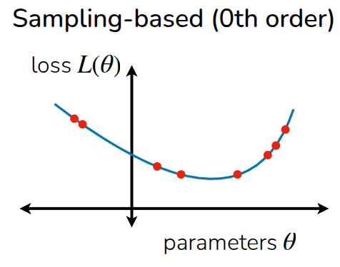{#fig-sampling}

:::

Rather than starting from a single point and following the gradient, the sampling-based view evaluates many candidate action sequences and selects or refits toward the ones with high return. Because it does not require explicit gradient computation, It can be described as **gradient-free optimization** and notes that it can be useful in settings where differentiating through the optimization objective is difficult.

```pseudocode
#| html-indent-size: "1.2em"
#| html-comment-delimiter: "//"
#| html-line-number: true
#| html-line-number-punc: ":"
#| html-no-end: false
#| pdf-placement: "htb!"
#| pdf-line-number: true
#| label: algo-sampling-planning

\begin{algorithm}
\caption{Planning via Sampling}
\begin{algorithmic}
\State Run some policy (e.g. random policy) to collect data $\mathcal{D} = \{ (s, a, s')_i\}$
\State Learn model $f_{\phi}(s, a)$ to minimize $\sum_i \Vert f_{\phi}(s_i, a_i) - s_i' \Vert^2$
\State Iteratively sample action sequences, run through model $f_{\phi}(s, a)$ to choose actions
\State Execute $\hat{a}_{t:t+H}$ in real environment.
\end{algorithmic}
\end{algorithm}
```

Two simple sampling-based strategies are described. The first is **"random shooting"**: sample $N$ candidate action sequences from a chosen distribution and pick the one with the highest predicted return. The second is the **cross-entropy method (CEM)**: sample candidates from a parameterized distribution (usually assumed it as gaussian distribution), evaluate them, keep the top-performing “elite” samples, refit the distribution to those elites, and repeat. After that, it can be progressively fitting a distribution around good action sequences.

The lecture then compares the two families of methods. Gradient-based methods scale naturally to large parameter spaces and fit well with neural-network models, but require a suitable optimization procedure. Sampling-based methods are simple and parallelizable, and do not require differentiating the planner objective, but they become harder to scale as the action dimension and planning horizon grow. The lecture slides make the same high-level comparison, emphasizing that sampling-based optimization is simple and can be fast when parallelized, but does not scale well to high-dimensional settings.

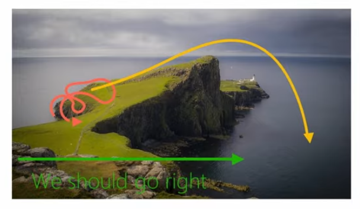{#fig-fail-case}

The section closes with a failure example (@fig-fail-case) using a cliff environment. If the planner is trained only on trajectories that happen to move rightward, it may conclude that “going right” is always good, even though continuing right eventually causes the agent to fall off the cliff. This is framed as **data-distribution mismatch**: the state distribution induced by the final policy can differ from the state distribution seen in the initial data. A simple fix is to add newly visited real trajectories back into the model-training dataset and keep updating the model as planning proceeds.

```pseudocode
#| html-indent-size: "1.2em"
#| html-comment-delimiter: "//"
#| html-line-number: true
#| html-line-number-punc: ":"
#| html-no-end: false
#| pdf-placement: "htb!"
#| pdf-line-number: true
#| label: algo-sampling-planning-2

\begin{algorithm}
\caption{Planning via Sampling (Updated)}
\begin{algorithmic}
\State Run some policy (e.g. random policy) to collect data $\mathcal{D} = \{ (s, a, s')_i\}$
\State Learn model $f_{\phi}(s, a)$ to minimize $\sum_i \Vert f_{\phi}(s_i, a_i) - s_i' \Vert^2$
\State Iteratively sample action sequences, run through model $f_{\phi}(s, a)$ to choose actions
\State Execute planned actions, appending visiting tuples $(s, a, s')$ to $\mathcal{D}$
\end{algorithmic}
\end{algorithm}
```

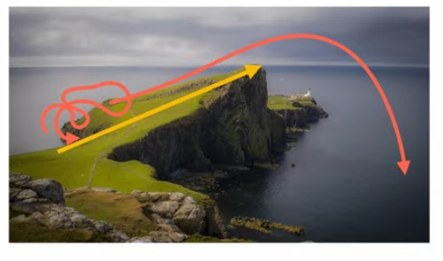{#fig-success-case}

## Plan And Replan using Model

::: {#fig-plan layout-ncol=2}

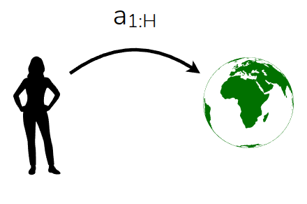{#fig-open}

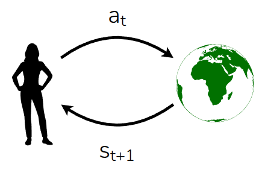{#fig-close}

:::

The next section contrasts open-loop and closed-loop use of a model. In the open-loop case, the planner computes a full action trajectory 
$a_1, \dots, a_H$ in advance and then executes it as-is. This can work when the model is accurate, but if the model is wrong or the environment changes during execution, blindly following the original plan may be a poor choice. A **closed-loop** alternative is to execute only the first planned action, observe the true next state from the environment, and then replan from that new state.

```pseudocode
#| html-indent-size: "1.2em"
#| html-comment-delimiter: "//"
#| html-line-number: true
#| html-line-number-punc: ":"
#| html-no-end: false
#| pdf-placement: "htb!"
#| pdf-line-number: true
#| label: algo-mpc

\begin{algorithm}
\caption{Model Predictive Control (MPC)}
\begin{algorithmic}
\State Run some policy (e.g. random policy) to collect data $\mathcal{D} = \{ (s, a, s')_i\}$
\State Learn model $f_{\phi}(s, a)$ to minimize $\sum_i \Vert f_{\phi}(s_i, a_i) - s_i' \Vert^2$
\State Use model $f_{\phi}(s, a)$ to optimize action sequence
\State Execute **the first** planned action, observe resulting state $s'$
\State Append $(s, a, s')$ to dataset $\mathcal{D}$
\end{algorithmic}
\end{algorithm}
```

The lecture identifies this approach with **Model Predictive Control (MPC)**(@GARCIA1989335): use the model to optimize an action sequence, execute only the first action, observe the next state, append the transition to the dataset, and repeat. 

The benefit is that replanning can correct for model error and keep the controller aligned with the real system, which is why MPC is widely used in industry. The downside is computational cost: planning must be repeated at every interaction step over a horizon $H$, so this is more expensive than executing a fixed policy. As shown in @algo-mpc, this process is similar with some kind of "Off-Policy" manner. Technically, it should be expressed with **Receding-Horizon-Control (RHC)**, rather than Off-Policy Approach.

The lecture also discusses a question raised: if MPC replans at every step, couldn’t the action sequence keep changing and cause oscillatory behavior? The professor mentioned **warm-starting** as one practical idea for making replanning more stable and efficient.

## Planning with Learned Models

This section summarizes the learned-model planning loop in three steps: 

1. plan an action sequence using gradient-based or sampling-based optimization
2. execute the planned actions in the real environment and use the resulting data to update the dynamics model
3. replan to compensate for model error. 

The central idea is that if the dynamics model is accurate enough, model-based RL can adapt planning to many different goals and reward functions without having to relearn everything from scratch.

The lecture also emphasizes the tradeoff of Model-based RL: this approach is conceptually simple and flexible, but computationally expensive at test time, and its performance depends strongly on model accuracy. It therefore presents this planning-heavy style of model-based RL as being most practical for short-horizon problems, which is also how the lecture slides frame the limitation.

## Case Study - Online Planning with Deep Dynamics Model (PDDM)



As a concrete example, the lecture introduces [**online Planning with Deep Dynamics Model (PDDM)**](https://sites.google.com/view/pddm/) by @nagabandi2020deep, which applies online planning with learned deep dynamics models to dexterous robotic manipulation. The task uses a **24-DoF anthropomorphic hand**, and the paper shows that the method can learn complex real-world dexterous behaviors using only about **4 hours of purely real-world data**. A key point is that PDDM does not rely on a separately trained policy network in the usual model-free sense; instead, it performs online planning with a learned dynamics model inside an MPC-style loop.

In the setup described in the paper, the state includes information about both the robotic hand and the manipulated object, and the reward reflects how well the object follows the target behavior, with penalties for failure cases such as dropping the object. To reduce model error, the method uses an **ensemble** of learned dynamics models, and planning is performed with a modified **CEM-style** optimizer inside MPC. The comparisons in the paper include both model-free baselines such as **SAC** (@haarnoja2018soft) and **NPG** (@kakade2001natural) and model-based baselines such as **MBPO** (@janner2019trust), **PETS** (@chua2018deep) , and earlier work (**MBMF** - @nagabandi2018neural) by the same authors. The main takeaway is that planning with learned models can yield strong **data efficiency**, which is especially important in fragile real-world hardware settings where data collection and reset costs are high.

::: {#fig-result layout-ncol=2}

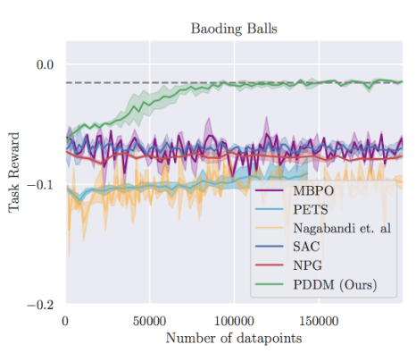{#fig-baoding}

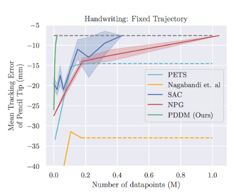{#fig-handwriting}

:::

## Model-Based Policy Optimization (MBPO)

Model-based RL can also be used in a different way: instead of planning online at test time, the learned dynamics model can be used to generate **synthetic rollouts** that help train a policy network. This is the core idea of **Model-Based Policy Optimization (MBPO)**(@janner2019trust). The important design choice in MBPO is not to trust the model for arbitrarily long imagined trajectories. Instead, MBPO uses **short model-generated rollouts branched from real data**, which helps limit compounding model error while still improving sample efficiency.

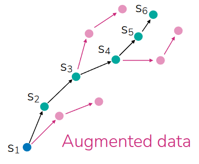{#fig-augmented}

Operationally, MBPO alternates between collecting real transitions, updating the learned dynamics model, generating short synthetic rollouts from real states—often replay-buffer states—and then updating a model-free learner using both real and model-generated data. In the original paper, this policy-optimization backbone is implemented with SAC. 

```pseudocode
#| html-indent-size: "1.2em"
#| html-comment-delimiter: "//"
#| html-line-number: true
#| html-line-number-punc: ":"
#| html-no-end: false
#| pdf-placement: "htb!"
#| pdf-line-number: true
#| label: algo-mbpo

\begin{algorithm}
\caption{Model-Based Policy Optimization (MBPO)}
\begin{algorithmic}
\State Collect data using current policy $\pi_{\phi}$, add to $\mathcal{D}_{env}$
\State Update model $p_{\theta}(s' \vert s, a)$ using $\mathcal{D}_{env}$
\State Collect synthetic roll-outs using $\pi_{\phi}$ in model $p_{\theta}$ from states in $\mathcal{D}_{env}$
\State Update policy $\pi_{\theta}$ (and critic $Q$) using $\mathcal{D}_{env} \cup \mathcal{D}_{model}$
\State Repeat 1 to 4 until convergence
\end{algorithmic}
\end{algorithm}
```

It finally remarks that although the displayed algorithm is online, the same general process perspective can inspire offline variants and combinations with other model-free RL algorithms. That is presented more as a methodological extension than as the exact scope of the original MBPO paper.

## Takeways

The main lesson of the lecture is that model-based RL can be used in at least two complementary ways. One is **planning**, as in MPC and PDDM, where the model is used directly to choose actions online. The other is **data augmentation**, as in MBPO, where the model produces synthetic experience that helps train a separate policy. In both cases, a good model can significantly improve data efficiency relative to purely model-free methods.

At the same time, model-based RL is only as good as the predictive model it relies on. Learning the dynamics model itself can be difficult, especially in complex real-world domains, and the extra modeling and optimization machinery introduces additional engineering cost. Still, one major advantage is that dynamics models can often be trained in a largely self-supervised way from trajectories, without requiring explicit reward labels for the modeling step itself. That makes model-based RL a powerful option when interaction data are expensive and when the structure of the environment can be learned well enough to support planning or synthetic rollouts.

Another kinds of model are described at the end of the this topic: Initially, the lecture described dynamics model ($p(s_{t+1} \vert s_t, a_t)$), and there are lots of variation. One widely mentioned model is **inverse-dynamics model**($p(a_t \vert s_t, s_{t+1})$), which predicts action while seeing state and next state. And it can be extended with multi-step($p(a_t \vert s_t, a_{t+n})$ or $p(a_{t:t+n} \vert s_t, s_{t+n})$). Or there is next-state prediction model without action information($p(s_{t+1:t+n} \vert s_t)$). Especially on Video Generation Model, there are some models to interpolate between frames($p(s_{t+1:t+n} \vert s_t, s_{t+n+1})$). Or we could use transition model itself($p(s_t, a_t, s_{t+1}$).