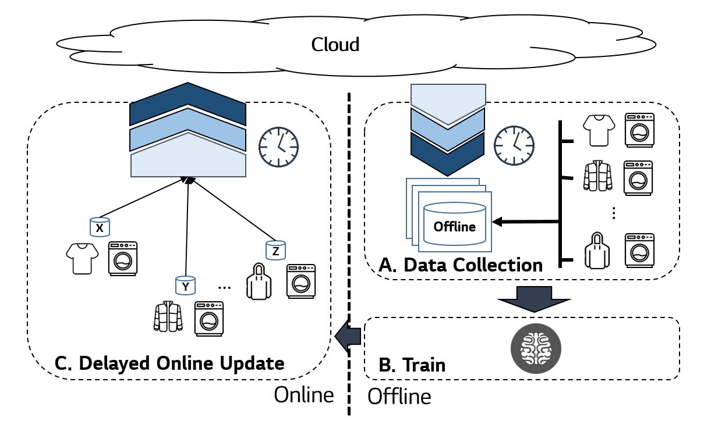
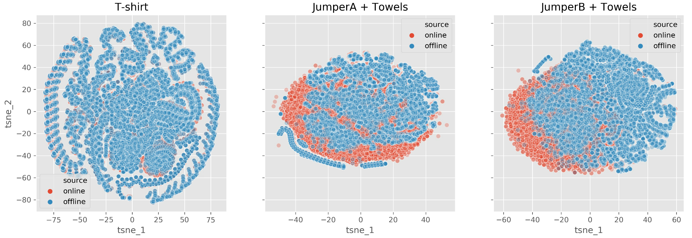
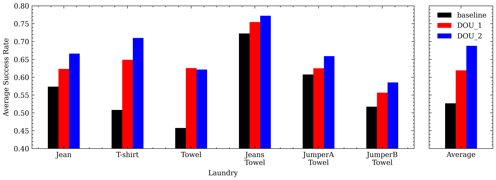
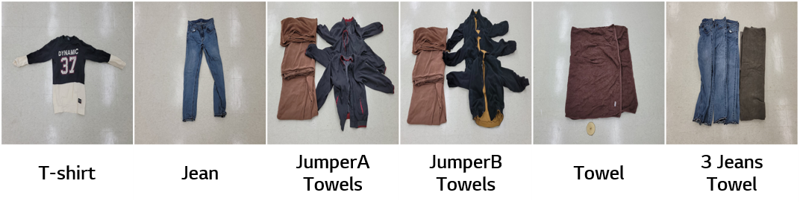
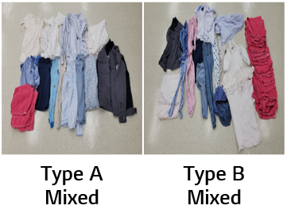
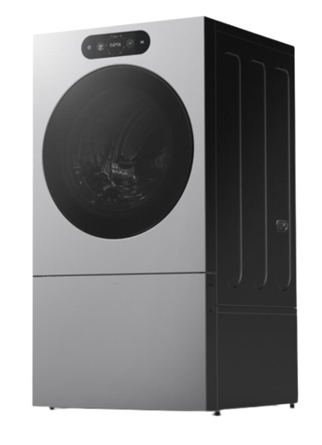
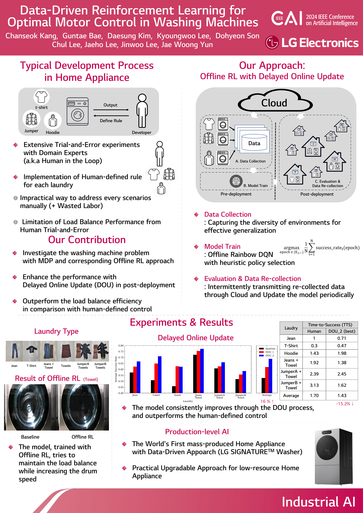

::: {.paper-project}

::: {.paper-hero}
<div class="paper-title">Data-Driven Reinforcement Learning for Optimal Motor Control in Washing Machines</div>

::: {.paper-venue}
2024 IEEE Conference on Artificial Intelligence (CAI), Singapore
:::

<div class="paper-authors">
  <a class="paper-author" href="../../about.html">Chanseok Kang</a>
  <span class="paper-author">Guntae Bae</span>
  <span class="paper-author">Daesung Kim</span>
  <span class="paper-author">Kyoungwoo Lee</span>
  <span class="paper-author">Dohyeon Son</span>
  <span class="paper-author">Chul Lee</span>
  <span class="paper-author">Jaeho Lee</span>
  <span class="paper-author">Jinwoo Lee</span>
  <span class="paper-author">Jae Woong Yun</span>
</div>

::: {.paper-affiliation}
LG Electronics AI Lab
:::

<div class="paper-links">
  <a class="paper-button" href="https://ieeexplore.ieee.org/document/10605463/" target="_blank" rel="noopener"><i class="ai ai-ieee"></i> IEEE</a>
  <a class="paper-button" href="https://doi.org/10.1109/CAI59869.2024.00083" target="_blank" rel="noopener"><i class="fas fa-link"></i> DOI</a>
  <!-- Add a local manuscript after placing projects/data-driven-rl-washing-machines/assets/paper.pdf:
  <a class="paper-button" href="assets/paper.pdf"><i class="fas fa-file-pdf"></i> PDF</a>
  -->
</div>
:::

## TL;DR

::: {.paper-tldr}
Delayed Online Update는 실제 세탁기 운전 데이터와 continual offline reinforcement learning을 결합해 세탁물 시나리오를 모두 수동 규칙으로 작성하지 않고도 탈수 구간의 load balancing을 개선합니다.
:::

::: {.paper-teaser}
::: {.paper-figure .paper-figure-main}
{.paper-image}

::: {.paper-media-caption}
Post-deployment 개선을 위한 Delayed Online Update (DOU) workflow.
:::
:::
:::

## Overview

::: {.paper-summary-grid}
::: {.paper-summary-card}
### Problem

현대 세탁기는 여러 운전 조건에서 세탁물 균형을 유지해야 합니다. 수동 시행착오 중심의 튜닝은 배포 이후 제어 성능을 빠르게 개선하는 데 한계가 있습니다.
:::

::: {.paper-summary-card}
### Approach

본 논문은 세탁기 모터 제어를 위한 continual offline reinforcement learning workflow를 제안하며, 누적된 transition data와 delayed online update를 활용해 distribution shift 위험을 줄입니다.
:::

::: {.paper-summary-card}
### Outcome

탈수 구간에서 서로 다른 세탁물 조건을 포함한 실험을 통해 균형 유지 성능 개선을 보고합니다.
:::
:::

## Method

::: {.paper-method}
::: {.paper-method-steps}
1. 실제 세탁기 운전에서 transition data를 수집합니다.
2. 탈수 구간 모터 제어를 위한 offline RL policy를 학습합니다.
3. 새로운 online interaction data를 delay window 동안 누적합니다.
4. 짧은 online rollout마다 즉시 반응하는 대신 확장된 dataset으로 policy를 갱신합니다.
:::

::: {.paper-figure}
{.paper-image}

::: {.paper-media-caption}
선택된 laundry task에서 offline/online data coverage 비교.
:::
:::
:::

## Results

::: {.paper-result-grid}
::: {.paper-result-card .paper-result-wide}
### Average Success Rate

{.paper-image}

평가한 laundry task 전반에서 DOU variant가 baseline보다 높은 평균 success rate를 보입니다.
:::

::: {.paper-result-card}
### Multi-Task Laundry Set

{.paper-image}

Multi-task evaluation에 사용한 대표 laundry configuration입니다.
:::

::: {.paper-result-card}
### Unseen Tasks

{.paper-image}

Generalization 평가를 위한 unseen laundry combination입니다.
:::

::: {.paper-result-card}
### Production Device

{.paper-image}

Offline RL control approach가 적용된 production-ready target device입니다.
:::
:::

## Videos

::: {.paper-media-grid}
::: {.paper-media-card .paper-media-feature}
```{=html}
<video class="paper-video" controls muted loop playsinline preload="metadata">
  <source src="assets/supplement_2.mp4" type="video/mp4">
</video>
```

::: {.paper-media-caption}
Supplemental motion example.
:::
:::

::: {.paper-media-card}
```{=html}
<video class="paper-video" controls muted loop playsinline preload="metadata">
  <source src="assets/sample1.mp4" type="video/mp4">
</video>
```

::: {.paper-media-caption}
Naive rule-based baseline motion.
:::
:::

::: {.paper-media-card}
```{=html}
<video class="paper-video" controls muted loop playsinline preload="metadata">
  <source src="assets/sample2.mp4" type="video/mp4">
</video>
```

::: {.paper-media-caption}
Proposed learned motion.
:::
:::
:::

## Poster

::: {.paper-poster}
{.paper-image}
:::

## Citation

::: {.paper-citation}
```bibtex
@inproceedings{kang2024dataDrivenRLWasher,
  title     = {Data-Driven Reinforcement Learning for Optimal Motor Control in Washing Machines},
  author    = {Kang, Chanseok and Bae, Guntae and Kim, Daesung and Lee, Kyoungwoo and Son, Dohyeon and Lee, Chul and Lee, Jaeho and Lee, Jinwoo and Yun, Jae Woong},
  booktitle = {Proceedings - 2024 IEEE Conference on Artificial Intelligence (CAI)},
  pages     = {418--424},
  year      = {2024},
  doi       = {10.1109/CAI59869.2024.00083}
}
```
:::

:::
