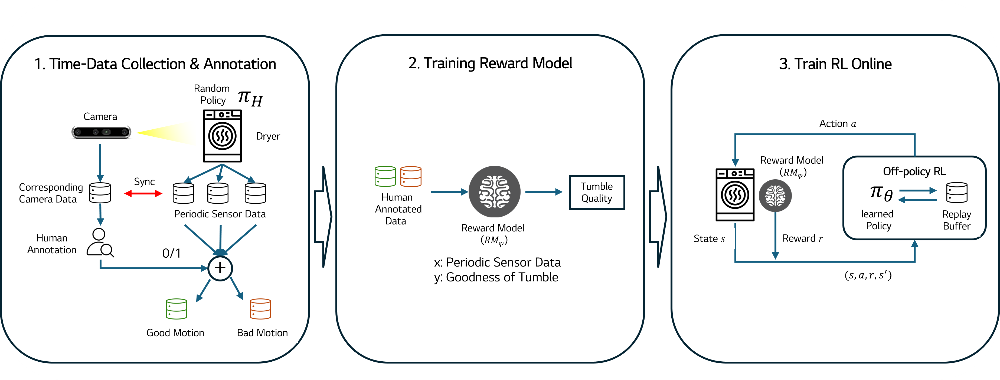
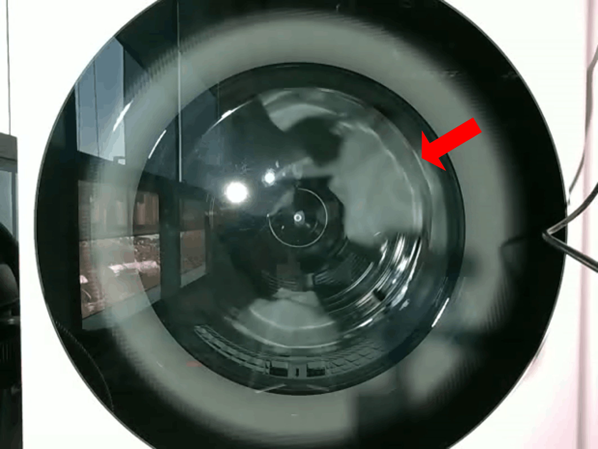
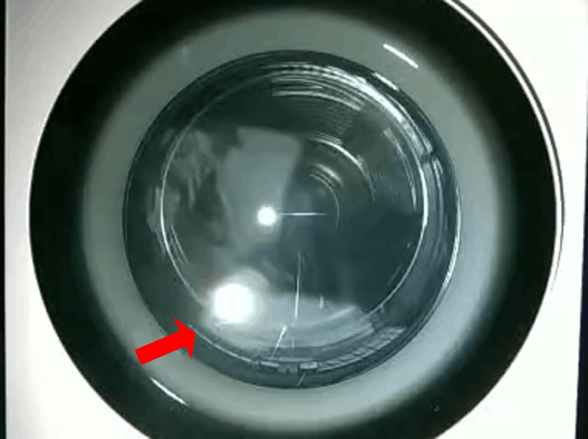
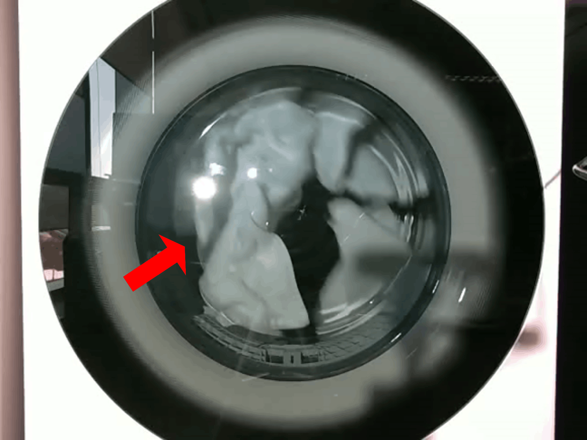
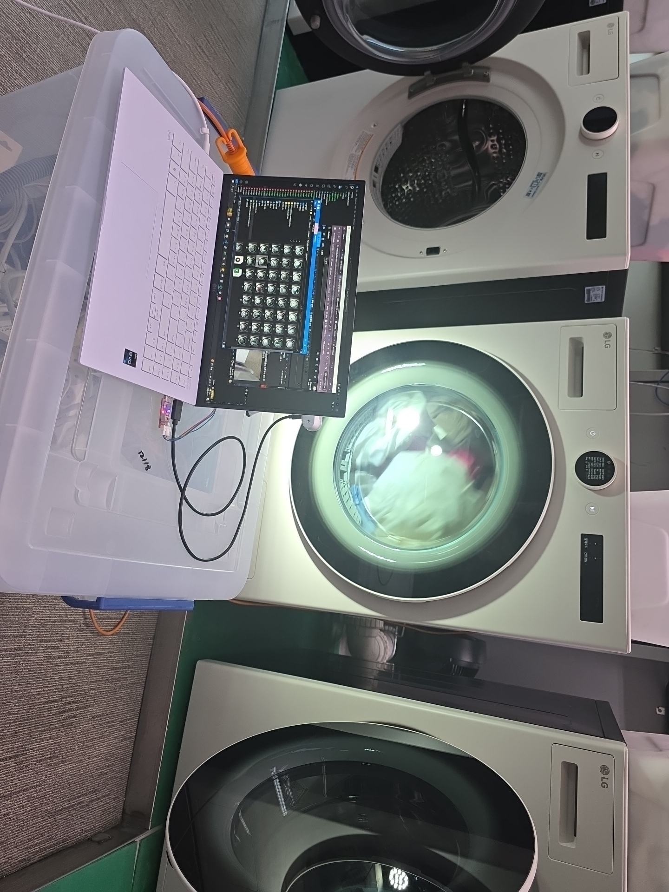
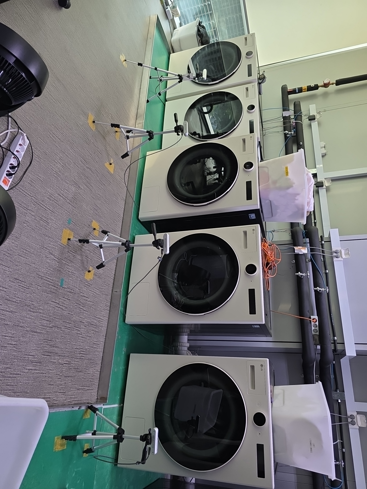

::: {.paper-project}

::: {.paper-hero}
<div class="paper-title">Sensor-Based Reward Learning from Video Labels for Tumble Motion Control in a Household Dryer</div>

::: {.paper-venue}
To appear at 2026 IEEE 22nd International Conference on Automation Science and Engineering (CASE), August 2026
:::

<div class="paper-authors">
  <span class="paper-author">Jinwoo Lee</span>
  <a class="paper-author" href="../../about.html">Chanseok Kang</a>
  <span class="paper-author">Guntae Bae</span>
</div>

::: {.paper-affiliation}
LG Electronics AI Lab
:::

<div class="paper-links">
  <span class="paper-button"><i class="fas fa-calendar-check"></i> To appear</span>
</div>
:::

## TL;DR

::: {.paper-tldr}
This work transfers human video judgments of laundry motion into a deployable sensor-only reward model, then uses reinforcement learning to improve dryer drum-speed control without requiring video at runtime.
:::

::: {.paper-teaser}
::: {.paper-figure .paper-figure-main}
{.paper-image}

::: {.paper-media-caption}
Learning-based reward model pipeline: visual supervision is collected during development, distilled into a sensor-only reward model, and used for reinforcement learning.
:::
:::
:::

## Overview

::: {.paper-summary-grid}
::: {.paper-summary-card}
### Problem

Efficient drying depends on maintaining cataracting laundry motion, but the internal tumble state is not directly observable from production sensors such as motor current and drum-speed signals.
:::

::: {.paper-summary-card}
### Approach

The method collects synchronized sensor trajectories and internal video during development, uses human video labels or preferences to train a sensor-only reward model, and freezes that model during SAC-based policy learning.
:::

::: {.paper-summary-card}
### Outcome

Across five load compositions, the learned controller improved normalized moisture-removal performance by 2.04% on average and 2.86% in the best case compared with an expert-designed baseline.
:::
:::

## Motion Labels

::: {.paper-result-grid .paper-motion-grid}
::: {.paper-result-card}
### Bad Motion: Wall-Following

{.paper-image}

The laundry remains attached to the drum wall, reducing effective surface exposure to airflow.
:::

::: {.paper-result-card}
### Bad Motion: Rolling

{.paper-image}

The load rolls near the bottom of the drum rather than entering the desired falling motion.
:::

::: {.paper-result-card}
### Good Motion: Tumbling

{.paper-image}

The target motion exposes laundry surfaces more evenly to heated airflow and supports drying efficiency.
:::
:::

## Method

::: {.paper-pipeline}
::: {.pipeline-stage}
<span>Stage 1</span>
<strong>Collect</strong>
<p>Synchronized onboard sensor sequences and internal drum video are gathered on a real dryer.</p>
:::

::: {.pipeline-arrow}
&rarr;
:::

::: {.pipeline-stage}
<span>Stage 2</span>
<strong>Learn Reward</strong>
<p>Video labels or pairwise preferences supervise an LSTM-based reward model that consumes sensor histories only.</p>
:::

::: {.pipeline-arrow}
&rarr;
:::

::: {.pipeline-stage}
<span>Stage 3</span>
<strong>Train Control</strong>
<p>The frozen reward model supplies rewards to a SAC controller that adjusts drum speed from onboard sensors.</p>
:::
:::

::: {.paper-method}
::: {.paper-method-steps}
1. Sweep drum speed over the operating motor range while recording synchronized sensor and video data.
2. Annotate video clips as desirable or undesirable tumble motion, or compare clip pairs by relative motion quality.
3. Align annotations with sensor windows and train a sensor-only reward model.
4. Use the learned reward to train an incremental drum-speed controller with Soft Actor-Critic.
5. Deploy the final controller without video input; only production sensor streams are required.
:::

::: {.paper-figure}
### Motion Supervision

The key design is to use video only as development-time supervision. Human-readable tumble quality is distilled into a reward model that maps sensor histories to scalar motion quality, so the learned controller remains compatible with production sensing constraints.

::: {.paper-metric-strip}
::: {.paper-metric}
<strong>5</strong>
<span>evaluated load compositions</span>
:::

::: {.paper-metric}
<strong>2.04%</strong>
<span>average relative gain</span>
:::

::: {.paper-metric}
<strong>2.86%</strong>
<span>best-case gain</span>
:::
:::
:::
:::

## Development Setup

::: {.paper-figure}
::: {.paper-figure-grid .paper-setup-grid}
{.paper-image}

{.paper-image}
:::

::: {.paper-media-caption}
Real household dryer setup used for collecting synchronized sensor streams, observing internal tumble motion, and evaluating the learned controller.
:::
:::

## Results

::: {.paper-result-grid}
::: {.paper-result-card .paper-result-wide}
### Moisture-Removal Performance

The proposed controller improved the normalized moisture-removal metric for all five evaluated loads. The mean metric increased from 0.6129 to 0.6261, corresponding to a mean per-load relative improvement of 2.04%.
:::

::: {.paper-result-card}
### Load Coverage

The experiments cover 3 kg and 5 kg mixed-fabric loads, different cotton-to-polyester ratios, and a towel-heavy 3 kg load.
:::

::: {.paper-result-card}
### Preference Reward Check

A preference-based reward model was also validated on the towel-heavy load. It followed the overall trend of binary motion labels and improved performance by 2.10%.
:::

::: {.paper-result-card}
### Deployment Constraint

Video is used only for annotation during development. During RL training and deployment, both the reward model and controller use onboard sensor sequences only.
:::
:::

## Videos

::: {.paper-media-grid}
::: {.paper-media-card .paper-media-feature}
```{=html}
<video class="paper-video" controls muted loop playsinline preload="metadata">
  <source src="assets/CASE26_0577_AV_i.mp4" type="video/mp4">
</video>
```

::: {.paper-media-caption}
Supplementary demonstration of dryer tumble-motion control.
:::
:::
:::

## Citation

::: {.paper-citation}
```bibtex
@misc{lee2026sensorRewardDryer,
  title  = {Sensor-Based Reward Learning from Video Labels for Tumble Motion Control in a Household Dryer},
  author = {Lee, Jinwoo and Kang, Chanseok and Bae, Guntae},
  note   = {To appear at 2026 IEEE 22nd International Conference on Automation Science and Engineering (CASE)},
  year   = {2026}
}
```
:::

:::
